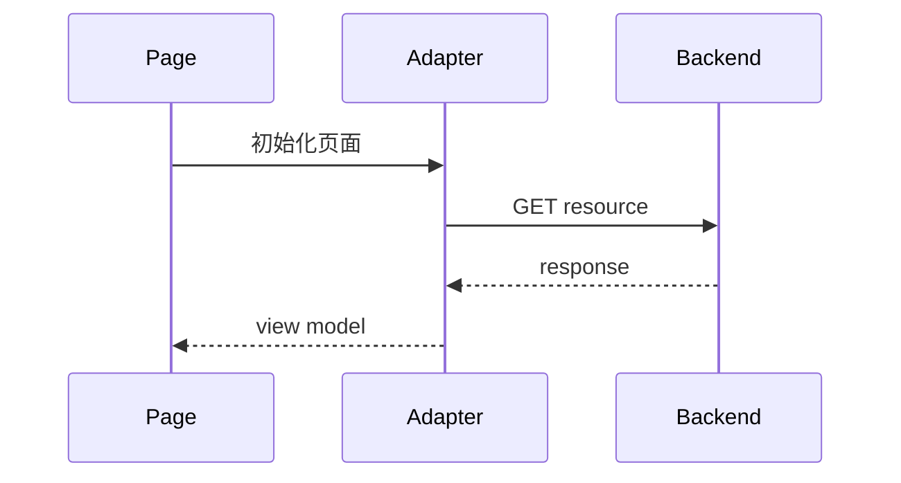

# 统一规范草稿: {title}

## 00. 索引与元数据 (-> 00_index.md)
*   **负责人**: {user}
*   **状态**: 规划中 (Planning)
*   **类型**: {project_type}
*   **最后更新**: {date}

## 01. 需求契约 (-> 01_requirements.md)
> **真理源头**: 基于 {input_source}

### 来源依据

| 来源 | 类型 | 用途 |
|---|---|---|
| {source_name} | {source_type} | {source_usage} |

### 1.1 核心意图 (Intent)
{intent}

### 1.2 用户故事 (User Stories)
{user_stories}

### 1.3 验收标准 (Acceptance Criteria)

| AC | 验收标准 | 来源摘要 | 上下文判定 | 证据 |
|---|---|---|---|---|
| {ac_id} | {criterion} | {source_summary} | {context_judgement} | {evidence} |

### 1.4 变更记录（仅语义变更时保留）

> 无语义变更时删除本小节，不输出占位行。

| 日期 | 变更对象 | 变更内容 | 变更原因 | 来源依据 |
|---|---|---|---|---|
| {date} | {changed_object} | {change_summary} | {change_reason} | {change_source} |

## 02. 技术蓝图 (-> 02_design.md)
> **多态策略**: {strategy_name}

### 来源依据

| 来源 | 类型 | 用途 |
|---|---|---|
| {design_source_name} | {design_source_type} | {design_source_usage} |

### 2.1 关键设计决策

| Decision | 选择 | 来源摘要 | 上下文判定 | 证据 |
|---|---|---|---|---|
| {decision_id} | {choice} | {source_summary} | {context_judgement} | {evidence} |

{design_content}

### 2.2 变更记录（仅语义变更时保留）

> 无语义变更时删除本小节，不输出占位行。

| 日期 | 变更对象 | 变更内容 | 变更原因 | 来源依据 |
|---|---|---|---|---|
| {date} | {changed_object} | {change_summary} | {change_reason} | {change_source} |

## 02b. 前后端页面契约 (-> 02_design_fe_be_contract.md)（UI + API 项目时）

### 2b.1 契约目的
{说明本文件如何绑定页面布局、前端组件、API、请求顺序和字段责任}

### 2b.2 证据来源

| 证据 | 作用 |
|---|---|
| {layout_source} | {layout_usage} |
| {frontend_design_source} | {frontend_usage} |
| {backend_design_source} | {backend_usage} |

### 2b.3 页面锚点总览

| 锚点 | 布局/视觉区块 | 前端组件/模块 | Adapter / service | 后端/API | 请求触发 |
|---|---|---|---|---|---|
| {anchor_id} | {layout_region} | {frontend_owner} | {adapter_or_service} | {endpoint_or_provider} | {request_trigger} |

### 2b.4 首屏请求编排

### 2b.5 关键交互请求编排

{按 Tab 切换、筛选、拖拽、提交、展开等关键交互列出请求先后关系}

### 2b.6 API 与页面字段契约

| 页面字段 | 来源 API | API 字段 | 计算责任 | FE 展示规则 |
|---|---|---|---|---|
| {page_field} | {source_api} | {api_field} | {owner} | {display_rule} |

### 2b.7 请求触发规则

| 用户动作 / 系统动作 | 触发请求 | 不触发请求 |
|---|---|---|
| {action} | {requests_to_fire} | {requests_not_to_fire} |

### 2b.8 状态、空态与错误态

| 状态 | 页面契约 |
|---|---|
| loading | {loading_behavior} |
| empty | {empty_behavior} |
| error | {error_behavior} |

### 2b.9 评审门禁

| 门禁项 | 通过标准 |
|---|---|
| 页面锚点完整 | 每个业务区块都有锚点、组件、API/provider 和触发时机 |
| 请求顺序清楚 | 首屏与关键交互请求顺序可由时序图解释 |
| 字段责任明确 | 页面字段可追溯到 API 字段或前端本地状态 |
| 空错态独立 | 单一区块失败不会导致整页不可用 |

### 2b.10 联调验证清单

| 验证项 | 操作 | 通过信号 |
|---|---|---|
| {check_name} | {action} | {pass_signal} |

## 03. 实施计划 (-> 03_plan.md)

### 3.1 任务清单 (Tasks)
{tasks}

### 3.2 验证计划
{verification_plan}
