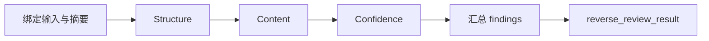

# Reality Validation Mode

## 目的

Reality 验证不是普通的 requirements ↔ spec ↔ code ↔ tests 一致性评分。它验证一组已经经过
逆向边界裁决的现实资料是否：

- 遵守 Reality Contract、模板包和显式 materialization；
- 对每个已接受模块提供足够的事实摘要、UIUX/前端实现线索和深挖入口；
- 把知识状态、证据充分度、未知和阻断分开表达；
- 能由独立验证方从同一候选提交重新核对。

本模式不运行项目、不采集运行时、不生成候选模块、不用目录数量或覆盖率推算内容质量。

## 触发条件

输入包含以下任一项时，进入本模式，不进入普通健康度评分流程：

- `specs/10_reality`；
- Reality Projection；
- `reverse_work_contract`、`reverse_module_map`、`semantic_review_package`；
- `reverse_review_result` 的复验请求。

## 必须绑定的输入

1. 当前候选提交和修改前 baseline；
2. `reverse_work_contract` 及其 digest；
3. `reverse_module_map` 及 Gate A 记录；
4. 项目级入口页面与首个模块纵切片的 Gate B 记录；
5. 按依赖顺序生成的逐模块 `semantic_review_package`；
6. 同一 `templates/reality-packs/registry.yaml`、manifest、方法论、页面契约、正向示例和审阅项；
7. 目标项目自己的 `10_reality` Profile、完整 Reality tree 和本次变化范围。

任一绑定缺失、baseline 不一致、Gate 未接受、包摘要漂移或目标路径无法确认时，结果为
`blocked`，不能以“结构看起来完整”继续。

## 验证顺序

### 1. Structure

只检查可确定的结构事实：

- Reality Contract、Profile 和模板包版本是否一致；
- 模板包声明的项目级入口页是否按 `target_path` 直接位于目标 Reality 根目录；
- 是否不存在未由 Profile 或模板包声明的旧投影容器（包括旧 `domains/*.md` 或 `modules/*.md` 形状）；
- 每个模块是否有能力层、实现层、接口/运行、验证和证据入口；
- 页面是否按 manifest `target_scope`、`target_path` 和适用性落地；
- 页面、Claim、SourceRef、Gate 和 digest 的绑定是否完整；
- 是否误把机器证据目录当成最终 Reality 页面目录。

Structure 通过不代表内容有意义，也不代表事实已经成立。

### 2. Content

逐模块和逐页面阅读，不以页面数代替内容检查：

- 是否回答该页面自己的读者问题；
- 是否有事实摘要、适用范围、直接证据、owner page 和下一处静态深挖入口；
- 是否从用户任务、入口/路由、视图/组件、状态、前端源文件和 API/Store/数据连接解释
  UIUX/前端；
- 是否明确能力目标、实现边界、接口/数据/权限/验证中实际适用的维度；
- 是否保留公共内容、未归类项和证据缺口，而不是用“其他”模块消除问题；
- 是否把需求、设计、代码、配置和测试放在各自允许的事实范围内。

Content 结果必须指出具体缺页、空泛段落、越级结论和缺失的深挖入口，不得用“内容一般”作为
唯一 finding。

### 3. Confidence

逐条核对 Claim 和 SourceRef：

- `knowledge_status` 只能使用 Reality Contract 的 canonical 值；
- `evidence_sufficiency` 单独使用 `supported`、`partial`、`missing` 或 `blocked`；
- `intent`、`design_protocol`、`implementation`、`verification` 不得相互升级；
- unknown、not_established、not_applicable 和 blocked 必须说明原因、已查范围和下一入口；
- SourceRef 必须绑定 source unit、role、baseline、relative path、anchor 和定位质量；
- 任何没有直接证据的推断都不得写成 established。

Confidence 不是主观信心分数，而是事实状态与证据绑定是否诚实、可回查。

## 结果

结果必须符合 Reverse 能力提供的 review result 交接契约，至少包含：

- `candidate_commit`、baseline、完整 Reality digest 和变化摘要；
- Template Pack、Module Map、Gate A、Gate B 和逐模块包摘要；
- `review_layers.structure`、`review_layers.content`、`review_layers.confidence`；
- 每层的状态、检查依据和 findings；
- `overall_status`：`pass`、`rework_required` 或 `blocked`；
- `reviewed_paths` 和结果 digest。

不输出综合健康度百分比，不把结构通过、页面数量或链接数量当成 content/confidence 通过。

## 与其他能力的边界

- `review-validation-surface` 负责结果层 findings 的汇总；它不能把 Reality 结果降级为普通
  实现 review。
- `maglev-reverse-spec` 负责模块地图、Gate A/B 和逐模块生成；验证器不能重新划分模块。
- `crystallization` 负责在本结果通过后决定是否写回当前 Reality；验证器不直接写回。
- Reality Admission 只核对候选提交、摘要、证据可见性和结果绑定，不代替本模式的语义验证。
