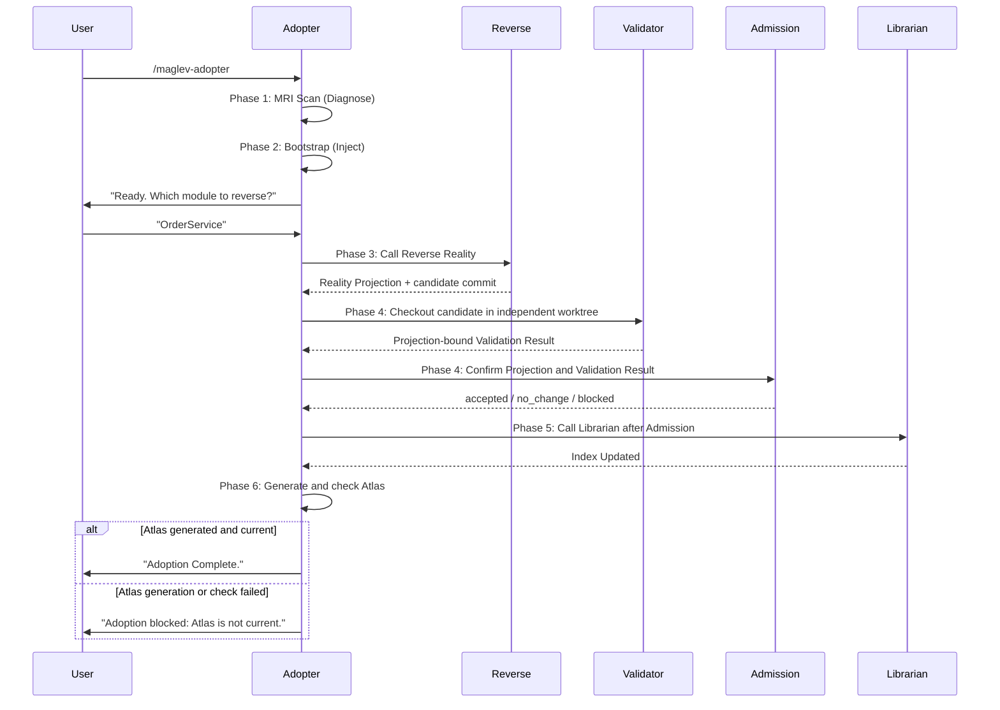

# Legacy Adopter Workflow

本工作流编排了从"环境诊断"到"资产入库"的全过程。

## 流程图 (Sequence)

## 详细指令

### Step 1: MRI & Bootstrap
执行 `references/step-01-mri-scan.md` 和 `references/step-02-bootstrap.md`。
确保环境就绪。

### Step 2: 逆向现状重建
调用 `maglev-reverse-spec`，按[逆向现状重建使用手册](../../../../docs/guides/20_operations/reverse_reality_manual.md)
完成从范围锁定到独立验证的逆向流程。
**关键要求**：必须取得候选提交、现实资料投影和验证交接结果后，才能进入后续接入动作。

### Step 3: Projection Validation & Admission
从 Step 2 的 candidate commit 创建独立 Validator worktree，验证完整 Reality tree 和
base → candidate diff，再调用共享 Reality Admission。
**Critical**: 未取得 `accepted` 或 `no_change` Receipt 时不得进入索引、地图或完成态。

### Step 4: Indexing (Delegation)
调用 `index-librarian`。
模式: 仅登记已准入的 Reality 与导航资产。

### Step 5: Atlas (Delegation)
调用 `maglev-map-maker` 生成 `docs/ATLAS.md`，并执行 `--check`。
仅当生成命令与 `--check` 均成功时，才允许进入完成态；任一失败都必须保留原始错误，
不得输出成功结束语。

## 结束语
仅在 Step 5 成功后输出：

"您的项目已成功接入 Maglev。
1. 核心模块已形成 Reality Projection。
2. Projection 已通过独立 Validation 与 Admission。
3. 已准入资产已登记在册。
请查阅 `specs/README.md` 开始您的演进之旅。"
