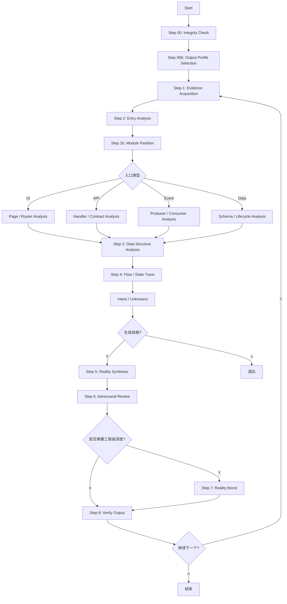

# Reverse-to-Reality Workflow

本工作流定义了通用项目逆向到 reality 的完整流程，强调证据优先、入口自适应和深度增强。

## 执行边界
- 本工作流默认只允许观察、建模、记录和验证。
- 在 workflow 运行期间，禁止直接修改业务实现、补回填脚本、执行数据修复或推动任何会改变现状的动作。
- 若发现严重问题，应在 reality / validation 中登记为风险或建议，而不是在本流程内顺手修复。
- 本工作流默认以中文生成阶段总结、reality 文档、验证报告与评审结论；除非用户明确要求其他语言，否则不得输出以英文为主的产物。

## 流程概览

## Checkpoint 规则
1. **每个关键 Step 后暂停**，展示事实、推断、未知项。
2. **等待用户确认** (`[Y/n]` 或 `[confirm/edit]`)。
3. **用户可随时退出** (输入 `exit` 或 `n`)。
4. **如果目标是后续实现或重构**，默认进入 Reality Boost 阶段。
5. **在 Step 00b 必须选择输出档位**，至少明确 `Lean / Standard / Deep` 三者之一。
6. **在整个 reverse workflow 中默认禁止业务修复**，除非用户显式中断 reverse 并切换到实现任务。
7. **在整个 reverse workflow 中默认使用中文产物**，除非用户显式要求其他语言。

## 执行顺序

| Step | 名称 | 产出 | 参考文件 |
|------|------|------|----------|
| 00 | Integrity Check | Ready State / Scope Lock | `step-00-integrity-check.md` |
| 00b | Output Profile Selection | Lean / Standard / Deep Decision | `step-00b-output-profile.md` |
| 1 | Evidence Acquisition | Evidence Map / Evidence Log | `step-01-evidence-acquisition.md` |
| 2 | Entry Analysis | Feature Map / Entry Context / Module Partition | `step-01-project-map.md`, `step-02b-module-partition.md`, `step-02-page-analysis.md` |
| 3 | Data Structure Analysis | Data Map / Data Dictionary | `step-03-data-structure-analysis.md` |
| 4 | Flow / State Trace | Call Chain / State / Contracts | `step-03-stack-trace.md`, `step-03b-intent-enrichment.md` |
| 5 | Reality Synthesis | Unified Draft | `wrapper-04-spec-handoff.md` |
| 6 | Adversarial Review | Inconsistency Report | `step-04-cross-examination.md` |
| 7 | Reality Boost | Scorecard / Expert Queue | `step-05-reality-boost.md` |
| 8 | Verify Output | Quality Gate / Archive Check | `step-06-verify-output.md` |

## 异常处理
- **纯后端项目**: Step 2 走 API-First 或 Data-First。
- **纯前端项目**: Step 3 只追到 API 契约和状态管理，不虚构后端。
- **事件驱动项目**: 用 Event-First 替代 Page-First。
- **缺少测试**: 标记证据等级下降，不可假装结论稳定。
- **档位无法判断**: 默认先用 `Standard`，并在输出中声明该选择是暂定的。
- **用户中断**: 随时可输入 `exit` 退出，已完成产物不受影响。
