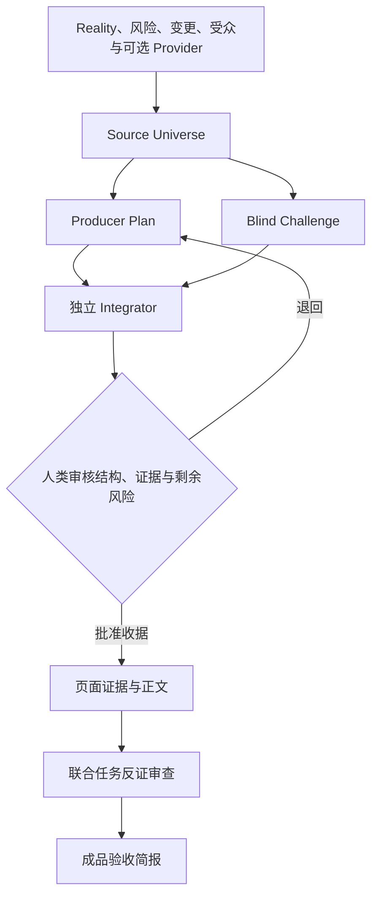

# Wiki 内容生产工作流

## 目标

从项目事实和独立读者问题推导 Wiki，经充分性挑战与人类审核后完成写作、审查、修订和接受基线。

## 步骤

1. `step-01-detect-mode.md`：加载人类可读基准、项目配置和已有批准状态；
2. `step-02-infer-structure.md`：构建完整 Source Universe，并在隔离上下文中分别生成 Producer Plan 与带执行依据的 Blind Challenge；
3. `step-03-review-structure.md`：由第三个独立 Integrator 形成差异与剩余风险账本，生成唯一 Markdown 结构审阅面；人类批准后单独生成审批收据；
4. `step-04-build-evidence.md`：按批准页面和开放世界摘要构建受限证据包；
5. `step-05-write.md`：按读者任务和证据写作，不套用模板规模；
6. `step-06-review-and-repair.md`：以 Plan、Challenge、剩余风险、变更和独立业务问答的联合任务集执行机械观察、反证审查和自动修订；
7. `step-07-present-and-record.md`：生成成品简报，并在明确接受后记录增量基线。

