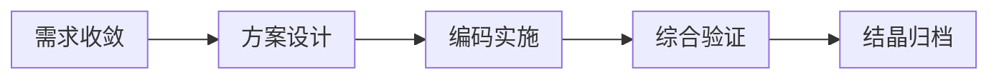

# 看板模式模板 (Board Template)

## 模式版本

- version: 1.1
- layout: graph LR
- stages: 5 (需求收敛 → 方案设计 → 编码实施 → 综合验证 → 结晶归档)

## 图例

每次生成看板时，在 Mermaid 图之前输出图例：

```markdown
## 图例

| 符号 | 含义 |
|------|------|
| ✅ | 阶段已完成 |
| ⏳ | 阶段进行中 |
| ⬜ | 阶段未开始 |
| 🟢 | Mermaid 中当前主导阶段 |
| 🟠 | Mermaid 中阶段待确认 |

**流程阶段**: 需求收敛 → 方案设计 → 编码实施 → 综合验证 → 结晶归档
```

## 样式定义

```
classDef active fill:#4CAF50,color:#fff,stroke:#333
classDef waiting fill:#f5f5f5,color:#999,stroke:#ddd
classDef uncertain fill:#FF9800,color:#fff,stroke:#333
```

| 样式类 | 用途 | 视觉效果 |
|--------|------|---------|
| `active` | 需求当前所在阶段 | 绿色填充，白色文字 |
| `waiting` | 空阶段占位 | 浅灰填充，灰色文字 |
| `uncertain` | 阶段待确认 | 橙色填充，白色文字 |

## Mermaid 结构模板



## 节点格式

每个需求节点的格式：

```
{id}["{spec_name}<br/>{intent_short}<br/>👤 {role}: {person}"]:::{style_class}
```

- `{id}`: 唯一标识（如 A, B, C...）
- `{spec_name}`: spec 目录名
- `{role}`: 当前主导角色（VO/TP/XG）
- `{person}`: 人员名称（若配置了）
- `{style_class}`: active / uncertain

空阶段占位节点：

```
empty{n}[" "]:::waiting
```

## 模式治理

- **数据更新**（需求节点的增删移动）：自动执行
- **模式变更**（需 AI + 用户确认）：
  - 增减阶段列
  - 修改 classDef 样式
  - 更改 layout 方向
  - 调整节点格式
- 确认后更新本文件的 version 字段
