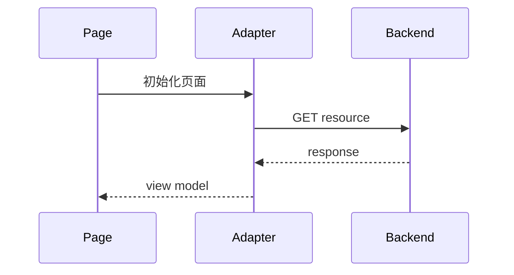

# 页面到 API 绑定门禁

## 目标

在开发开始前，防止 UI、前端实现、后端 API 设计和请求编排各自漂移。

当一个功能同时包含用户界面和后端/API 依赖时，`spec-designer` 必须生成独立的 `02_design_fe_be_contract.md`，用于绑定：

- 视觉/页面布局锚点
- 前端组件或模块
- 后端/API 端点
- 请求触发时机与先后顺序
- 页面字段与 API 字段
- loading、empty、error 行为
- 评审门禁与联调验证检查项

本门禁属于方案设计阶段。它不替代 `02_design_frontend.md` 或 `02_design_backend.md`；它负责在两者之间建立桥接契约。

## 阶段定位

`02_design_fe_be_contract.md` 是 02 技术方案阶段的收口门禁，而不是 03 计划之后的补档，也不是 04 验证阶段才生成的检查报告。

- 在 02 方案草稿中生成：必须等页面结构、前端组件边界、API 草案和关键字段已有足够信息后再收口。
- 在 03 实施计划前确认：如果契约发现 API 缺失、请求顺序不清、字段责任不明，必须先回修 `02_design*.md`，再拆 `03_plan.md`。
- 在 04 验证阶段复核：验证阶段只检查该契约是否存在、是否覆盖页面锚点和请求编排，不负责首次补写。

简化口径：它是 02b，职责是“设计收口”；它给 03 提供输入，并给 04 提供检查依据。

## 触发条件

同时满足以下条件时运行本门禁：

1. 功能包含 UI、页面、屏幕、看板、流程视图或组件工作。
2. UI 消费后端/API/数据提供方响应。
3. 多个页面区块、组件、请求或用户交互会影响请求顺序或字段映射。

以下场景跳过本门禁：

- 纯后端或 headless 服务
- 仅 CLI 工具
- 无 API 依赖的静态内容
- 无后端契约的孤立 UI-only 修改

如果不确定是否触发，默认运行本门禁，并保持输出精简。

## 必需产物

生成 `02_design_fe_be_contract.md`，并包含以下章节：

1. 契约目的
2. 证据来源
3. 页面锚点总览
4. 首屏请求编排
5. 关键交互请求编排
6. API 到页面字段契约
7. 请求触发规则
8. loading、empty、error 行为
9. 评审门禁
10. 联调验证清单
11. 变更日志

## 页面锚点总览

每个可见业务区块或交互区块使用一行。

| 锚点 | 布局/视觉区块 | 前端负责人 | Adapter / service | 后端/API | 请求触发 |
|:---|:---|:---|:---|:---|:---|
| `{anchor_id}` | `{layout_region}` | `{component_or_module}` | `{adapter}` | `{endpoint_or_provider}` | `{trigger}` |

规则：

- 锚点必须稳定且可评审，例如 `F2-WEEKLY-TABLE`。
- 如果存在 ASCII 图或线框图，必须把每个有业务意义的区块映射到一个锚点。
- 不要因为多个区块共享同一个 API 就合并无关区块。
- 除非不同用户动作或请求时机要求拆分，否则不要把同一个视觉区块拆成多个锚点。

## 请求编排

使用 Mermaid `sequenceDiagram` 表达请求时序。participant ID 必须简单，且只使用 ASCII 字符。

安全写法：

规则：

- 避免使用带 `as` 的 participant 别名；不同 Mermaid 渲染器对带空格标签的解析不一致。
- 参与者 ID 不要包含 `/`、`.`、`?`、`:` 或空格。
- endpoint 名称写在消息文本中，不要放进 participant ID。
- 依赖请求必须按先后顺序展示。
- 可并行请求必须明确说明。

## 字段契约

每个主要页面区块至少建立一张字段表。

| 页面字段 | 来源 API | API 字段 | 计算责任 | 前端展示规则 |
|:---|:---|:---|:---|:---|
| `{visible_field}` | `{endpoint}` | `{response_field}` | `FE` / `BE` / `provider` | `{formatting_and_null_rule}` |

规则：

- 用户可见的指标、标签、状态、计数、百分比、时间范围和表格列都必须有来源。
- 必须明确标注计算责任归属。
- 必须说明 `null`、空数据和数据不可用时的行为。
- 当排序影响页面语义时，必须说明排序责任归属。

## 评审门禁

进入实施前，评审者必须能逐项确认：

| 门禁项 | 通过信号 |
|:---|:---|
| 布局覆盖 | 每个有业务意义的 UI 区块都有锚点 |
| 组件归属 | 每个锚点都有前端负责人 |
| API 归属 | 每个锚点都有 API/provider，或明确声明无 API |
| 请求顺序 | 首屏请求和交互触发请求已编排 |
| 字段可追溯 | 用户可见字段能追溯到 API 字段或前端本地状态 |
| 计算责任 | FE/BE/provider 责任不重叠 |
| 状态行为 | loading、empty、error 行为收敛在正确区块内 |
| 验证可执行 | 联调检查项可由 FE/BE/QA 执行 |

如果任一通过信号缺失，spec 应停留在方案评审阶段，不进入实施。

## 验证清单

联调验证清单必须具体到开发和 QA 可执行：

| 检查项 | 操作 | 通过信号 |
|:---|:---|:---|
| 首屏请求顺序 | 打开页面并检查 Network | 依赖请求发生在前置请求之后 |
| 空态 | 让某一区块返回空响应 | 只有该区块进入空态 |
| 错误隔离 | 让某个 API 失败 | 无关区块仍能渲染 |
| 字段映射 | 对比响应 payload 与 UI | 每个可见值符合声明的来源和格式 |
| 排序 | 调整后端返回顺序 | UI 遵循已声明的排序责任方 |
| 交互触发 | 执行用户交互 | 只有契约声明的请求被触发 |
