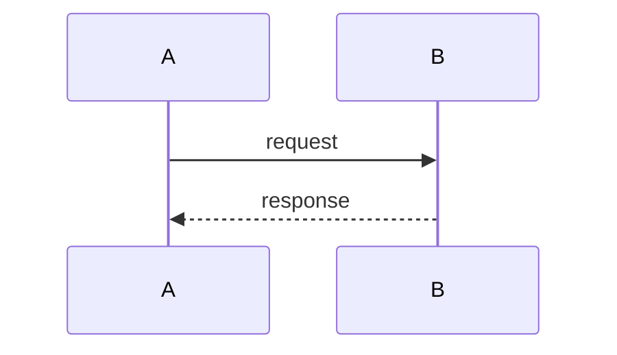
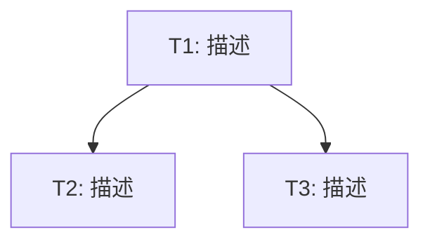

# 统一规范草稿: {title}

> **指南**: 这是临时暂存区。定稿后，此文件将被拆分为 `00_index.md`, `01_requirements.md`, `02_design.md` 和 `03_plan.md`。

## 00. 索引与元数据 (-> 00_index.md)
*   **负责人**: {user}
*   **状态**: 规划中 (Planning)
*   **最后更新**: {date}

## 00b. 文档关系声明

> 每个拆分后的文件开头应包含文档关系声明，格式如下：

```markdown
## 文档关系

- **上游**: {依赖的文档列表}
- **下游**: {消费本文档的文档列表}
- **平行**: {同级别的关联文档}
```

具体关系：

| 文档 | 上游 | 下游 | 平行 |
|------|------|------|------|
| 01_requirements.md | PRD/用户输入 | 02_design.md, 03_plan.md | 01_requirements_interaction.md |
| 01_requirements_interaction.md | 01_requirements.md | 02_design_interaction.md, 03_plan.md | — |
| 02_design.md | 01_requirements.md | 03_plan.md, 代码 | 02_design_interaction.md |
| 02_design_interaction.md | 01_requirements_interaction.md, 02_design.md | 03_plan.md, 前端代码 | — |
| 03_plan.md | 02_design.md, 02_design_interaction.md | context-implementer | — |

## 01. 需求契约 (-> 01_requirements.md)

### 1.1 核心意图 (Intent)
{intent}

### 1.2 功能需求 (Functional Requirements)

> 每个功能需求包含用户故事 + 至少 1 条可测试的验收标准（AC）。
> AC 编号格式：`AC-F{N}-{M}`（F = 功能需求序号，M = AC 序号）。
> AC 描述格式："当 [触发条件] 时，系统应 [响应行为]" 或 "若 [前置条件]，则系统应 [响应行为]"。
> 简单任务可省略本节。

#### F-1: {功能名称}

**用户故事**: 作为 {角色}，我希望 {功能}，以便 {价值}

**验收标准**:
- AC-F1-1: 当 {触发条件} 时，系统应 {响应行为}
- AC-F1-2: 若 {前置条件}，则系统应 {响应行为}

**边界情况**:
- {边界情况描述}

### 1.3 非功能需求 (Non-Functional Requirements)
{non_functional_requirements}

### 1.4 术语表

> 扫描当前功能描述和 AC 中出现的专有名词、缩写、易混淆术语。
> 如果 `specs/10_reality/glossary.md` 存在，复用已定义术语，新术语追加到项目级术语文件的待确认区。

- **{术语}**: {一句话定义}

### 1.5 粗略边界 (Rough Boundaries)
{boundaries}

## 01b. 交互需求契约 (-> 01_requirements_interaction.md)（含 UI 项目时）

> 参照 `interaction-requirement-template.md` 格式生成。
> 不含 UI 的项目跳过此区段。

### 文档关系

- **功能需求**: `01_requirements.md`
- **交互设计**: → `02_design_interaction.md`
- **技术设计**: → `02_design.md`

### 简介
{从用户交互视角描述核心体验目标}

### 术语表
- **{术语}**: {定义}

### 交互需求
{按 interaction-requirement-template.md 的结构生成 I 系需求和 AC}

## 02. 技术蓝图 (-> 02_design.md)
> **多态设计**: 根据项目类型适配 (UI / Logic / Agent)。

### 2.0 Overview
{一段话概述方案核心思路}

### 2.1 需求覆盖表

> 确保每个 AC 在设计中至少被一个组件引用。

| 需求 | AC | 设计覆盖位置 |
|------|-----|-------------|
| F-1 | AC-F1-1 ~ F1-N | §组件A, §数据流 |
| ... | ... | ... |

### 2.2 架构视图


### 2.3 组件职责表

| 组件 | 现有职责 | 新增/修改职责 | 覆盖 AC |
|------|---------|-------------|---------|
| {组件名} | {当前做什么} | {要增改什么} | AC-F1-1, ... |

### 2.4 变更方案
{按功能需求分节，每节描述具体改动}

### 2.5 设计决策表

| # | 决策 | 理由 | 备选方案 | 关联 AC |
|---|------|------|----------|---------|
| D-1 | {选择} | {为什么} | {被否决的方案} | AC-... |

### 2.6 数据模型 / Schema 变更（可选）
{data_model}

### 2.7 API 接口定义（可选）
{api_interface}

### 2.8 数据流图（可选）



## 03. 实施计划 (-> 03_plan.md)

### 3.1 实施任务

> 每个任务标注覆盖的 AC 编号。超过 3 个任务时须包含依赖图。

- [ ] T1: {任务描述} → _需求: AC-F1-1, AC-F2-3_
  - {子步骤}
  - {子步骤}

### 3.2 任务依赖（超过 3 个任务时必须）



### 3.3 验证计划
{verification_plan}

## 02b. 交互设计 (-> 02_design_interaction.md)（含 UI 项目时）

> 参照 `interaction-design-template.md` 格式生成。
> 不含 UI 的项目跳过此区段。

### 文档关系

- **交互需求**: `01_requirements_interaction.md`
- **功能需求**: `01_requirements.md`
- **技术设计**: `02_design.md`
- **实施计划**: → `03_plan.md`

### Overview
{核心交互体验目标}

### 需求覆盖
{I 系 AC → 设计位置映射表}

### UI 状态
{Mermaid stateDiagram-v2，每个核心场景一张}

### 组件清单
{组件、职责、覆盖 AC、Props、Events}

### 组件 API（推荐）
{按 interaction-design-template.md 格式}

### 响应式策略（多端时必须）
{断点、布局、关键适配}

### 可访问性方案（有 a11y AC 时必须）
{场景、实现方式、覆盖 AC}

### 设计决策
{UX 层面 trade-off}
