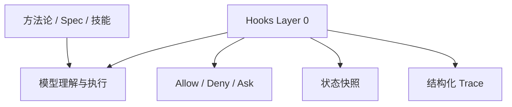

# Agent Hooks 接入指南

如果你的项目已经在用 Copilot、Codex 或类似的 AI 协作方式，这份指南的结论很简单：

> **先不要急着重构整套方法论，先用 Hooks 补上一层确定性的运行时护栏。**

我们这次的实践证明，Hooks 最适合做三类事：

1. **硬门控**：把“不要这么做”从文本提醒变成真正的 allow / deny / ask
2. **状态保持**：在 session 边界保存上下文，降低长会话失忆
3. **执行追踪**：把技能、子 agent、工具调用和治理拦截变成结构化 trace

它不替代你的方法论、Spec、工作流或校验体系，但能显著降低它们在运行时失效的概率。Copilot / VS Code Agent 与 Codex 的 hooks 事件模型不完全相同，但足够支撑同一套设计原则：**运行时护栏、状态连续性、结构化 trace**。

---

## 1. 这套能力最适合解决什么问题

Hooks 不是“让 AI 更聪明”，而是“让 AI 更不容易失控”。

最适合它介入的，通常是下面这些问题：

| 问题 | 典型表现 | Hooks 适合怎么做 |
|---|---|---|
| 纪律靠提示词记忆 | AI 忘记遵守规则、子 agent 裸奔 | 在 `SubagentStart`、`PreToolUse` 做强制注入或拦截 |
| 关键目录不能误写 | `dist/`、生成物、发布产物被直接改 | 在 `PreToolUse` 做 deny |
| 长会话容易失忆 | context compaction 后丢主线 | 在 `PreCompact` 保存快照 |
| 会话结束太随意 | 改完就停，没有验证 | 在 `Stop` 做 soft / hard gate |
| 工具执行不可观测 | 不知道技能实际怎么跑 | 记录 `SessionStart`、`Pre/PostToolUse`、`SubagentStart/Stop` |

**读表结论**：Hooks 最强的地方不是“自动化更多步骤”，而是“把最脆弱的步骤做成确定性边界”。

---

## 2. 核心判断：Hooks 是 Layer 0

很多体系已经有自己的提示词、规则文件、流程文档、技能定义。这些东西仍然重要，但它们有一个共同局限：

> **它们都依赖模型在当前上下文里记住并服从文本。**

Hooks 补上的，是一个更底层的运行时层：



它的价值不在于替代上层，而在于：

- 上层告诉 AI **应该怎么做**
- Hooks 决定某些动作 **能不能这样做**

---

## 3. Copilot 与 Codex 的能力对照

两套 hooks 的核心能力高度重合，但 Codex 多出几个适合组织治理和体验优化的事件。

| 能力 | Copilot / VS Code Agent | Codex | 接入建议 |
|---|---|---|---|
| 会话开始注入上下文 | `SessionStart` | `SessionStart` | 两边都做项目快照 |
| 用户 prompt 进入前 | `UserPromptSubmit` | `UserPromptSubmit` | 两边都可做 prompt trace |
| 工具调用前拦截 | `PreToolUse` | `PreToolUse` | 两边都做高风险路径保护 |
| 工具调用后记录 | `PostToolUse` | `PostToolUse` | 两边都做 tool trace |
| 压缩前快照 | `PreCompact` | `PreCompact` | 两边都写本地快照 |
| 压缩后恢复 | 无独立事件 | `PostCompact` | Codex 可补 memory repair |
| 子 agent 启动 | `SubagentStart` | `SubagentStart` | 两边都注入纪律 |
| 子 agent 结束 | `SubagentStop` | `SubagentStop` | 两边都做结果 trace |
| 会话结束 | `Stop` | `Stop` | 两边都生成 summary / 做验证门控 |
| 审批请求 | 无独立事件 | `PermissionRequest` | Codex 可做自适应审批 |

**读表结论**：先按共同能力设计，再给 Codex 增加 `PermissionRequest` 和 `PostCompact` 两个增强件。

---

## 4. 先落地这 5 个 Hook

如果你只想在其他项目先试一轮，不要一上来做全量自动化。先做下面 5 个。

### 4.1 `PreToolUse`：保护高风险目录

这是最容易见效的一步。

**适合保护的目标**：
- `dist/`
- `build/`
- 自动生成代码目录
- 发布产物目录
- 只允许脚本生成、不允许人工改的目录

**策略**：
- 命中高风险路径 → `deny`
- 给出明确替代路径（例如“请改源文件再构建”）

**Codex 适配提醒**：
- 文件编辑通常体现为 `apply_patch`
- Shell 通常体现为 `Bash`
- MCP 工具通常是 `mcp__...`
- 不要只匹配 Copilot 的 `editFiles` / `createFile`

---

### 4.2 `SubagentStart`：给子 agent 自动补纪律

如果你的体系依赖子 agent、subtask、delegate、skill runtime，这一步很关键。

**目标**：
- 自动注入最小纪律摘要
- 不再依赖主 agent 手动复制规范

**最低限度应该注入**：
- 交付前要有证据
- 状态判断要基于事实
- 改动边界和禁区
- 需要遵守的关键相对路径或入口文件

---

### 4.3 `SessionStart`：注入项目快照

这一步不是为了替代项目扫描，而是为了降低会话冷启动成本。

**推荐注入的信息**：
- 当前分支
- 最近一次提交
- 当前活跃 spec / issue / milestone
- 项目版本或运行时版本

**经验**：只放“让 AI 少走弯路”的信息，不要把整份项目地图塞进去。

**Codex 增强点**：`SessionStart` 的 source 可以区分 `startup`、`resume`、`clear`、`compact`。如果 source 是 `compact`，可以优先读取上一次 `PreCompact` 保存的快照，恢复压缩前主线。

---

### 4.4 `PreCompact`：压缩前快照

如果你们的会话经常比较长，这一步很值。

**推荐保存到用户本地目录**：
- `~/.your-system/session-snapshots/`

不要默认写进仓库。快照是运行态临时产物，不是项目资产。

**Codex 增强点**：如果平台支持 `PostCompact`，在压缩后再记录一次事件，并注入“继续当前主线，不要重复扫描已确认上下文”的恢复提示。

---

### 4.5 `Stop`：结束前门控

这是最容易做出治理效果的一步，但也最容易误伤体验，所以建议分阶段上。

**推荐顺序**：
1. 先做 **soft mode**：只提醒，不阻止
2. 再做 **hard mode**：命中关键条件才阻止

**适合阻止的条件**：
- 改了 spec 但没跑验证
- 触发了高风险拦截后没有修正
- 有必须完成的总结 / 汇总步骤尚未执行

---

## 5. Codex 额外建议：用 `PermissionRequest` 做审批治理

Codex 比 Copilot 多了一个很有价值的事件：`PermissionRequest`。它不是普通的工具前置拦截，而是在系统准备向用户请求审批时触发。

这适合做三类体验优化：

| 场景 | 动作 |
|---|---|
| 明确只读请求 | 自动 `allow`，减少打断 |
| 明确危险请求 | 直接 `deny`，不给用户背锅 |
| 中风险请求 | 不做决定，继续走正常审批 |

推荐先只做保守策略：

- 自动放行：`git status`、`git diff`、`pwd`、`ls`、`cat`、`head`、`tail`、`jq` 等只读命令
- 直接拒绝：`sudo`、`rm -rf`、`curl | sh`、`chmod -R 777`、直接 patch `dist/`
- 其他情况：交回平台默认审批

**经验**：审批治理的目标不是“全部自动通过”，而是让安全动作更顺、高风险动作更硬。

---

## 6. 再往前一步：做结构化 Trace

很多团队一开始只把 Hooks 当成 guardrail，这样已经有价值；但真正能放大长期收益的，是 **trace**。

建议把下面这些事件写成结构化 JSON，而不是只写文本日志：

- `SessionStart`
- `UserPromptSubmit`
- `PreToolUse`
- `PostToolUse`
- `SubagentStart`
- `SubagentStop`
- `PreCompact`
- `PostCompact`（Codex）
- `PermissionRequest`（Codex）
- `Stop`

推荐输出位置：

- `~/.your-system/hooks-traces/events/<session_id>.jsonl`
- `~/.your-system/hooks-traces/summaries/<session_id>.json`

### 推荐事件格式

```json
{
  "timestamp": "2026-06-17T10:40:03Z",
  "session_id": "abc",
  "hook_event_name": "PreToolUse",
  "repo": "my-repo",
  "branch": "feat/example",
  "tool_name": "apply_patch",
  "target_paths": ["src/main.ts"],
  "policy_decision": "allow"
}
```

### 推荐汇总内容

- 各 hook 触发次数
- 工具调用统计
- subagent 生命周期
- policy deny 记录
- prompt 次数
- compaction 次数
- permission request 次数（Codex）
- 最后一次 stop 事件

**经验**：先做“事件流 + 会话摘要”，不要一开始就追求复杂可视化。只要数据结构稳定，后面接 dashboard 很容易。

---

## 7. 不要这样接

Hooks 很强，但也很容易被用偏。

### 不建议的做法

| 做法 | 为什么不建议 |
|---|---|
| 把 Hooks 当成完整工作流引擎 | 它更适合做边界控制，不适合承载复杂编排 |
| 在 Hook 里塞很重的逻辑 | 会拖慢会话，增加超时和误判 |
| 把临时运行态文件写进仓库 | 会污染 git 历史和项目资产 |
| 一上来就所有事件都 hard block | 会让体验急剧变差 |
| 指望 Hooks 替代 Spec 审查或设计判断 | 它看的是运行态边界，不是高层方案质量 |
| 让同一个脚本假设所有平台工具名一致 | Copilot 与 Codex 的 tool schema 不同 |

### 更稳妥的做法

- **短脚本**
- **明确输入输出**
- **优先本地文件落盘**
- **先 guardrail，后 trace，最后再做门控升级**

---

## 8. 一套可复制的最小目录

### Copilot / VS Code Agent

默认放在 `.github/hooks/`：

```text
.github/hooks/
├── hooks.json
└── scripts/
    ├── session-context.sh
    ├── protect-generated.sh
    ├── inject-subagent-rules.sh
    ├── pre-compact-snapshot.sh
    ├── trace-lib.sh
    ├── trace-user-prompt.sh
    ├── trace-post-tool.sh
    └── trace-stop.sh
```

### Codex

默认放在 `.codex/`：

```text
.codex/
├── hooks.json
└── hooks/
    ├── session-context.sh
    ├── protect-generated.sh
    ├── permission-request-policy.sh
    ├── inject-subagent-rules.sh
    ├── pre-compact-snapshot.sh
    ├── post-compact-trace.sh
    ├── trace-lib.sh
    ├── trace-user-prompt.sh
    ├── trace-post-tool.sh
    ├── trace-subagent-stop.sh
    └── trace-stop.sh
```

如果你希望跨项目复用，建议把这套脚本抽成：

- 一个仓库内模板目录，供复制
- 或一个 installer / bootstrap 脚本，按目标平台初始化 `.github/hooks/` 或 `.codex/`
- 或 Codex plugin / policy pack，给组织统一分发

这样比要求每个项目手写一套更稳定。

---

## 9. 推荐的接入路线

### 先上护栏

- `PreToolUse`
- `SubagentStart`
- `SessionStart`

目标：先把最容易出事故的点卡住。

### 补状态和 trace

- `PreCompact`
- `PostCompact`（Codex）
- `UserPromptSubmit`
- `PostToolUse`
- `SubagentStop`
- `PermissionRequest`（Codex）
- `Stop`

目标：让执行过程可观察、可回放。

### 再做治理升级

- `Stop` 从 soft mode 升到 hard mode
- 按 agent / skill 做 scoped hooks
- 让 trace 汇总进入 review、回顾或质量分析
- 面向 Codex 时，把稳定策略抽成 managed hooks 或 plugin-bundled hooks

目标：从“能用”升级到“能持续优化”。

---

## 10. 判断这套方案有没有成功

不要只看“脚本有没有跑起来”，而要看这几类结果：

| 指标 | 成功信号 |
|---|---|
| 稳定性 | 高风险目录误写显著减少 |
| 纪律执行 | 子 agent 不再缺关键约束 |
| 连续性 | 长会话压缩后能快速恢复主线 |
| 可观测性 | 能还原一次 session 的关键执行链路 |
| 体验 | 拦截次数可接受，提醒信息可执行 |
| 审批体验 | 低风险动作少打断，高风险动作不放过 |

如果只有“日志变多了”，但没有让错误更少、恢复更快、治理更清楚，那就不算成功。

---

## 11. 对其他体系最重要的一句话建议

**先把 Hooks 当成运行时护栏，而不是自动化舞台。**

先解决：
- 什么不能做
- 关键状态怎么保存
- 执行过程怎么留下证据

等这三件事稳定后，再考虑更复杂的自动化和 agent-scoped 设计。

---

## 12. 进一步参考

- 深度分析：[`../../thinking/20_architecture/vscode_hooks_maglev_opportunities_2026_06_17.md`](../../thinking/20_architecture/vscode_hooks_maglev_opportunities_2026_06_17.md)
- Codex 对照分析：[`../../thinking/20_architecture/codex_hooks_maglev_analysis_2026_06_17.md`](../../thinking/20_architecture/codex_hooks_maglev_analysis_2026_06_17.md)
- Runtime Layer 洞察：[`../../thinking/20_architecture/hooks_runtime_layer_maglev_product_insights_2026_06_17.md`](../../thinking/20_architecture/hooks_runtime_layer_maglev_product_insights_2026_06_17.md)
- VS Code 官方文档：<https://code.visualstudio.com/docs/agent-customization/hooks>
- Codex 官方文档：<https://developers.openai.com/codex/hooks>
