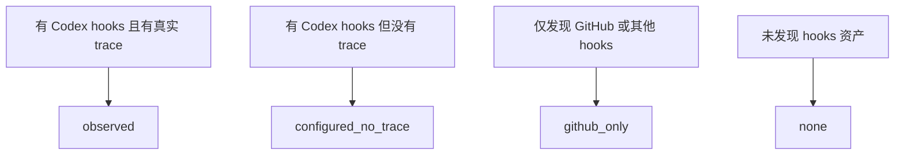

# Hooks Trace 快照分析手册

> 将 Codex hooks 的运行态 trace 导出为可审计快照。它回答“观察到了什么”，不回答 skill 是否成功或需求是否完成。

## 证据边界

快照只导出可由 hooks、文件系统或 trace parser 独立复算的事实：显式 skill 入口和交接、工具调用、policy deny、目标路径、验证命令调用、已注册产物是否存在，以及 trace 健康度。

当前 Codex `PostToolUse` payload 没有稳定的结构化退出码，模型文本也不是独立证据。因此 skill 完成、需求收敛、验证命令通过或失败，以及失败原因均为 `unverified`。`Stop` 只表示 turn 结束，不会为 skill 写入完成状态。

## 导出快照

在仓库根目录执行：

```bash
python3 scripts/export_hooks_trace_snapshot.py \
  --workspace-root ~/workspace \
  --output ~/.maglev/analysis/hooks-trace-snapshot.json \
  --report ~/.maglev/analysis/hooks-trace-governance.md
```

输出包括：

- `hooks-trace-snapshot.json`：供审计和二次分析使用的结构化快照。
- `hooks-trace-governance.md`：日常阅读的事实型报告。

用 `--trace-root` 可追加脚本无法自动推断的 trace 根目录；未提供 `--output` 时 JSON 输出到标准输出。

## 输出结构

| 区块 | 用途 | 关键字段 |
|---|---|---|
| `summary` | workspace 覆盖情况 | Git 项目数、已配置 hooks 项目数、观察到真实 trace 的项目数 |
| `final_skill_session_summary` | 以会话最后可观察 skill 标签聚合的会话数量 | `final_skill`、`sessions_total`、`completion_state` |
| `skill_invocation_summary` | 显式 skill 入口和显式交接统计 | `explicit_usage_count`、`transition_count`、`completion_state` |
| `final_skill_session_load` | 会话负载事实 | 工具调用与 compact 均值、policy deny 数量 |
| `fact_observation_summary` | 独立事实的总计 | 验证命令调用、目标路径、产物存在和缺失 |
| `maglev_project_adoption` | Maglev 项目的 trace 覆盖和健康度 | `skills_used`、`unused_core_skills`、`trace_health` |
| `projects` / `trace_roots` | 项目和 trace 根目录明细 | hooks 资产、关联 trace、解析失败、字段覆盖 |

`final_skill_session_summary` 不是 invocation 统计；`skill_invocation_summary` 只读取 `started` 与 `handed_off` 事件。两处的 `completion_state: unverified` 都是证据边界，不是失败或默认成功。

## 性能与可靠性边界

Trace 是 best-effort 观测能力，不是控制面或业务流程的前置条件。事件写入使用独立的有界 event lock：在短预算内无法取得锁时丢弃本次事件并继续返回，不把高频 trace 写入变成长时间等待。

- trace 写入失败、trace root 不可用或 event lock 冲突，不改变 policy 的 `allow` / `deny` 决策。
- 正常 trace-only 路径应保持在秒级以下；超过 1 秒属于异常信号，应优先检查锁竞争、文件系统和宿主进程启动成本。
- `SessionStart` / `SubagentStart` 的上下文注入、Git 查询、snapshot 生成和未来的 Maglev workflow 属于流程或辅助能力，必须单独测量，不能把组合耗时归因于 trace。
- 有界丢弃意味着事件日志不是审计级完整日志。分析时同时查看 `trace_health`、坏文件数量和可观察事件覆盖，不以事件数量推断业务完成。

## Trace 状态



- `observed`：配置和实际运行记录均已观察到。
- `configured_no_trace`：资产已安装，尚无当前根目录下的运行记录。
- `github_only`：不足以证明 Codex hooks trace 已接入。
- `none`：未发现相关 hooks 资产。

## 分析顺序

1. 查看 `summary` 和 `trace_status`，确认哪些项目产生了可用 trace。
2. 查看 `trace_roots` 的 `bad_file_count`；有损坏 trace 时先修复写入健康度，再做趋势判断。
3. 查看 `skill_invocation_summary`，只把显式入口和交接理解为采用事实。
4. 查看 `fact_observation_summary` 与项目明细，定位验证命令调用、目标路径、产物检查和 policy deny。
5. 对业务完成、命令结果和失败原因保持 `unverified`，直到平台提供可独立验证的结构化证据。

## 何时扩展 Schema

只有新的平台 payload 能稳定提供独立证据，并且字段的生产者、聚合规则、隐私边界和回归测试都已确定时，才新增指标。不要通过解析 assistant 正文、`tool_response` 正文或缺失的退出码补全成功率。
