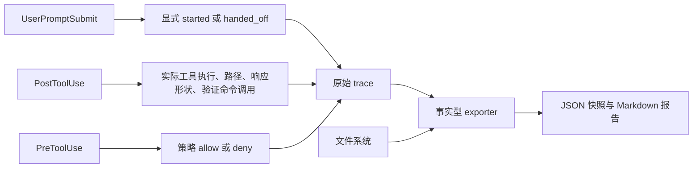

# Maglev Hooks 语义 Trace Schema v1

> 目标：用最小、可复算的语义 trace 记录 Maglev 的显式使用和运行事实。该 schema 不从模型文本、模型自述或缺失的退出码推断成功、失败或业务完成。

## 1. 当前能力

Codex hooks 可以记录会话、prompt、工具、policy、compact 与 stop 等运行事件。Maglev 在这些事件上补充显式 skill 入口、显式交接、工具与路径事实，以及验证命令调用观察。

`Stop` 仅记录 turn 结束的运行事实；它不写入 skill `finished` 事件，也不写入 outcome、失败原因或验证结果。

## 2a. 性能与可靠性边界

语义 trace 属于 best-effort 观测面。事件 append 使用独立的有界 event lock；锁竞争超过短预算时，本次事件可以丢弃，hook 仍应结束并返回原有的控制面结果。trace 写入失败不得改变 `allow`、`deny` 或其他 policy 决策。

正常 trace-only 路径应保持在秒级以下，超过 1 秒应视为异常并检查 event lock、文件系统和宿主进程启动成本。上下文注入、Git 或文件查询、snapshot 导出以及任何实际 Maglev workflow 的性能属于独立维度，必须用各自的流程基准衡量，不能从 trace 事件耗时推导流程能力性能。

由于事件可在竞争时有界丢弃，trace JSONL 不是审计级完整日志；`trace_health` 和解析完整性用于描述观测质量，不用于推断 skill 或业务流程是否完成。

## 2. 事实字段

| 字段 | 生产位置 | 表达的事实 | 不能推出的结论 |
|---|---|---|---|
| `maglev_skill` | 语义 trace 事件 | 当前可观察的 skill 归属 | 该 skill 成功或完成 |
| `maglev_entrypoint` | `UserPromptSubmit` | 显式入口类型 | 实际执行质量 |
| `maglev_stage` | 语义 trace 事件 | 可观察的主流程阶段标签 | 阶段已闭环 |
| `maglev_invocation_event=started` | `trace-user-prompt.sh` | 显式 skill 入口 | business completion |
| `maglev_invocation_event=handed_off` | `trace-user-prompt.sh` | 显式 skill 切换 | 前一 skill 已完成或后一 skill 成功 |
| `tool_name` / `target_paths` | `trace-post-tool.sh` | Hook 在执行后观察到的工具调用和可提取的目标路径 | 修改正确或产物有效 |
| `policy_decision=allow` | `protect-dist.sh` | PreToolUse 已放行当前工具请求 | 工具一定开始或成功完成 |
| `policy_decision=deny` | `protect-dist.sh` | 明确的策略阻断 | skill 或需求失败 |
| `verification_command_observed` | `trace-post-tool.sh` | 命中配置规则的命令被调用 | 验证命令通过 |

历史的 `maglev_outcome`、`maglev_failure_reason`、`maglev_verification_state` 与 `maglev_next_handoff` 是退役推断字段。exporter 会过滤它们，旧 trace 不会被启发式补算为新指标。

## 3. 导出指标

| 指标 | 证据源 | 限制 |
|---|---|---|
| `explicit_usage_count` | `started` | 仅覆盖显式入口。 |
| `transition_count` | `handed_off` | 仅代表显式切换。 |
| `tool_call_count` | `PostToolUse` | 仅覆盖执行后被 Hook 观察到的工具调用；不代表工具成功。 |
| `policy_deny_count` | policy deny 事件 | 不代表整体失败。 |
| `target_path_count` | `target_paths` | 仅覆盖可提取目标的工具。 |
| `artifact_present_count` / `artifact_missing_count` | 文件系统和版本化 registry | 存在不代表内容正确。 |
| `verification_command_observed_count` | 命令规则匹配 | 命令结果为 `unverified`。 |
| `trace_health` | parser 和写入完整性 | 是观测系统健康，不是 skill 状态。 |

所有 skill 的业务完成、需求收敛、验证通过或失败原因均输出为 `unverified`，直到有独立、结构化且可稳定复算的证据源。

## 4. 维护约束

新增字段或指标必须同时明确生产 hook、证据来源、聚合规则、隐私边界、报告语言和回归测试。不得保存或解析 assistant 正文、`tool_response` 正文来构造结果性结论；平台没有结构化退出码时，不得生成通过率或失败率。

使用方式见 [Hooks Trace 快照分析手册](./hooks_trace_snapshot_analysis_manual.md)。
