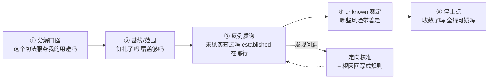

# 逆向质量判断指南：人的判断点与校准

逆向的目标不是"AI 全自动产出"，而是**用尽可能低的总成本，把任意项目转化为相对可靠的现状认知**。人力是这个成本结构里的高杠杆组件，不是要被消除的兜底。本文回答三个流程手册不回答的问题：什么算"可靠"、人的判断力应该花在哪几个点上、发现问题时怎样校准才不会失控。

流程步骤本身见[逆向现状重建使用手册](reverse_reality_manual.md)；能力定义见 `maglev-reverse-spec` 技能。本文与它们的关系一句话：**流程保证完备性，判断保证正确性。**

## 一、先定义"相对可靠"：四条可验收标准

逆向产物的质量不是"全对"——那不存在也不值得追求。可靠的现状认知是指：

1. **事实可复现**：每条关键事实带源码锚点（文件：行号）+ 基线提交钉扎，任何人 checkout 到基线都能核对；
2. **缺席有记录**：声明"没有"的结论（无测试、无前端、无配置）必须有实查痕迹，没写到 ≠ 不存在；
3. **边界诚实**：established（有直接证据）/ partial / unknown / not_applicable 分得清，推断不冒充事实；
4. **关键判断有人签收**：分解口径、范围、unknown 接受度这些机器无法担责的决策，有人明确点头。

实测校准（两份逆向样本 + maglev 自逆向的全量对比评估）：锚点坐实率可以到 93%~96%，也可以低到 80%；差别不在流程走没走完——流程全走完、回执全 passed 的那份样本恰恰缺陷率最高。**差别在人有没有在正确的位置做判断。**

## 二、成本观：机械活脚本化，判断活留给人

| 成本洼地（让机器干，人只看摘要） | 高杠杆点（人必须亲自判断） |
| --- | --- |
| 锚点行号逐条核对、链接断链、digest 重算 | 模块/域的分解口径对不对 |
| 计数类声称（端点数、文件数、表数）复测 | 基线与读取范围锁得对不对 |
| 覆盖格数对账、frontmatter 完整性 | 抽验时的反例质询 |
| unknown 总账的机械汇总 | unknown 能不能接受、哪些风险可发布 |
| 迭代轮次的收敛核算 | 迭代什么时候停 |

人力预算参考（10 模块规模项目）：3~5 次介入 × 每次约 30 分钟 ≈ **1~2 小时人力**，对比 AI 的天级工作量占比不足 5%——但这 5% 决定产出的方向正确性。想压到 0 人力不是省钱，是把校准成本转嫁到每一个后续使用这份现状认知的人身上。

## 三、五个关键判断点

按时间顺序。每个点给出：看什么、问什么、放过的代价。

### 1. 分解口径校准（阶段 A 早期，最便宜的一次介入）

- **看**：语义模块/域清单与边界审阅记录；
- **问**："这个切法能回答我本次用途吗？"（交接？重构前分析？接口核对？）"有没有业务概念被硬塞进两个域或被漏掉？"
- **代价**：切法错了，后面每一页都在错误的地基上生产。这是全流程唯一"改一次省十天"的点。
- 实测：同一项目，一份样本切 10 个 C-模块、另一份切 7 个业务域——两种切法都自洽，但只有使用者知道哪种对用途更合适。这没有机械答案。

### 2. 基线与范围锁定（准备阶段收口）

- **看**：基线提交是否钉扎（不是"当前 HEAD"）、读取范围是否覆盖用途所需、来源角色（intent/implementation/verification）标注是否成立；
- **问**："结论会不会因为基线漂移而失效？""有没有我明知存在但没进读取范围的资产？"
- **代价**：范围漏了关键资产（如前端仓、数仓脚本），产出的"现状"系统性失明。
- 实测：一份样本在准备阶段被人类要求重对齐基线后重派——这是全程最有价值的一次人工介入。

### 3. 反例质询（收口前抽验，性价比最高的一次介入）

不用读完全部页面。抽 3~5 页（含 1 个根页 + 2 个核心域页 + 1 个 verification 页），只做三件事：

- **质询"未见"类声称**："你说基线无测试/无前端调用/无配置——你 grep 了吗？把命令给我看。"
- **质询 established**："这条的锚点在哪一行？"随机抽 2~3 条亲手核对；
- **质询计数**："41 个端点，你怎么数的？"让机器复测。

实测：一份样本全部 10 个域都写了"基线无测试文件"，实际基线里有 15 个测试类——**假阴性 unknown 成批出现，就是因为没人问过这一句**。另一份样本的"本域无 UI"错误判断，也是被人类质询后纠正的。

### 4. unknown 接受度裁定（准入前）

- **看**：unknown 总账逐条过（好的机制会给你一份集中账目而不是散落各页）；
- **判**：哪些 unknown 对本次用途无害可以直接带着走；哪些必须在准入前闭合；哪些要写进交接说明让下一任知道。
- **代价**：unknown 不是缺陷清单，是风险声明——接受多少、接受哪些，是人的风险判断，机器不该也无法代劳。

### 5. 停止点裁定（全程有效）

两条经验法则，均来自实测教训：

- **全绿可疑**：所有格子都 established、所有回执都 passed、零 unknown——先怀疑核查深度，再庆祝完成；
- **每轮必须收敛**：看到"第 N 轮审查发现的问题比上轮多"或"修复引入新修复"，就到停止点了吗——继续叠加审查只会进入无法收敛的死循环。此时宁可带着已声明的 unknown 交付，也不要无限打磨。

## 四、发现问题后怎么校准

按问题类型选动作，核心原则：**定向返工 + 根因回写，禁止无差别全量重跑**。

| 问题类型 | 校准动作 | 禁止 |
| --- | --- | --- |
| 单点事实错（某行号、某计数） | 定向修复 + 用同根因关键词全仓 grep，看是否跨页复制 | 逐条修但不查根因 |
| 系统性偏移（同一文件的行号锚整体漂移、模板句跨域残留） | **整簇作废重做**该域，不逐条修 | 手工逐条对行号 |
| 假阴性 unknown（"未见"实为存在） | 该类声称全域重查（所有"未见/无/缺少"句逐条实查） | 只修被发现的孤例 |
| 分解口径错 | **立即停止产出**，回到判断点 1 重新裁决 | 边产边改（最贵的返工） |
| 反复同类错误 | 把校准结论回写成防复发规则：契约加一条要求、检查器加一道检查、模板删一个坑 | 修完就完，不回写 |

最后一条是成本收敛的关键：每次校准若不沉淀为机制规则，同样的错误会在下一次逆向全额重付。

## 五、按用途选投入档位

| 用途 | 机械电池 | 深度抽验 | 人工介入 |
| --- | --- | --- | --- |
| 交接 / 新人概览 | 全量 | 轻抽样 ~15% | 判断点 1/2/4 |
| 重构 / 关键决策依据 | 全量 | 抽样 ~30% | 判断点 1~4 |
| 长期事实层 / 版本发布 | 全量 | 全量深验 | 判断点 1~5 + 双 run 交叉 |

判断标准：**这份现状认知错了，会疼多久？** 疼一天的轻档，疼一季的中档，写进发布资产的全量档。

## 六、反模式清单（全部来自实测样本）

1. **流程拟合**：十步全走完、回执全 passed，但内容深度和真实性无人过问——回执密度与内容真实性零相关；
2. **全自动迷信**："逆向跑完我就不用看了"——没有判断点 3 的抽验，假阴性 unknown 会成批埋进去；
3. **人当兜底而非杠杆**：出问题才找人；正确姿势是在五个判断点主动小额投入；
4. **全量返工当默认**：发现一个错就推翻整域，校准成本失控；
5. **覆盖=质量错觉**：账本全绿只说明"该写的都写了"，不说明"写的都是对的"；
6. **unknown 当污点**：把 unknown 清零当目标——诚实的 unknown 是资产，被清洗掉的 unknown 是负债。

## 七、一页速查

介入预算：全程 3~5 次、每次 ≤30 分钟。省下的不是这 2 小时，是后续每个使用这份现状认知的人的信任成本。
