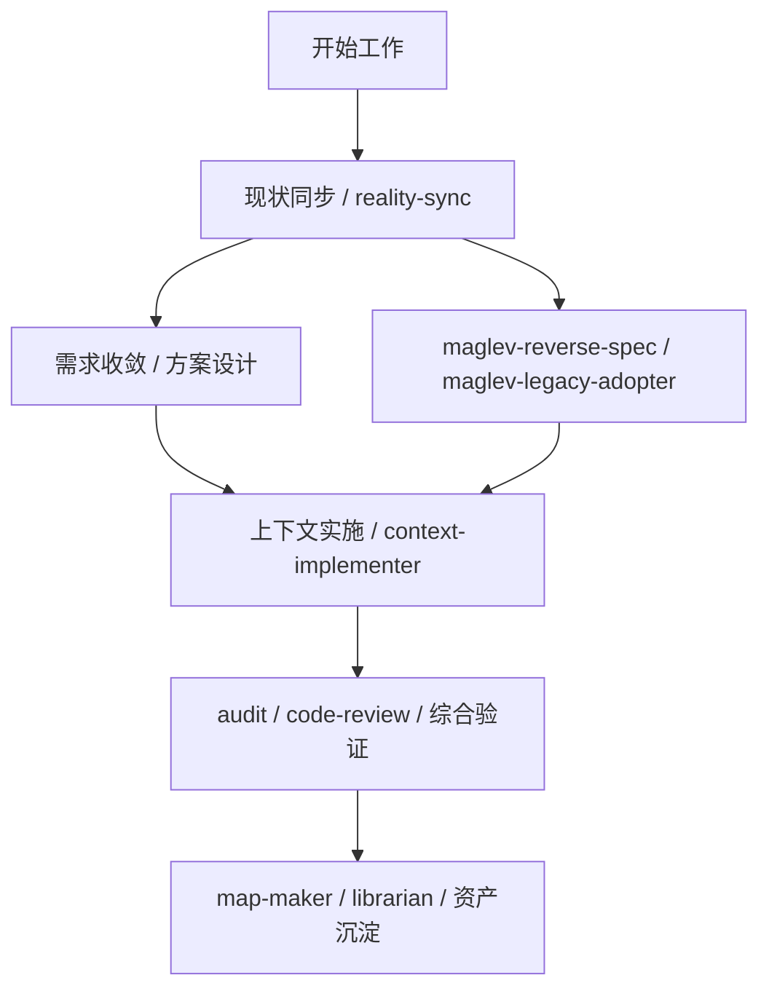

# Maglev 现在具体有哪些能力

如果只听到 Spec、规则、工作流这些词，很多人都会继续追问：

> **Maglev 现在到底已经能做什么？**

最直接的回答是：
Maglev 现在已经不是只有原则判断，而是已经有一组可以实际使用的 skill、workflow 和 CLI 入口，用来把“对齐、实施、验证、接入”这些动作真正跑起来。

## 先看最重要的几类能力

当前最值得先理解的，不是全部能力清单，而是下面这几类：

1. 先把上下文对齐
2. 再把需求或现状写清楚
3. 再推进实现和验证
4. 最后把结果沉淀成可继续使用的资产

如果换成更具体的话，就是：

- 有能力帮团队先同步当前主线和风险
- 有能力把模糊需求整理成更清楚的 Spec
- 有能力把老项目现状重新整理出来
- 有能力帮团队做审计、代码审查和交叉验证
- 已经有正式 CLI 入口支持安装和更新



## 1. 上下文同步能力

这类能力解决的问题是：

- 新会话一开始就抓错主线
- 同一个任务里每个人和 AI 的理解不一致
- 做着做着忘了当前风险和下一步动作

当前最直接的抓手是：

- `现状同步（reality-sync）`

它做的事情很简单：

- 同步当前仓库现实
- 同步主要风险
- 给出下一步建议
- 帮团队先进入正确工作模式

如果你把它理解成“每次开工前的统一对焦动作”，会比较接近它的真实价值。

## 2. 需求收敛与 Spec 能力

这类能力解决的问题是：

- 需求说了很多，但真正能执行的输入不够清楚
- 前后端、产品、测试理解的不是同一件事
- AI 直接消费模糊需求，结果越写越偏

当前比较关键的能力是：

- `requirement-convergence`（需求收敛与稳定需求产物输出）
- `方案设计（spec-designer）`

它们的作用不是“多写一份文档”，而是把原本会在聊天、会议和人脑里漂移的东西，先压缩成一个更稳定的执行依据。

## 3. 老项目接入与逆向能力

这类能力主要解决：

- 老项目没有足够文档
- AI 很难正确理解现有系统
- 团队接手成本高，修改边界不清

当前最关键的抓手是：

- `maglev-legacy-adopter`（存量项目接入）
- `maglev-reverse-spec`（代码逆向成 Spec）

这组能力的价值在于：

- 先把老项目接进统一工作方式
- 再把现有代码、页面和结构重新整理成可依赖说明

也就是说，它不是替你发明业务，而是帮你重新知道系统现在到底是什么。

## 4. 快速开发与最小闭环能力

这类能力解决的问题是：

- 团队不是不想落地，而是不知道怎么从最小闭环开始
- 小需求经常也会拖成大返工
- 大家希望先试一小步，而不是一上来铺很重

当前比较适合承接这件事的是：

- `上下文实施（context-implementer）`

它更像一种“小范围实施 + 自检”的推进方式。
重点不是让团队一次性铺满所有流程，而是先把一次真实需求跑成一个更清楚、更可验证的闭环。

## 5. 审计、代码审查与交叉验证能力

这类能力解决的问题是：

- 做完了，但不知道是不是真的对齐
- Spec、代码、测试之间容易再次走散
- 最后只能靠熟人经验兜底

当前比较关键的抓手包括：

- `spec-audit-surface`（需求与 Spec 输入审计）
- `review-validation-surface`（实现结果审查与验证面）
- `综合验证（integrated-validator）`

它们共同在做的事是：

- 让“做完了没有”变成可检查的问题
- 让需求、设计、代码、测试之间的关系重新可追溯

## 6. 地图、索引与知识沉淀能力

这类能力解决的问题是：

- 仓库越来越大，没人说得清结构
- 知识散在很多目录里，不容易找
- 下次接手时，大家又要重新摸索一次

当前这组能力比较关键：

- `maglev-map-maker`（项目地图）
- `index-librarian`（知识索引）

它们的意义在于：

- 把项目结构重新变得可见
- 把长期会反复使用的知识重新整理出来

对团队来说，这类能力不是最显眼，但往往最能减少后续重复沟通。

## 7. 安装与更新入口

除了上面的 skill 和 workflow，Maglev 当前也已经有正式 CLI 入口。

第一次接入项目，最常用的是：

```bash
npx @idea-maglev/maglev-cli init
```

已有项目更新时，最常见的是：

```bash
npx @idea-maglev/maglev-cli update --dry-run
```

如果你想先看具体怎么用，可以继续读：

- [Maglev 快速开始](../../../guides/20_operations/maglev_distribution_quickstart.md)
- [Maglev 更新与同步手册](../../../guides/20_operations/maglev_update_manual.md)

## 8. 如果把这些能力合在一起看

更容易理解的方式不是记住所有名字，而是记住它们共同在做什么：

| 阶段       | Maglev 现在能提供什么                                                   |
| :--------- | :---------------------------------------------------------------------- |
| 开始前     | 用 `现状同步（reality-sync）` 先同步主线、风险和下一步                  |
| 需求收敛   | 用 `requirement-convergence` / `方案设计（spec-designer）` 把输入写清楚 |
| 老项目理解 | 用 `maglev-legacy-adopter` / `maglev-reverse-spec` 重新整理现状         |
| 实施推进   | 用 `上下文实施（context-implementer）` 推进小范围闭环                   |
| 收口验证   | 用 audit、code review、`综合验证（integrated-validator）` 做检查        |
| 资产沉淀   | 用 `maglev-map-maker` / `index-librarian` 留下地图和索引               |

这也是最值得强调的一点：

> **Maglev 现在不是只在说“团队应该对齐”，而是已经开始提供一组具体的对齐动作。**

## 9. 接下来读什么

如果你想继续往下看，可以按这个顺序继续：

1. [Maglev 解决什么问题？](../problem_statement/published.md)
2. [一个最小工作流示例](../minimal_workflow_showcase/published.md)
3. [Maglev 不直接写代码，那代码部分怎么解决？](../how_maglev_handles_coding_execution/published.md)
4. [一个老项目接入案例](../legacy_system_showcase/published.md)
5. [Maglev 快速开始](../../../guides/20_operations/maglev_distribution_quickstart.md)
