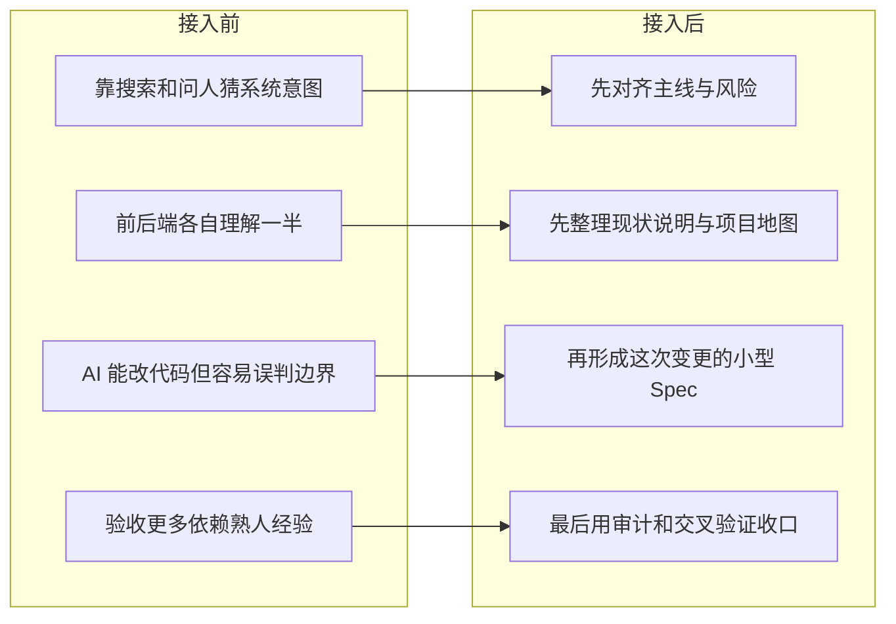

# 一个老项目接入案例

很多团队真正开始觉得 AI 不够稳，不是在新项目里，而是在老项目里。

原因很简单。
新项目至少还有一份相对新鲜的共识，老项目更常见的状态却是：

- 代码跑了很多年
- 文档长期缺失或过期
- 业务知识散在不同人脑里
- AI 虽然能快速读代码，却很容易“合理地误解”

所以老项目真正难的，通常不是“没人能写代码”，而是：

> **没人能稳定说清楚这个系统为什么会变成现在这样、哪些地方不能碰、这次改动到底会牵连到哪里。**

这篇案例不伪造某个具体公司背景，只讲一个很多团队都见过的老系统接入场景：

> **当一个文档缺失、上下文混乱、还要继续迭代的老项目接入 Maglev 时，第一步到底怎么做，团队会留下什么。**

## 先说一个更接近真实的场景

假设你接手的是一个已经在线运行很多年的内部系统。

这次业务改动看起来不大，只是要：

- 在关键流程前增加一个必填校验
- 在发起审批前补一段风险提示
- 在原有流程里支持一个新的临时子项录入方式

单看这三件事，好像都不算大。
但老项目最麻烦的地方恰恰在这里：

- 这个校验可能不在当前页面，而在后端链路里
- 这段提示不只是文案，还会影响用户怎么理解后续步骤
- 这个“临时子项”到底是草稿、正式数据，还是审批中的中间态，往往牵扯到另一套旧规则

这时候最危险的情况不是“代码写不出来”，而是：

- 前端改了一部分
- 后端补了一部分
- AI 看起来也给出了合理改动
- 但整条流程的边界其实已经悄悄改错了

## 没有 Maglev 时，团队通常怎么做

很多团队面对老项目时，实际会这样推进：

1. 先靠代码和搜索猜系统意图
2. 再去问熟悉这块的人补上下文
3. 先改出一个能跑的版本
4. 最后再看看有没有影响别的流程

这种方式不是完全不能工作，但代价会越来越高。

因为每一次改动都像重新认识一次系统。
你不是在稳定迭代，而是在反复进行高成本的“系统考古”。

## Maglev 介入时，第一步并不是写代码

Maglev 在老项目里最先改变的，通常不是代码，而是理解方式。

它不会先问“这次要改哪几个文件”，而是先把这几件事搞清楚：

- 当前系统到底是怎么工作的
- 哪些规则是真约束，哪些只是历史习惯
- 这次改动真正影响哪些模块和流程
- 做到什么算完成，什么不算

这也是为什么 Maglev 在老项目里有价值。
它不是先让系统“变新”，而是先让团队重新拥有一个可以依赖的当前说明。

## 把这个接入过程想成一个更具体的分镜

如果把这次接入过程拍成几个镜头，通常会更接近下面这样：

### 镜头 1：接入前

团队接到一个看起来不大的需求。

大家第一反应通常是：

- 去搜代码
- 去问熟悉这块的人
- 先改出一个版本再说

表面上看，项目还在推进。
但实际状态更像是：

- 前端和后端各自理解了一半
- 业务边界主要靠口头补充
- AI 虽然能快速给出修改建议，但没人敢完全相信它真的理解了旧规则

这时候，真正拖慢团队的不是编码速度，而是“到底改没改对”始终没有把握。

### 镜头 2：开始接入

Maglev 介入后，团队不会先冲进代码层，而是先做几件更基础的事：

- 先把当前主线和风险对齐
- 先把老系统现状重新整理出来
- 先把这次变更真正影响的流程、模块和边界说清楚

这时候团队的感觉通常会从：

- “先试试看能不能改出来”

变成：

- “先确认我们理解的是不是同一个系统”

### 镜头 3：进入实现

等现状说明、边界和小型 Spec 已经形成之后，团队才开始真正进入改动。

这时实现层的变化并不一定更少，
但理解层的噪音会明显下降：

- AI 不再直接消费一句模糊需求
- 前后端不再各自猜测这次到底改到哪里
- 测试也不再只能在最后凭经验兜底

换句话说，代码还是要写，
但它终于开始围绕同一份依据被写出来。

### 镜头 4：改动完成后

最重要的变化，其实常常出现在这一步。

以前做完一个需求，团队留下来的通常只有：

- 代码改动
- 几段聊天记录
- 少数人脑中的解释

而接入 Maglev 之后，团队更容易留下的是：

- 当前系统说明
- 这次变更的小型 Spec
- 验证和回归抓手
- 后续还能继续使用的地图和索引

这也是为什么很多团队最后会觉得：

> **真正被改善的，不只是这次需求，而是这个系统以后终于开始变得“还能继续被理解”。**

## 这时 Maglev 具体靠什么介入

如果只说“它会帮助治理老项目”，还是太虚。
更实际的情况通常会更接近下面这样：

### 1. 先用 `maglev-legacy-adopter` 把项目接进来

它解决的是：

- 老项目原本没有统一工作方式
- 团队不知道应该从哪里开始接入
- 仓库里缺少稳定的接入起点

这一步的意义不是大改系统，而是先让项目进入一套能继续工作的基础轨道。

### 2. 再用 `maglev-reverse-spec` 把现状重新写出来

这一步最关键。

因为老项目最大的问题，往往不是没有代码，而是没有“当前系统说明”。

`maglev-reverse-spec` 做的事情，不是发明新架构，而是把下面这些内容重新整理出来：

- 当前系统有哪些关键流程
- 哪些字段、状态、步骤是真正影响业务的
- 哪些模块之间存在依赖关系
- 这次改动会碰到哪些边界

对于团队来说，这一步最大的价值是：

> **以后大家不再直接消费一堆历史代码，而是先消费一份更清楚的现状说明。**

### 3. 用 `maglev-map-maker` 和 `index-librarian` 重新建立可见结构

很多老项目的问题不是没有信息，而是信息太散。

有人知道模块关系，有人知道旧规则，有人知道哪个目录最关键，但这些知识没有被稳定留下来。

这时：

- `maglev-map-maker` 会帮助团队重新看到项目结构
- `index-librarian` 会帮助团队把关键知识变成可查找的索引

这两步做完之后，团队面对老项目时的感觉会完全不一样：

- 之前是“哪里都像有关，哪里又都不敢碰”
- 之后会变成“先看地图，再看索引，再进入改动”

### 4. 再用 `方案设计（spec-designer）` 把这次变更压缩成一份小而清楚的执行依据

一旦现状重新变得可见，下一步就不是立刻动代码，而是把这次要改的东西收敛成一个足够小、但足够清楚的说明。

这份说明不需要很长，但至少会写清楚：

- 这次到底改哪条流程
- 哪些模块会受影响
- 哪些内容不在这次范围内
- 完成标准是什么

这一步非常重要。

因为老项目最怕的不是需求复杂，而是：

> **需求本来就不够清楚，又直接丢给实现层和 AI 去猜。**

### 5. 最后再用审计和交叉验证能力收口

真正让老项目接入变稳的，不是“写出代码”本身，而是修改后还能不能确认自己没有理解错。

这时比较有价值的能力通常是：

- `spec-audit-surface`（Spec 审计）
- `review-validation-surface`（代码审查）
- `综合验证（integrated-validator）`

它们做的不是增加仪式感，而是回答几个非常现实的问题：

- 这次代码改动和原始意图对上了吗
- 前后端是不是改的是同一件事
- 测试和验收是不是也围绕同一套边界

## 站在使用者视角，接入之后最明显的变化是什么

如果把这个案例翻成更直接的体验差异，前后会很像这样：

| 接入前 | 接入后 |
| :--- | :--- |
| 先靠搜索和问人猜系统意图 | 先看现状说明、项目地图和知识索引 |
| AI 能读代码，但经常误判边界 | AI 开始有更稳定的输入和约束 |
| 每次改动都像重新考古一次系统 | 这次留下来的说明下次还能继续用 |
| 做完后只能靠熟人经验判断 | 开始有 Spec、审计和交叉验证做收口 |

对大多数团队来说，真正被改变的不是“这次需求能不能做”，而是：

> **这次之后，团队是不是终于开始知道该怎么继续理解这个系统。**

## 如果是你的项目，最小可以怎么做

不是每个老项目都要一上来做很重的接入。

更现实的做法通常是：

1. 先挑一个正在发生的真实变更
2. 用 `现状同步（reality-sync）` 对齐当前主线和风险
3. 用 `maglev-reverse-spec` 先把和这次变更相关的现状写清楚
4. 用 `方案设计（spec-designer）` 把这次改动收敛成一个小 Spec
5. 做完后再用审计和交叉验证能力收口

也就是说，最小接入并不是“先把整个老系统一次性梳理完”，而是：

> **先拿一个真实需求，把“理解 -> 变更 -> 验证”这条线跑通。**

## 这个案例真正想说明什么

它不是想证明老项目会因为接入 Maglev 就一下子变简单。

它真正想说明的是：

> **Maglev 的价值，是让一个原本只能靠熟人记忆和临时沟通维持的老系统，开始留下可以继续理解、继续验证、继续演进的依据。**

## 接下来读什么

如果你想继续往下看，建议接着读：

1. [为什么老项目和存量系统会成为 Maglev 的关键场景](../why_legacy_systems_matter/published.md)
2. [Maglev 现在具体有哪些能力](../capability_snapshot/published.md)
3. [Maglev 快速开始](../../../guides/20_operations/maglev_distribution_quickstart.md)

如果把这篇压缩成一句话，那就是：

> **Maglev 不是先让老项目“变新”，而是先让它不再只能靠熟人记忆维持。**
