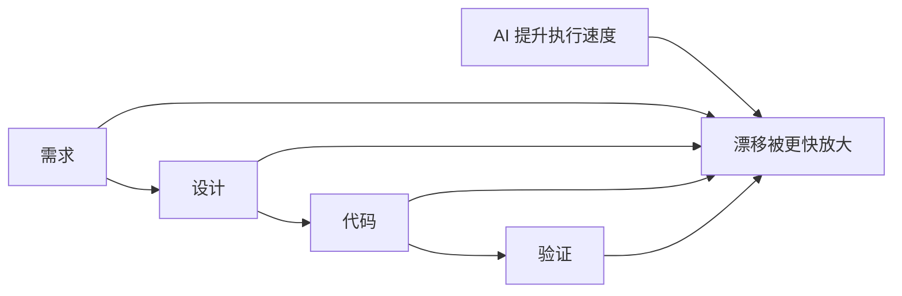

# Maglev 解决什么问题？

## 1. 结论先行

AI Coding 已经让写代码这件事变得更快了，但团队交付并没有因此自动变稳。
很多团队的真实体验不是“更顺”，而是“更快地把问题做大”。

真正的问题不是“模型还不够强”，而是意图、设计、代码和验证之间的漂移仍然存在，甚至会被 AI 放大。

Maglev 要解决的，不是让 AI 多写一点代码，而是：
**让团队在 AI Coding 时代仍然能够稳定协作、沉淀资产并持续交付。**

## 2. 场景或问题

先从一个常见现实开始：

- 需求变更越来越快
- AI 可以很快产出代码
- 但文档、设计、实现和验收标准还是经常不同步
- 结果不是“更稳”，而是“更快地返工”

这说明：
AI 提升了执行速度，但没有自动解决研发对齐问题。

如果团队原本就存在这些问题：

- 需求描述不稳定
- 技术设计缺少统一表达
- 文档更新依赖个人自觉
- 老项目缺少可依赖的真理源

那么 AI Coding 往往不是先带来秩序，而是先放大混乱。

## 3. 为什么 AI Coding 越强，团队越需要治理

很多团队会自然产生一个判断：

> AI 只要越来越强，研发流程就会自然越来越顺。

但现实往往相反。

当 AI Coding 的速度上升之后，团队里原本就存在的问题不会自动消失，反而会被放大：

- 模糊需求会更快变成错误实现
- 设计遗漏会更快扩散到代码层
- 文档失效会让后续修改成本更高
- 老项目缺少真理源时，AI 会更容易“合理地误解”

所以真正的矛盾不是“AI 还不够会写代码”，而是：

> **团队缺少一套能让意图、设计、代码和验证持续对齐的机制。**

## 4. Maglev 的判断

Maglev 对这个问题的核心判断有三点：

1. **问题不只是代码生成，而是研发资产在持续漂移。**
2. **如果没有 Spec、规则和验证闭环，AI 只会把原本的混乱放大。**
3. **团队真正缺的，不只是更强模型，而是更稳定的研发对齐机制。**

换句话说，Maglev 关注的不是“怎么让 AI 再快一点”，而是：

- 怎么让需求不在传递中失真
- 怎么让设计不在实现中丢失
- 怎么让代码不在演进中脱离原始意图
- 怎么让 AI 产出变成可维护资产，而不是一次性结果

## 5. 结构化说明

| 常见现象 | 表面理解 | Maglev 的判断 |
| :--- | :--- | :--- |
| AI 写代码更快了 | 团队会自然更高效 | 速度提升不等于交付稳定 |
| 大家都在用 AI | 组织能力已经升级 | 个人提效不等于团队协同 |
| 文档经常落后于代码 | 是正常工程摩擦 | 这是研发对齐失效的信号 |
| 老项目很难交给 AI | 是模型上下文不够 | 更深层问题是缺少稳定真理源 |

读表结论：
**Maglev 要解决的核心问题，是 AI 时代的软件研发对齐，而不是单纯的代码生成效率。**

## 6. Maglev 实际提供的最小闭环

如果只用一句话描述 Maglev 的做法，可以理解成：

> **先固定意图，再执行实现，最后持续校准。**

在实践里，这通常体现为一个最小闭环：

1. **用 Spec 固定意图**
   在开始实现前，把需求和关键约束先固定下来。

2. **用规则固定边界**
   让团队和 AI 都在同一套边界里工作，而不是各自理解。

3. **用工作流固定执行路径**
   降低“每个人都在用 AI，但每个人的方法都不一样”的混乱。

4. **用验证和纠偏固定闭环**
   让偏差被尽早发现，而不是在返工时才暴露。

这也是 Maglev 和单纯 AI Coding 工具最重要的差别：

- 工具主要提升“生成速度”
- Maglev 主要提升“交付稳定性”

## 7. 这套闭环现在是怎么落地的

如果只讲 Spec、规则和工作流，读者还是会继续追问：

> **这些东西现在到底是怎么被团队实际使用的？**

当前 Maglev 已经有一组比较具体的抓手，可以把上面的闭环落到真实动作上：

- 用 `现状同步（reality-sync）` 先同步当前主线、风险和下一步动作，减少一上来就各自理解
- 用 `方案设计（spec-designer）` 把模糊需求收敛成更可执行的 Spec
- 老项目资料不足时，用 `maglev-reverse-spec`（代码逆向成 Spec）和 `maglev-legacy-adopter`（存量项目接入）先把现状重新冻结出来
- 小范围实施时，用 `上下文实施（context-implementer）` 推进实现和自检
- 收口阶段再用 `spec-audit-surface`（Spec 审计）、`review-validation-surface`（代码审查）、`综合验证（integrated-validator）` 做对齐检查

如果把它压缩成更直白的话，就是：

- 不是只说“先对齐”，而是先有 `现状同步（reality-sync）`
- 不是只说“先写清楚”，而是有 `方案设计（spec-designer）` / `maglev-reverse-spec`
- 不是只说“再验证一下”，而是有 `spec-audit-surface` 和 `综合验证（integrated-validator）` 这类收口动作

## 8. 什么时候最需要 Maglev

Maglev 并不是在任何场景下都同样必要。

它最适合下面这些情况：

### 8.1 团队已经在用 AI，但协作没有同步升级

常见表现是：

- 每个人都在用 AI
- 但没有统一工作方式
- 结果是产出越来越多，协作越来越碎

### 8.2 需求和实现经常漂移

如果你的团队经常出现：

- 需求开会说的是一套
- 文档写的是一套
- 最后代码又是另一套

那么 Maglev 的价值会很直接，因为它本质上是在修复这条链路。

### 8.3 老项目很难让 AI 正确理解

当仓库里：

- 没有文档
- 代码历史很长
- 业务逻辑依赖口口相传

AI 越强，也越容易“自信地误解”。
Maglev 在这里的作用，不是替你发明业务，而是帮助把旧系统重新冻结成可读、可改、可验证的资产。

### 8.4 团队想把 AI 使用变成组织能力

如果目标不只是“某几个高手用得很好”，而是：

- 让更多人稳定使用
- 让产出可以审计和复用
- 让流程能被团队共同维护

那么 Maglev 会比单纯加工具更有意义。

## 9. 什么时候不一定需要 Maglev

反过来说，如果你的场景是：

- 个人快速做一个小工具
- 一次性原型验证
- 没有多人协作和长期维护压力

那么你未必需要完整引入 Maglev。

这时候更轻量的 AI Coding 工具、简单的 Spec 流程，可能已经足够。

这不是 Maglev 的弱点，而是它的边界：

> **Maglev 更适合需要长期协作、持续演进和减少漂移的软件研发场景。**

## 10. Maglev 不是什么

为了避免误解，这里也需要说清楚边界。

Maglev 不是：

- 一个通用智能体应用开发框架
- 一个通用 agent runtime 平台
- 一个只靠 prompt 模板运行的方法
- 一个替代所有现有工具的万能平台

它更适合被理解成：

> **面向组织内 AI Coding 的软件研发对齐系统。**

## 11. 总结

- Maglev 主要解决的是 AI 时代的软件研发对齐问题
- 它和 AI Coding 工具不是同一层东西
- 它不等于智能体应用开发框架

如果把这篇文章压缩成一句话，那就是：

> **Maglev 的价值不在于让 AI 多写一点代码，而在于让团队少承担一点混乱。**

## 12. 接下来读什么

如果你想继续往下看，建议按这个顺序继续：

1. [一个最小工作流示例](../minimal_workflow_showcase/published.md)
2. [Maglev 现在具体有哪些能力](../capability_snapshot/published.md)
3. [一个老项目接入案例](../legacy_system_showcase/published.md)
