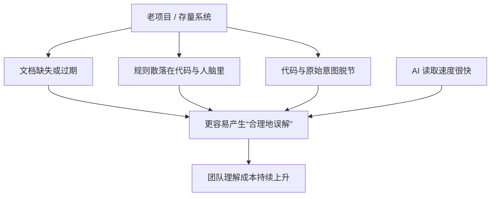

# 为什么老项目和存量系统会成为 Maglev 的关键场景

很多方法在新项目里看起来都成立，但真正能拉开差异的，往往是老项目。

因为老项目最难的地方，从来不只是代码旧。
真正难的是：

- 文档缺失
- 规则散落
- 业务知识依赖口口相传
- 代码和原始意图早就脱节

这也是 Maglev 更容易体现价值的地方。

这里说的“老项目和存量系统”，不是单纯指代码年份长。
更准确地说，是指下面这类系统：

- 已经支撑真实业务在跑
- 前后端模块多，协作链条长
- 需求和规则改过很多轮
- 很多关键知识已经散在代码、文档、会议记录和人脑里

一旦系统进入这个阶段，团队面临的问题就不只是“怎么继续开发”，而是“怎么继续理解”。

## 老项目真正缺的，不是“更多代码”，而是“更稳定的真理源”

AI 可以很快读代码，但如果仓库里没有稳定真理源，它读到的往往只是结果，不是意图。

这会导致一个常见问题：

- 模型看起来理解了
- 生成的代码看起来也合理
- 但真正上线时，偏差反而更大

因为它补全的是“看起来合理”，不是“和系统原始约束一致”。

## 为什么 Maglev 在这里有价值

Maglev 的意义不是替代团队重新发明业务，而是帮助把原本分散、模糊、失效的知识重新冻结成可依赖资产。

它最核心的作用是：

1. 让意图重新被写下来
2. 让规则重新被看见
3. 让代码和文档重新建立关系
4. 让后续修改有可验证的依据

换句话说，Maglev 在老项目里的价值，不是“让团队更会写代码”，而是：

> **让团队终于开始知道自己改的到底是不是同一个系统。**

## 一个最小判断

| 场景 | 常见问题 | Maglev 的价值 |
| :--- | :--- | :--- |
| 新项目 | 规则还没完全形成 | 先建立对齐机制 |
| 老项目 | 规则存在但已经散失 | 重新收拢真理源与协作边界 |

读表结论：
**老项目不是 Maglev 的次要场景，反而是最容易体现它价值的场景。**

## 为什么这种场景更需要 Maglev，而不只是更强模型

因为在老项目里，团队往往同时缺三样东西：

1. **稳定的当前说明**
   大家知道系统能跑，但未必知道它为什么这样跑。

2. **明确的变更边界**
   一次改动真正会影响哪些模块、哪些流程、哪些角色，通常没有被写清楚。

3. **可回归的验收依据**
   很多修改做完只能靠熟人经验判断，没法被稳定复查。

Maglev 在这里的作用，不是替代团队理解业务，
而是把这三样重新补出来：

- 用 Spec 收拢当前系统说明
- 用规则和工作流固定变更边界
- 用验证和测试项留下回归抓手

这也是为什么它在存量系统里尤其容易显示出价值。

## 你怎么判断自己已经在这个场景里

很多团队其实已经处在“老项目关键场景”里了，只是没有明确说出来。

如果你的项目已经出现下面这些信号，基本就说明问题不只是开发效率，而是理解和治理开始失稳：

- 需求一变更，大家先去问“这个功能到底是谁最懂”
- AI 很快能定位文件，但给出的修改建议经常只对一半
- 前后端每次都会在“这次到底影响哪里”上反复确认
- 做完改动之后，验收更多依赖熟人经验，而不是显式标准
- 新人或新会话接手同一块功能时，启动成本明显偏高

这些信号如果已经频繁出现，说明团队真正缺的就不是“再快一点”，而是先把当前系统重新变成一个可以被共同理解的对象。

## 接下来读什么

如果你已经确认自己就在这个场景里，建议接着读：

1. [一个老项目接入案例](../legacy_system_showcase/published.md)
2. [Maglev 现在具体有哪些能力](../capability_snapshot/published.md)

## 总结

- 老项目最难的不是代码旧，而是对齐机制失效
- AI 读得快，不代表理解得稳
- Maglev 在这里的价值，是帮助团队重建可以继续演进的真理源

如果压缩成一句话：

> **老项目真正需要的，不是更快改代码，而是重新知道自己为什么这样写。**
