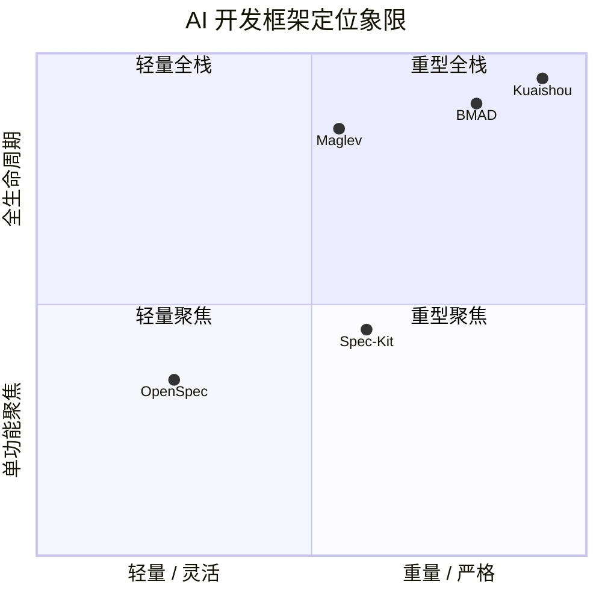
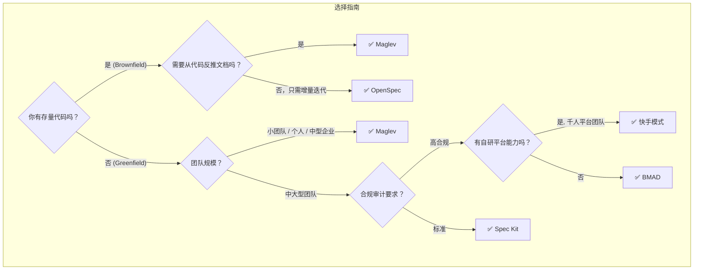

# Maglev vs OpenSpec vs BMAD vs 快手：AI 驱动开发框架深度对比报告

> **日期**: 2026-02-23
> **目的**: 客观对比五大 AI 驱动开发框架/范式，帮助团队和外部读者理解 Maglev 在行业生态中的差异化定位。
> **数据来源**: 各框架官方文档 (GitHub, openspec.pro, bmadcodes.com)、独立评测 (Medium, Reddit, YouTube)、快手技术团队公开文章《快手万人组织 AI 研发范式跃迁之路》、Maglev 项目自身文档与自我批判记录。

---

## 1. 框架概览

| 维度 | **Maglev** | **OpenSpec** | **GitHub Spec Kit** | **BMAD** | **快手 (Kuaishou)** |
| :--- | :--- | :--- | :--- | :--- | :--- |
| **全称** | AI-Native Engineering Protocol | OpenSpec SDD Framework | GitHub Spec Kit | Breakthrough Method for Agile AI-Driven Development | 快手 AI 研发范式 (KDev + Flow) |
| **发起方** | 个人创作者 (gaofeiyu) | 开源社区 | GitHub / Microsoft | 开源社区 (bmad-code-org) | 快手技术团队 (万人规模) |
| **开源状态** | ✅ MIT | ✅ 开源 | ✅ 开源 | ✅ 开源 | ❌ 内部闭源平台 |
| **首次公开** | ~2026-01 | ~2025 中 | 2025-09 (首发), 2025-11 (首个 Tag) | ~2024-2025 | 2025 公开分享 (内部始于 2024) |
| **技术栈** | 纯 Markdown + Mermaid (语言无关) | TypeScript / CLI | Python / CLI | Markdown + YAML | 自研一站式平台 (KDev/Kwaipilot/Flow) |
| **核心隐喻** | **"人机协作操作系统"** | **"轻量级翻新师"** | **"规格蓝图中心"** | **"AI 敏捷团队模拟"** | **"AI 研发工厂"** |

---

## 2. 核心哲学对比

### 2.1 设计理念

| 哲学维度 | **Maglev** | **OpenSpec** | **Spec Kit** | **BMAD** | **快手** |
| :--- | :--- | :--- | :--- | :--- | :--- |
| **驱动模式** | **产物驱动 (Outcome-Driven)** — Spec 即 IR，代码是 Spec 的编译产物 | **变更驱动 (Change-Driven)** — 关注每次变更的提案与归档 | **规格驱动 (Spec-Driven)** — 四阶段门控，规格为中心 | **角色驱动 (Role-Driven)** — 12+ 专业 AI Agent 分工协作 | **平台驱动 (Platform-Driven)** — 统一平台强制规范，上下文自动流转 |
| **信任模型** | **High Trust** — 信任 AI 执行力，强制 Spec 结构约束 | **Developer Trust** — 信任开发者判断，最小化仪式感 | **Gated Trust** — 每阶段需人工验证后放行 | **Zero Trust** — 假设人和 AI 都不靠谱，强制 Checkpoint | **Platform Trust** — 平台流水线自动校验，AI CR + 规则引擎 |
| **核心假设** | 人类负责意图 (60%)，AI 负责执行 (90%) | AI 是工具，开发者是决策者 | 规格是唯一真相源 (SSoT)，AI 按规格执行 | AI 团队协作可模拟完整敏捷团队 | 通过专属平台 + 私有模型解决上下文和合规问题 |
| **目标用户** | **各规模团队** — 设计为企业级三层协议 (Project→Organization→Insight)，当前已充分验证执行层 | 高级开发者 / 小团队 | 中大型团队 / 企业 | 大型企业 / 合规行业 | **万人级大厂** / 有自研平台能力的组织 |

### 2.2 独特创新点

| 框架 | 独特贡献 |
| :--- | :--- |
| **Maglev** | ① **意图原子化拆解 (Atomizer)** — 通过对抗式质问把模糊需求粉碎为不可误解的原子任务 ② **逆向 Spec (Reverse Spec)** — 从存量代码反推标准化文档 ③ **三层治理架构** (Project → Organization → Insight) ④ **Mermaid-as-Code** 设计可 Diff 可版本控制 |
| **OpenSpec** | ① **Brownfield-First** — 专为存量项目设计的变更隔离机制 ② **Two-Folder Model** (specs/ + changes/) ③ **极致 Token 效率** — 只喂 AI 增量变更 |
| **Spec Kit** | ① **Constitution.md** — 项目级不可违背的宪法规则 ② **GitHub 生态深度集成** ③ **Microsoft / GitHub 企业背书** |
| **BMAD** | ① **12+ 专业 Agent 团队** (Analyst, PM, Architect, QA...) ② **Agent-as-Code** — Agent 定义为版本控制的 Markdown ③ **跨领域适用** (软件 + 游戏 + 创意) |
| **快手** | ① **L1→L3 成熟度路线图** — 清晰定义 Copilot→Agent→Agentic 三级跃迁 ② **效率悖论验证** — 用万人数据证明"个人提效 ≠ 组织提效" ③ **私有模型 (Kwaipilot)** — 喂入公司私有代码/文档的定制化模型 ④ **一站式 DevOps (KDev + Flow)** — 设计→编码→流水线全链路自动流转 |

---

## 3. 工作流对比

### 3.1 流程架构

```mermaid
graph LR
    subgraph Maglev["Maglev 工作流"]
        M1["意图输入"] --> M2["Atomizer 拆解"]
        M2 --> M3["Spec 生成 / 逆向"]
        M3 --> M4["对抗式审核"]
        M4 --> M5["Code 实现"]
        M5 --> M6["Gatekeeper 守门"]
        M6 --> M7["Crystallize 归档"]
    end

    subgraph OpenSpec["OpenSpec 工作流"]
        O1["Draft 提案"] --> O2["Review 审核"]
        O2 --> O3["Apply 实施"]
        O3 --> O4["Archive 归档"]
    end

    subgraph SpecKit["Spec Kit 工作流"]
        S1["Specify 定义目标"] --> S2["Plan 技术规划"]
        S2 --> S3["Tasks 任务拆解"]
        S3 --> S4["Implement 实施"]
    end

    subgraph BMAD["BMAD 工作流"]
        B1["Analyst 分析"] --> B2["PM 需求定义"]
        B2 --> B3["Architect 架构设计"]
        B3 --> B4["Scrum Master 任务分配"]
        B4 --> B5["Dev Agent 实施"]
        B5 --> B6["QA Agent 验证"]
    end

    subgraph Kuaishou["快手工作流"]
        K1["需求录入 KDev"] --> K2["AI 设计方案生成"]
        K2 --> K3["Kwaipilot 编码"]
        K3 --> K4["AI CR 代码审查"]
        K4 --> K5["Flow 流水线验证"]
        K5 --> K6["自动入库发布"]
    end
```

### 3.2 关键流程差异

| 流程维度 | **Maglev** | **OpenSpec** | **Spec Kit** | **BMAD** | **快手** |
| :--- | :--- | :--- | :--- | :--- | :--- |
| **步骤数** | 灵活 (Atomizer 动态路由，可 2 步也可 7 步) | 4 步 (Draft → Review → Apply → Archive) | 4 阶段门控 (Specify → Plan → Tasks → Implement) | 6+ 阶段 (Analyst → PM → Architect → Scrum → Dev → QA) | 6 步 (需求 → 设计 → 编码 → CR → 流水线 → 发布)，平台自动串联 |
| **人工介入点** | 意图定义 + 关键 Checkpoint | 每步可选介入 | 每阶段强制验证 | 每步强制 Checkpoint | L3 阶段仅验收 (人只做最终确认) |
| **逆向支持** | ✅ **核心能力** — `reverse-spec` 可从代码反推 Spec | ❌ 不原生支持 | ❌ 不原生支持 | ❌ 不原生支持 | ⚠️ 部分 — 通过 RAG 喂入私有代码实现上下文理解，但不生成标准 Spec |
| **AI Agent 数量** | 1 (统一入口 Atomizer 路由到 29 个 Skills) | 1 (单一 AI 助手) | 1 (单一 AI 助手) | 12+ (多 Agent 协作) | 多个专项模型 (Kwaipilot 编码 + AI CR + Flow Agent) |
| **流程灵活性** | ⭐⭐⭐⭐ 高 (动态路由) | ⭐⭐⭐⭐⭐ 最高 (几乎无门控) | ⭐⭐⭐ 中 (门控但可跳过) | ⭐⭐ 低 (严格按角色流转) | ⭐ 最低 (平台强制，流程写死在工具链中) |
---

### 3.3 框架互操作性与包容性 (Interoperability)

> Maglev 作为**纯协议层**（Markdown + 文件系统），天然具备包容其他框架产物和流程的能力。这是其他工具型框架所不具备的架构特性。

| 互操作维度 | **Maglev** | **OpenSpec** | **Spec Kit** | **BMAD** | **快手** |
| :--- | :--- | :--- | :--- | :--- | :--- |
| **能否吸收其他框架的产物？** | ✅ **原生支持** — `spec-ingest` 可摄入任意 Markdown/文档作为 `intake/` 原料 | ⚠️ 有限 — 可手动导入到 `specs/` | ⚠️ 有限 — 可手动纳入 | ❌ 无 — Agent 定义耦合私有格式 | ❌ 无 — 绑定内部平台 |
| **能否被其他框架吸收？** | ✅ — Spec 为纯 Markdown，任何框架均可读取 | ✅ — 纯 Markdown | ✅ — 纯 Markdown | ⚠️ — Agent YAML 有专有格式 | ❌ — 闭源平台 |
| **能否叠加在其他框架之上运行？** | ✅ **Workstation Mode** — 非侵入式挂载任何已有仓库（含已用 OpenSpec/BMAD 的项目） | ❌ — 需要项目采用其文件结构 | ❌ — 需要项目采用其文件结构 | ❌ — 需要项目采用其 Agent 定义 | ❌ — 需要接入平台 |
| **架构本质** | **协议层 (Protocol)** — 不绑定任何工具链 | **CLI 工具** | **CLI 工具** | **Agent 框架** | **一站式平台** |

**具体包容路径**：

| 被包容框架 | Maglev 的吸收方式 |
| :--- | :--- |
| **OpenSpec** | `changes/` 文件夹 → 被 `spec-ingest` 摄入 `intake/` → 降噪为 Maglev Spec |
| **Spec Kit** | `constitution.md` → 映射为 `.maglev/rules/`；`spec.md` + `plan.md` → 作为 `01_requirements` 和 `02_design` 的输入 |
| **BMAD** | PRD + Architecture Docs → 进入 `intake/01_prds/` → 被 Atomizer 消化拆解 |
| **快手 KDev** | 平台导出文件 → 作为 `intake/` 原料被纳管 |

> [!NOTE]
> 这一包容性源于 Maglev 将自身定义为 **"Spec as Universal IR"（通用中间表示）** 的理论根基：任何文本产物都可以被视为 Maglev 编译器的"源码"输入。详见 `docs/thinking/00_meta/spec_as_universal_ir.md`。

---

## 4. 适用场景对比

| 场景 | **最优选择** | 理由 |
| :--- | :--- | :--- |
| **全新项目 (Greenfield 0→1)** | **Maglev** / **Spec Kit** / **BMAD** | Maglev 的 Atomizer + Spec 体系可驱动从零到一的全栈设计；Spec Kit 的 Constitution 确保一致性；BMAD 适合重度合规新项目 |
| **存量项目改造 (Brownfield 1→N)** | **Maglev** 或 **OpenSpec** | Maglev 的 Reverse Spec 可从代码反推文档；OpenSpec 的变更隔离模型非常适合增量迭代 |
| **小修小补 / 快速迭代** | **OpenSpec** | 12 分钟完成一个 CRM Dashboard，最轻量高效 |
| **企业合规 / 严格审计** | **BMAD** / **快手** / **Maglev** | BMAD 多 Agent + 完整文档链；快手平台级流水线；Maglev 的 Spec 生命周期 + cross-validate 提供协议级审计能力 |
| **个人创客 / 小团队** | **Maglev** 或 **OpenSpec** | Maglev 一个人就能跑起整套流程；OpenSpec 极致轻量 |
| **中大型企业团队 (无自研平台)** | **Maglev** / **BMAD** / **Spec Kit** | Maglev 的三层协议 (Project→Organization→Insight) 天然覆盖组织级需求；BMAD/Spec Kit 提供审批流 |
| **万人级大厂 (自研能力强)** | **快手模式** | 拥有自研平台团队的大厂可复制快手的 KDev+Flow+Kwaipilot 全链路方案 |

---

## 5. 性能基准 (独立评测数据)

> **来源**: 2025 年末独立评测，任务为"从零构建一个 CRM Dashboard"。

| 指标 | **Maglev** | **OpenSpec** | **Spec Kit** | **BMAD** | **快手** |
| :--- | :--- | :--- | :--- | :--- | :--- |
| **完成耗时** | 无公开基准 (估算 30-60 min) | **~12 分钟** ⚡ | ~90 分钟 | ~5.5 小时 | 无公开基准 (平台级，不可直接比较) |
| **Token 效率** | 中等 (29 Skills 上下文) | **最优** (仅喂增量) | 中等 | 最差 (大量 Prompt Payload) | **不适用** (私有模型，不计公共 API Token) |
| **产出完整性** | 高 (Spec + Code + Index) | 中 (变更记录 + Code) | 高 (Spec + Plan + Tasks + Code) | 最高 (PRD + Arch + Code + QA) | **最高** (全链路 + 度量指标) |
| **可审计性** | 高 (Spec 生命周期 + Contribution Log) | 中 (Archive 机制) | 高 (阶段性 Artifact) | 最高 (完整文档链) | **最高** (平台留痕 + 逐行编辑距离追踪) |
| **组织度量** | 中 (已设计 Commit + Spec 变更联动度量方案，尚未实现) | 弱 | 弱 | 中 | **最强** (入库 Commit 编辑距离、端到端交付周期、AI 采纳率) |

> [!NOTE]
> Maglev 和快手缺乏与其他框架可直接比较的独立基准数据。快手的数据来自内部万人实践，但其平台级方案无法用 Token/时间直接对比。

---

## 6. 优势与劣势的诚实评估

### 6.1 Maglev

| ✅ 优势 | ❌ 劣势 |
| :--- | :--- |
| **原生逆向能力** — 唯一内建 Reverse Spec 的框架 | **社区规模小** — 尚处于早期推广阶段 |
| **企业级三层治理设计** — Project→Organization→Insight 覆盖执行到战略 | **组织层/战略层待验证** — Layer 2 (协作层) 和 Layer 3 (洞察层) 尚未在大型组织中实战检验 |
| **Mermaid-as-Code** — 设计产物可 Diff、可版本控制 | **"空心化"风险** — AI 可能生成"正确的废话"填充模板 |
| **Atomizer 动态路由** — 用户不需要记忆 29 个技能名 | **技能膨胀** — 29 个 Skills 带来路由和维护复杂度 |
| **哲学深度** — 大量自我红队批判确保理论韧性 | **缺乏公开基准** — 没有独立性能评测数据 |
| **全生命周期闭环** — Ingest → Crystallize 自动吞吐 | **管理类技能待补齐** — 审批流、Sprint Planning 等协作能力尚未建设 |

### 6.2 OpenSpec

| ✅ 优势 | ❌ 劣势 |
| :--- | :--- |
| **极致轻量** — 最小化仪式感，上手成本极低 | **不适合 Greenfield** — 缺乏全面的前期架构规划 |
| **Brownfield 专精** — 变更隔离模型 (specs/ + changes/) | **功能范围窄** — 仅覆盖"变更管理"环节 |
| **Token 效率最优** — 按需加载上下文 | **社区尚小** — 相对较新 |
| **支持 20+ AI 工具** — 高兼容性 | **缺乏逆向能力** — 无法从代码反推 Spec |

### 6.3 GitHub Spec Kit

| ✅ 优势 | ❌ 劣势 |
| :--- | :--- |
| **企业背书** — Microsoft / GitHub 官方维护 | **门控僵化** — 小任务也需走完四阶段流程 |
| **Constitution.md** — 项目级宪法确保一致性 | **Python 依赖** — 需要 Python 环境 |
| **GitHub 生态深度集成** | **速度较慢** — 比 OpenSpec 慢约 7.5 倍 |
| **Agent 无关** — 支持多种 AI 助手 | **无逆向能力** — 无法处理"文档缺失"的存量项目 |

### 6.4 BMAD

| ✅ 优势 | ❌ 劣势 |
| :--- | :--- |
| **最完整的团队模拟** — 12+ 专业 Agent | **严重过度工程** — 小项目完全不适用 |
| **最强可审计性** — 全链路文档 | **Agent 幻觉风险** — QA Agent 曾错误标记损坏代码为"完美" |
| **跨领域** — 软件 + 游戏 + 创意 | **成本高昂** — 大量 Token 消耗，月费可达数百美元 |
| **Agent-as-Code** — 可版本控制 | **速度最慢** — 比 OpenSpec 慢约 27.5 倍 |
| | **瀑布风险** — 强制前期全面规划类似瀑布模型最差实践 |

### 6.5 快手 (Kuaishou)

| ✅ 优势 | ❌ 劣势 |
| :--- | :--- |
| **万人规模验证** — 唯一经过万人组织实战检验的方案 | **完全闭源** — 外部团队无法复用，只能参考思路 |
| **效率悖论的数据背书** — 用硬数据证明"个人提效 ≠ 组织提效" | **重基建依赖** — 需要 1000+ 人的平台团队支撑 |
| **私有模型 (Kwaipilot)** — 喂入公司全量代码和文档，理解业务语境 | **黑盒化** — 平台内部逻辑不透明，难以调试和定制 |
| **硬核度量指标** — 逐行编辑距离、端到端交付周期 | **L3 人类角色过度简化** — 人仅做"验收"，缺乏架构参与 |
| **全链路自动流转** — 设计→编码→CR→流水线无缝衔接 | **不可移植** — 绑定快手内部基础设施 (KDev/Flow) |

---

## 7. 差异化定位总结

## 8. 结论与战略建议

### 8.1 客观结论

这五个框架/范式并非零和竞争，它们在 AI 驱动开发的生态中各据一席：

- **OpenSpec** 是"瑞士军刀"——面对小而快的存量改造，它效率最高、摩擦最小。
- **Spec Kit** 是"标准蓝图"——有 GitHub/Microsoft 加持，适合需要企业级背书的团队。
- **BMAD** 是"重装军团"——在高合规、高复杂度的大型企业场景中不可替代。
- **快手** 是"iOS 封闭生态"——万人大厂的终极形态，体验极佳但完全不可移植。
- **Maglev** 是"Android 开放协议"——以**三层治理架构 (Project→Organization→Insight)** 覆盖从项目执行到组织战略的全链路，在**逆向工程**和**协议驱动的全栈闭环**上独树一帜。其开放协议的特性使任何规模的团队无需自建平台即可获得 L3 级研发范式。

> [!IMPORTANT]
> **Maglev 的生态位**：快手用万人数据证明了"Copilot 模式有天花板，必须走向 Agentic"。但快手的路径是"自建平台"（iOS），Maglev 的路径是"开放协议"（Android）。两者目标一致、路径互补。Maglev 的设计愿景是企业级的（三层治理覆盖组织和战略），而不依赖千人基建团队。其当前优先事项是在更大规模的组织中验证 Layer 2 和 Layer 3 的落地效果。

### 8.2 对 Maglev 的战略建议

1. **建立公开基准** — 用行业通用任务 (CRM Dashboard 等) 发布独立性能数据，消除"自说自话"的印象。
2. **引入度量体系** — 借鉴快手的"入库 Commit 逐行编辑距离"和"端到端交付周期"指标，在 `maglev-standup` 或 `maglev-librarian` 中加入 **Spec-to-Code Coverage** 和 **Modification Efficiency** 度量。
3. **发挥逆向护城河** — Reverse Spec 是 Maglev 的**唯一独占能力**（五框架中无一具备），应将其作为市场差异化的核心叙事。
4. **补强 Brownfield 短板** — 学习 OpenSpec 的 Token 优化策略，减少 29 Skills 带来的上下文膨胀。
5. **探索互补集成** — 考虑将 OpenSpec 的 Change Model 或 Spec Kit 的 Constitution 概念引入 Maglev 体系。
6. **坚持 "Architect + Auditor" 人类定位** — 对标快手 L3 阶段"人只做验收"的风险，Maglev 应坚持人类必须同时参与架构设计 (`02_design`) 和审计 (`audit`)，因为没有 Spec 作为基准的"验收"是空的。
7. **产出落地案例** — 在真实企业项目中完成 1-2 个端到端案例研究，用数据证明价值。

---

*本报告基于 2026-02-23 可获取的公开信息编写，力求客观。各框架均在快速迭代中，建议定期更新对比数据。*
*快手部分数据来源：[快手万人组织 AI 研发范式跃迁之路](https://mp.weixin.qq.com/s/dyJE2a3vEYl3TvNCE5RtQw) 及项目内分析文档 `docs/thinking/50_alignment/maglev_vs_kuaishou_paradigm.md`。*
