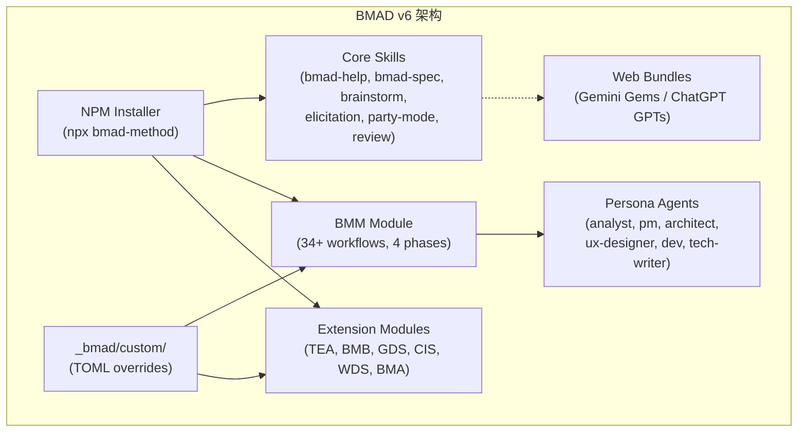

# BMAD Method v6 深度研究报告

> **日期**: 2026-05-25
> **目标版本**: v6.8.0 (2026-05-25 released)
> **Maglev 版本**: v0.4.3
> **研究范围**: BMAD Method 自 2026-02 以来的完整演进（v4 → v6.8.0），重点关注架构重写、Spec Kernel 设计、模块化生态、42 平台适配策略
> **性质**: 客观对比分析，不预设立场

## 一、概览

BMAD Method（Build More Architect Dreams）是一个角色驱动的 AI 敏捷开发框架，由 BMad Code, LLC 开源维护。自我们上次研究（2026-02-23）以来发生了**根本性重构**：

- v4.0.0 (Jun 2025)：从 prompt 集合完全重写为 NPM 分发框架
- v6.0.0 (Sep 2025)：再次重写为 "Lean Core" 模块化架构
- v6.8.0 (May 2026)：当前最新稳定版，引入 Spec Kernel + UX 双脊椎 + Web Bundles + 42 平台支持

BMAD 在 3 个月间从"重装步兵"成功瘦身为"模块化重装步兵"，保留其角色驱动核心的同时大幅提升了灵活性。活跃度从 medium 上调为 **high**。

## 二、对标分析

### M-1: 定位与目标

| 维度 | BMAD v6.8 | Maglev v0.4.3 |
|------|-----------|---------------|
| 一句话定位 | "Scale-Domain-Adaptive AI Agile 框架 + 模块生态" | "AI-Native 工程协议，Spec 即编译器 IR" |
| 核心目标 | 用 12+ 专业 Agent 模拟完整敏捷团队，自适应项目复杂度 | 以产物驱动的方式让人类保持架构师角色，AI 执行 90% |
| 目标受众 | 个人开发者 → 企业团队（明确 scale-adaptive） | 个人 → 小团队（企业层理论设计完成，待验证） |
| 设计哲学 | "AI 是团队成员，但人做决策" — 引导式协作 | "AI 是执行器，人是建筑师" — 对抗式质疑 |
| 开源状态 | MIT, NPM 分发, 100% 免费无 paywall | MIT, 纯 Markdown, Git 分发 |
| 社区生态 | Discord 活跃, YouTube 教程, 多语言文档站, 42 IDE 支持 | 单人创作者, 无公开社区 |

**关键变化**：BMAD 已不再是我们 2 月描述的"重型过度工程"。v6 的 scale-adaptive 机制让它能在 bug fix（轻量）到 enterprise system（重量）之间自动调整深度。

### M-2: 架构模式

| 维度 | BMAD v6.8 | Maglev v0.4.3 |
|------|-----------|---------------|
| 整体架构 | Core + Module + Custom 三层；Installer 统一管理 | AGENTS.md + Skills/ + Specs/ 协议层；纯文件系统 |
| 技术栈 | Node.js CLI (installer) + Markdown Skills + TOML Config + Python (resolve_customization) | 纯 Markdown + YAML + Mermaid；语言无关 |
| 分发方式 | `npx bmad-method install`，NPM 语义版本，stable/next 双通道 | Git clone / manual copy，无包管理器 |
| 扩展机制 | 官方 Module Registry + --custom-source (Git URL) + TOML override | .agents/skills/ 目录 + private-catalog.yaml 注册 |
| 平台适配 | 42 IDE/Agent 平台支持（Claude, Cursor, Copilot, OpenCode, Amp...） | 主要依赖 Claude Code / Cursor；理论上平台无关 |

**架构亮点**：BMAD 的 installer 体系解决了"如何让非技术用户快速上手"的问题，而 Maglev 至今依赖手动设置。BMAD 的 TOML 自定义层允许在不 fork 的情况下调整任何 workflow/agent，这是 Maglev 通过 `.agents/private-catalog.yaml` 部分实现但不如其完善的能力。

### M-3: 需求→实施流水线

| 维度 | BMAD v6.8 | Maglev v0.4.3 |
|------|-----------|---------------|
| 需求收敛 | bmad-product-brief (Create/Update/Validate) → bmad-prd (Discovery→Elicitation→Output) | requirement-convergence (4-step: Triage→Define→Ready Gate→Handoff) |
| 方案设计 | bmad-spec (5-field kernel: Why/Capabilities/Constraints/Non-goals/Success) + companions | spec-designer (Socratic Interview → 4-file spec cluster: intent/requirements/design/plan) |
| 编码执行 | bmad-dev-story (Dev Agent, baseline commit tracking) + bmad-quick-dev | context-implementer (受控编码 + 自检 + 对抗审查) |
| 验证闭环 | bmad-code-review + bmad-qa-generate-e2e-tests + bmad-checkpoint-preview | integrated-validator (requirements↔spec↔code↔tests 四层交叉) + review-validation-surface |
| 管理/协调 | bmad-sprint-planning, bmad-sprint-status, bmad-retrospective, bmad-correct-course | project-board (只读看板，无 sprint 概念) |
| 调查/诊断 | bmad-investigate (新增！forensic case file, evidence grading) | ❌ 无对应 skill |

**Spec 设计对比**（核心差异点）：

| | BMAD bmad-spec | Maglev spec-designer |
|---|---|---|
| 产出物 | SPEC.md (5-field kernel) + companions (glossary, archetypes...) | 00_intent + 01_requirements + 02_design + 03_plan |
| 精髓 | "Distill, don't coach" — 蒸馏而非教练 | "Socratic interrogation" — 苏格拉底式质问 |
| 输入容忍度 | 极高（brain dump, transcript, email, brief...任何形式） | 中（需要 requirement-convergence 先收敛） |
| ID 体系 | CAP-N 能力 ID，稳定不复用 | 功能编号 F-N，每次可重排 |
| 文件合约 | companions: 前端 frontmatter 声明依赖 | INDEX.md 元数据声明结构 |
| 验证机制 | Self-Validate 双 pass（Coherence + Preservation） | spec-audit-surface（独立 skill） |
| Lean 纪律 | 8 条 Spec Law 强制精练 | 无对应强制规则，依赖 designer 自律 |

### M-4: 治理与纪律

| 维度 | BMAD v6.8 | Maglev v0.4.3 |
|------|-----------|---------------|
| 红线/门禁 | Activation Guardrails (6-step: INCLUDE→READ→RUN→CHECK→FILTER→CD) 每个 skill 强制 | maglev-discipline (3 不可灰度红线 + L0-L4 压力升级) |
| Drift 检测 | .decision-log.md 追踪所有决策偏移 | Spec → Code 一致性由 integrated-validator 检查 |
| 纪律强度 | 中-高（guardrails + checkpoint + review agents） | 高（8 类惰性模式识别 + 自检闭环） |
| 合规检查 | bmad-code-review + checkpoint-preview + TEA module (test architecture) | review-validation-surface + test-design-surface |
| 自定义纪律 | TOML override per-agent/per-workflow | 无正式自定义机制，靠 skill 内部约束 |

**亮点对比**：
- BMAD 的 `.decision-log.md` 是一个优秀的设计——在整个 workflow 生命周期中追踪"为什么做了这个决定"。Maglev 的 `docs/thinking/` 做了类似的事但更分散，没有 per-spec 粒度的决策追溯。
- BMAD v6.8 的 Activation Guardrails 解决了 LLM agent 跳步问题（确认 AI 没有 hallucinate 中间步骤）——Maglev 的 skill protocol 有类似意图但没有这么显式的 6-step 强制链。

### M-5: 知识管理

| 维度 | BMAD v6.8 | Maglev v0.4.3 |
|------|-----------|---------------|
| 知识沉淀 | project-context.md (persistent facts) + .decision-log.md (per-workflow memory) | docs/thinking/ (分层: meta/critique/paper/alignment) + specs/10_reality/ |
| 跨会话记忆 | config.user.toml (user preferences) + _bmad/custom/ (project overrides) | session-store (SQLite) + AGENTS.md (Custom Instructions) |
| 结晶/归档 | ❌ 无显式结晶概念；PRD/Spec 产出后不再生命周期管理 | crystallization skill (active→reality 闭环) |
| 索引管理 | bmad-index-docs (文档索引) + module-help.csv (skill 帮助清单) | index-librarian (多类索引自动化) + INDEX.md 层级体系 |
| 决策可追溯 | ✅ .decision-log.md 贯穿全流程 | 部分——docs/thinking/ 做大决策追溯，spec 级缺乏 |

**差异化洞察**：Maglev 的结晶闭环（active → reality 归档）是 BMAD 完全不具备的。BMAD 生成文档后没有生命周期管理，不存在"需求→实现→验证→归档"的完整圆环。但 BMAD 的 `.decision-log.md` per-spec 决策追溯是 Maglev 应该学习的。

### E-1: 模块化分发与生态策略

| 维度 | BMAD v6.8 | Maglev v0.4.3 |
|------|-----------|---------------|
| 分发模型 | NPM 包 + Module Registry + 双通道(stable/next) | Git 仓库直连，无包管理 |
| 扩展生态 | 7 官方 module (BMM/TEA/BMB/GDS/CIS/WDS/BMA) + custom source | 20+ internal skills，无外部扩展机制 |
| Web 前端 | Web Bundles (Gemini Gems / ChatGPT GPTs) + VS Code UI (alpha) | ❌ 无 |
| 升级体验 | `npx bmad-method install` 一键，auto-migrate, backup 保护 | 手动 Git pull，无自动迁移 |
| IDE 覆盖 | 42 平台（每个平台自动生成 pointer files） | ~2 平台（Claude Code, Cursor） |
| i18n | docs 站 5 语言 (en/fr/cs/zh-cn/vi-vn) | ❌ 仅中文内部文档 |

这是 BMAD 的最大竞争优势区域——**分发和生态建设远超 Maglev**。不过这也是 BMAD 的定位（大众化工具）与 Maglev 的定位（个人/小团队深度协议）的根本差异所决定的。

## 三、对 Maglev 的启示（M-6）

### 1. 可借鉴的模式/机制

**① .decision-log.md 模式（优先级：高）**

BMAD 在 v6.7 引入的 `.decision-log.md` 是一个精巧设计：每个 spec/workflow 目录内有一个决策日志，记录"做了什么决定、为什么、什么时候"。这解决了一个 Maglev 也面临的核心问题——当 AI 跨会话继续工作时，"之前为什么选了方案 A 而不是方案 B"的信息丢失。

Maglev 当前通过 `docs/thinking/` 做宏观决策追溯，但在 spec 粒度上缺少这种轻量级的 per-spec decision log。建议在 spec-designer 产出中增加 `context/decisions.md`，记录 Socratic Interview 中的关键抉择。

**② Spec Kernel "8 条法则"（优先级：中）**

BMAD 的 Spec Law 是显式的质量约束：
- 每个 capability 必须有 intent + success signal
- Constraint 必须真正弯曲设计决策
- Non-goals 至少一条
- 能力 ID 稳定不复用

Maglev 的 spec-designer 输出高质量但缺乏这种可审计的"法则清单"。建议在 spec-audit-surface 中参考这些规则作为检查维度。

**③ Activation Guardrails（优先级：中）**

BMAD 发现 LLM agent 会"假装执行了步骤"——直接跳到输出而省略中间读取。他们的解决方案是在 skill activation 中强制 6 步链（INCLUDE→READ→RUN→CHECK→FILTER→CD），每步需确认执行。

Maglev 的 skill protocol 有类似意图（"行动前必须阅读完整步骤文件"）但没有显式的防跳步机制。这是 maglev-discipline 可以参考的执行保障模式。

**④ Web Bundles 策略（优先级：低，但有启发性）**

BMAD 将规划类 skill 打包为 Gemini Gems / ChatGPT GPTs，让用户用固定订阅费做前期规划，再把产出导入 IDE。这是一种"前端规划在免费/低成本 LLM + 后端执行在高性能 LLM"的成本分层策略。Maglev 目前不需要这个，但作为未来商业化路径值得关注。

### 2. Maglev 差异化优势（BMAD 不具备的）

- **逆向工程 (Reverse Spec)**：BMAD 仍然无法从代码反推 Spec。这是 Maglev 独占的核心能力。
- **结晶闭环 (Crystallization)**：BMAD 生成文档后没有生命周期管理。Maglev 的 active→reality 归档是完整的知识治理闭环。
- **知识分层沉淀**：`docs/thinking/` 的 5 层分类 (meta/critique/paper/alignment/retrospective) 让思考过程可追溯。BMAD 只有平坦的文档输出。
- **对抗式质量控制**：Maglev 的 requirement-convergence 通过对抗质问逼人类思考，而 BMAD 的 elicitation 更温和（"引导"而非"质问"）。
- **协议层本质**：Maglev 是协议（可叠加在任何项目上），BMAD 是工具（需要安装、需要 Node.js）。

### 3. 互补点（可引入的新能力）

- **bmad-investigate 的 forensic 模式**：Maglev 缺少"调查/诊断"类 skill。当遇到 bug 或需要理解陌生代码时，BMAD 的证据分级方法（Confirmed/Deduced/Hypothesized）是有价值的参考。
- **Scale-Adaptive Intelligence**：BMAD 根据项目复杂度自动调整深度。Maglev 目前需要用户手动选择"quick-dev vs full spec"。可以在 entry-router 中增加复杂度评估逻辑。
- **Installer / 分发机制**：虽然 Maglev 有 maglev-cli，但缺乏 BMAD 那样的一键安装 + 自动升级 + 配置隔离。installer 体验是推广门槛。

### 4. 风险/警示（避免犯的错误）

- **过度 guardrail 导致 token 浪费**：BMAD 为了防跳步，每个 skill 都有复杂的 activation 序列，可能增加 ~10-20% 的 token 消耗。Maglev 应找到更轻量的防跳步方案。
- **模块膨胀**：BMAD 从 v4 到 v6 经历了"社区模块市场"的失败（已 retire marketplace），说明过度外部化不如精心策划的官方模块。
- **"Lean" 口号与实际复杂度的矛盾**：BMAD 自称 "lean" 但其 SKILL.md 长达数千字（bmad-spec 有 11KB），实际 token 负载不轻。Maglev 的 skill 定义更精简是正确的。

## 四、Actionable Insights

| ID | 标题 | 建议目标 | 优先级 | 简述 |
|----|------|----------|--------|------|
| BMAD-001 | Per-Spec Decision Log 模式 | spec-designer | high | 在 spec cluster 中增加 context/decisions.md，记录设计过程中的关键抉择 |
| BMAD-002 | Spec Law 可审计化 | spec-audit-surface | medium | 参考 BMAD 的 8 条 Spec Law 作为 audit checklist 维度 |
| BMAD-003 | Activation 防跳步机制 | maglev-discipline | medium | 在关键 skill 中增加执行确认点，防止 LLM 假装完成中间步骤 |
| BMAD-004 | Forensic Investigation Skill | 新 skill 候选 | low | 参考 bmad-investigate 的证据分级方法，为 Maglev 增加调查/诊断能力 |
| BMAD-005 | 复杂度自适应路由 | entry-router | low | 在入口路由中增加项目/任务复杂度评估，自动选择适当深度的流程 |

## 五、新竞品发现（本轮）

| 名称 | 分类建议 | 理由 | 纳入建议 |
|------|----------|------|----------|
| BMad Builder (BMB) | vertical | BMAD 官方的 "Build custom agents and workflows" 工具，与 Maglev 的 skill-scout 有参考价值 | 观望 |
| BMad Test Architect (TEA) | vertical | 独立的测试架构模块，risk-based test strategy | 观望 |
| Whiteport Design Studio (WDS) | vertical | UX/Design-first planning，与 maglev-design-ux 可比 | 观望 |

> 这三个均为 BMAD 子模块，暂不独立纳入 Registry，但记录备查。

## 六、研究元数据

- **信息来源**: GitHub (bmad-code-org/BMAD-METHOD) CHANGELOG.md, README.md, src/ skill 结构, bmad-modules.yaml, bmad-spec/SKILL.md; NPM version history; Web search (dev.to, npmjs.com, CSDN, plain english)
- **研究耗时**: ~25 min
- **Registry 变化**: 
  - 更新 BMAD version_tracked: v6.8.0
  - 更新 activity_level: high
  - 新增 5 条 insights (BMAD-001 ~ BMAD-005)
- **维度说明**: Mandatory M1-M6 全覆盖, Exploratory E-1: 模块化分发与生态策略
