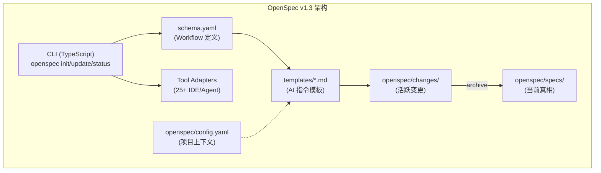

# OpenSpec (OPSX) v1.3 深度研究报告

> **日期**: 2026-05-25
> **目标版本**: v1.3.1 (2026-04-21)
> **Maglev 版本**: v0.4.3
> **研究范围**: OpenSpec 自 2026-02 以来的完整演进——从 Two-Folder Model 到 OPSX Workflow + Workspace 规划
> **性质**: 客观对比分析，不预设立场

## 一、概览

OpenSpec（Fission-AI 维护）自称 "The most loved spec framework"，是一个变更驱动的轻量级规格管理工具。自上次研究（2026-02-23）以来经历了**范式转换**：

- 从"Draft → Review → Apply → Archive"固定四步流 → "Actions, not phases"流动模式
- 引入 OPSX Workflow：schema.yaml + templates/*.md 完全可定制
- 开发中 Workspace 支持（多仓库协调规划）
- 从 ~5 个工具支持 → 25+ 工具集成

核心哲学：**"fluid not rigid, iterative not waterfall, easy not complex, brownfield-first"**

## 二、对标分析

### M-1: 定位与目标

| 维度 | OpenSpec v1.3 | Maglev v0.4.3 |
|------|---------------|---------------|
| 一句话定位 | "轻量级 spec 层，让人和 AI 在编码前对齐" | "AI-Native 工程协议，Spec 即 IR" |
| 核心目标 | 给 AI 编码加一层可追溯的 spec 契约，极致轻量 | 以产物驱动的方式管理人机协作全生命周期 |
| 目标受众 | 个人 → 企业（scalable），任何 AI 编码用户 | 个人 → 小团队，强调深度协作 |
| 设计哲学 | "Agree before you build" — 对齐式契约 | "Spec as IR, code as compiled artifact" — 编译器式 |
| 开源状态 | MIT, NPM 分发, Discord 社区活跃 | MIT, 纯 Markdown, Git 分发 |
| 哲学标签 | 流动 / 迭代 / 简单 / 棕地优先 | 产物驱动 / 对抗质问 / 结构化 / 闭环 |

**关键差异**: OpenSpec 是显式反 phase-gate 的（"no rigid phases"），而 Maglev 有明确的流程阶段（requirement → spec → implement → validate），但通过 entry-router 提供灵活入口。

### M-2: 架构模式



| 维度 | OpenSpec v1.3 | Maglev v0.4.3 |
|------|---------------|---------------|
| 整体架构 | CLI (TypeScript) + Schema + Templates；生成 skill files 给各 IDE | AGENTS.md + Skills/ + Specs/；纯文件系统协议 |
| 技术栈 | TypeScript CLI, Node.js 20.19+, NPM/pnpm/yarn/bun/nix | 纯 Markdown + YAML + Mermaid，语言无关 |
| 分发方式 | `npm install -g @fission-ai/openspec` + `openspec init` | Git clone/manual setup |
| 扩展机制 | Community schemas (第三方 YAML 工作流包) + schema override | .agents/skills/ + private-catalog.yaml |
| 平台适配 | 25+ (Claude, Cursor, Copilot, Codex, Amp, Junie, etc.) | ~2 (Claude Code, Cursor) |

**架构亮点**: OpenSpec 的 "schema + templates" 分离是优雅的——workflow 逻辑在 YAML 中声明，AI 指令在 Markdown 模板中编写，两者独立可定制。这比 Maglev 的 SKILL.md 单文件更容易让非作者定制。

### M-3: 需求→实施流水线

| 维度 | OpenSpec v1.3 | Maglev v0.4.3 |
|------|---------------|---------------|
| 需求收敛 | `/opsx:propose` — 从模糊想法生成 proposal.md (why + what) | requirement-convergence (4-step 对抗式收敛) |
| 方案设计 | `/opsx:propose` 同时生成 specs/ + design.md + tasks.md | spec-designer (Socratic Interview → 4 文件 cluster) |
| 编码执行 | `/opsx:apply` — 按 tasks.md checklist 实施 | context-implementer (受控编码 + 自检) |
| 验证闭环 | `/opsx:verify` (expanded profile) — 检查实施是否满足 spec | integrated-validator (四层交叉验证) |
| 归档 | `/opsx:archive` — 变更归入 specs/ 成为新的真相源 | crystallization (active → reality 闭环) |

**关键对比: 流动 vs 结构化**

| | OpenSpec | Maglev |
|---|---|---|
| Phase gate | **无** — "do any action anytime" | **有** — 但入口灵活 (entry-router) |
| 依赖关系 | "Enablers, not requirements" — 显示什么可以做，不强制顺序 | 显式依赖 (plan 中 T1→T2→T3) |
| 创建灵活性 | 一次 `/propose` 生成全部 artifacts | 分步：先 requirement-convergence，再 spec-designer |
| 编辑时机 | 任何 artifact 任何时间可编辑 | Spec 冻结后需 explicit update flow |

**每个变更的产物结构:**

```
OpenSpec:                           Maglev:
changes/add-dark-mode/              specs/20_evolution/active/dark_mode/
├── proposal.md                     ├── 00_intent.md
├── specs/                          ├── 01_requirements.md
│   └── feature-x/spec.md          ├── 02_design.md
├── design.md                       ├── 03_plan.md
└── tasks.md                        ├── context/
                                    └── INDEX.md
```

### M-4: 治理与纪律

| 维度 | OpenSpec v1.3 | Maglev v0.4.3 |
|------|---------------|---------------|
| 红线/门禁 | **无显式红线** — 哲学上反对 gate | maglev-discipline (3 红线 + L0-L4 升级) |
| Drift 检测 | `openspec status` 检测结构异常 | integrated-validator (spec↔code drift) |
| 纪律强度 | **低** — "easy not complex"，信任用户 | **高** — 8 类惰性模式 + 自检闭环 |
| 合规检查 | schema validation (artifact 结构) | review-validation-surface + spec-audit |
| 规则定制 | `config.yaml` 中 per-artifact rules | 无显式定制，靠 skill 内部约束 |

**核心差异**: OpenSpec 哲学性地拒绝强制门禁（"no rigid phase gates"），而 Maglev 认为门禁是质量保证的核心。这是两种截然不同的信任模型：
- OpenSpec: "开发者知道自己在做什么，工具不应妨碍"
- Maglev: "AI 和人都会犯错，结构化约束防止滑坡"

### M-5: 知识管理

| 维度 | OpenSpec v1.3 | Maglev v0.4.3 |
|------|---------------|---------------|
| 知识沉淀 | specs/ (当前真相) + changes/archive/ (历史变更) | docs/thinking/ (5 层) + specs/10_reality/ |
| 跨会话记忆 | openspec/config.yaml (项目上下文持久化) | session-store (SQLite) + AGENTS.md |
| 结晶/归档 | ✅ `/opsx:archive` 将 delta merge 入 specs/ | ✅ crystallization (active → reality) |
| 索引管理 | ❌ 无索引概念；靠文件系统发现 | index-librarian + INDEX.md 层级 |
| 决策追溯 | ❌ 无 decision log（changes/ 本身即记录） | docs/thinking/ 宏观追溯，per-spec 缺乏 |

**发现**: OpenSpec 的 "specs/ 是当前真相，changes/ delta merge 进去" 模型与 Maglev 的 "active → reality" 几乎同构！只是命名和粒度不同。但 OpenSpec 缺少 Maglev 的分层思考沉淀（docs/thinking/）。

### E-1: 模块化分发与生态策略

| 维度 | OpenSpec v1.3 | Maglev v0.4.3 |
|------|---------------|---------------|
| 分发 | NPM global package + `openspec init` | Git 仓库 |
| Schema 定制 | community schemas (第三方 YAML packages) | 无对应 |
| 多仓库 | Workspace (开发中) — 跨 repo 协调规划 | ❌ 单仓库假设 |
| Telemetry | 有（可 opt-out）| ❌ 无 |
| 升级 | `npm install -g` + `openspec update` | 手动 Git pull |

### E-2: 反 Phase-Gate 哲学（作为设计决策的研究）

OpenSpec 明确表达了对 phase gate 的反对：

> "The problem with linear workflows: You're 'in planning phase', then 'in implementation phase', then 'done'. But real work doesn't work that way."

这挑战了 Maglev 的核心假设——流程阶段有价值。值得深入思考：
- **OpenSpec 视角**: 灵活性 > 结构化。工作本质非线性。
- **Maglev 视角**: 没有结构 = 无法审计 = 质量不可保证。
- **中间地带**: Maglev 的 entry-router 已经部分实现了"非线性入口"，但内部仍是结构化流程。

## 三、对 Maglev 的启示（M-6）

### 1. 可借鉴的模式/机制

**① Schema + Template 分离的可定制性（优先级：中）**

OpenSpec 将工作流逻辑（schema.yaml）和 AI 指令（templates/*.md）分离，用户可以：
- 不改代码就修改 AI prompt 质量
- 创建自定义 workflow（community schemas）
- 按项目注入不同 context

Maglev 的 skill SKILL.md 是一体化的——workflow + instructions 混在一起。虽然这保证了一致性，但也意味着用户无法在不修改 skill 本身的情况下调整 AI 行为。考虑在 skill 引用的 `references/` 中明确标注哪些是"可定制模板"。

**② 变更作为一等公民（Change-as-First-Class-Object）（优先级：中）**

OpenSpec 的核心模型是"每个变更一个文件夹"。这与 Maglev 的 `specs/20_evolution/active/{topic}/` 结构高度同构，但 OpenSpec 的 naming 更直觉化：
- `changes/add-dark-mode/` vs `specs/20_evolution/active/dark_mode/`
- 前者对新用户来说语义更清晰

这不是说 Maglev 应改名，而是确认我们的设计选择是行业共识的变体。

**③ Workspace 多仓库协调（优先级：低-中）**

OpenSpec 正在开发的 Workspace 功能解决了"规划跨越多个仓库"的问题。Maglev 目前是单仓库假设。如果 Maglev 未来要支持组织级（Layer 2），multi-repo coordination 是必须解决的问题。OpenSpec 的 "link + open + explore + propose + apply per-repo" 模型可作参考。

**④ Profile/Schema 选择模式（优先级：低）**

OpenSpec 提供 `core` (精简) 和 `expanded` (完整) 两种 workflow profile。这与 Maglev 的 `quick-dev` vs `full spec` 二分法类似，但 OpenSpec 的实现更形式化——用户通过 `openspec config profile` 显式选择。考虑在 entry-router 中更显式地暴露"轻量模式 vs 完整模式"选择。

### 2. Maglev 差异化优势（OpenSpec 不具备的）

- **对抗式质量控制**: OpenSpec 没有任何"质疑"机制。它信任用户输入直接转化为 spec。Maglev 的 requirement-convergence 通过对抗质问确保需求真的被想清楚了。
- **结构化验证体系**: OpenSpec 的 `/verify` 功能薄弱（expanded profile 才有），而 Maglev 有 integrated-validator + spec-audit + review-validation 三层。
- **知识分层**: OpenSpec 没有 `docs/thinking/` 这样的思考沉淀层。变更归档后历史就"平坦化"了。
- **逆向工程**: OpenSpec 虽然 brownfield-first，但只能对增量做 spec，无法从存量代码反推全貌。
- **纪律执行**: Maglev 的 maglev-discipline 是"反 AI 惰性"的显式武器。OpenSpec 完全没有对应物。
- **生命周期深度**: OpenSpec 止于 archive。Maglev 的 crystallization → reality → obsolescence 是更完整的知识生命周期。

### 3. 互补点

- **"fluid" 工作模式参考**: 对于简单变更，Maglev 可能过于仪式感。考虑在 entry-router 中增加"OpenSpec 式"的超轻量路径——一步 propose + apply，无需完整 spec 流程。
- **Community Schema 概念**: Maglev 的 skill 系统可以向"可定制模板"方向发展，让团队能基于 Maglev 骨架定义自己的 workflow 变体。
- **多仓库规划**: 随着 Maglev 向组织级演进，OpenSpec 的 Workspace 设计值得持续观察。

### 4. 风险/警示

- **"Easy" 的代价**: OpenSpec 追求极致轻量导致它的产出质量依赖用户自律。在大型项目中这可能成为"技术债快速道"。Maglev 不应为追求易用性而放弃结构化门禁。
- **反 phase-gate 不等于无纪律**: OpenSpec 的哲学有道理（工作非线性），但 Maglev 不应把此理解为"去掉所有结构"。正确的学习是：**让入口灵活，让内部有序**（这正是 entry-router 的设计意图）。
- **AGENTS.md 为空**: OpenSpec 的 AGENTS.md 是空文件（0 bytes）——说明他们依赖 CLI 生成 skill files，不维护集中式 agent 指令。这对 AI 理解项目结构是劣势。

## 四、Actionable Insights

| ID | 标题 | 建议目标 | 优先级 | 简述 |
|----|------|----------|--------|------|
| OPSX-001 | Skill 模板可定制层 | skill 体系 | medium | 在 skill references/ 中明确区分"固定逻辑"和"可定制模板"，允许项目级 override |
| OPSX-002 | 超轻量变更路径 | entry-router | medium | 为简单变更提供"一步 propose+apply"路径，无需走完整 spec 流程 |
| OPSX-003 | 多仓库协调规划 | 组织层(Layer 2) | low | 持续观察 OpenSpec Workspace 设计，为 Maglev 组织级做预研 |

## 五、新竞品发现（本轮）

| 名称 | 分类建议 | 理由 | 纳入建议 |
|------|----------|------|----------|
| Kiro (AWS) | vertical | OpenSpec README 提及作竞品对比："Powerful but locked to their IDE and Claude models" | 推荐纳入 |

> Kiro 是 AWS 出品的 spec-driven 开发工具，锁定自有 IDE + Claude 模型。值得追踪。

## 六、研究元数据

- **信息来源**: GitHub (Fission-AI/OpenSpec) README.md, WORKSPACE_REIMPLEMENTATION_DIRECTION.md, docs/opsx.md, docs/concepts.md; NPM releases; Web search
- **研究耗时**: ~15 min
- **Registry 变化**:
  - 更新 OpenSpec version_tracked: v1.3.1
  - 更新 subcategory: "OPSX fluid workflow + change-driven spec + multi-repo workspace"
  - 新增 3 条 insights (OPSX-001 ~ OPSX-003)
  - 新竞品发现: Kiro (AWS)
  - E-2 加入 dimension_upgrades.pending
- **维度说明**: Mandatory M1-M6 全覆盖, Exploratory E-1: 模块化分发, E-2: 反 Phase-Gate 哲学
