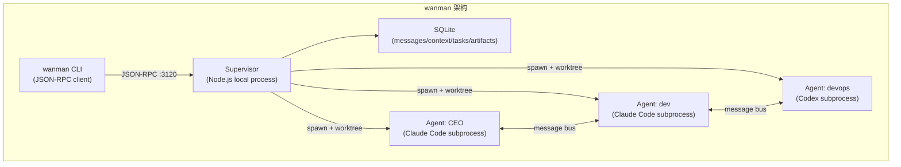

# wanman 深度研究

> **日期**: 2026-06-01
> **对象**: [chekusu/wanman](https://github.com/chekusu/wanman) (Apache-2.0)
> **版本**: main branch, last commit 2026-05 (约 2 个月历史)
> **Stars**: 613 | Forks: 99 | Contributors: 3
> **作者**: guo-yu (郭宇)
> **位段**: 10_critique (竞品分析)

## 一、定位与核心理念

wanman（ワンマン，日语"一人列车"）有两层定位：

1. **开源层**（GitHub）：本地多 Agent 矩阵运行时——在你的机器上运行一个由 Supervisor 协调的 Claude Code / Codex Agent 网络
2. **产品层**（wanman.ai）：**AI 自动化运营平台**——让任何人都能在 AI Agent 团队帮助下，从零创办或接管任何组织，持续自动化地运营一人公司

作者郭宇在[发布推文](https://x.com/turingou/status/2047860898560373246)中明确表述核心理念：围绕用户的核心意图，AI 团队自动规划任务、开会对齐、创意发散，持续运行直到目标达成。典型场景如"运营一个草莓农场"——用户只需输入意图，Agent 团队自动处理市场调研、供应链、营销等全部运营环节。

**两种工作模式**：
- **Story 模式**：从目标自治运行。分析目标 → 规划任务 → 邀请 AI 员工 → 自动开会对齐 → 每个虚拟工作日结束后创意发散 → 持续运行
- **Takeover 模式**：接管 GitHub 仓库。分析代码 → 围绕目标自动优化和测试 → 持续提交代码到远端

**与 Maglev 的层次关系**：wanman 的野心比"多 Agent 编排"大得多——它试图成为"AI 驱动的一人公司操作系统"。Maglev 解决的是"意图-设计-代码-验证的漂移"问题，聚焦在软件工程协作层。两者的交集在 Takeover 模式（代码仓库自动优化），但 wanman 的 Story 模式（运营草莓农场、创办公司）完全超出了 Maglev 的边界。

## 二、架构分析

### 核心组件

| 组件 | 职责 |
|------|------|
| **Supervisor** | 进程管理、消息路由、状态持久化、Cron 调度 |
| **Agent Process** | 每个 Agent 一个 Claude/Codex 子进程，隔离 worktree + $HOME |
| **Message Store** | SQLite 持久化，steer/followUp 两级优先级 |
| **Task Pool** | 带依赖关系的任务管理 |
| **Artifact Store** | Agent 产出物的结构化存储 |
| **Context Store** | 跨 Agent 共享 KV 存储 |

### Agent 生命周期

| 模式 | 行为 | 适用场景 |
|------|------|---------|
| `24/7` | 持续 respawn 循环 | CEO、核心开发 Agent |
| `on-demand` | 空闲直到被触发 | 低频任务 Agent |
| `idle_cached` | 空闲但保留 Claude session（`--resume`） | 需要上下文连续性的 Agent |

### 隔离机制

- 每个 Agent 独立 git worktree（不污染用户 checkout）
- 每个 Agent 独立 `$HOME`（shell profile、.npmrc 等隔离）
- 每个 Agent 独立 `.claude/` 或 `.codex/` 目录

## 三、核心能力

| 能力 | 描述 | 成熟度 |
|------|------|--------|
| 多 Agent 消息总线 | steer（中断当前任务）+ followUp（排队） | ⭐⭐⭐⭐ 已实现 |
| 进程隔离 | worktree + $HOME 隔离 | ⭐⭐⭐⭐ 已实现 |
| 任务依赖管理 | `--after` 依赖链 | ⭐⭐⭐ 基础实现 |
| 外部事件接入 | webhook → Agent 触发 | ⭐⭐⭐ 已实现 |
| Cron 调度 | 5 字段 cron 表达式 | ⭐⭐⭐ 已实现 |
| 多运行时适配 | Claude Code + Codex | ⭐⭐⭐ 已实现 |
| FinOps | API 成本追踪 + Stripe 收入同步 | ⭐⭐ 实验性 |
| Skill 系统 | 共享 SKILL.md 注入 Agent | ⭐⭐ 基础 |
| 跨运行记忆 | db9 brain adapter（可选） | ⭐ 外部依赖 |

## 四、与 Maglev 的对比

| 维度 | wanman | Maglev |
|------|--------|--------|
| **核心问题** | "如何让 AI 团队自动运营一人公司" | "如何让 AI 产出对齐意图、边界和验证" |
| **层次** | 自动化运营平台 + 执行层基础设施 | 方法论 + 治理层 |
| **目标用户** | 任何想创办/运营组织的人 | 软件工程团队 |
| **Agent 数量** | 多 Agent（CEO/dev/devops/marketing...） | 单 Agent + skill 路由 |
| **执行模式** | 多进程并行，消息总线协调，持续自治运行 | 单会话，skill 切换，人类决策 |
| **隔离** | worktree + $HOME 物理隔离 | 无进程隔离（单 Agent） |
| **Spec/设计** | 无（Agent 自行决定） | 结构化 spec 生命周期 |
| **验证** | 无内建验证体系 | integrated-validator 四层交叉验证 |
| **知识管理** | Context Store（KV）+ 可选 db9 | docs/thinking/ 7 分类 + specs 三层 |
| **纪律** | 无（Agent 自由度高） | maglev-discipline 红线 + L0-L4 |
| **运营能力** | ✅ Story 模式（运营公司/农场/任何组织） | ❌ 仅限软件工程协作 |
| **部署** | 零部署（wanman.ai hosted）或本地 | 本地 npm init |

## 五、设计哲学差异

### wanman："多 Agent 自主协作"

1. **人类是观察者** — 启动后 Agent 网络自主运行，人类通过 `wanman watch` 观察
2. **角色分工** — CEO Agent 做决策，dev Agent 写代码，devops Agent 部署
3. **消息驱动** — Agent 之间通过异步消息协作，steer 可中断
4. **进程隔离** — 每个 Agent 是独立子进程，互不干扰
5. **无方法论约束** — Agent 怎么做事由 system prompt 决定，框架不强制流程

### Maglev："有导轨的单 Agent"

1. **人类是决策者** — AI 执行但人类把控方向和验证
2. **能力路由** — 单 Agent 通过 skill 切换承担不同角色
3. **Spec 驱动** — 先设计后实施，有结构化的生命周期
4. **治理纪律** — 红线、惰性检测、压力升级
5. **知识沉淀** — 跨会话的结构化知识体系

## 六、wanman 的优势

1. **真正的并行执行** — 多 Agent 同时工作，不是串行 skill 切换
2. **进程级隔离** — worktree 隔离避免 Agent 互相踩踏
3. **可观测性** — `wanman watch` 实时流式观察所有 Agent 活动
4. **灵活的 Agent 拓扑** — 可以按需定义任意角色组合
5. **外部事件集成** — webhook + cron 让 Agent 网络可以响应外部世界
6. **FinOps 意识** — 内建成本追踪（虽然实验性）
7. **轻量** — 纯 TypeScript，无 Python 依赖

## 七、wanman 的不足

1. **无方法论** — 没有 spec、没有验证、没有知识沉淀。Agent 怎么做事完全靠 system prompt
2. **无质量门控** — 没有 TDD 强制、没有 review 机制、没有验收标准
3. **Skill 系统原始** — 只有 5 个基础 skill，无生命周期管理
4. **项目极早期** — 2 个月历史，3 个贡献者，无 release
5. **CEO Agent 瓶颈** — 所有决策集中在 CEO Agent，单点故障
6. **无 Spec 层** — Agent 直接从 goal 到代码，缺少设计阶段
7. **知识不持久** — 本地 SQLite 只在单 workspace 内有效，db9 是外部依赖
8. **商业化倾向** — wanman.ai 提供付费 sandbox 版本，OSS 版可能功能受限

## 八、对 Maglev 的启示

### 可借鉴

| 方向 | wanman 做法 | Maglev 可借鉴点 |
|------|------------|----------------|
| 并行执行 | 多 Agent + worktree 隔离 | 当前 SP 的 subagent 已部分覆盖；未来可考虑多 worktree 并行 |
| 可观测性 | `wanman watch` 实时流 | Maglev 缺少执行过程的实时可观测性 |
| 外部事件 | webhook + cron 触发 Agent | Maglev 当前纯手动触发，可考虑事件驱动 |
| 成本追踪 | FinOps 模块 | Maglev 无 token/成本意识 |
| Agent 拓扑 | 灵活的角色定义 | Maglev 的 skill 路由是静态的，可考虑动态角色 |

### 不应借鉴

| 方向 | 原因 |
|------|------|
| 去掉 Spec 层 | wanman 的"直接从 goal 到代码"正是 Maglev 要解决的问题 |
| 人类退到观察者 | Maglev 的价值在于人类保持决策权 |
| 多 Agent 替代 skill 路由 | 当前阶段多 Agent 的协调成本 > 收益 |
| 无纪律执行 | 没有红线和验证的 Agent 产出质量不可控 |

## 九、定位锚定判断

按 `positioning.md` §6 锚定规则：

1. **这是不是我们的战场？** — 部分是。wanman 的 Takeover 模式（代码仓库自动优化）与 Maglev 有交集，但 Story 模式（运营草莓农场/创办公司）完全不是 Maglev 的战场。
2. **他们解决了我们没解决的需求吗？** — Story 模式解决的是"非技术人员用 AI 运营组织"的需求，这不是 Maglev 用户的痛点。但"持续自治运行 + 创意发散"的模式对长期任务有启发。
3. **要借鉴吗？** — 可观测性、事件驱动、持续自治运行的理念值得关注。但"人类退居观察者"的哲学与 Maglev"人类保持决策权"相悖。
4. **编码层创新 = Maglev 环境约束变化？** — 是的。如果"AI 团队自治运营"被验证可行，Maglev 的价值主张（人类把控方向）需要重新审视——但目前没有证据表明无纪律的自治能产出高质量结果。

## 十、结论

**wanman 的野心是"AI 驱动的一人公司操作系统"** — 不仅仅是多 Agent 编排基础设施，而是试图让任何人通过 AI 团队自动运营一个完整组织（从草莓农场到 SaaS 公司）。开源部分（GitHub）提供了底层运行时，产品部分（wanman.ai）提供了零部署的 hosted 体验。

**与 Maglev 的关系**：
- **Takeover 模式**与 Maglev 有交集——都是对代码仓库的 AI 辅助治理。但 wanman 缺少 Maglev 的 spec 层、验证层和知识沉淀。
- **Story 模式**完全超出 Maglev 边界——Maglev 不做"运营一人公司"，只做"让 AI 协作产出对齐意图"。
- 架构层面，wanman 的 Supervisor + 消息总线 + worktree 隔离模式，对 Maglev 远期的多 Agent 并行执行仍有参考价值。

**关注级别**：🟡 持续观察。项目 2 个月历史、无正式 release，但作者有产品化野心（wanman.ai hosted 版本已上线）且社区增长快（613 stars、17.2 万推文浏览）。如果 Story 模式被验证可行，可能代表一种新的 AI 协作范式——但当前缺乏方法论约束（无 spec、无验证、无纪律）是其核心短板。

---

*Content was rephrased for compliance with licensing restrictions. Sources: [github.com/chekusu/wanman](https://github.com/chekusu/wanman), [x.com/turingou/status/2047860898560373246](https://x.com/turingou/status/2047860898560373246)*
