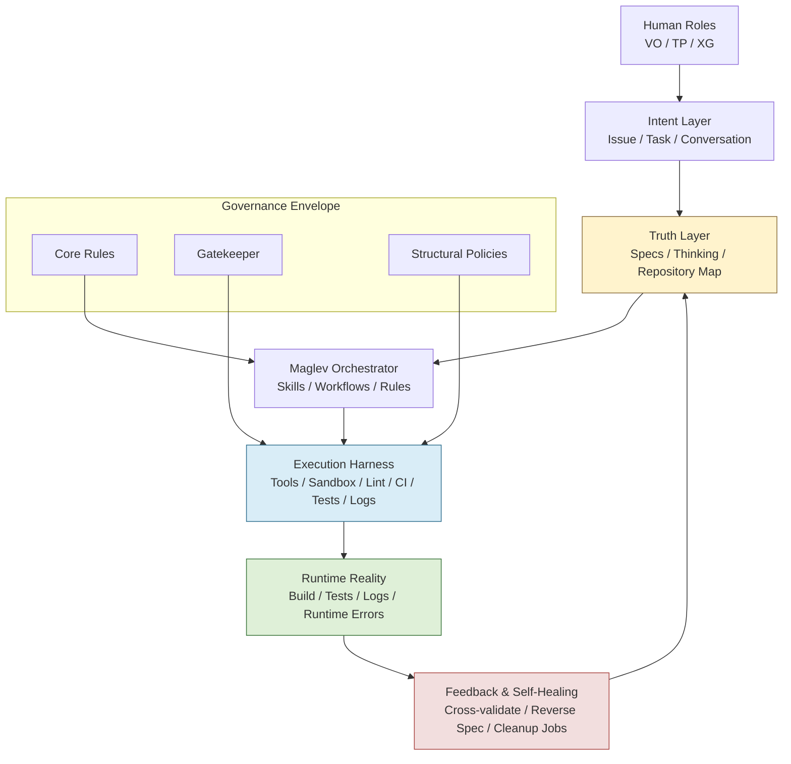

# Harness Engineering x Maglev: 集成蓝图与升级清单

> **Date**: 2026-03-16
> **Goal**: 将前一篇对比分析进一步落地，给出一套可执行的集成架构图、能力映射和分阶段改造路线，用于把 Maglev 升级为“带 harness 的执行体系”。
> **Status**: Architecture blueprint

> **Boundary Note**:
> 本蓝图只讨论 **组织内 AI Coding / AI 驱动的软件研发执行** 场景下，Maglev 如何吸收 Harness engineering 的长处。
> 它不试图把 Maglev 扩展成“智能体应用开发平台”或“通用 agent runtime framework”。

## 1. 设计目标

这份蓝图解决的不是“Maglev 是否需要 Harness engineering”，而是：

> **如果我们接受 Harness engineering 在“组织内 AI Coding”这一范围内是 Maglev 执行层的重要能力簇，那么它应该如何嵌入 Maglev，而不把 Maglev 降级成单纯的 agent 脚手架？**

因此，这份方案遵循三个原则：

1. **Spec 仍是上游真理源**
   Harness 不替代 Spec，只增强 Spec 到 Code 的执行可靠性。

2. **执行层必须机械化**
   任何反复出现的问题，都应优先沉淀为 lint、test、script、CI policy 或 recurring cleanup job。

3. **运行态必须可见**
   Runtime 不应只存在于理念里，而应成为 agent 可以主动读取和利用的上下文。

---

## 2. 集成后的分层架构

---

## 3. 分层解释

### 3.1 Intent Layer

这是人类与 AI 的接触面，输入可能来自：

- issue
- standup 后续指令
- feature request
- bug report
- brownfield reverse request

这一层的目标不是直接编码，而是将模糊意图稳定注入到真理层。

### 3.2 Truth Layer

这仍然是 Maglev 的根本优势所在：

- `specs/` 负责描述结构化意图
- `docs/thinking/` 负责记录决策逻辑
- `repository_map.md` 负责提供空间感知

Harness 只能增强这一层，不能绕过这一层。

### 3.3 Maglev Orchestrator

这层保留 Maglev 当前最独特的部分：

- Skills
- Workflows
- Core Rules
- lifecycle protocol
- role-aware governance

它负责决定 agent 可以做什么、应该先读什么、需要遵守什么约束。

### 3.4 Execution Harness

这是本次要补强的关键层。在当前边界下，核心组件应包含：

- 文件系统与 sandbox 边界
- code search / symbol search
- lint / static analysis
- test runner
- log access
- CI status reader
- recurring cleanup executor

这层的职责是：
**把“AI 知道应该怎么做”升级为“AI 有足够稳定的环境去做，并且做错会被立即纠偏”。**

如果未来要扩展到智能体应用开发，再考虑 browser automation、复杂 observability fabric、agent runtime orchestration 等能力会更合适；
但那已经超出本文的目标。

### 3.5 Runtime Reality

这里是最终事实世界，包括：

- 代码是否编译
- 测试是否通过
- 日志是否报错
- 运行时是否出现关键错误

如果 Runtime 不回流给 agent，那么 “Self-Healing” 只会停留在理论口号。

### 3.6 Feedback & Self-Healing

这里是 Maglev 与 Harness engineering 结合后的关键收益层。

这层至少应包含三类机制：

1. **同步纠偏**
   - lint fail
   - test fail
   - policy fail

2. **异步纠偏**
   - 周期性扫描 drift
   - 自动发现过期文档
   - 自动发现重复实现

3. **知识回流**
   - Reverse Spec
   - 更新质量规则
   - 生成 debt / cleanup issue

---

## 4. 能力映射：Maglev 已有 vs Harness 待补

| 层 | Maglev 已有能力 | Harness 需要补强的能力 | 预期收益 |
| :--- | :--- | :--- | :--- |
| **Intent** | Atomizer, create-spec, quick-dev | 意图质量评分、变更风险分级 | 提前识别高风险任务 |
| **Truth** | Specs, Thinking, repository_map | 更细粒度的计划文档和任务记忆 | 降低长任务状态丢失 |
| **Orchestrator** | Skills, workflows, core rules | 动态能力路由、工具权限治理 | 减少技能冲突和越权 |
| **Harness** | 部分 shell / repo 操作能力 | 测试、日志、CI、结构 lint、失败摘要 | agent 获得研发执行闭环 |
| **Feedback** | cross-validate, reverse-spec, self-healing theory | recurring cleanup jobs、自动 drift detection | 熵减机制从手工变自动 |

---

## 5. 升级路线图

## Phase 0: 不改范式，先补可观测性入口

### 目标

让 Runtime 从“理论中的第三个顶点”变成 agent 可消费的真实输入。

### 改造项

1. 建立统一的日志读取入口
2. 让 agent 能读取最近一次测试、构建和运行失败信息
3. 将这些入口写入 workflow / skill 的标准上下文加载路径

### 验收信号

- agent 修复 Bug 时不再只依赖静态代码
- 站会或调试流程中能主动汇报 build / test / log evidence

---

## Phase 1: 把规则从“文档”提升为“机械约束”

### 目标

减少“规则写在那里，但没人执行”的情况。

### 改造项

1. 将部分 `core_rules` 翻译为 lint / CI policy
2. 增加 Spec 完整性检查
3. 增加目录结构和依赖边界检查
4. 为高风险改动增加 architecture guardrails

### 验收信号

- 常见违规不再靠 review 才发现
- 违规能在 commit / CI 阶段被自动阻断

---

## Phase 2: 建立后台 Garbage Collection 机制

### 目标

让 Maglev 具备真正的“持续熵减能力”。

### 改造项

1. 周期性扫描过期文档、死链和漂移描述
2. 检测代码重复实现和未归档设计决策
3. 自动生成 cleanup issue 或小粒度修复 PR
4. 为 recurring cleanup 结果建立 debt register

### 验收信号

- 文档腐烂速度下降
- 清理任务由“人想起来才做”变成“系统持续提议”

---

## Phase 3: 让 Standup 进入运行态同步模式

### 目标

把当前 Standup 从“读静态索引”升级为“读索引 + 读运行态摘要”。

### 改造项

1. 在 `maglev-standup` 中增加 runtime summary source
2. 将最近失败测试、关键告警、清理任务状态纳入 Daily Brief
3. 对接 cleanup 和 validation 的最新结果

### 验收信号

- `/standup` 不只知道“我们写了什么文档”
- `/standup` 还能知道“系统昨天哪里出问题了，哪些地方正在腐烂”

---

## 6. 面向技能体系的改造清单

### 6.1 `maglev-standup`

- 读取 `repository_map.md`
- 读取 `docs/thinking/README.md`
- 新增读取 test/build/log summary 与 cleanup summary
- 输出 Topology + Decision + Runtime + Action 四段式简报

### 6.2 `maglev-quick-dev`

- 开始执行前必须加载相关 Spec
- 执行后自动调用 lint / test / policy checks
- 若失败，优先收集结构化错误证据再尝试修复

### 6.3 `maglev-cross-validate`

- 增加 Runtime 维度输入
- 将现有 Spec ↔ Code 比对升级为 Spec ↔ Code ↔ Runtime

### 6.4 `maglev-reverse-spec`

- 增加对运行时行为证据的吸收
- 在逆向时区分“源码显式事实”和“运行态观察事实”

### 6.5 新增候选技能

可以考虑新增以下 harness-oriented skills：

1. `maglev-build-log-summarizer`
2. `maglev-drift-cleaner`
3. `maglev-structure-lint`
4. `maglev-failure-summarizer`
5. `maglev-ops-brief`

---

## 7. 最小可行集成包 (MVP)

如果只做一个最小版本，而不一次做满，建议 MVP 包含这四项：

1. **Execution Summary File**
   - 汇总最近测试失败、构建失败、关键错误日志

2. **Spec Integrity Check**
   - 检查需求、设计、索引是否齐全

3. **Cleanup Scan**
   - 扫描过期文档与明显漂移

4. **Standup Upgrade**
   - Daily Brief 展示 Runtime 与 Cleanup 摘要

这个 MVP 的意义在于：
不要求立刻拥有复杂 agent runtime，但先让 Maglev 的执行层开始具备 AI Coding harness 雏形。

---

## 8. 风险与边界

### 风险 A: 过度工程

如果在能力还不稳定时一次性引入过多后台任务、规则和指标，可能造成：

- adoption 变慢
- 误报增多
- agent 被噪音淹没

### 风险 B: 机械规则压过意图建模

如果团队过度关注 harness，而忽视 Spec 质量，那么最终会得到：

- 执行过程很稳定
- 但执行目标本身是错的

### 风险 C: 运行态接入质量不高

如果日志和指标本身噪音大、命名混乱、可读性差，那么 agent 只会被喂入更多低质量上下文。

---

## 9. 推荐结论

最合理的演进方向不是：

- 放弃 Maglev，转向纯 Harness engineering
- 或坚持纯方法论，不补执行层

而是：

> **保留 Maglev 的 Intent / Spec / Governance / Brownfield 优势，系统性吸收 Harness engineering 在 AI Coding 执行环境、反馈回路、机械约束与垃圾回收上的长处。**

从这个角度看，未来更完整的 Maglev 可以被描述为：

> **Maglev = Collaboration OS + Spec IR + Execution Harness + Self-Healing Loop**

---

## 10. 下一步建议

建议按以下顺序推进：

1. 先改 `standup`，让运行态和清理状态进入 Daily Brief
2. 再补最小的 runtime summary 与 cleanup summary
3. 然后把部分规则机械化
4. 最后再考虑 recurring cleanup agents 与更高自治级别

这样做的好处是：
先提升可见性，再提升约束，最后提升自治，风险最低。
