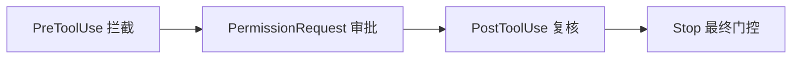
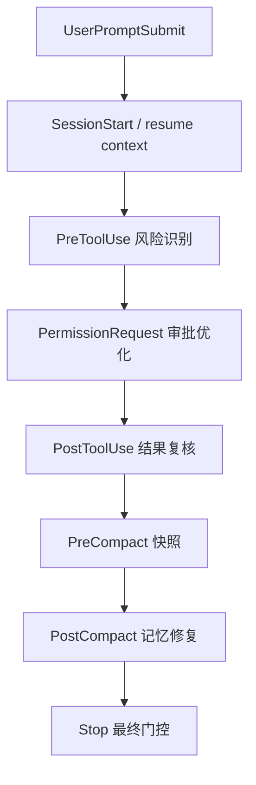

# Codex Hooks × Maglev：对等性、复用性与额外机会

> **主题**: 评估 OpenAI Codex Hooks 对 Maglev 的价值，判断它与 VS Code Agent Hooks 是否能力对等、现有方案能否复用，以及是否存在额外机会。
> **结论**: **大体对等，但不是一比一等价。** Maglev 已经在 VS Code hooks 上验证出来的 **Layer 0 护栏、状态快照、结构化 trace** 三类能力，绝大多数都可以迁移到 Codex；同时 Codex 还多出 **`PermissionRequest`、`PostCompact`、managed hooks、plugin-bundled hooks、turn_id / permission_mode`** 这些额外抓手。

---

## 1. 先给结论

如果只回答“能不能复用”，答案是：

> **能，而且复用率很高。**

如果再往前一步问“是否能力完全对等”，更准确的答案是：

> **不是完全对等，而是“核心能力重合 + 一些关键差异 + Codex 有额外抓手”。**

对 Maglev 来说，最重要的不是平台细节，而是三件事能不能成立：

1. **能不能做运行时硬门控**
2. **能不能在 session 边界保存和恢复状态**
3. **能不能把执行链路变成可观测 trace**

Codex 在这三件事上都成立。

---

## 2. 与 VS Code Hooks 的能力对照

| 能力 | VS Code Agent Hooks | Codex Hooks | 对 Maglev 的意义 |
|---|---|---|---|
| `SessionStart` | 有 | 有 | 会话冷启动注入项目快照 |
| `UserPromptSubmit` | 有 | 有 | prompt 审计、注入额外上下文 |
| `PreToolUse` | 有 | 有 | 运行时 guardrail 的核心入口 |
| `PostToolUse` | 有 | 有 | 工具后处理、反馈改写、trace |
| `PreCompact` | 有 | 有 | 压缩前保存状态 |
| `PostCompact` | 无 | **有** | 压缩后自动补记忆 / 修复上下文 |
| `SubagentStart` | 有 | 有 | 子 agent 自动注入纪律 |
| `SubagentStop` | 有 | 有 | 子 agent 结果质检、续跑 |
| `Stop` | 有 | 有 | 结束前门控、强制继续一轮 |
| `PermissionRequest` | 无独立事件 | **有独立事件** | 审批策略更细，可把“deny / auto-allow / ask”拆开治理 |
| tool input 重写 | 有 | 有 | 自动修正不安全调用 |
| plugin 打包 hooks | 有 plugin hooks | **有 plugin-bundled hooks** | 可把 Maglev 做成可安装能力包 |
| enterprise managed hooks | 有组织策略，但文档侧较轻 | **更强，明确支持 `requirements.toml` + managed-only** | 企业级统一治理更稳 |

**读表结论**：如果把 VS Code hooks 看成 1.0，Codex hooks 更像 1.0 + 若干企业和治理增强件。

---

## 3. 哪些现有 Maglev Hooks 可以直接复用

我们已经验证过的那套思路，大部分不需要换脑子，只需要换适配层。

### 3.1 可以原样迁移的

#### A. 高风险目录保护

例如：

- 禁止改 `dist/`
- 禁止改构建产物
- 禁止直接改生成代码

在 Codex 里依然适合挂在 `PreToolUse`。

只是要把工具名适配成 Codex 的命名：

- `Bash`
- `apply_patch`
- `mcp__...`

而不是 VS Code 里的 `editFiles`、`createFile` 之类。

---

#### B. 子 agent 纪律自动注入

`SubagentStart` 在 Codex 里同样存在，而且还能按 `agent_type` matcher。

这意味着 Maglev 的“子 agent 不准裸奔”可以照搬：

- 自动注入三条红线
- 自动注入关键路径边界
- 自动注入最小验证纪律

这仍然是 P0 级机会。

---

#### C. Session 快照注入

`SessionStart` 也对等存在，而且 matcher 支持：

- `startup`
- `resume`
- `clear`
- `compact`

这甚至比 VS Code 更细。

额外价值是：你可以对 **新会话** 和 **压缩后恢复** 注入不同上下文，而不是一把梭。

---

#### D. PreCompact 快照

把状态写到用户本地目录，例如：

- `~/.maglev/session-snapshots/`

这套策略可直接搬过去。

---

#### E. 结构化 Trace

`SessionStart / UserPromptSubmit / PreToolUse / PostToolUse / SubagentStart / SubagentStop / Stop`

这些足够构成一条完整事件流。我们在 VS Code 上验证过的“jsonl 事件流 + session summary”思路，直接适用于 Codex。

---

## 4. 不能简单照搬的一些差异

### 4.1 `PreToolUse` 不是完整 enforcement boundary

Codex 文档明确写了：

> `PreToolUse` 仍然是 guardrail，而不是完整 enforcement boundary，因为 Codex 往往能通过其他工具路径完成等价工作。

这对 Maglev 是一个重要提醒：

**不要把单个 Hook 当作“绝对安全边界”。**

更稳妥的做法是：

也就是说，Codex 更适合做 **多层治理链**，而不是“单点防御”。

---

### 4.2 Codex 的多 hook 是并发启动的

文档明确写了：

> 同一事件下多个 matching command hooks 会并发启动，一个 hook 不能阻止另一个 matching hook 开始。

这意味着：

- 不能假设“deny hook 跑了，logging hook 就不会跑”
- 不能在 hooks 之间依赖严格串行顺序
- trace / audit / guardrail 脚本都要设计成**幂等**或至少**可并发**

这比 VS Code 的心智负担更高一点。

---

### 4.3 trust review 是一等公民

Codex 对非托管 hooks 有显式 trust review：

- 新 hook 要 review
- 改过的 hook 要重新 review
- trust 绑定到当前 hook hash

这对 Maglev 不是负担，反而是优势：

> **Maglev 可以把“治理规则本身的发布和审计”做得更正规。**

以前很多 hook 方案默认“文件存在就执行”，Codex 强制你处理“谁信任这段自动执行代码”。

---

### 4.4 `ask` 语义不在 `PreToolUse`，而在 `PermissionRequest`

VS Code 的心智模型比较像：

- `PreToolUse` 里决定 `allow / deny / ask`

Codex 不是这样。

Codex 的结构更像：

- `PreToolUse`：前置改写 / deny / 额外上下文
- `PermissionRequest`：当系统真的要 ask 时，决定 allow / deny / 继续走原审批流

这其实更适合做**审批分层治理**。

---

## 5. Codex 独有的额外机会

这里才是最值得举一反三的地方。

### 5.1 `PermissionRequest`：把审批做成治理层

这是 Codex 相比 VS Code 最有意思的增强点之一。

你可以做三类策略：

| 场景 | 动作 |
|---|---|
| 安全的 Bash 或 patch | 自动 `allow`，减少打断 |
| 命中高风险命令 | 直接 `deny` |
| 中风险动作 | 不决定，让正常 approval prompt 继续 |

这让 Maglev 第一次可以把“**用户体验优化**”和“**风险控制**”拆开做：

- `PreToolUse` 负责判断风险
- `PermissionRequest` 负责减少不必要确认

这比单纯 `ask` 更细。

---

### 5.2 `PostCompact`：压缩后自动修复记忆

VS Code 只有 `PreCompact`，Codex 多了 `PostCompact`。

这很重要，因为它允许：

1. 压缩前保存状态
2. 压缩后立刻补一段恢复性上下文

例如：

- “当前主线仍然是 X”
- “不要重复扫描 Y”
- “上一轮已经确认 Z 不要再质疑”

这比单纯保存快照更接近真正的 **memory self-healing**。

---

### 5.3 managed hooks：组织级治理更强

Codex 明确支持：

- `requirements.toml`
- managed hooks 目录
- `allow_managed_hooks_only = true`

这意味着一个企业可以做到：

> 用户本地可以自定义很多东西，但组织要求的治理 hooks 永远在，而且不能被本地关闭。

对 Maglev 来说，这是非常大的机会，因为它天然适合：

- 组织级研发规则
- AI Coding 合规边界
- 发布流程守门
- 风险动作审批

这比 repo-local 提示词更接近真正的组织能力。

---

### 5.4 plugin-bundled hooks：把 Maglev 做成可安装包

Codex 插件可以自带 hooks。

这意味着 Maglev 不一定非要要求每个项目手抄 `.codex/hooks.json`，而可以走两条路：

1. **repo template**
2. **Codex plugin**

第二条更有想象力：

- 安装插件
- trust hooks
- 自动获得 Layer 0 护栏、trace、状态快照、最小纪律注入

这使 Maglev 更像一个**可部署的治理组件**，而不只是文档集合。

---

### 5.5 `turn_id`、`permission_mode`、`last_assistant_message`

Codex 在 hook 输入里给了更多运行态字段。

其中最有价值的几个是：

- `turn_id`
- `permission_mode`
- `last_assistant_message`
- `agent_transcript_path`
- `model`

这带来几种 VS Code 里不那么直接的机会：

#### 按 permission mode 调整治理强度

例如：

- `dontAsk` / `bypassPermissions` 时提高 guardrail 严格度
- `plan` 模式时更偏向提醒，不急着阻断

#### 做 turn-level trace

不只是 session trace，而是：

- 第几轮开始偏离
- 哪一轮开始频繁触发 deny
- 哪一轮 compaction 后质量下降

#### 做 stop-aware recovery

利用 `last_assistant_message` 判断：

- 这轮是不是已经给了空口完成式结论
- 是否需要在 `Stop` 自动补一句“请再给证据”

---

## 6. 对 Maglev 的新创意

### 6.1 “治理编排链”而不是单 hook

Codex 的最佳用法可能不是“写一个厉害的 hook”，而是把几个事件串成一条治理链：

这条链比 VS Code 更完整。

---

### 6.2 “Maglev Managed Policy Pack”

如果面向组织推广，最值得想的不是“给单仓库补脚本”，而是：

> **把 Maglev 做成一组 managed hooks policy pack。**

内容可能包括：

- 禁改生成物
- 子 agent 纪律注入
- 验证前禁止结束
- 高风险 Bash 自动 deny
- 低风险常见审批自动 allow
- 统一 trace 输出到本地或企业收集端

这会把 Maglev 从“项目方法论”再往前推一步，变成“组织 AI Coding 治理组件”。

---

### 6.3 “Memory Repair Pack”

Codex 因为有 `PreCompact + PostCompact`，很适合做一类单独能力：

> **Memory Repair Pack**

它不负责业务规则，只负责：

- 压缩前快照
- 压缩后恢复主线
- 提醒不要重复劳动
- 恢复当前 active spec / issue / validator 状态

这对长任务、多阶段任务、跨 subagent 任务都很值。

---

### 6.4 “Adaptive Approval UX”

借助 `PermissionRequest`，可以把审批体验做得更聪明：

- 常见低风险动作自动通过
- 命中高风险模式直接拒绝
- 中间地带继续 ask

长期看，这会让用户感觉：

- 不安全时系统更稳
- 安全时系统更顺

这其实是 hooks 在体验层的一个被低估的方向。

---

## 7. 推荐的复用策略

如果要把当前 VS Code 上的经验迁移到 Codex，我建议这样拆：

### 第一层：策略不变

保持不变的应该是：

- Layer 0 护栏思想
- 本地目录落盘
- 事件流 + 会话汇总
- 子 agent 自动注入纪律
- 先 soft gate，后 hard gate

### 第二层：适配层重写

需要重写的是：

- hook 配置路径：`.github/hooks/` → `.codex/hooks.json` 或 `config.toml`
- 工具名匹配：`editFiles` → `apply_patch` / `Bash` / `mcp__...`
- 审批模型：`ask` 逻辑迁移到 `PermissionRequest`
- 事件增强：把 `PostCompact`、`turn_id`、`permission_mode` 用起来

### 第三层：能力升级

在 Codex 上应该额外加的，不是简单复刻，而是：

- managed policy pack
- permission-aware guardrails
- compaction repair layer
- plugin-bundled distribution

---

## 8. 最终判断

**是否对等？**

大体对等，但 Codex 在治理和企业分发上更强一些，在 per-agent scoped hooks 这种体验上则不是同一形态。

**是否可复用？**

高度可复用。Maglev 现在已经验证出来的 hooks 思路，至少 70% 到 80% 可以直接迁到 Codex，只需要换事件 schema 和工具命名适配层。

**是否有额外机会？**

有，而且不止一个。最值得做的是：

1. `PermissionRequest` 驱动的审批治理
2. `PostCompact` 驱动的记忆修复
3. managed hooks 驱动的组织级策略包
4. plugin-bundled hooks 驱动的可安装 Maglev 治理组件

---

## 9. 一句话结论

> **如果 VS Code hooks 让 Maglev 拥有了 Layer 0，那么 Codex hooks 让 Maglev 有机会把 Layer 0 从“项目护栏”升级成“组织级治理与可观测组件”。**

---

## 参考

- VS Code 对照分析：[`./vscode_hooks_maglev_opportunities_2026_06_17.md`](./vscode_hooks_maglev_opportunities_2026_06_17.md)
- Codex Hooks 官方文档：<https://developers.openai.com/codex/hooks>
- Maglev 定位锚点：[`../../../specs/10_reality/positioning.md`](../../../specs/10_reality/positioning.md)
