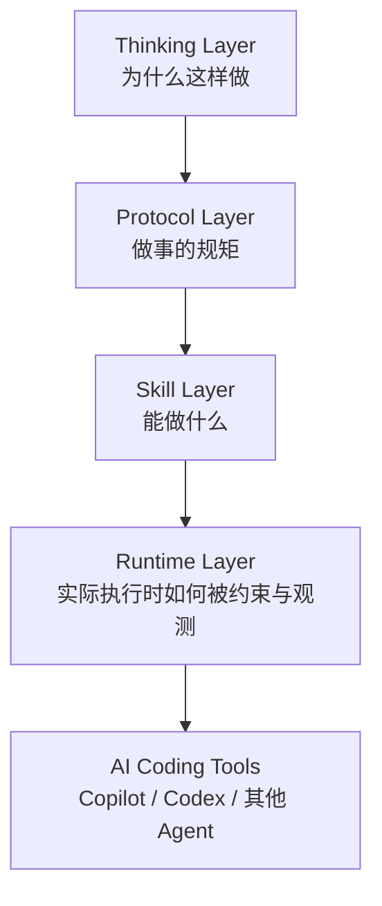
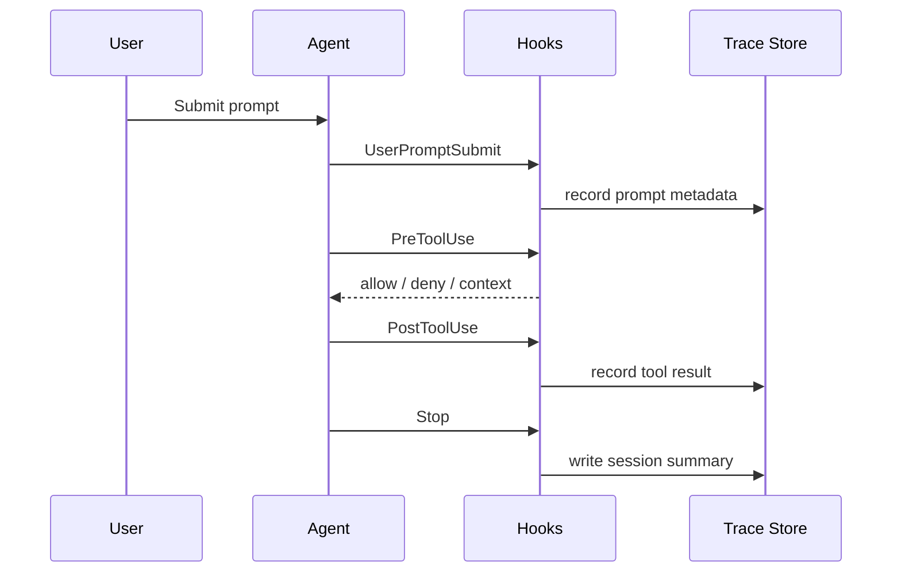
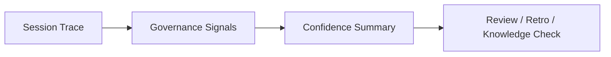
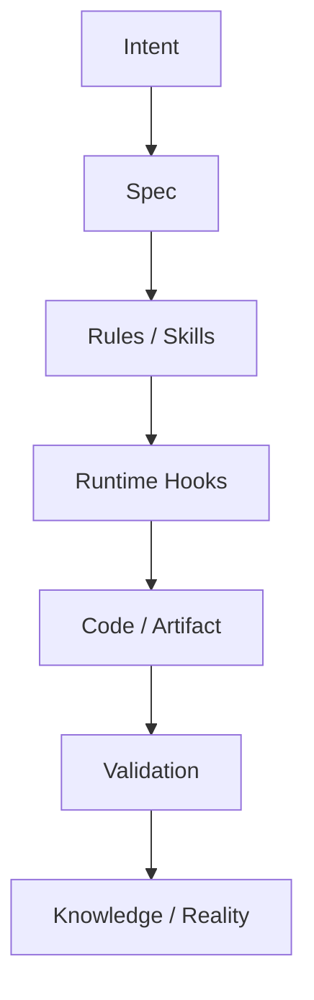

# Hooks Runtime Layer：对 Maglev 范式与产品化的再思考

> **主题**: 从 VS Code Agent Hooks 与 Codex Hooks 出发，重新审视 Maglev 的思想、范式、方法论和产品化机会。
> **核心结论**: Hooks 不只是“多一种自动化扩展点”，而是让 Maglev 第一次拥有了可落地的 **Runtime Layer**。这会把 Maglev 从“靠文本协议约束 AI”推进到“用运行时事件约束、观察和修复 AI 协作过程”。

---

## 1. 最大变化：Maglev 多了一层 Runtime

Maglev 原本最稳定的定位是：

> 用 Spec、规则和工作流，减少意图、设计、代码与验证之间的漂移。

这套定位没有变。

但 Hooks 出现后，Maglev 的结构可以从三层扩展为四层：

原来的 Maglev 更像“协议和技能系统”，现在可以多出一层：

> **Runtime Layer：在 agent 执行过程中进行门控、注入、快照、追踪和恢复。**

这不是改变 Maglev 的定位，而是让定位更可执行。

---

## 2. Hooks 改变的是“治理介质”

过去 Maglev 的规则主要通过文本生效：

- `AGENTS.md`
- `SKILL.md`
- spec 模板
- workflow 文档
- validator 提示

这些都属于 **declarative governance**：声明式治理。

Hooks 带来的是 **operative governance**：操作式治理。

| 过去 | Hooks 之后 |
|---|---|
| 告诉 AI 不要改 `dist/` | 在 `PreToolUse` 直接 deny |
| 告诉子 agent 先读纪律 | 在 `SubagentStart` 自动注入 |
| 告诉 AI 长会话别忘上下文 | 在 `PreCompact` 保存快照 |
| 告诉 AI 结束前要验证 | 在 `Stop` 阻止或提醒 |
| 事后靠人复盘 | 运行时生成 trace |

**关键变化**：治理从“模型是否记得”变成“系统是否拦得住、记得住、看得见”。

---

## 3. 这对 Maglev 方法论的影响

### 3.1 从“流程正确”转向“流程可证明”

Maglev 一直强调闭环验证，但过去很多闭环仍然需要靠最终产物判断。

Hooks 让过程本身也能留下证据：

- 什么时候启动 session
- 用户提交了什么类型的请求
- 是否启动子 agent
- 调用了哪些工具
- 是否触发高风险拦截
- 是否发生 context 压缩
- 是否在结束前生成 summary

这意味着 Maglev 可以从：

> “我们要求 AI 按流程做”

升级为：

> “我们能证明 AI 在哪些关键边界上被约束过。”

这会强化 Maglev 的“可治理团队能力”定位。

---

### 3.2 从“单次交付”转向“协作遥测”

过去一次 AI 协作完成后，真正留下来的通常只有：

- 文件 diff
- commit
- spec
- 测试结果

但 agent 是怎么走到这个结果的，基本不可见。

Hooks trace 让 Maglev 能采集一类新的资产：

> **Collaboration Telemetry（协作遥测）**

它不是模型思维链，而是外显行为链：

这类数据可以回答以前回答不了的问题：

- 哪类任务最容易触发风险拦截？
- 哪些技能最常在没有验证时结束？
- 哪些子 agent 输出需要二次修正？
- context 压缩后任务质量是否下降？
- 用户体验里的摩擦点主要来自哪里？

这是 Maglev 从“流程方法论”走向“可观测工程系统”的关键一步。

---

### 3.3 从“规则文档”转向“Policy Pack”

Hooks 让规则可以被打包成可运行策略。

过去一个规则写成：

> 不要直接修改生成物。

现在可以变成：

- 一个 policy 名称
- 一个 matcher
- 一个 deny 条件
- 一条用户可读原因
- 一条 trace 事件
- 一个组织级启用配置

也就是说，Maglev 的一部分“治理纪律”可以产品化为：

> **Maglev Policy Pack**

例如：

| Policy Pack | 内容 |
|---|---|
| Generated Artifact Guard | 禁改 `dist/`、`build/`、generated files |
| Subagent Discipline Pack | 子 agent 自动注入项目纪律 |
| Verification Gate Pack | 结束前验证门控 |
| Memory Repair Pack | 压缩前快照、压缩后恢复 |
| Trace Pack | session / tool / subagent / policy trace |
| Approval UX Pack | 低风险自动放行、高风险拒绝 |

这比单纯发布文档更像产品。

---

## 4. 对产品化的启发

### 4.1 Maglev 可以有“最小运行时发行版”

目前 Maglev 更像：

- docs
- specs
- skills
- protocols
- installer

Hooks 暗示一个新形态：

> **Maglev Runtime Kit**

它不需要变成 IDE，也不需要替代 Copilot / Codex。它只需要提供：

- 跨平台 hooks 模板
- 可配置 policy packs
- 本地 trace store
- 会话快照
- 简单 summary 查看器
- 安装 / 更新脚本

这样 Maglev 的产品边界仍然清楚：

> 不做代码生成层，只做 AI Coding 的治理、对齐和验证运行层。

---

### 4.2 用户体验的关键不是“更多拦截”，而是“更少不必要打断”

Hooks 很容易做过头。

差的体验：

- 每个工具调用都弹警告
- 每次结束都被阻止
- 每个文件都被扫描
- 用户觉得 AI 变慢、变啰嗦

好的体验：

- 明确危险时强拦
- 低风险动作自动放行
- 中风险保留确认
- 只在关键节点给上下文
- trace 静默记录，不打扰用户

尤其 Codex 的 `PermissionRequest` 给了一个很好的产品化方向：

> **Adaptive Approval UX：风险越低越顺，风险越高越硬。**

这比“一刀切审批”更适合真实团队。

---

### 4.3 Trace 可以变成“交付可信度面板”

如果只把 trace 当日志，它价值有限。

真正的产品化方向是把 trace 汇总成可读信号：

| 信号 | 用户能得到什么 |
|---|---|
| Tool Count | 这次任务复杂度多高 |
| Deny Count | 是否多次碰到治理边界 |
| Subagent Count | 是否发生复杂委派 |
| Compaction Count | 是否存在长会话风险 |
| Validation Gate | 是否经历收尾验证 |
| Prompt Count | 用户反复澄清程度 |

最终可以形成一个简单的交付可信度视图：

这与 Maglev 的 integrated-validator、knowledge-check、crystallization 都能连接。

---

## 5. 对 Maglev 思想的更深一层影响

### 5.1 Maglev 不只是“写更好的 Spec”

过去外部读者容易把 Maglev 理解成：

> 一套 Spec-first 方法。

Hooks 之后，更准确的表达应该是：

> Maglev 用 Spec 固定意图，用 Skills 固定协作角色，用 Hooks 固定运行边界，用 Validation 固定纠偏闭环。

它把 Maglev 的链条补完整了：

Hooks 让“规则”第一次能在执行层产生可观察的硬效果。

---

### 5.2 “人机协作协议”可以有运行时实现

Maglev 原本讲“人机协作协议”，容易显得抽象。

Hooks 给了它一个很具体的落点：

- 协议不是只写在文档里
- 协议可以监听事件
- 协议可以阻止动作
- 协议可以保存状态
- 协议可以生成证据

这会让 Maglev 的方法论更可信，因为它不再只依赖“AI 应该遵守”。

---

### 5.3 从“AI 自律”转向“系统约束”

这是最重要的思想变化。

AI 协作里很多失败并不是模型完全不知道，而是：

- 忘了
- 被上下文挤掉了
- 选择了省事路径
- 子 agent 没继承规则
- 会话结束前没再验证

Hooks 的价值是承认一个现实：

> 不要期待 AI 永远自律，要把关键自律要求移到系统边界上。

这与 Maglev 的治理纪律完全一致。

---

## 6. 产品路线上的可能形态

### 6.1 本地开发者版

面向个人和小项目：

- 一键安装 `.github/hooks/` 或 `.codex/hooks/`
- 本地 `~/.maglev/` trace / snapshot
- 默认启用少量低噪音策略
- 不做组织级上报

目标：让个人先感受到“更稳，不更烦”。

---

### 6.2 团队仓库版

面向团队：

- repo-local hooks
- 项目级 policy 配置
- 统一高风险目录保护
- trace summary 进入 PR / review / retro
- 与 integrated-validator 形成收尾门控

目标：让团队把 AI 协作从个人习惯变成可治理流程。

---

### 6.3 企业托管版

面向企业：

- Codex managed hooks
- 组织统一 policy pack
- 用户不可绕过的最低治理要求
- 审计 trace 可接入企业日志系统
- 不同项目可叠加本地策略

目标：让 AI Coding 治理成为组织级基础设施。

---

## 7. 体验设计原则

如果把 Hooks 产品化，应该遵守下面几条：

| 原则 | 含义 |
|---|---|
| Silent by default | 默认静默记录，不打扰用户 |
| Block only when obvious | 只有高置信危险才硬拦 |
| Explain next action | 拦截时必须告诉用户下一步怎么做 |
| Local first | 默认写本地目录，不污染仓库 |
| Policy visible | 用户要能看到哪些策略在生效 |
| Reviewable | hook 脚本和策略本身要可审查 |
| Portable | 不绑定单一 agent 平台 |

最重要的是：

> **治理不能让用户觉得 AI 变笨了，而要让用户觉得 AI 更靠谱了。**

---

## 8. 还可以继续探索的创意

### 8.1 Runtime Contract

为每次任务生成一份运行时契约：

- 本次任务目标
- 禁止触碰区域
- 必须验证项
- 允许的工具范围
- Stop 前检查项

然后由 Hooks 在运行期执行契约。

这会把 Task Contract 从“文本计划”推进到“运行时约束”。

---

### 8.2 Drift Detector

利用 trace 检测漂移迹象：

- 用户多次纠正同一方向
- 工具调用越来越远离初始 spec
- 子 agent 反复进入不相关目录
- compaction 后重复扫描已完成区域

一旦命中，就在 `PostToolUse` 或 `Stop` 注入提醒：

> 当前任务出现漂移迹象，请回到原始 intent / spec 对齐。

---

### 8.3 Confidence Budget

给一次 session 设置“可信预算”：

- 高风险 deny 次数
- 未验证改动数量
- compaction 次数
- 子 agent 失败次数
- stop hook 续跑次数

预算越接近耗尽，收尾时越强制进入验证或复盘。

这会把 Maglev 的“信心门控”产品化。

---

### 8.4 Skill Health Analytics

用 trace 反推 skill 健康度：

- 哪些 skill 常需要 Stop 续跑
- 哪些 skill 经常触发 deny
- 哪些 skill 平均工具调用异常高
- 哪些 skill 在 subagent 后经常需要主 agent 补救

这可以反哺 skill-scout / skill-squadron。

---

## 9. 最终判断

Hooks 对 Maglev 的意义，不是多了几个脚本入口，而是让 Maglev 的范式从：

> **Spec + Skill + Validation**

演进为：

> **Spec + Skill + Runtime + Validation**

其中 Runtime 负责：

- 关键动作门控
- 上下文连续性
- 协作过程观测
- 规则执行证据
- 用户体验降噪

这会让 Maglev 的“治理”不再只是方法论和提示词，而是可以被安装、被审计、被追踪、被优化的运行层能力。

---

## 一句话总结

> **Copilot 和 Codex 的 Hooks 共同指向一个机会：Maglev 可以把自己的方法论产品化为跨 agent 平台的 AI Coding Runtime Guardrail，而不是停留在文档和技能集合。**
