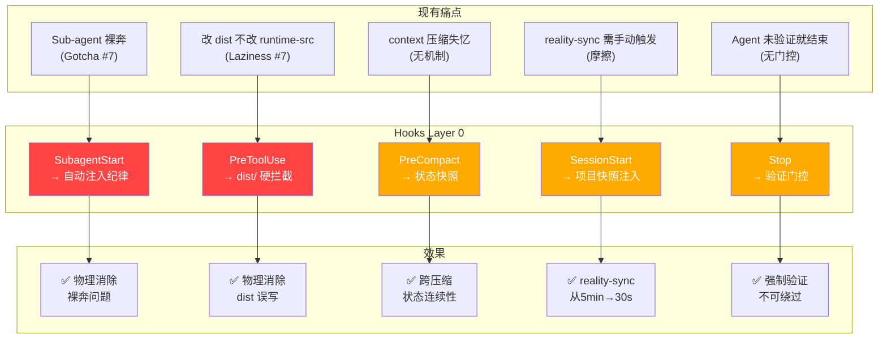

# VSCode Agent Hooks × Maglev：机会分析

> **主题**: 深度评估 VSCode Agent Hooks（Preview, 2026-06）对 Maglev 框架的影响
> **结论**: Hooks 带来了一个"Layer 0"——把 Maglev 的纪律从"软约束（靠 AI 服从文本）"升级为"硬约束（由确定性代码强制执行）"，这是一次范式转变。

---

## 1. 核心判断：范式转变，不是功能叠加

Maglev 当前的纪律层是三层防御架构：

```
Layer 1: AGENTS.md 顶部红线区块（系统提示注入）
Layer 2: 各主流程 SKILL.md 头部引用
Layer 3: maglev-discipline 知识资产
```

三层的共同局限：**全部依赖 AI 在当前 context window 内读取并服从文本指令**。

当 AI 触发 context compaction、spawn subagent（空白上下文）、或单纯"懒惰"时，三层都可能失效。

VSCode Hooks 引入了 **Layer 0**：
```
Layer 0: 确定性 Shell 代码，在 AI 调用工具前/后/session 边界强制执行
```

**关键性质**：
- Layer 0 不需要 AI 记住任何事
- Layer 0 不能被 AI "惰性跳过"
- Layer 0 的输出直接影响 AI 的工具执行权限

这不是"又多了一个功能"，而是把 Maglev 的治理模型从"请求式"升级到"强制式"。

---

## 2. Hooks 全景（8 个生命周期事件）

| Hook | 触发时机 | 可做什么 | 对 Maglev 的核心价值 |
|------|---------|---------|---------------------|
| `SessionStart` | 用户提交第一条 prompt | 注入 `additionalContext` | 自动同步项目状态，加速 reality-sync |
| `UserPromptSubmit` | 用户每次提交 prompt | 注入系统消息 | 路由辅助，可识别需要 entry-router 的请求 |
| `PreToolUse` | AI 调用任何工具前 | **allow/deny/ask** + 修改工具输入 + 注入上下文 | 🔴 **最高价值**：把 Gotcha 变成硬门控 |
| `PostToolUse` | 工具执行成功后 | 注入上下文、block 后续 | 触发自动化后处理（lint、索引更新等） |
| `PreCompact` | context 即将被压缩前 | 导出重要状态 | 解决"压缩失忆"问题 |
| `SubagentStart` | 子 agent 被 spawn 时 | 注入 `additionalContext` | 🔴 **最高价值**：消除 Sub-agent 裸奔问题 |
| `SubagentStop` | 子 agent 完成时 | block 或让其继续 | 子 agent 结果质检 |
| `Stop` | agent session 结束 | **block** 阻止结束 | 强制验证门控 |

---

## 3. 机会矩阵（按价值/成本排序）

### 🔴 P0：消除已知脆弱点（立刻有价值）

#### 3.1 Sub-agent 纪律自动注入
**当前问题**: maglev-discipline 的 Gotcha #7 明确写道：
> "Sub-agent 裸奔：spawn 子 agent 时忘了在 prompt 里注入红线 — 子 agent 是空白上下文，不注入就没纪律"

这是一个**已知的、高频的、依赖 AI 主观记忆的失效点**。

**Hooks 方案**: `SubagentStart` hook 自动注入 maglev 纪律

```json
{
  "hooks": {
    "SubagentStart": [
      {
        "type": "command",
        "command": ".maglev/hooks/scripts/inject-subagent-discipline.sh"
      }
    ]
  }
}
```

```bash
#!/bin/bash
# inject-subagent-discipline.sh
INPUT=$(cat)
AGENT_TYPE=$(echo "$INPUT" | jq -r '.agent_type // "unknown"')

# 读取核心纪律摘要（避免注入太长）
DISCIPLINE=$(cat .agents/skills/maglev-discipline/SKILL.md | head -80)

cat <<EOF
{
  "hookSpecificOutput": {
    "hookEventName": "SubagentStart",
    "additionalContext": "⚠️ Maglev 纪律已自动注入（agent: $AGENT_TYPE）\n\n三条不可灰度红线:\n1. 闭环验证：交付前必须用证据（命令输出、文件 diff）说话\n2. 事实驱动：声明状态前必须有工具验证依据\n3. 穷尽方法：宣告无法解决前必须走完通用 5 步方法论\n\n纪律全文: .agents/skills/maglev-discipline/SKILL.md"
  }
}
EOF
```

**效果**: Subagent 裸奔从"AI 记忆问题"变成"物理不可能"。这消除了整个 Gotcha #7。

---

#### 3.2 dist/ 保护门（`PreToolUse`）
**当前问题**: Laziness Pattern #7 "改 dist 不改 runtime-src"，AGENTS.md 反复警告，但仍然会犯。

**Hooks 方案**: 拦截所有对 `packages/*/dist/` 的写操作并 deny。

```bash
#!/bin/bash
# protect-dist.sh
INPUT=$(cat)
TOOL_NAME=$(echo "$INPUT" | jq -r '.tool_name')
FILES=$(echo "$INPUT" | jq -r '.tool_input.files[]? // .tool_input.path // .tool_input.filePath // empty' 2>/dev/null)

if [[ "$TOOL_NAME" =~ ^(editFiles|createFile|replace_string_in_file|insert_edit_into_file)$ ]]; then
  while IFS= read -r FILE; do
    if echo "$FILE" | grep -q "/dist/"; then
      echo "{\"hookSpecificOutput\":{\"hookEventName\":\"PreToolUse\",\"permissionDecision\":\"deny\",\"permissionDecisionReason\":\"⛔ Maglev 保护：禁止直接修改 dist/ 构建产物。请修改 packages/maglev-cli/runtime-src/ 下的源文件，然后运行构建命令。\"}}"
      exit 0
    fi
  done <<< "$FILES"
fi

echo '{"continue":true}'
```

**效果**: Laziness Pattern #7 从"依赖 AI 自律"变成"物理拦截"。这是目前 maglev-discipline 三层防御都无法做到的。

---

#### 3.3 context 压缩前状态保存（`PreCompact`）
**当前问题**: Context compaction 后 AI 可能"失忆"：失去当前 spec、阶段、待处理任务的上下文。

**Hooks 方案**: 压缩前自动快照会话状态。

```bash
#!/bin/bash
# save-session-state.sh
INPUT=$(cat)
SESSION_ID=$(echo "$INPUT" | jq -r '.session_id // "unknown"')
TIMESTAMP=$(echo "$INPUT" | jq -r '.timestamp')

# 保存关键状态
mkdir -p .maglev/session-snapshots
SNAPSHOT_FILE=".maglev/session-snapshots/${SESSION_ID}-$(date +%Y%m%d%H%M%S).json"

# 收集活跃 spec
ACTIVE_SPECS=$(ls specs/20_evolution/ 2>/dev/null | head -5 | jq -R -s 'split("\n") | map(select(length>0))')
BRANCH=$(git branch --show-current 2>/dev/null || echo "unknown")

cat > "$SNAPSHOT_FILE" <<EOF
{
  "session_id": "$SESSION_ID",
  "timestamp": "$TIMESTAMP",
  "branch": "$BRANCH",
  "active_specs": $ACTIVE_SPECS,
  "trigger": "pre_compaction"
}
EOF

# 注入提醒给 AI
cat <<EOF
{
  "hookSpecificOutput": {
    "hookEventName": "PreCompact",
    "systemMessage": "⚡ 即将压缩 context。当前状态已快照至 $SNAPSHOT_FILE。压缩后请先检查该文件恢复工作上下文。"
  }
}
EOF
```

---

### 🟡 P1：体验升级（显著提升日常流畅度）

#### 3.4 SessionStart 动态项目上下文注入
**机会**: 每次会话都自动获得项目快照，让 reality-sync 从"5分钟手动扫描"变成"30秒确认+补充"。

```bash
#!/bin/bash
# session-context.sh

BRANCH=$(git branch --show-current 2>/dev/null || echo "unknown")
ACTIVE_SPECS=$(ls specs/20_evolution/ 2>/dev/null | grep -v "^_\|^README\|^INDEX" | head -5 | tr '\n' ', ')
PENDING_ISSUES=$(ls issues/ 2>/dev/null | wc -l | tr -d ' ')
LAST_COMMIT=$(git log -1 --format="%h %s" 2>/dev/null || echo "unknown")

cat <<EOF
{
  "hookSpecificOutput": {
    "hookEventName": "SessionStart",
    "additionalContext": "🧲 Maglev 项目快照\n分支: $BRANCH\n上次提交: $LAST_COMMIT\n活跃演进 specs: ${ACTIVE_SPECS:-无}\nIssues 数: $PENDING_ISSUES\n\n建议: 运行 reality-sync 获取完整现状，或直接说明你的目标。"
  }
}
EOF
```

**注意**: 这是加速 reality-sync，不是替代它。reality-sync 的核心价值是 AI 主动扫描+判断风险，而不仅仅是读取快照。

---

#### 3.5 Stop Hook 验证门控
**机会**: 防止 agent 在完成 spec 修改后、未运行 integrated-validator 的情况下直接结束。

```bash
#!/bin/bash
# validate-before-stop.sh
INPUT=$(cat)
STOP_HOOK_ACTIVE=$(echo "$INPUT" | jq -r '.stop_hook_active')

# 防止无限循环
if [ "$STOP_HOOK_ACTIVE" = "true" ]; then
  echo '{"continue":true}'
  exit 0
fi

# 检查是否有未验证的 spec 变更
SPEC_CHANGES=$(git diff --name-only HEAD 2>/dev/null | grep "^specs/" | wc -l | tr -d ' ')

if [ "$SPEC_CHANGES" -gt "0" ]; then
  cat <<EOF
{
  "hookSpecificOutput": {
    "hookEventName": "Stop",
    "decision": "block",
    "reason": "检测到 $SPEC_CHANGES 个 specs/ 文件变更，但尚未运行 integrated-validator 综合验证。请先运行 /validate-all 确保 requirements↔spec↔code↔tests 一致性，再结束 session。"
  }
}
EOF
else
  echo '{"continue":true}'
fi
```

**限制**: 仅检查 spec 变更，不检查代码变更，避免每次编码都触发门控（影响流畅度）。

---

### 🟢 P2：新能力（之前做不到的）

#### 3.6 Agent-scoped Hooks 为每个 Maglev Skill 定制自动化

VSCode 的 Agent-scoped hooks 允许在 `.agent.md` frontmatter 里直接定义 hooks，**只在该 agent 激活时生效**。这让每个 Maglev skill 可以携带自己的专属自动化：

```yaml
# .agents/skills/context-implementer/.agent.md (示意)
---
name: "Context Implementer"
description: "..."
hooks:
  PostToolUse:
    - type: command
      command: ".maglev/hooks/scripts/auto-lint-after-edit.sh"
  PreToolUse:
    - type: command
      command: ".maglev/hooks/scripts/protect-dist.sh"
---
```

```yaml
# .agents/skills/integrated-validator/.agent.md (示意)
---
name: "Integrated Validator"
hooks:
  Stop:
    - type: command
      command: ".maglev/hooks/scripts/ensure-validation-complete.sh"
---
```

这让 Maglev 的"技能边界"从"文本约定"升级到"运行时隔离"。

---

#### 3.7 PostToolUse → 自动触发 index-librarian

`index-librarian` skill 目前需要手动触发。批量文件变更后自动触发索引更新：

```bash
#!/bin/bash
# trigger-index-update.sh
INPUT=$(cat)
TOOL_NAME=$(echo "$INPUT" | jq -r '.tool_name')

if [[ "$TOOL_NAME" =~ ^(editFiles|createFile)$ ]]; then
  FILES_CHANGED=$(echo "$INPUT" | jq -r '.tool_input.files[]? // .tool_input.path // empty' | wc -l)
  if [ "$FILES_CHANGED" -gt "3" ]; then
    # 标记需要更新索引（不阻塞，只注入提醒）
    cat <<EOF
{
  "hookSpecificOutput": {
    "hookEventName": "PostToolUse",
    "additionalContext": "ℹ️ 本次修改了 $FILES_CHANGED 个文件。建议完成后运行 index-librarian 更新项目索引。"
  }
}
EOF
    exit 0
  fi
fi

echo '{"continue":true}'
```

---

#### 3.8 audit trail：完整的 AI 行为日志

```bash
#!/bin/bash
# audit-tool-use.sh
INPUT=$(cat)
TIMESTAMP=$(echo "$INPUT" | jq -r '.timestamp')
TOOL_NAME=$(echo "$INPUT" | jq -r '.tool_name')
SESSION_ID=$(echo "$INPUT" | jq -r '.session_id // "?"')

mkdir -p .maglev/audit-logs
echo "[$TIMESTAMP][session:$SESSION_ID] $TOOL_NAME" >> .maglev/audit-logs/$(date +%Y-%m-%d).log

echo '{"continue":true}'
```

这让 `knowledge-check` 和 `crystallization` 有了可追溯的原始数据源。

---

## 4. 总结：稳定性与体验改善地图



### 按优先级排序的实施建议

| 优先级 | Hook | 解决的核心问题 | 实施难度 |
|--------|------|--------------|---------|
| P0 | `SubagentStart` → 纪律注入 | 消除 Sub-agent 裸奔 | 低（Shell 脚本） |
| P0 | `PreToolUse` → dist/ 保护 | 消除 Laziness #7 | 低（路径匹配） |
| P1 | `PreCompact` → 状态快照 | 解决压缩失忆 | 中（状态格式设计） |
| P1 | `SessionStart` → 项目快照 | 加速 reality-sync | 低（git + ls 命令） |
| P1 | `Stop` → 验证门控 | 强制 integrated-validator | 中（误触发设计） |
| P2 | `Agent-scoped hooks` | 技能运行时隔离 | 高（需 .agent.md 重构） |
| P2 | `PostToolUse` → 索引触发 | 减少手动维护 | 低 |

---

## 5. 边界判断：Maglev 的定位护栏

根据 `specs/10_reality/positioning.md` 的判断原则：

> 编码层的创新 = Maglev 的环境约束变化——它们变强意味着 Maglev 的输出可以被更好地消费，不意味着 Maglev 需要追赶

Hooks 属于**环境约束变化**。正确的使用姿势：

✅ **应该用 Hooks 做的**：
- 在 session 边界强制执行治理纪律（不依赖 AI 记忆）
- 防止结构性错误（dist 保护）
- 在工具调用边界注入上下文

❌ **不应该用 Hooks 做的**：
- 替代 Spec 质量审查（那是 AI + Maglev 技能的工作）
- 构建复杂的 CI/CD 管道（那不是 Maglev 的定位）
- 替代 entry-router 路由判断（那是 AI 判断层）

---

## 6. 建议的实施路径

```
Phase 1 (MVP, ~1天):
  .github/hooks/maglev-guards.json
  → dist/ 保护 + subagent 纪律注入

Phase 2 (稳定性, ~3天):
  + PreCompact 状态快照
  + SessionStart 项目上下文
  + Stop 验证门控 (soft mode: 警告不阻止)

Phase 3 (深度集成, 后续):
  + Agent-scoped hooks 嵌入各 skill .agent.md
  + 审计日志驱动 knowledge-check
  + Stop 验证门控 (hard mode: 真正阻止)
```

---

*分析日期: 2026-06-17*
*参考文档: [VSCode Agent Hooks](https://code.visualstudio.com/docs/agent-customization/hooks) (Preview, 2026-06-10)*
*锚定: `specs/10_reality/positioning.md`, `.agents/skills/maglev-discipline/SKILL.md`*
