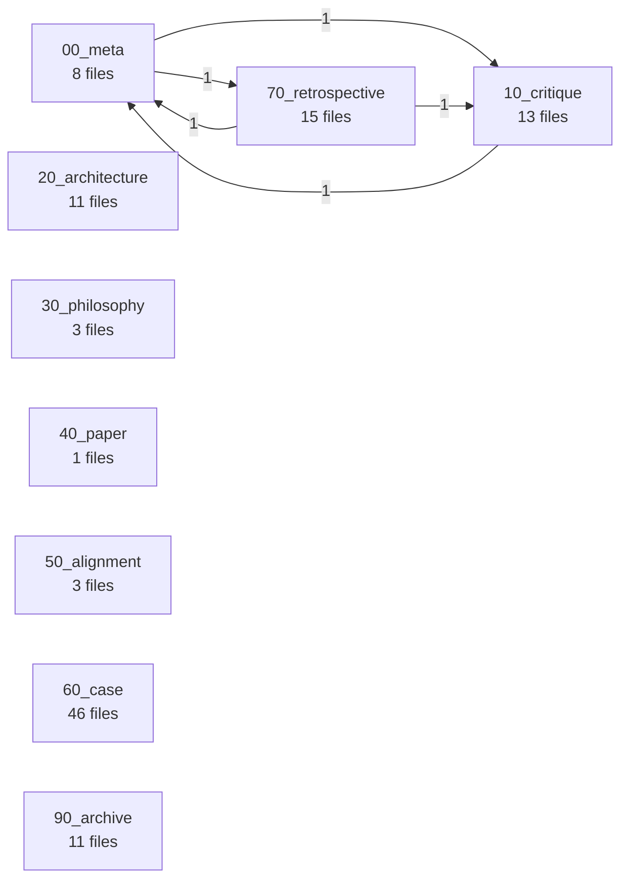

# 思考与决策日志 (Thinking Hall)

> 这是 `docs/thinking/` 的协议根索引（INDEX.md），由脚本独占维护。
> 用户友好的精选导航在 [README.md](./README.md)（保留过渡期内容）。
> 索引脚本：`.agents/skills/index-librarian/protocol/scripts/`

## 位段表

| 位段 | 房间名 | 用途 | 状态 |
|:---|:---|:---|:---|
| [00_meta/](./00_meta/) | 元厅 | 模块元信息、入口与导航 | 🟢 active |
| [10_critique/](./10_critique/) | 批判间 | 反思、对抗与质疑性分析 | 🟢 active |
| [20_architecture/](./20_architecture/) | 架构间 | 系统结构、分层与边界设计 | 🟢 active |
| [30_philosophy/](./30_philosophy/) | 哲学殿 | 范式根基、第一性原理与方程式表达 | 🟢 active |
| [40_paper/](./40_paper/) | 论文阁 | 学术对位、方法借鉴与理论引用 | 🟢 active |
| [50_alignment/](./50_alignment/) | 对标厅 | 跨范式对比、生态对位与差异化定位 | 🟢 active |
| [60_case/](./60_case/) | 案例馆 | 落地实例、试点与具体场景产出 | 🟢 active |
| [70_retrospective/](./70_retrospective/) | 复盘室 | 迭代闭环、决策回顾与经验提炼 | 🟢 active |
| [90_archive/](./90_archive/) | 归档库 | 已结晶/退役的历史文档 | 🟢 active |

## 认知地图

> 由 `cognitive_map.py --module docs/thinking --inject` 自动维护。
> 节点 = 位段；边 = 跨位段引用（markdown 链接 + frontmatter `linked_to`）。
> 仅 `status != draft` 的文档参与建边（AC-F8-4）。

<!-- COGNITIVE_MAP:BEGIN -->

<!-- COGNITIVE_MAP:END -->

## 迁移说明

当前阶段 = **Phase 3 进行中**（位段化第一钉）。

- 已有 4 个位段子目录（00/10/20/90）已与协议命名对位，无需重命名。
- 5 个待新建位段（30/40/50/60/70）将通过后续分批 `git mv` 从根目录与现存非位段目录中归位。
- 迁移过程中，本文件 `migration_status` 字段保持 `phase3_in_progress`；当 `index_verify.py --module thinking` 全绿且根目录无未归位 `.md` 时切换到 `stable`。

## 协议约束

- 任何 AI 与人都不得直接编辑本 INDEX.md 的统计字段（`stats`/`child_count`）— 请运行 `python3 .agents/skills/index-librarian/protocol/scripts/index_update.py --module thinking`。
- 叶子文档 frontmatter 应声明 `segment` 与 `status`（`draft` / `active` / `crystallized` / `archived`）；F8 认知地图启用后再补 `linked_to`。
