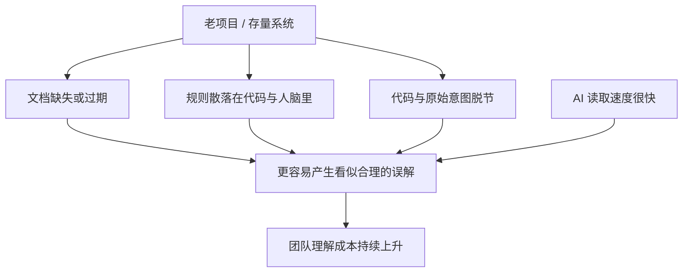
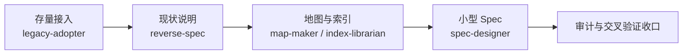
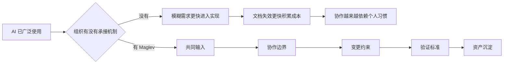

# 新项目与存量项目的采用路径

采用方式取决于项目当前有没有稳定的代码和事实基础。新项目可以先建立规格和入口；存量项目应从局部真实变更切入，先恢复当前状态，再逐步扩大覆盖。

> 面向负责维护老系统、存量业务的团队负责人：读完这一页，你会知道老项目真正的难点为什么不是代码旧、接入 Maglev 的第一步做什么，以及如何从一个受控范围开始。

## 老项目难的，从来不只是代码旧

这里说的"老项目和存量系统"，不是单纯指代码年份长，而是指这类系统：

- 已经支撑真实业务在跑
- 前后端模块多，协作链条长
- 需求和规则改过很多轮
- 很多关键知识已经散在代码、文档、会议记录和人脑里

一旦系统进入这个阶段，团队的问题就不只是"怎么继续开发"，而是"怎么继续理解"：



AI 可以很快读代码，但如果仓库里没有稳定的真理源，它读到的往往只是结果，不是意图（来源：为什么存量系统重要）。于是出现一个熟悉的现象：模型看起来理解了，生成的代码看起来也合理，真正上线时偏差反而更大——因为它补全的是"看起来合理"，不是"和系统原始约束一致"。

新项目至少还有一份相对新鲜的共识；老项目更常见的状态是代码跑了很多年、文档长期缺失、业务知识散在不同人脑里。团队真正难的，通常不是"没人能写代码"，而是没人能稳定说清楚：这个系统为什么会变成现在这样、哪些地方不能碰、这次改动到底会牵连到哪里。

## 你可能已经在这个场景里：五个信号

很多团队其实已经处在老项目场景里，只是没有明确说出来。如果下面这些信号频繁出现，说明问题不只是开发效率，而是理解和治理开始失稳（来源：为什么存量系统重要）：

- 需求一变更，大家先去问"这个功能到底是谁最懂"
- AI 很快能定位文件，但给出的修改建议经常只对一半
- 前后端每次都要在"这次到底影响哪里"上反复确认
- 做完改动之后，验收更多依赖熟人经验，而不是显式标准
- 新人或新会话接手同一块功能时，启动成本明显偏高

这时团队缺的不是"再快一点"，而是先把当前系统重新变成一个可以被共同理解的对象。

## 接入的第一步，不是写代码

Maglev 在老项目里最先改变的不是代码，而是理解方式。它不会先问"这次要改哪几个文件"，而是先搞清楚：当前系统到底是怎么工作的、哪些规则是真约束哪些只是历史习惯、这次改动真正影响哪些模块和流程、做到什么算完成。



这几步各有分工：

1. **先把项目接进来**：老项目原本没有统一工作方式，团队不知道从哪里开始，这一步让项目先进入一套能继续工作的基础轨道，而不是大改系统。
2. **把现状重新写出来**：这是最关键的一步。老项目最大的问题往往不是没有代码，而是没有"当前系统说明"。做法不是发明新架构，而是把当前系统的关键流程、真正影响业务的字段和状态、模块之间的依赖、这次改动会碰到的边界重新整理出来。以后大家不再直接消费一堆历史代码，而是先消费一份更清楚的现状说明。
3. **重建可见结构**：项目地图让结构重新可见，知识索引把关键知识变成可查找的条目——团队从"哪里都像有关、哪里又都不敢碰"变成"先看地图，再看索引，再进入改动"。
4. **把这次变更收敛成一份小而清楚的执行依据**：写清楚这次改哪条流程、哪些模块受影响、哪些内容不在范围内、完成标准是什么。老项目最怕的不是需求复杂，而是需求本来就不清楚，又直接丢给实现层和 AI 去猜。
5. **用审计和交叉验证收口**：回答三个很现实的问题——代码改动和原始意图对上了吗、前后端是不是在改同一件事、测试和验收是不是围绕同一套边界。

（来源：存量系统示例）

## 接入前后，团队体验差在哪

| 接入前 | 接入后 |
|--------|--------|
| 先靠搜索和问人猜系统意图 | 先看现状说明、项目地图和知识索引 |
| AI 能读代码，但经常误判边界 | AI 开始有更稳定的输入和约束 |
| 每次改动都像重新考古一次系统 | 这次留下来的说明下次还能继续用 |
| 做完后只能靠熟人经验判断 | 开始有 Spec、审计和交叉验证做收口 |

最重要的变化常常出现在改完之后：以前团队留下来的通常只有代码改动、几段聊天记录和少数人脑中的解释；接入之后留下的是当前系统说明、这次变更的小型 Spec、验证和回归抓手、后续还能继续使用的地图和索引。真正被改善的不只是这一次需求，而是这个系统以后终于开始变得"还能继续被理解"。

## 最小接入：从一个真实变更开始

不是每个老项目都要一上来做很重的接入。更现实的做法是（来源：存量系统示例）：

1. 先挑一个正在发生的真实变更
2. 用现状同步（reality-sync）对齐当前主线和风险
3. 用逆向能力先把和这次变更相关的现状写清楚
4. 用方案设计把这次改动收敛成一个小 Spec
5. 做完后再用审计和交叉验证能力收口

也就是说，最小接入不是"先把整个老系统一次性梳理完"，而是先拿一个真实需求，把"理解 → 变更 → 验证"这条线跑通。

## 下一步

- 想对照自己团队的整体处境？读 [Maglev 的价值场景](adoption-paths.md)
- 想算清引入的收益与风险？读[如何评估引入 Maglev 的收益](evidence-and-limitations.md)
- 想动手接入？从[安装 maglev-cli](../developer/first-success.md) 开始

---

> 面向正在评估 AI Coding 投入的业务负责人与决策者：读完这一页，你能对照自己团队的处境判断是否到了引入时机，并知道引入后在组织层面、在一次次真实需求里分别会改变什么。

## 先对照：这些信号说明该认真评估了

很多组织已经开始投入 AI Coding，也确实看到了局部速度提升。但管理层更常遇到的现实是：一些人做得更快了，团队整体却没有明显更稳，协作成本、返工成本和管理难度并没有一起下降。这说明问题不只在"工具够不够强"，而在"组织有没有承接机制"（来源：给决策者的说明）。

如果你的团队已经出现下面这些迹象，Maglev 会更值得进入视野：

- AI 工具已经在广泛使用，但交付质量没有同步提升
- 项目推进越来越快，但返工和对齐成本没有下降
- 老项目、复杂项目、跨角色协作项目越来越难管理
- 团队在用 AI，但还没有形成可复制的共同工作方式

这些迹象在日常管理里通常长这样：

| 你看到的 | 表面像什么 | 实际缺什么 |
|---------|-----------|-----------|
| 需求推进更快，交付口径越来越不一致 | 执行力提升 | 统一的交付口径 |
| 项目看上去更忙，结果越来越依赖少数关键人 | 团队投入度高 | 不依赖个人的协作机制 |
| 代码和文档产出更多，可复用资产没有同步增加 | 产出丰富 | 资产沉淀方式 |
| 新工具不断引入，组织没有形成稳定工作方式 | 工具先进 | 承接工具的组织机制 |

这些问题表面上像执行问题，本质上是组织承接问题。只把 AI 当成一个新的效率工具，很容易高估短期提效、低估长期失配。这时真正需要的往往不是"再快一点"，而是"先稳下来"。

## 引入后，改变的是组织层面的四件事

Maglev 不替代现有工具，补的是共同输入、协作边界、变更约束、验证标准和资产沉淀方式。对组织影响的观察可以从四个方面记录，不应预先当作必然收益：

1. 需求、设计、实现和验证是否更容易保持同一口径；
2. 团队是否减少对少数个人经验和临时习惯的依赖；
3. 一次产出是否更容易成为下一次可以复用的资产；
4. 管理者是否能看到可复核的协作与验证依据，而不是零散工具使用。



这些改变对应当前已登记的能力入口：现状同步对齐上下文，方案设计或代码逆向形成执行依据，上下文实施推进受控变更，验证与结晶保留可复核结果。页面和能力存在不等于每个项目都能获得同样效果，试点仍需现场验证。

## 一个最小试点长什么样

一个最小试点应选择真实、边界清楚且能够完成验证的变更，例如一个局部模块或单条业务流程。重要的不是预先承诺某种收益，而是记录原始需求、当前状态、变更范围、验收标准和实际结果。

如果直接把模糊需求丢给 AI，前端、后端和流程状态可能各自完成一部分，整条链路却没有真正对齐。最小试点要用同一份执行依据把这些部分连起来，并把未解决的未知保留下来。

Maglev 在最小闭环里不要求先写很多文档，只要求先补一份足够小、但足够清楚的执行依据：

| 步骤 | 团队在做什么 | 可见产出 | 解决什么问题 |
|------|-------------|---------|-------------|
| 固定意图 | 把模糊需求改写成可执行说明 | 一页小型 Spec | 避免每个人理解不同 |
| 执行实现 | 人和 AI 围绕同一输入推进 | 代码、接口、页面变更 | 避免只改表面、不改关键约束 |
| 对齐验证 | 按说明检查是否真的完成 | 验收清单、关键测试点 | 避免最后才发现偏差 |
| 沉淀资产 | 把这次共识留下来供下次使用 | 可复用规则、变更记录 | 避免下次又从头解释 |


Maglev 增加的不是"再一层流程"，而是一份让后续动作对齐的依据：AI 和人不再直接消费一句模糊需求，而是消费一份更清楚的说明。

## 从哪里切入：按最痛的阶段选

不需要记住全部能力清单。对照工作阶段，从团队最痛的一格开始就够（来源：能力快照）：

| 阶段 | Maglev 现在能提供什么 |
|------|----------------------|
| 开始前 | 现状同步：先同步主线、风险和下一步 |
| 需求收敛 | 需求收敛与方案设计：把输入写清楚 |
| 老项目理解 | 存量接入与代码逆向：重新整理现状 |
| 实施推进 | 上下文实施：推进小范围闭环 |
| 收口验证 | Spec 审计、代码审查、综合验证：把检查变成动作 |
| 资产沉淀 | 项目地图与知识索引：留下地图和索引 |

## 下一步

- 还没看过 Maglev 解决的问题本身？读 [AI Coding 已经很强，为什么交付还是不稳？](value-and-boundaries.md)
- 想知道引入收益怎么算、风险怎么防？读[如何评估引入 Maglev 的收益](evidence-and-limitations.md)
- 准备在真实仓库里跑最小试点？从[安装 maglev-cli](../developer/first-success.md) 开始

---

老项目文档缺失甚至过时时，**代码是唯一的真理**。接入策略是反向对齐（Code First Entry, Spec First Evolution）：不要求先补全文档再干活，而是让 AI 先"读"代码重建现状，再让 Spec 随迭代自然生长（策略出处：存量项目引入 Maglev）。底线是业务连续性：不要为了追求方法的纯洁性，而牺牲了业务的连续性。


## 三条接入路径怎么选

接入 Maglev 有三条路径，按项目当前状态选，不要混着跑（出处：接入与集成能力）：

| 你的处境 | 走哪条路径 | 它做什么 |
| :--- | :--- | :--- |
| 空目录或新环境，还没有业务代码 | `maglev-bootstrapper`（`/maglev-init` 或 "Initialize Maglev"） | Greenfield/Adoption 判定，注入骨架目录（`.agents/`、`.maglev/`、空 `specs/`、`docs/`、`issues/`），完成仓库登记与初始化自检 |
| 已有代码仓库，要整体纳入 Maglev 且不破坏现有逻辑 | `maglev-legacy-adopter` | 六阶段接入：环境诊断 → 基础设施注入 → 逆向准备 → Projection 验证准入 → 索引登记 → 首次项目地图 |
| 只想为项目重建可独立核对的当前事实 | `maglev-reverse-spec` | 经 Gate A / Gate B 人工裁决的逆向重建：阶段 A 语义审阅、阶段 B 事实核对与准入；不修业务代码、不补测试、不做设计决策 |

选错的典型信号：项目里已有业务代码却跑 `/maglev-init`（应走 legacy-adopter）；只需要摸清某个模块现状，却启动整套接入流程（直接走 reverse-spec 代价更小）。本页下文展开的正是后两条路径——存量项目最常见。

### 消费者隔离：接入的是空白实例

无论走哪条路径，消费者项目默认只得到**空白 Maglev 实例**：不携带 Maglev 源仓库的 Reality、项目地图或事实页——那些是 Maglev 自己仓库的当前事实，不是你项目的。bootstrapper 仅在你确认登记至少一个仓库后，才会生成/更新 `specs/10_reality/crosscutting/repository-map/repositories.md`；未登记仓库不得创建该文件。你项目的 Reality 只能从自己的逆向重建与需求迭代里长出来。

## 分阶段接入存量项目

### 按三阶段推进，不搞一刀切

三个阶段的完整展开见存量项目引入 Maglev：

**Phase 1：零文档接入**（修 Bug、微小优化时）。甚至不需要 `specs/` 目录：直接把相关代码文件放进 AI 上下文，让它"阅读这段代码，修复 NPE bug，保持原有代码风格"。此阶段只用 AI 编码能力，不引入流程。

**Phase 2：局部逆向**（要迭代某个核心模块，如 `PaymentService` 时）。运行 `/maglev-legacy-adopter`，技能会依次完成：

1. 自动诊断项目结构并初始化 `.maglev` 环境
2. 调用 `maglev-reverse-spec` 逆向你指定的模块
3. 逆向结果经共享 Reality Admission 准入，只有 `accepted` / `no_change` 才继续
4. 调用 `index-librarian` 登记资产，并在项目具备 Git 根目录时用 `maglev-map-maker` 生成 `docs/ATLAS.md`

**Phase 3：增量覆盖**（日常迭代）。**不动不补**：只有要修改的模块才补全它的 Spec；随着 Sprint 进行，`specs/` 自然覆盖最活跃的业务域；万年不改的死代码让它安静躺着，不需要 Spec。

### 给存量路径配置豁免

在 VibeKanban 或 Husky 中配置 Spec 检查豁免规则：修改 `/legacy/*` 目录不强制检查 Spec 关联；修改 `/active/*` 目录必须有 Spec。

### 需要完整重建当前事实时：走逆向现状重建流程

1. **准备**：锁定目标项目根目录、当前基线提交、当前用途（交接、重构前分析、接口核对或验证）、允许读取的来源及其角色（`intent` 目标与约束 / `implementation` 代码与配置 / `verification` 测试与断言），以及相互隔离的人读产物目录和机器证据目录
2. **建立读取契约**：一份可回查的最小契约，例如：

```yaml
reverse:
  project_id: <项目标识>
  project_root: <项目相对路径>
  baseline: <基线提交>
  source_units:
    - unit_id: application
      relative_path: src
      roles: [implementation]
      exclusions: []
  output:
    human_review_root: <项目外或隔离的人读目录>
    machine_evidence_root: <项目外或隔离的机器证据目录>
```

3. **阶段 A——语义审阅**：按项目形态选阅读入口（有页面的应用找页面路由、接口服务找接口资源、异步系统找任务与事件、命令行工具找命令、数据系统找实体与数据生命周期），直接阅读原文生成语义审阅包；结论必须标 `[FACT]` / `[INFERENCE]` / `[UNKNOWN]` / `[BLOCKED]`，没有直接证据不能写成事实；然后人工审阅四件事——模块边界、拆分合并、跨模块公共内容、无法归属项，裁决用 `accept` / `split` / `merge` / `defer` / `keep_unclassified` / `request_scope_change`（阶段 A 的完整流程出处：逆向现状重建手册）
4. **阶段 B——事实核对与准入**：先做只读结构校验；再按当前用途核对事实，每个维度登记 `covered` / `not_applicable` / `unknown` / `blocked`；把已核对事实写入**目标项目自己的**现实资料位置（逆向只改现实资料，不改业务代码、测试、数据）；最后由独立验证方检出同一候选提交核对后准入，记录 `base_commit` 与 `candidate_commit`（阶段 B 的准入与证据要求出处：逆向现状重建手册）


## 验证

接入成功的标志：

- 修改热点模块前有 Snapshot Spec 可依，新需求走"Updated Spec → 新代码"而不是直接改代码
- `specs/` 覆盖了活跃业务域，且没有为死代码空造 Spec
- 逆向产出的现实资料写入目标项目自己的位置，业务代码零改动

## 下一步

- [安装 maglev-cli](../developer/first-success.md)：老项目首次安装 Maglev 环境本身的命令
- [日常推进手册](../developer/session-workflow.md)：接入完成后，每个工作循环怎么操作
- [故障排查与常见问题](../developer/update-and-recovery.md)：安装或初始化报错先查这里
