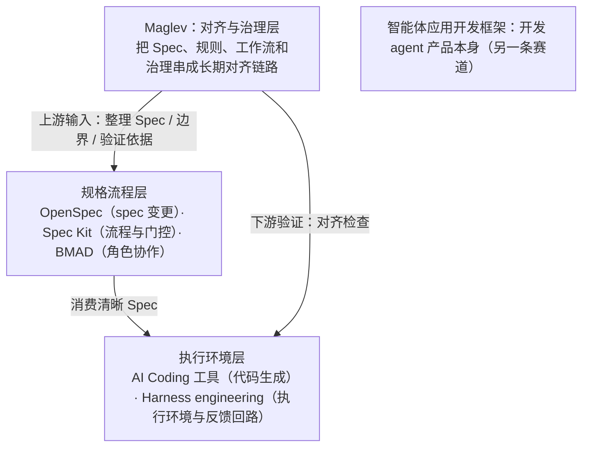
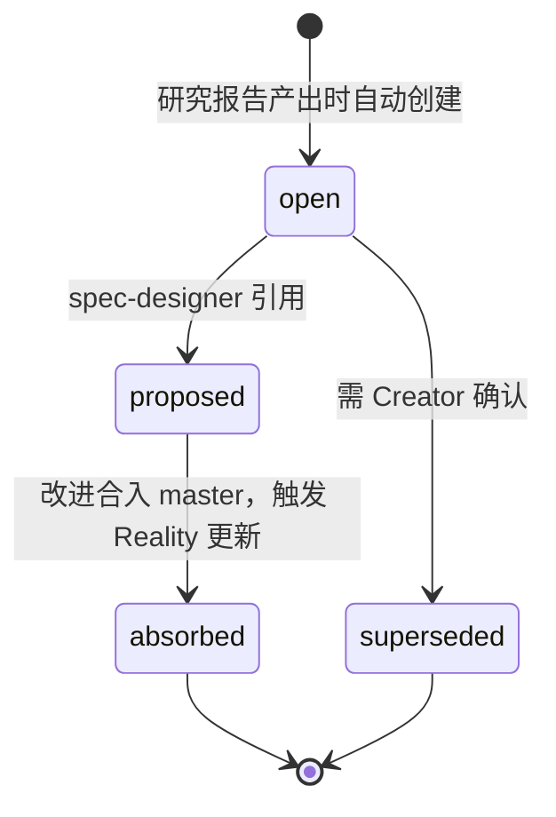

# 比较方法与替代方案

比较页用于帮助读者判断“是否适合采用”，不是给所有工具排一个脱离场景的名次。每个结论都必须回答四个问题：比较的是哪一层、依据来自哪里、适用前提是什么、哪些内容不能外推。

> 面向正在评估 Maglev 的技术负责人与架构师：读完本页，你会得到 Maglev 与 AI Coding 工具、规格驱动框架、角色协作框架、Agent 执行环境各自解决哪一段问题，哪些比较是合理的，以及 Maglev 自身的适用边界。

## 先分清问题层级

很多对比之所以错位，是因为这些概念看起来都和 AI、代码、流程、协作有关，但解决的问题层级并不一样：有的解决"写代码更快"，有的解决"规格驱动开发怎么落地"，有的解决"agent 怎么稳定执行"。

Maglev 更适合被理解成**面向 AI Coding 时代的软件研发对齐系统**。它关心的是：

- 需求、设计、代码和验证怎样持续对齐
- AI 使用怎样从个人习惯变成团队能力
- 老项目和存量系统怎样被更稳定地接手和演进

重点不在单点生成能力，而在持续对齐和组织治理。

## 各自的战场

| 概念 | 主要解决什么 | 与 Maglev 的关系 |
|------|-------------|-----------------|
| AI Coding 工具 | 写代码更快 | Maglev 关心的是团队交付更稳 |
| OpenSpec | 轻量级 spec 驱动与变更管理 | 更聚焦变更与 spec 流程，Maglev 范围更大 |
| Spec Kit | 规格驱动的标准流程与门控 | 和 Maglev 有交集，但更偏规格流程本身 |
| BMAD | 多角色 AI 团队式协作 | 更像角色驱动框架，Maglev 更偏统一对齐协议 |
| Harness engineering | agent 执行环境与反馈回路 | 有交集，但 Maglev 更偏治理与协作协议 |
| 智能体应用开发框架 | 开发 agent 产品本身 | 不是 Maglev 的直接问题域 |

把这些位置放到同一条交付链路上看：

这不是能力高低的排序，而是问题域的分层：Maglev 不与生成层竞争，也不试图取代规格流程框架，它补的是这些层之间"持续不漂"的空档。

## 在 spec 驱动工具谱系中的位置

只看 spec 驱动相关工具，粗略的分工是：OpenSpec 更像轻量级 spec 变更框架，Spec Kit 更像规格流程与门控框架，BMAD 更像角色驱动的 AI 团队协作框架，Maglev 则把 Spec、规则、工作流和治理串成一条长期对齐链路。它不是"另一个 spec 工具名词"，而是回答一个更长的问题：当团队开始依赖 AI Coding 之后，规格、执行、验证和协作如何持续不漂。

一个容易被忽略的判断：**Maglev 对代码层不是完全中立的。**它不替代代码生成工具，但会更偏好那些愿意直接消费 Spec、规则和完成标准的执行工具。原因不是绑定某类产品，而是它的核心价值本来就在于把模糊输入整理成更清晰的 Spec——spec / SDD 驱动的执行工具更容易把这份上游成果直接传到执行层。

## 已跟踪竞品全景

上面的边界是概念层的。除此之外，Maglev 还用一份持续观测注册表（competitive-registry.yaml，唯一状态源）跟踪具体竞品对象，把"跟谁比、比什么、为什么盯着它"落成可核对的记录：

| 对象 | 跟踪的差异点 | 为什么盯着它 |
|------|-------------|-------------|
| Superpowers | 同层 AI 编码纪律框架 + TDD/Subagent | 同层框架，TDD/Subagent/Visual Companion 对 Maglev 有直接参考 |
| BMAD Method | 角色驱动的 AI 敏捷模拟，v6 重构为模块化 Lean Core + 42 IDE 支持 | Spec Kernel 设计值得参考 |
| OpenSpec | 轻量级 spec 框架，OPSX 流动工作流 | 反 phase-gate 哲学对 Maglev 有挑战价值 |
| GitHub Spec Kit | GitHub 官方 SDD 工具包 + Extension 生态（登记时点 90+ extensions、18+ presets） | 该领域最大规模开源项目，Integration 多平台架构与 Extension 生态有战略参考价值 |
| 快手 CodeFlicker | 万人级 AI 研发工厂 + KAT 代码大模型 | "个人 AI 效率≠组织效率"的万人规模验证，直接支持 Maglev 的协议层价值主张 |
| Kiro（AWS） | IDE 锁定的 spec-driven AI 开发 | AWS 出品、锁定自有 IDE + Claude 模型，值得追踪 |
| gstack | 角色驱动 AI 工程全链路（Plan→Build→QA→Ship→Deploy→Monitor）+ 持久化浏览器 QA | 在 combo stack 中承担"组织/角色"层，与 Maglev 的 entry-router + discipline 高度重叠 |
| wanman | 本地多 Agent 矩阵运行时：Supervisor + 消息总线 + worktree 隔离 | 多 Agent 编排基础设施，对远期并行执行有参考 |

注册表还跟踪 Hermes Agent、Windows MCP 等对象，以及不绑定单一竞品的跨产品元洞察（如 combo stack 趋势）。

## 观测机制：insight 怎么流动

每轮观测按 6 Phase 循环执行：Phase 0 先读定位锚点，之后依次走 Scope → Insight Review → Deep Research → Discovery → Output & Archive → Self-Check。研究报告归档到 `docs/thinking/10_critique/`，同时把发现的改进点登记为 insight。insight 的生命周期是一个带确认门的状态机（机制见演进循环机制）：

每条 insight 除状态外还带需求预测四字段：`demand_driver`（什么痛点驱动竞品能力）、`demand_signal`（受众规模与紧迫度）、`maglev_applicability`（Maglev 用户是否有同样痛点）、`response_strategy`（absorb / differentiate / watch）。设计意图是"深度洞察 = 需求预测，不是看到好的就抄"。

## 诚实边界：养分回流还没有执行实例

按当前事实层已知缺口的口径，这套观测机制要诚实读：

- 注册表现有 25 条 insight **全部处于 `open` 状态**——`proposed → absorbed` 的后半段生命周期没有任何执行实例，因此"观测养分已回流到 Maglev"这一宣称被阻断，不能成立。
- 上表的版本号等字段是**登记时的快照**，不代表竞品的当前版本；观测由人主动触发、无自动调度，`last_researched` 最新记录为 2026-06-01（wanman），Kiro 登记后尚未深研。

评估时可以把注册表当作"Maglev 如何看竞品"的透明账本来读，而不是当成竞品情报的最新快照。

## 什么比较是合理的

合理的比较：

- Maglev 和 AI Coding 工具的关系（上游输入与下游验证 vs 生成执行）
- Maglev 和 OpenSpec / Spec Kit / BMAD 的差异（对齐系统 vs 规格流程、角色协作框架）
- Maglev 和 Harness engineering 在组织内 AI Coding 场景下的边界
- Maglev 和研发方法论的差异

不合理的比较：

- 拿 Maglev 去对标通用 agent runtime
- 要求它直接承担智能体应用开发框架的职责
- 把它当成更换全部工具链的万能平台

落地评估时，比"谁更强"更有用的问题是：它们分别解决哪一段问题？哪些适合放在生成层，哪些适合放在治理层？哪些更适合单人提效，哪些更适合团队协作？

## 适用边界：工程而非业务域

Maglev 的适用边界不在"B 端 vs C 端"，而在"工程 vs 艺术"：

- **工程（有序）**：追求确定性、可维护性、可扩展性——Maglev 的问题域
- **艺术（无序）**：追求创意、瞬间爆发、不可复制性——更适合对话式模式

从领域特征看：逻辑严密、协议即 Spec 的基础设施与中间件，以及逻辑复杂、UI 标准的 B 端系统，适配度最高；软硬结合、状态机即 Spec 的嵌入式场景适配度较高；交互体验主导、视觉回归难以 Spec 化的 C 端场景存在挑战。判断标准可以压缩成一句：只要项目需要协作、需要维护、需要对抗熵增，对齐机制就有用武之地。

## 下一步

- 回看整体架构：[架构总览](../evaluator/architecture-overview.md)
- 看五阶段工作流如何落地这种对齐：[核心工作流](../evaluator/lifecycle-and-governance.md)
- 看扩展机制与集成边界：[扩展机制与集成](../evaluator/runtime-and-extensibility.md)
