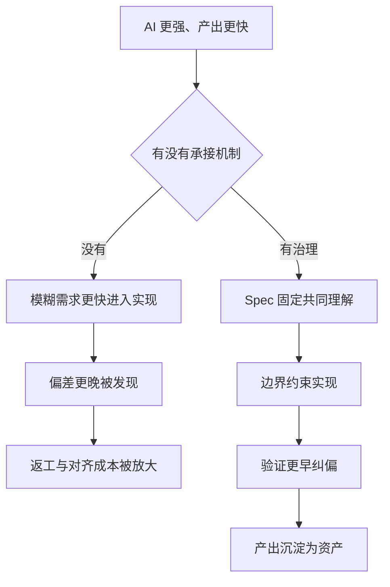
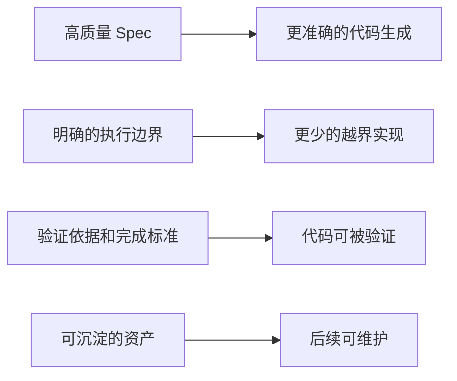

# Maglev 的价值与边界

Maglev 帮助团队在 AI Coding 时代稳定协作、持续交付并沉淀资产。它处理的核心问题不是“代码写得够不够快”，而是**意图、设计、代码和验证之间是否持续对齐**。

> 如果你的团队用上了 AI 编码工具，速度确实变快了，但返工、口径不一和验收扯皮并没有消失——本文解释为什么，以及 Maglev 在其中的位置。

## 一个常见现实

- 需求变更越来越快
- AI 可以很快产出代码
- 但文档、设计、实现和验收标准还是经常不同步
- 结果不是"更稳"，而是"更快地返工"

AI 提升了执行速度，但没有自动解决研发对齐问题。很多团队的真实体验不是"更顺"，而是"更快地把问题做大"（来源：问题陈述）。

## 问题出在哪

真正的问题不是"模型还不够强"，而是**意图、设计、代码和验证之间的漂移**仍然存在，甚至会被 AI 放大（出处：Maglev 定位）：

漂移的典型症状：需求描述不稳定、技术设计缺少统一表达、文档更新依赖个人自觉、老项目缺少可依赖的真理源（来源：问题陈述）。

## Maglev 的回答

Maglev 要解决的，不是让 AI 多写一点代码，而是**让团队在 AI Coding 时代仍然能够稳定协作、沉淀资产并持续交付**。它的切入点是两个：

1. **上游输入层**——把"想要什么"收敛成高质量、边界清晰的 Spec，让编码工具有可靠的输入
2. **下游验证层**——用需求、方案、代码、测试之间的交叉验证兜住产出质量（出处：Maglev 定位）

一句话：Maglev 不是让 AI 多写一点代码的工具，而是让"写出来的东西"能持续对齐意图、边界和验证。

## 与你有关的三种角色

| 如果你是 | 你会在意 |
|---------|---------|
| 业务/产品负责人 | 需求到交付的口径不再走样，验收有据可依 |
| 技术负责人 | 设计有统一表达，AI 产出可被系统性验证 |
| 开发者 | 接入和日常操作边界清楚，知道如何执行、验证和恢复 |

## 下一步

- 想看这些信号对应哪些团队处境？读 [Maglev 的价值场景](adoption-paths.md)
- 想理解治理机制为什么是解法？读 [为什么 AI 编码越强，越需要治理机制](value-and-boundaries.md)
- 想算清引入的收益与风险？读[如何评估引入 Maglev 的收益](evidence-and-limitations.md)
- 想知道开发者视角的直接收益？读 [Maglev 对开发者的三个直接收益](../developer/verification-and-knowledge.md)

---

> 面向已经在团队层面使用 AI 编码的技术与业务负责人：读完这一页，你会得到一个判断框架——速度红利什么时候会变成失控风险、治理机制具体在承接什么、以及写代码这件事到底由谁来完成。

## AI 提升的是执行速度，不是协作稳定性

AI Coding 最直接提升的是执行效率：更快生成代码、更快给出方案、更快推进修改。但团队真正需要的不只是快，而是稳。

一个常见误解是：AI 越强，流程应该越轻，治理应该越少。这个判断对个人使用场景有时成立——个人写一个小工具，速度提升本身就可能足够有价值。但一旦进入多人协作、持续演进、老项目维护和跨角色交付，问题就不再只是"写代码快不快"，而是：

- 大家是不是在理解同一个需求
- 设计有没有被正确继承
- 代码有没有偏离原始意图
- 验证标准是不是一致

这里说的"稳"包括：需求和实现不越来越偏，文档和代码不越来越脱节，团队成员不各自形成不同工作方式，AI 产出不变成难以复用的一次性结果。这些问题如果本来就存在，AI 越强，出错的速度也越快（来源：为什么 AI Coding 越强，越需要治理）。

## 没有治理时，速度红利会怎么失控

很多团队把下面这些现象当成正常摩擦，其实是对齐机制已经失效：

| 常见现象 | 表面看起来 | 实际问题 |
|---------|-----------|---------|
| 代码生成更快了 | 交付会自然更顺 | 速度提升不等于协作稳定 |
| 每个人都在用 AI | 组织能力已经升级 | 个人提效不等于团队一致 |
| 文档越来越跟不上 | 只是正常摩擦 | 真正问题是对齐机制失效 |
| 老项目更难交给 AI | 模型上下文不足 | 缺少稳定的真理源 |

AI 放大的是执行能力，治理决定这种能力是被用来放大产出，还是放大混乱。

## 治理不是额外负担，而是三件具体的事

治理最容易被误解成更多流程、更多审查、更多限制。但在 AI Coding 场景里，它真正的作用是：

1. **固定共同理解**——让团队和 AI 不至于各自按自己的理解往前跑
2. **限制错误扩散**——让模糊需求、设计遗漏和实现偏差尽早被发现，而不是在返工时才暴露
3. **沉淀可复用资产**——让 AI 产出不只是“这次写出来了”，而是以后还能接、还能改、还能继续演进

这三点是定位与治理资料提出的目标方向，不是对所有项目的运行结果承诺。

落到 Maglev 上，这三件事被落成四类具体机制：

| 问题 | 没有 Maglev 时 | Maglev 提供什么 |
|------|---------------|----------------|
| 输入模糊 | AI 直接消费模糊需求 | 用 Spec 固定更清晰的输入 |
| 边界松散 | 每个人按自己的理解执行 | 用规则和工作流固定边界 |
| 偏差发现过晚 | 错了以后才返工 | 用验证机制更早纠偏 |
| 产出不可复用 | 每次都像重来一次 | 把结果沉淀成可继续使用的资产 |

这些方向对应当前已登记的动作：现状同步对齐任务、风险和上下文；方案设计或代码逆向把输入提升成执行依据；上下文实施推进受控变更；Spec 审计、代码审查和综合验证检查偏差。具体效果仍需在项目现场验证。

## 那代码到底由谁来写

Maglev 不直接写代码。代码部分仍然可以由现有 AI Coding 工具、现有工程师工作流或团队已经熟悉的执行方式完成；Maglev 要解决的不是替代这一层，而是让这一层不再在混乱中运行。现实里通常有三种承接方式：

| 承接方式 | 谁负责写代码 | Maglev 在哪里发挥作用 |
|---------|-------------|----------------------|
| 团队现有工程师 | 人主写，AI 辅助 | 固定意图、边界和验证机制 |
| 现有 AI Coding 工具 | AI 主写，人审核 | 让工具输出有更稳定的输入和验收标准 |
| 受控 agent 工作流 | AI 执行更长链路任务 | 提供协作协议、规则和纠偏闭环 |

如果团队要选择下游执行工具，应优先检查它是否能消费 Spec、遵循明确边界并返回测试与审查证据；这是一条评估标准，不是对某一类工具的兼容性承诺。

团队不需要因为采用 Maglev 就放弃已有 AI 编码工具；具体组合方式应根据数据边界、工具契约和项目验证结果决定。

## 下一步

- 想理解问题与治理关系？继续阅读 [比较方法与替代方案](comparisons.md) 或 [证据口径与风险限制](evidence-and-limitations.md)。
- 想动手验证治理机制？从[安装 maglev-cli](../developer/first-success.md) 开始

---

> 本页是 Maglev 定位与能力边界的事实参考页，内容绑定权威定位文件 `specs/10_reality/positioning.md`，口径以该文件为准。

## 核心定位

Maglev 是一套帮助团队在 AI Coding 时代**稳定协作、持续交付并沉淀资产**的方法论、协议和可执行能力集合。核心关注的问题是：意图、设计、代码和验证之间的漂移（出处：Maglev 定位）。

## 三层结构

| 层 | 位置 | 回答的问题 |
|----|------|-----------|
| 方法论 | `docs/thinking/` | 为什么这样做 |
| 当前规则 | `.agents/skills/`、`.agents/workflows/`、`specs/10_reality/` | 当前执行边界、兼容入口和事实 |
| 技能 | `.agents/skills/` | 能做什么 |

## 与编码工具的关系

Maglev 是编码工具的**上游输入层**和**下游验证层**，不是竞品（出处：Maglev 定位）：

## 核心能力域

| 域 | 核心价值 | 外部工具不做/做不好的 |
|----|----------|---------------------|
| 需求收敛 | 对抗式质问逼出高质量需求 | 其他工具是声明式的（用户自己写 spec） |
| Spec 质量 | 结构化方案 + 质量规则 | 其他工具无 spec 质量审计 |
| 追踪对齐 | requirements↔spec↔code↔tests | 没有其他框架做四层交叉验证 |
| 治理纪律 | 8 类惰性模式 + **五级压力分级（L0-L4）**（出处：[maglev-discipline 治理纪律](../../../.agents/skills/maglev-discipline/SKILL.md)） | 其他工具纪律是“建议”，Maglev 是“可检测可升级的系统” |
| 知识分层 | 5 层 thinking/ + 3 层 specs/ + 结晶 | 其他工具是扁平存储 |
| Spec 生命周期 | 创建→使用→结晶→归档 | 没有其他框架管理 spec 的完整生命周期 |

## 刻意边界（不做什么）

| 不做的事 | 原因 |
|---------|------|
| 替代代码生成层 | 已有成熟的外部编码工具 |
| 追求编码层的"更强" | 那是编码工具的战场 |
| 运维/部署/监控 | 不是 Maglev 的定位 |
| 做平台/IDE | Maglev 是协议层，不锁定任何平台 |

## 判断外部信号的锚定规则

分析竞品或市场趋势时的四条规则：先问"是不是我们的战场"；同层则问"是否解决了我们没解决的上游/下游需求"；借鉴前问"痛点是否也被 Maglev 用户遇到"；编码层创新是环境约束变化而非追赶对象（出处：Maglev 定位）。

## 下一步

- 看这套定位挂在什么架构上：[Maglev 架构总览](../evaluator/architecture-overview.md)
- 看五阶段交付闭环如何运转：[核心工作流：五阶段闭环](../evaluator/lifecycle-and-governance.md)
- 看与相邻方法论的分界：[与相邻概念的边界](comparisons.md)
- 看主链路技能与治理登记的权威清单：[能力登记册](../evaluator/capability-landscape.md)
