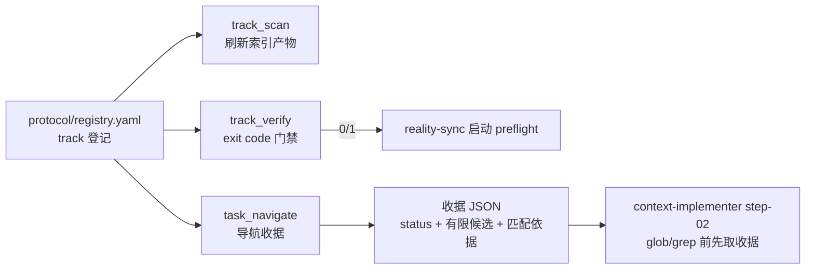
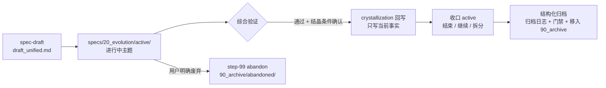

# 导航、上下文与规格分层

当仓库包含技能、规格、指南、代码和测试时，最快的路径不是通读，而是先找到权威入口，再按问题进入对应能力域。索引降低定位成本；上下文入口限定 Agent 可见范围；规格分层决定知识的时间和事实边界。

> 本页覆盖 Maglev 帮助人与 agent 在多产物仓库中定位权威文件的两组机制：机器索引引擎（三类索引产物、任务导航收据、新鲜度门禁）与唯一人读项目地图 `docs/ATLAS.md` 的确定性生成与漂移校验。数据时点为 2026-09-03 仓库现状。

## 评估者先读：接入三问

| 问题 | 回答 |
|------|------|
| 接在哪一层 | 定位基础设施层：会话启动（reality-sync preflight）与受控阶段（实施/设计前的上下文收集）消费它的产物与收据，不接管任何执行环节（见 specs/10_reality/machine-index-engine/capability/overview.md §1） |
| 与现有体系冲突吗 | 不接管你已经拥有的工具：代码依赖分析走独立 `radar` skill，活跃需求看板归 collaboration-lifecycle 域，本能力只做索引与导航（见 specs/10_reality/machine-index-engine/capability/overview.md §3） |
| 要不要一次铺满 | 不需要。新模块在 `registry.yaml` 新增 track 即纳入后续 scan/verify，按需渐进接入（见 specs/10_reality/machine-index-engine/capability/overview.md §2） |

## 问题：多产物仓库里"找文件"为什么不可信

在 Maglev 仓库里，技能、specs、docs、代码、测试都是一等产物。靠会话记忆或逐目录翻找定位权威文件，成本高且无法证明"这次定位是对的"；全域搜索则把噪音当上下文。机器索引引擎回答一个稳定问题：**如何用最低成本定位权威文件，并证明这次定位是可信的。**

抓手由三部分构成（见 specs/10_reality/machine-index-engine/capability/overview.md §1）：



## 三类索引产物

索引由登记驱动：track 在 `.agents/skills/index-librarian/protocol/registry.yaml` 的 `tracks:` 段登记后，`track_scan.py --track-id <id>|--all` 按类型分派扫描。三类产物各有分工：

| 产物 | 形态 | 回答的问题 |
|------|------|------------|
| 目录树 `INDEX.md` 网络 | 各目录级 Markdown 知识记录 | 这个目录里有哪些权威文件、各讲什么 |
| 仓库入口锚点 | YAML（repo-entry 锚点；code-tree 需显式启用） | 仓库级入口文件在哪 |
| summary YAML | 目录级摘要数据 | 机器可消费的目录摘要 |

人读与机器读采用两层密度：`knowledge_records` 面向机器（有限 topic），人读知识导航表只展示前 4 个 topic 并以 `(+N)` 折叠——索引不承担正文摘抄。（见 specs/10_reality/machine-index-engine/capability/overview.md §1、§3）

## 任务导航收据：task_navigate

**问题**：agent 在受控阶段开始任务前，怎么拿到可解释的上下文入口，而不是全域搜索或凭记忆猜路径？

**抓手**：`task_navigate.py --intent <文本>` 产出导航收据 JSON（`--receipt-out` 可落盘，`--validate-receipt` 可复验已有收据）。收据字段集：`schema_version` / `status` / `task_fingerprint` / `query` / `sources` / `candidates` / `missing_categories` / `events` / `created_at`（升级态含 `escalation`）。

收据 status 五态（见 specs/10_reality/machine-index-engine/interfaces/cli.md §4）：

| status | 含义 | 产生条件 |
|--------|------|----------|
| `not_needed` | 调用方已声明足够来源，无需导航补充 | 提供了 `--known-source` 且未提供 `--missing-question` |
| `queried` | 查到相关权威记录，返回有限、可解释候选 | 打分后有候选，取 `top_k`（默认 5） |
| `insufficient` | 无相关权威来源，需升级 | 打分后无候选 |
| `escalated` | 在 `insufficient` 基础上进入受控补救动作 | 提供 `--escalation-step` 且未加 `--exhausted` |
| `exhausted` | 补救动作已标记穷尽 | `--escalation-step` + `--exhausted` |

每个候选带 `score` / `adjusted_score` / `reasons` / `confidence` 字段——匹配依据可解释，而非黑盒排序。

**门禁语义**：`status ∈ {insufficient, exhausted}` 时进程 exit 1，否则 exit 0。消费方按状态分流：`queried` 围绕候选定位文件；`not_needed` 说明理由后继续；`insufficient`/`escalated`/`exhausted` 不得静默跳过或恢复全域搜索，须走消费方侧升级纪律。例如上下文实施第二步（`step-02`）在 glob/grep 之前先取收据。（见 specs/10_reality/machine-index-engine/interfaces/cli.md §3、§4）

## 新鲜度门禁：track_verify

**问题**：索引产物会随仓库结构变化而腐烂，会话怎么在起点机器判定"索引是否还可信"？

**抓手**：`track_verify.py --track-id <id>|--all` 逐 track 校验索引与登记的一致性，逐 track 打印 `ok` 或失败原因（最多打印 15 条），进程 exit code 暴露门禁结论：**0 = 全部通过，1 = 任一 track 报告失败**。`reality-sync` 启动 preflight 将其作为会话起点的漂移哨兵；repo-entry pattern 未命中为 informational，不算失败。（见 specs/10_reality/machine-index-engine/capability/overview.md §2 与 specs/10_reality/machine-index-engine/interfaces/cli.md §3）

## ATLAS：唯一人读项目地图

**问题**：新加入的贡献者要一个权威的项目入口——不是又一份会过时的手工文档。

**抓手**：`maglev-map-maker` 的 `generate_atlas.py` 把治理事实与 Git 结构**确定性合成**为唯一的 `docs/ATLAS.md`（须在 Git 仓库内运行，每次生成整文件覆写）。

### 四项治理输入 + Git tracked tree

| 输入 | 位置 | 角色 |
|------|------|------|
| Reality Profile | `specs/10_reality/00_profile.yaml` | 内容解析（能力域） |
| 仓库清单 | `repository-map/repositories.md`（若存在） | 内容解析（仓库范围）；决定 High 置信度的可达性 |
| 项目看板 | `specs/20_evolution/board.md` | 内容解析（活跃需求） |
| 横切 overview | `repository-map/overview.md`（若存在） | 参与来源指纹 |
| Git tracked tree | `git ls-files`（可见性过滤） | 结构派生：≤2 层目录与 10 类根锚点文件 |

缺席的治理源文件跳过读取、不阻断生成，仅影响指纹与置信度。（见 specs/10_reality/project-map/implementation/architecture.md §1、§2）

### 漂移校验：--check 不写盘

ATLAS frontmatter 携带 `source_digest` 指纹，指纹 = **tracked path 集 + 治理源内容 sha256**。`--check` 将其与现算指纹比对并输出一致/漂移报告，**不写盘**，exit 0/1。（见 specs/10_reality/project-map/capability/overview.md §1、§2）

### 置信度分级：输入缺失就降级，不猜测

| 置信度 | 含义 |
|--------|------|
| High | 仓库清单、Reality Profile、看板等关键输入可用 |
| Medium / Low | 部分输入缺席，按输入可用性降级标注 |

输入缺失时降置信度（High/Medium/Low）而非猜测补齐；结构化生成证据 `.maglev/temp/atlas-snapshot.json` 是 gitignored 运行时产物，不作证据绑定。（见 specs/10_reality/project-map/implementation/architecture.md §1）

## 索引引擎与 ATLAS 的分工

| 维度 | 机器索引引擎（index-librarian） | ATLAS（maglev-map-maker） |
|------|--------------------------------|---------------------------|
| 读者 | 机器为主（技能流程、收据消费方） | 人（新贡献者、维护者） |
| 产物 | INDEX.md 网络、锚点/summary YAML、导航收据 | 单一 `docs/ATLAS.md` |
| 写盘 | `track_scan` 写回/刷新索引 | 始终是显式动作：初始化与日常 reality-sync 不自动写地图 |

（见 specs/10_reality/machine-index-engine/capability/overview.md §3 与 specs/10_reality/project-map/capability/overview.md §3）

## 刻意边界：不做什么

| 不做的事 | 依据 |
|----------|------|
| 让导航收据证明任务成功 | 候选 `confidence` 限定为 `navigation_confidence`，只表示导航候选与意图的匹配强度，不作业务证据消费（见 specs/10_reality/machine-index-engine/interfaces/cli.md §4） |
| 静默跳过 `insufficient`/`exhausted` 收据 | 消费方须走升级纪律，不得恢复全域搜索（见 specs/10_reality/machine-index-engine/interfaces/cli.md §4） |
| 把索引产物当作业务事实 | 三类产物不自动等同于业务事实，例如 `repo-entry.yaml` 是机器导航产物（见 specs/10_reality/machine-index-engine/capability/overview.md §3） |
| 做代码依赖分析或看板扫描 | impact/cycles/unused/hotspot 走独立 `radar`；活跃需求扫描归 collaboration-lifecycle 域（见 specs/10_reality/machine-index-engine/capability/overview.md §3） |
| 自动写 ATLAS 或猜测补齐输入 | 写盘始终是显式动作；输入缺失降置信度而非猜测（见 specs/10_reality/project-map/capability/overview.md §3） |
| 承诺门禁被调用的频率 | `track_verify` 被哪些启动哨兵以何种频率调用、verify 失败后的真实处置无运行遥测，属登记为 unknown 的缺口（见 specs/10_reality/machine-index-engine/capability/overview.md §3） |

## 来源

- specs/10_reality/machine-index-engine/capability/overview.md —— 索引能力定位、三类产物与边界
- specs/10_reality/machine-index-engine/interfaces/cli.md —— 三个脚本命令契约与导航收据 status 语义
- specs/10_reality/project-map/capability/overview.md —— ATLAS 生成、指纹校验与置信度分级
- specs/10_reality/project-map/implementation/architecture.md —— 生成链路、治理输入与构件锚点

## 下一步

- 看本页机制在主链路中何时被消费：[核心工作流](../evaluator/lifecycle-and-governance.md)
- 看索引背后的能力登记体系：[能力登记册](../evaluator/capability-landscape.md)
- 看整体架构中的位置：[架构总览](../evaluator/architecture-overview.md)
- 查看当前仓库的人读地图实例：docs/ATLAS.md

---

本页条目化回答五类查证问题：specs 四层各自放什么、思考如何沉淀与归类（knowledge-check 与 9 段记忆宫殿）、写对外内容前如何同步口径（Wiki authoring）、对外 wiki 投影层如何配置与生成。口径与 specs/10_reality 各能力域页一致，数据时点以 `last_updated: 2026-09-03` 的仓库事实为准。

## specs 四层：每层回答一个问题

specs 按四层组织知识，分层标准见 规格知识分层能力与 specs/README.md：

| 层 | 位置 | 回答的问题 | 生命周期 | 索引形态 |
| --- | --- | --- | --- | --- |
| 愿景 | `specs/00_vision.md` | 我们在构建什么（Iron Triangle / Anti-Entropy） | 稳定，低频修订 | 根 entity-index 的文件级记录 |
| 现状 | `specs/10_reality/` | 现在是什么（当前事实层） | 随结晶回写演进 | 域 INDEX 网络 + 域 README |
| 演进 | `specs/20_evolution/` | 正在发生什么变化（进行中主题） | 主题完成即收口 | entity-index（collection）+ active/ 目录索引 |
| 归档 | `specs/90_archive/` | 历史如何走到今天 | 只读 | entity-index（collection） |

层间流转与归档纪律（工作流事实见规格知识分层工作流）：



- **结晶回写只写当前事实**：变化经[结晶（crystallization）](../../../.agents/skills/crystallization/SKILL.md)确认后，写回 `10_reality` 时直接写"当前事实"，而不是写"去哪里看历史"；如需保留历史依据，只能在索引或思考入口承认其存在，不得把 Archive 当成 Reality 的解释依赖。
- **归档反模式（禁止）**：把 `20_evolution/active/` 内容直接搬到 `90_archive/`；或在未把结论写入 `10_reality` 的情况下执行归档。正确流程是三步：提取结论写入 `10_reality` → 收口 active → 结构化归档（填写归档日志、通过门禁、移入 `90_archive`）。本仓库 AGENTS.md 的 Git 工作流纪律同样禁止该直接搬运。

## knowledge-check：思考不随会话消失

[knowledge-check](../../../.agents/skills/knowledge-check/SKILL.md) 是知识沉淀检查器，也是 9 段位段归类的 canonical 检查入口。能力事实见 知识沉淀能力。

| 条目 | 内容 |
| --- | --- |
| 触发时机 | 一段高价值探索结束后；会话准备切换前；任务收尾前；怀疑当前有价值思考可能流失时 |
| 核对对象 | 思考、方案、参考资料和贡献记录是否已落盘 `docs/thinking/` |
| 交付物 | 当前知识资产清单、记录完整性判断、生命周期边界判断、缺口与最小补齐动作 |
| 判定纪律 | 只判断"是否已沉淀"，不代写内容；只把 blocker 级缺口单独升级；一旦问题属于 Reality 回写或 active 收口，立即切边界转交 |

与 crystallization 的边界：knowledge-check 问"**你保存了吗**"（检查知识资产是否已记录，适用于会话切换和探索结束）；crystallization 是"**发布到生产**"（把已验证成果写回 reality 并收口 active，适用于功能完成后）。两者都需要时，先 knowledge-check 再 crystallization。knowledge-check 明确不负责：需求归档、reality writeback、active 状态收口——这些属 crystallization 或其他后段对象。

## 9 段记忆宫殿：docs/thinking 位段归类

`docs/thinking/` 按 9 个位段组织，物理载体是目录结构与 docs/thinking/INDEX.md（9/9 位段有 indexed 知识记录）；**位段语义本体由 [segments-canonical.yaml](../../../.agents/skills/knowledge-check/references/segments-canonical.yaml)（机器读）与 [segments-canonical.md](../../../.agents/skills/knowledge-check/references/segments-canonical.md)（人读）持有**，任何项目实例的 `segments` 字段以 canonical 为内容来源，并在文件头标注 `segments_source` 指向该文件。

| 位段 | 房间名 | 一句话用途 |
| --- | --- | --- |
| 00_meta | 元厅 | 模块元信息、入口与导航 |
| 10_critique | 批判间 | 反思、对抗与质疑性分析 |
| 20_architecture | 架构间 | 系统结构、分层与边界设计 |
| 30_philosophy | 哲学殿 | 范式根基、第一性原理与方程式表达 |
| 40_paper | 论文阁 | 学术对位、方法借鉴与理论引用 |
| 50_alignment | 对标厅 | 跨范式对比、生态对位与差异化定位 |
| 60_case | 案例馆 | 落地实例、试点与具体场景产出 |
| 70_retrospective | 复盘室 | 迭代闭环、决策回顾与经验提炼 |
| 90_archive | 归档库 | 已被结晶/上位重写/退役的历史文档 |

canonical 数据的字段约束：`id`（`\d{2}_[a-z_]+`）、`room_name`（中文房间隐喻）、`description`、`status`（`active` / `draft` / `archived`）、`scope_in` 与 `scope_out`（互斥定义，判断"某条思考归到哪个位段"时直接消费）、`examples`。schema 格式由 index-librarian 规约，位段语义由 knowledge-check 持有，两者互不依赖。

## Wiki authoring 起点简报

Wiki authoring 在写作或改稿前读取当前 Reality、正式指南和任务边界，形成简短起点简报，再进入 Plan/Challenge/Approval 约束下的正文写作。该过程不拥有事实，也不替代页面审查；能力边界见运营文档知识能力。

| 条目 | 内容 |
| --- | --- |
| 触发时机 | 写任何一篇新运营内容前；修改已有对外文章前；会话中感觉对 Maglev 的理解开始泛化、漂移或混入无关概念时 |
| 五类同步 | Definition Sync（Reality 定义）、Message Sync（统一口径）、Audience Sync（受众与禁用表达）、Style Sync（文风约束）、Boundary Guard（阻止历史资产覆盖 Reality） |
| 先行产物 | Wiki authoring Brief，至少含四要素：当前版本 Maglev 是什么 / 不是什么 / 本次写作的问题域 / 最需避免的跑偏方向 |
| 来源边界 | 先读 Reality canonical，再读 `docs/guides/` 正式指南和比较材料；`docs/wiki/` 只作为经过审批的用户解释投影 | `.maglev/wiki.yaml` source policy | Publishing 和历史材料不能覆盖当前事实 |
| 结构审批 | Producer Plan、Blind Challenge、Divergence 和人类 Approval 共同决定页面是否进入正文阶段 | `.maglev/wiki/` 状态束 | 机械检查通过不等于内容充分 |
| 正文责任 | Wiki authoring 负责按批准页面和 evidence bundle 写作；作者必须保留未知和边界 | `.agents/skills/maglev-wiki/` | 没有用户问答时整体保持 provisional |

## Wiki 投影层：项目推导与结构审批

`docs/wiki/` 是对外 Wiki 投影层。Agent 先读取项目输入，再提出结构；配置文件不预先固定维度或页面。

| 条目 | 内容 |
| --- | --- |
| 项目输入 | `.maglev/wiki.yaml` 只保存标题、语言、来源边界和可选受众提示 |
| Source Universe | `wiki_content.py build-universe` 登记可访问来源、摘要、排除项和可选 Provider，不决定页面 |
| 双轨推导 | Producer 推导 Plan；独立 Challenger 在看不到 Plan 和现有 Wiki 时重建问题、风险和深度信号 |
| 人类审核 | `.maglev/wiki/wiki-plan.md` 同时展示结构、遗漏、差异处置、替代方案和剩余风险 |
| 机器投影 | Plan、Challenge Receipt、Challenge 与 Divergence 供脚本校验和追溯，不代替人的判断 |
| 确定性生成 | [wiki_generate.py](../../../.agents/skills/maglev-wiki/scripts/wiki_generate.py) 只生成 `WIKI.md`、维度入口和 `FRAMEWORK.md`，不生成正文 |
| 开放世界审查 | 最终任务合并 Plan、Challenge、风险、变更和独立业务问答；无反证轨迹不得全量通过 |

常用命令：

```bash
WIKI=.agents/skills/maglev-wiki/scripts

# 构建来源全集，随后由独立 Agent 生成 Plan 与 Blind Challenge
./scripts/maglev-python "$WIKI/wiki_content.py" build-universe --root .

# 差异裁决后检查开放世界束并渲染唯一人审面
./scripts/maglev-python "$WIKI/wiki_content.py" validate-open-world --root .
./scripts/maglev-python "$WIKI/wiki_content.py" render-plan --root .

# 明确批准后验证计划并生成导航
./scripts/maglev-python "$WIKI/wiki_content.py" validate-plan --root . --require-approved
./scripts/maglev-python "$WIKI/wiki_generate.py" --root .
```

## 来源

- 规格知识分层能力与规格知识分层工作流：四层定义、层间流转、回写规则
- [crystallization SKILL](../../../.agents/skills/crystallization/SKILL.md)：生命周期边界与归档反模式
- 知识沉淀能力与 [knowledge-check SKILL](../../../.agents/skills/knowledge-check/SKILL.md)：沉淀检查职责、触发、边界
- [segments-canonical.yaml](../../../.agents/skills/knowledge-check/references/segments-canonical.yaml)：9 段位段语义本体
- 运营文档知识能力：写前同步与 wiki 投影层
- [Wiki 内容生产 Skill](../../../.agents/skills/maglev-wiki/SKILL.md)：项目结构推导、审批后写作、证据约束与读者任务审查
- .maglev/wiki.yaml、结构方案与 [Wiki 入口](../WIKI.md)：项目输入、结构审核和阅读入口

## 下一步

- 在日常流中执行沉淀检查：[日常工作流](session-workflow.md)
- 在协作流程中处理交接与 Agent 使用：[从请求到结晶的日常协作](session-workflow.md)。
- 从首次交付走查理解知识如何随交付沉淀：[首次交付走查](first-success.md)
- 老项目接入时如何重建分层知识：[存量项目接入](brownfield-adoption.md)
