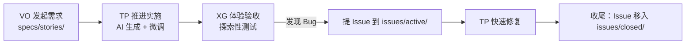
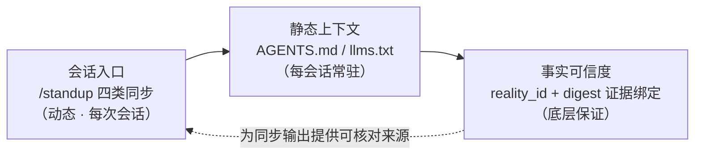
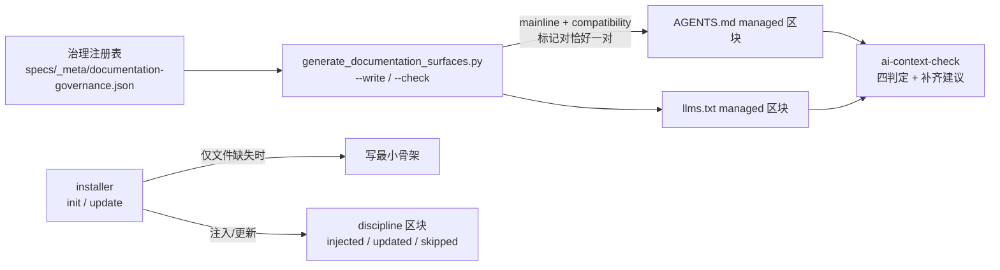

# 从请求到结晶的日常协作

日常请求不直接跳进代码。先判断当前阶段和事实起点，再按需要进入需求、方案、实施、验证和结晶。小任务可以采用更短路径，但不能省略理解边界和结果验证。

接入 Maglev 后，每个需求都走同一个循环：**发起需求 → 推进方案与实施 → 验证 → 收尾**。三个角色分工：VO（Value Owner）定义意图，TP（Tech Pilot）推进技术实施，XG（Experience Guardian）负责体验验收（角色职责与协作出处：协作手册）。本页以"用户登录"功能为例，把一个循环完整走一遍。



## 前置条件

- 项目已完成 Maglev 初始化，`src/`、`specs/`、`issues/`、`design/`、`tests/` 目录齐全（`ls -F` 可确认）
- VS Code / Cursor 并安装 AI 插件；熟练使用 `git pull`、`git commit`、`git push`
- 三角色对同一仓库都有 Write 权限（主干开发或短分支模型）

## 参考协作流程

### 1. 发起需求（VO）

在 `specs/stories/` 下新建 `login_feature.md`：

```markdown
# 用户登录功能
## 核心价值
用户可以通过手机号+验证码登录，以便保存个人数据。

## 验收标准 (Acceptance Criteria)
- [ ] 输入非法手机号应实时提示错误（红色文字）。
- [ ] 发送验证码后，按钮进入 60s 倒计时。
- [ ] 登录成功后跳转至首页。

## 参考设计
> 粘贴设计稿链接，或手绘草图截图
```

提交：`git add specs/stories/login_feature.md`，commit 信息用 `feat(spec): add login intent`。

#### 交给 TP 前，先过 Ready Gate

需求文件写完不等于收敛。交给 TP 推进方案前，VO 按 Ready Gate 做 6 条自检，全部满足才算收敛、才进方案设计（出处：项目术语表）：

- [ ] 当前核心对象明确——一句话说清"给谁、做什么"
- [ ] In Scope / Out of Scope 已能区分——例如"只做验证码登录，注册流程不在当前"
- [ ] 成功信号已可用于后续设计判断——验收标准每条都能独立核对
- [ ] 没有会直接改变设计方向的关键未知悬空——例如"要不要支持邮箱登录"还没定，就先定下来
- [ ] 已能判断唯一主去向——进方案设计，还是留在需求收敛里继续补
- [ ] 影响范围或设计方向的外部事实已区分来源：哪些是用户意图、哪些是直接观察、哪些是推断、哪些是历史、哪些被阻断；未决的仓库/Contract/权限冲突不得用高置信度默认值带过

核对动作：逐条对照清单，任何一条不满足就回到需求文件补齐后再提交，不带着模糊往下走。验收标准同时按全局唯一编号组织：功能需求用 `AC-F{N}-{M}`（N=功能序号，M=AC 序号），交互需求用 `AC-I{N}-{M}`；表达用 EARS 中文关键词（当…时 / 若…则 / 在…期间 / 应），例如 `AC-F1-1：当输入非法手机号时，页面应实时提示错误（红色文字）`。

### 2. 推进方案与实施（TP）

1. `git pull` 后阅读 `specs/stories/login_feature.md`
2. 打开 IDE Chat，引用 `@login_feature.md` 和项目的设计规范文件（如 design tokens），让 AI 按需求文档和设计规范生成 React 登录组件（使用 Tailwind CSS）
3. AI 产出 `src/components/Login.tsx` 后逐项核对 Spec；发现遗漏（如 60s 倒计时逻辑）就手动补全或追问 AI
4. 本地自测：编译通过、页面能跑
5. 提交：`git add .`，commit 信息用 `feat(dev): implement login basic logic`

### 3. 验证（XG）

1. `git pull` 后运行项目（如 `npm run dev`），做探索性测试：输入 `"123"` 检查非法手机号提示
2. 发现问题（如提示文字是黑色而非设计要求的红色）就提 Bug：在 `issues/active/` 下新建 `20260118-fix-LoginStyle.md`，写清三段——Reproduction Steps、Expected Behavior（红色文字 #FF0000）、Actual Behavior（黑色文字）
3. 提交：`git add issues/`，commit 信息用 `test(bug): report login style issue`

### 4. 收尾（TP）

1. 把 Bug 文件直接喂给 AI 修复，验证无误后 commit，信息用 `fix(dev)`
2. 把 Issue 文件移动到 `issues/closed/`

### 查看项目进展（任意角色，随时）

想看"当前有哪些需求在跑、各自到哪个阶段、谁在主导"时，调用 `/board`：看板扫描 `specs/20_evolution/active/` 与 `issues/active/`，输出总看板 `specs/20_evolution/board.md` 和每个需求自己的 `status.md` 子看板；`/standup` 也会在会话启动时自动展示看板摘要。

看板只做观测、不驱动流程：它不推进需求、不做工时/绩效统计、不做 commit 级追踪。看到某需求停在某个阶段，仍由对应角色按本页循环去推进，而不是等看板动它（出处：协作生命周期能力概览）。

### 冲突与熔断规则

- Commit 信息必须语义化，便于 AI 理解历史：`feat(spec)` / `feat(dev)` / `test(bug)` / `fix(dev)`
- 冲突处理：文档类冲突（`specs/`、`issues/`）通常是追加内容，手动修一下即可；代码类冲突（`src/`）必须由 TP 解决，VO 和 XG 不要尝试
- AI 发疯（代码完全跑不通、逻辑胡编乱造）时熔断：停止 Prompting，不要试图"说服"AI；手动接管并回退到上一个稳定版本；分析原因（通常是 Context 太长或 Spec 描述矛盾）；VO 简化 Spec，或把大任务拆解成小任务（熔断步骤出处：协作手册）


## 入口速查

| 场景 | 该用哪个入口 |
| :--- | :--- |
| 还没接入 Maglev 的项目 | 只用 npm / npx 包安装；此时项目里没有 `.agents/` 等基础，AI 工作流不可用、不算正式入口 |
| 已初始化的项目 | AI workflow（如 `/standup`）做上下文同步与导航；安装器后续命令 `update`、`dry-run`、`force` 做更新 |
| 想看各需求所处阶段与角色状态 | `/board` 输出总看板与需求子看板；`/standup` 会话启动时自动展示摘要 |
| 验证发行物更新是否生效 | 优先直接调用统一执行核心，或通过 npm / npx 包验证，最容易隔离问题 |

各入口的定义与适用边界见Maglev 入口说明。

## 验证

一个循环跑完后应确认：

- `specs/stories/` 中有需求文件，代码在 `src/` 中实现并通过本地自测
- 验收提出的 Bug 文件已从 `issues/active/` 移到 `issues/closed/`
- 全部 commit 信息符合语义化规范

循环卡住或报错时，看[故障排查与常见问题](update-and-recovery.md)。

## 下一步

- [教程：从安装到第一次完整交付](first-success.md)：还没接入的项目从安装开始走第一程
- 需要协作与 Agent 使用边界时，回看本页的流程、交接和验证段落。
- [存量项目接入](brownfield-adoption.md)：目标不是新项目而是老项目时看这里

---

> 面向正在评估 Maglev 的技术负责人与架构师：读完本页，你会理解人与 AI agent 的每次会话从哪里获得可信起点——动态的会话同步、静态的上下文入口、以及底层事实的可信度由什么保证。

每次会话开始，人和 agent 都面临同一个问题：不读全仓，凭什么知道"现在仓库是什么状态、有什么风险、下一步做什么"？仅靠记忆或过时的文件约定，AI 容易在会话起点误判主线、忽略结构性风险、给出错误的下一步建议——这是 [reality-sync 技能定义](../../../.agents/skills/reality-sync/SKILL.md)里登记的原始动机。

先回答评估时的三个直接问题：**接在哪一层**——会话入口与上下文注入层，位于你自选的编码工具之外，Maglev 不碰代码生成层；**与现有体系冲突吗**——不冲突，同步是只读动作，上下文注入只在文件缺失时发生、已存在内容一律不动；**要不要一次铺满**——不需要，下面三层机制各自独立成立，可以只用其中任何一层。



## 会话入口：四类同步对齐"现在在哪"

第一层是动态同步。用户说 "Standup."（`/standup` 兼容入口）时，[reality-sync](../../../.agents/skills/reality-sync/SKILL.md) 按 **Reality / Risk / Action / Mode 四类同步**对齐仓库真实状态，输出固定为 `[Space]`（当前主线与位置）、`[Mind]`（最近已确认的事实与阶段）、`[Risk]`（当前重要风险）、`[Action]`（1-3 个最优先动作）、`[Mode]`（单个推荐模式：Analyze / Implement / Verify / Release）五节。这一设计让人类开发者在新会话快速建立对仓库状态的可操作认知，也让 AI agent 在不读全仓的前提下获得会话起点的事实底座（能力事实见 会话现状同步能力）。

同步不是凭印象作答。reality-sync 启动时先做运行时 preflight（`./scripts/maglev-python --doctor`），再验证 skills 索引（`track_verify`）；preflight 失败会显式暴露 `env_failed` 并给出修复动作，索引验证不通过则提示重建——而不是带着过期索引继续输出。索引健康检查只确认入口索引"可验证且新鲜"，任务级导航仍留给后续受控阶段消费收据。

## 静态上下文：AGENTS.md 与 llms.txt 双入口

第二层是每会话常驻的静态上下文。跨平台 agent 从 AGENTS.md 获得会话入口——红线纪律、目录速查、定位锚点、managed 主链路区块、Skill 优先级协议；AI 代理从 llms.txt 获得上下文地图——身份定义、快速开始指令表、兼容入口与导航系统。两个文件分工明确：一个约束"进仓库后怎么行为"，一个回答"这个仓库里有什么、从哪开始"（构成与分工见 Agent 上下文入口）。

这套上下文面的维护有一条完整的治理链，而不是靠人工自觉：



三个构件各管一段。**installer 只在缺失时注入骨架**：`ensure_ai_context_files` 对已存在的入口文件保持不动（用户内容优先），只补缺失文件的最小骨架；discipline 区块注入按 `injected` / `updated` / `skipped` 三态报告结果。**managed 区块由治理注册表统一渲染校验**：主链路、兼容入口等受管表面从注册表生成，渲染器要求每个 managed 标记对恰好一对，不符即报结构错误——手工编辑 managed 区块会在下次校验时被打回。**ai-context-check 四判定只判断不重写**：对两个入口文件做存在性（present/missing）、充分性（sufficient/insufficient）、漂移（aligned/drifted）、上游私有污染（clean/contaminated）四项判定，输出存在性、充分性、漂移风险与最小补齐建议四段，契约明确首轮不做自动 merge、重写或下发（检查契约见 [AI Context Check Contract](../../../.agents/skills/_internal/ai-context-check/contract.md)）。

## 事实可信度：证据绑定与四态

前两层给出"起点"，第三层回答"凭什么信"。Maglev 的当前事实层 specs/10_reality/ 为每页登记 `reality_id`，claim 从页面 frontmatter 由脚本机械枚举，再以 digest 绑定证据文件——证据逐字节可复核，而不是一句"参见某文档"。

每条事实的状态用四个词表达证据充分度，词表与语义由 术语表与 00_profile.yaml 持有：

| 状态词 | 含义 | 证据充分度 | 它不表示 |
| --- | --- | --- | --- |
| established | 有直接证据（digest 绑定）支撑的当前事实 | direct：证据文件逐字节可复核 | 不表示生产环境验证过、不表示运行时成立 |
| unknown | 查过、无法成立的点 | missing：写明缺什么 | 不是"没查过"，也不等于失败 |
| not_established | 有线索但证据不足 | partial：不得当 established 用 | 不是已成立事实，也不是被否决的结论 |
| not_applicable | 页面/契约对该模块不适用 | 须记录判断依据 | 不是"没有证据"的委婉说法 |

状态来自来源角色与证据，不来自叙述流畅度，也不表示运行时验证通过——这套口径的原始登记见 10_reality 读取限制。

## 边界澄清：三层各自"不是什么"

这套起点对齐机制的能力边界是刻意的，评估者最值得核对的正是这里：

- **同步不保证输出事实质量**。reality-sync 能力页明文登记：四类内容的贴合度依赖当次索引状态，当前无运行质量记录机制；同步也不代用户做任务导航——它只把起点对齐，把起点变成结论之间的推理仍由后续受控阶段承担。
- **上下文入口不承诺与源始终同步**。Agent 上下文面能力页登记了已知缺口：CLAUDE.md 适配层已观察到陈旧条目（生成器无删除分支），双入口内容并非永远与源一致。
- **digest 一致不等于内容真实**。10_reality README显式声明："结构通过"不能包装成"内容真实"——证据绑定证明"这段话登记时与某个可复核的文件逐字节一致"，不证明文件内容本身正确；同理 `established` 也不等于运行时验证通过。

换句话说，Maglev 在会话起点提供的是**可核对的起点与诚实的证据状态**，而不是"已验证为真"的承诺。这一取舍是本页与"Maglev 保证 AI 输出正确"这类表述之间的分界线。

## 下一步

- 看这三层机制在整体架构中的位置：[架构总览](../evaluator/architecture-overview.md)
- 看对齐后的会话如何进入主链路：[核心工作流](../evaluator/lifecycle-and-governance.md)
- 看与相邻概念（Spec Kit、BMAD 等）在上下文治理上的分工：[与相邻概念的边界](../business/comparisons.md)
- 准备接入时，从安装与初始化开始：[安装 maglev-cli](first-success.md)
