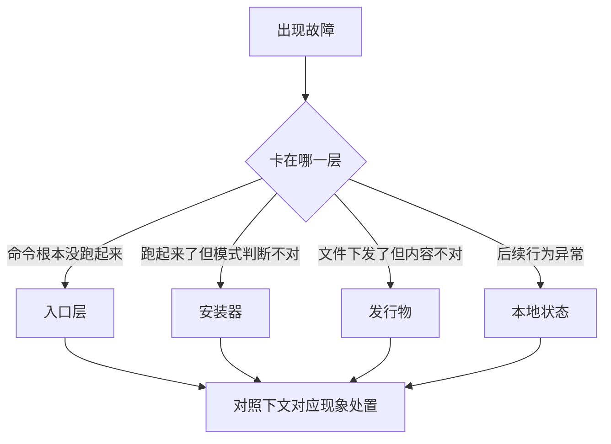

# 更新、运行与故障恢复

先判断当前项目处于安装前、安装后使用、发行维护还是故障恢复，再选择入口。`init`、`update`、workflow 和源仓库发版入口有不同前置，不要用一个入口覆盖全部阶段。

本页按"现象 → 原因 → 处置"整理安装、更新与使用中的常见问题。遇到故障先别急着翻日志，先自问：是入口根本没跑起来，还是安装器跑起来但判断成了错误模式，还是文件下发了但内容不对，还是状态文件不对导致后续行为异常（分层定位思路出处：Maglev 分发排障手册）。



## 四层定位

| 层 | 关键文件 |
| :--- | :--- |
| 入口层 | npm / npx 包入口 `packages/maglev-cli/bin/index.js`；Shell 入口 `packages/maglev-cli/dist/install.sh` |
| 安装器 | `.maglev_build/maglev_installer.py` 或 `packages/maglev-cli/dist/maglev_installer.py`（构建产物；源文件在 `packages/maglev-cli/runtime-src/`） |
| 发行物 | `manifest.json`、`CHANGELOG.md`、下发资产 |
| 本地状态 | `.maglev/config.json`、`.maglev/sync_state.json` |

`.maglev_build/` 是发行构建的临时沙箱、`packages/maglev-cli/dist/` 是 npm 包的发行镜像，两者都不是长期事实源；下游项目里安装器维护的受管布局见下游项目运行布局。

## 安装与更新问题速查

| 现象 | 原因 | 处置 |
| :--- | :--- | :--- |
| `update` 提示"未找到本地同步状态" | 当前目录没有 `.maglev/sync_state.json`，没真正完成过初始化 | `ls .maglev` 确认；新项目先 `init`；确认没在错误目录执行；`.maglev/` 被误删则重新初始化或恢复状态文件 |
| 执行 `init` 却自动切换为 Update | 目录已存在 `.maglev/sync_state.json`，被识别为已接入项目 | `cat .maglev/sync_state.json` 确认；首装测试换全新目录；历史残留先清理再重试 |
| Shell 入口提示无法下载安装器 | 网络不通、`MAGLEV_UPSTREAM_URL` 配置错误或远端发布目录不完整 | `echo $MAGLEV_UPSTREAM_URL` 检查；优先改用 `--local-dist` 本地离线验证；确认远端有 `maglev_installer.py` 和 `manifest.json` |
| npm / npx 包提示"离线安装器在包体中缺失" | `packages/maglev-cli/dist/` 不完整，包内镜像未与最新发行物同步 | 确认 `dist/maglev_installer.py`、`dist/manifest.json`、`dist/.agents/` 存在；重新构建发行物并同步镜像，发布前先做本地打包验证 |
| 本地清单解析失败 / 本地离线源文件缺失 | `--local-dist` 指向的不是完整发行物，或 `manifest.json` 非法、损坏 | 确认目录中有 `manifest.json`、`.agents/`、`.maglev/`；优先用 release 构建生成的发行物目录，不要把任意目录当 `--local-dist`；手工改过 manifest 就重新校验文件列表和哈希 |
| `Hash 校验失败: <path>` | 实际文件内容与 manifest 声明的 SHA-256 不一致，发行物被手改或构建产物与镜像不同步 | 重新构建发行物并重新生成 manifest，不要手工修改已登记资产；单文件哈希失败时安装器会警告并继续，还要确认最终下发结果完整 |
| 更新后根目录出现 `install.sh` 或 `maglev_installer.py` | 发行物不是最新规则构建的，manifest 仍把这两个文件视为下游项目资产 | 检查 `.maglev_build/manifest.json` 与 `packages/maglev-cli/dist/manifest.json` 是否还包含它们；用最新发行物重新初始化或更新 |
| 更新后某文件没变化，怀疑更新没生效 | 远端文件无变化进了 `SKIP`、看的不是纳管文件、或发行物与本地版本相同 | `cat .maglev/sync_state.json` 看 `last_synced_version` 与 `last_synced_time`；确认目标文件在 `manifest.json` 中；验证时改一个确定纳管的文件（如 `.agents/workflows/standup.md`）再触发更新 |
| 更新后出现 `.local_backup_*` | 不是错误，是保护机制——远端变了且你本地也改过，更新器先做了备份 | 比较原文件和备份差异，决定是否把本地修改合并进新版；确认要直接覆盖时再用 `update --force` |

### 提示未找到 Python，或协议运行时 `env_failed`

- **原因**：Shell 和 npm / npx 入口最终都依赖 Python 启动安装器，即使走 Node 入口也需要 Python；`env_failed` 表示受控 Python 运行时没准备好（缺 `uv` 且无 Python 3.11+，或依赖安装失败；`--check` 的退出语义出处：CLI 接口事实）
- **处置**：

```bash
python3 --version
./scripts/maglev-python --doctor
```

优先安装 `uv` 后重跑 doctor，或安装 Python 3.11+ 兜底。注意：`env_failed` 只表示环境不可用，不表示索引内容坏了；doctor 通过后 `partial` / `failed` 才表示 track 自身需要修复，届时再跑两个 `track_verify`。

### 扩展搜索返回 `sources_missing`

- **原因**：项目已接入 Maglev 但没配置任何扩展 source，可能是在默认官方源上线之前初始化的
- **处置**：

```bash
npx @idea-maglev/maglev-extension-cli sources list --json
npx @idea-maglev/maglev-extension-cli sources add --id maglev-official --type git --url https://github.com/Idea-Maglev/maglev.git --ref master --json
npx @idea-maglev/maglev-extension-cli search --slot code-execution --json
```

`sources add` 会在缺失时创建 `.maglev/extensions.sources.yaml`；配置多个 enabled source 时，CLI 会跳过单个失效 source 并带 warning 继续（单源降级规则出处：扩展分发）。

## 团队上手与环境问题

### 成员产出格式不统一，工具链对不上

- **原因**：各人用的工具不同（Cursor、Copilot 甚至记事本），缺少统一交付接口
- **处置**：不限制工具，只严格限制交付接口——Specs 必须是带 YAML frontmatter 的 Markdown；Issues 写进 `issues/` 目录（`active/` 处理中、`closed/` 已收口），写清复现步骤、预期结果与实际结果；Commits 遵循 `feat:`、`fix:` 语义化规范。再引入 Husky / Pre-commit Hooks 做纯机器兜底：格式不对（如 Spec 缺 Author 字段），Git Commit 直接拒绝（交付接口约定出处：人工兜底协议）

### 团队不会 Git / Markdown，循环跑不起来

- **处置**：按角色转型第一周行动计划补基础——需求角色 Day 1 装好 VS Code / Cursor，Day 2 学 Markdown，Day 3 学 Git 基础（`clone`、`pull`、`commit`、`push`），Day 4 练习把手头需求拆成 `specs/` 目录下的 `.md` 文件；研发 Day 2 强迫自己不写一行代码完成一个简单功能（全靠 Prompt）；测试 / 设计 Day 1 先获取仓库权限把项目在本地跑起来，Day 4 练习提一个带截图和复现步骤的 Markdown Issue。学习资源：[Markdown 官方教程](https://markdown.com.cn/)、[Git 简明指南](https://wangdoc.com/git/)、[Prompt Engineering Guide（中文）](https://www.promptingguide.ai/zh)

## 一条最实用的排障顺序

不确定问题在哪时，按这个顺序排：确认当前目录 → 确认 `.maglev/sync_state.json` → 确认入口能跑起来 → `--doctor` → 扩展 `sources list` → 两个 `track_verify` → 安装器 `--dry-run` → 最后核对发行物与镜像是否一致。

最小验证命令（分别回答：协议运行时是否可用、有没有扩展 source、冷启动索引检查是否可用、当前目录会被识别为 `init` 还是 `update`、发行物是否可读、这次更新会发生什么）：

```bash
./scripts/maglev-python --doctor
npx @idea-maglev/maglev-extension-cli sources list --json
./scripts/maglev-python .agents/skills/index-librarian/protocol/scripts/track_verify.py --track-id skills
./scripts/maglev-python .agents/skills/index-librarian/protocol/scripts/track_verify.py --track-id specs
npx @idea-maglev/maglev-cli update --dry-run
```

## 下一步

- [安装 maglev-cli](first-success.md)：正常安装流程
- [教程：从安装到第一次完整交付](first-success.md)：完整上手路径
- [日常推进手册](session-workflow.md)：环境就绪后的每个工作循环
- 完整排障细节：Maglev 分发排障手册

---

> 本页完成任务：**在你的机器上安装 maglev-cli 并确认运行时就绪**。

## 前置条件

- Node.js / npm 环境（npx 可用）
- 终端可访问 npm 源
- 本机有 `python3` 或 `python`，建议安装 `uv`——`init` / `update` 入口最终都靠 Python 启动安装器（出处：分发快速上手）

## 安装并初始化

在项目根目录按顺序执行：

```bash
npx @idea-maglev/maglev-cli init
```

如需全局安装后长期使用：

```bash
npm install -g @idea-maglev/maglev-cli
```

预期结果：命令行输出安装成功信息，`maglev` 命令可用。公司私域环境需先配置内部 npm 源与网络权限，见分发快速上手。


## 验证

安装完成后确认运行时就绪：

```bash
./scripts/maglev-python --doctor
```

自检输出应包含 `repo_root`、`python` 环境路径与版本信息。`--doctor` 检查的是 `scripts/maglev-python` 这条受控运行时入口（uv 优先、系统回退），出处：交付运行时能力。

## 常见问题

- **npx 拉包超时**：检查 npm 源配置或改用全局安装方式；私域环境的 npm 源与网络要求见分发快速上手
- **init 后环境检查失败**：按提示安装 `uv` 或确认 Python >= 3.11（`scripts/maglev-python` 的最低版本要求即 3.11），更多现象见分发排障手册

## 下一步

- [教程：从安装到第一次完整交付](first-success.md)：装好后从零走完第一次完整交付
- [日常推进手册](session-workflow.md)：接入后每个工作循环怎么操作
- [从请求到结晶的日常协作](session-workflow.md)：开始与 Agent 协作前了解主链、交接点与验证边界。
- [故障排查与常见问题](update-and-recovery.md)：安装或自检报错先查这里
- 操作事实原文：Maglev 分发与快速上手
