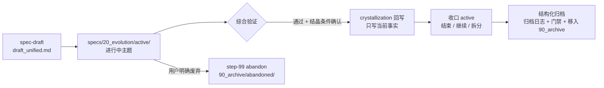
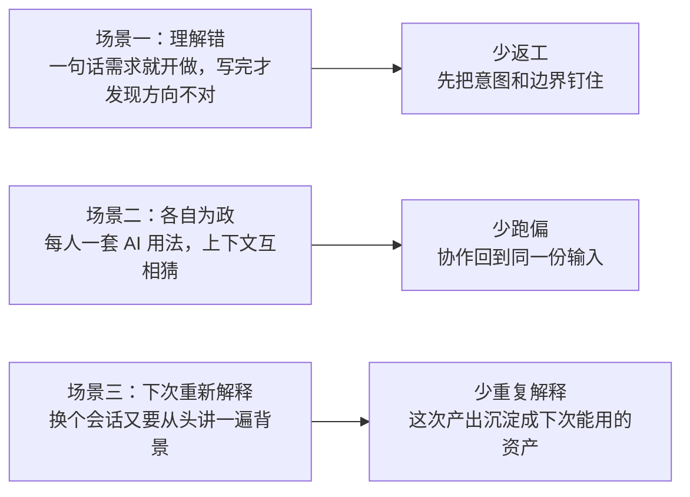

# 验证、地图与知识维护

维护任务的目标是发现漂移、缺失和证据断层，而不是让所有检查都返回绿色。按“生成—校验—解释—处理未知”的顺序执行，才能避免把索引或地图误当成事实本身。

本页条目化回答五类查证问题：specs 四层各自放什么、思考如何沉淀与归类（knowledge-check 与 9 段记忆宫殿）、写对外内容前如何同步口径（Wiki authoring）、对外 wiki 投影层如何配置与生成。口径与 [internal Reality](../../../internal Reality/README.md) 各能力域页一致，数据时点以 `last_updated: 2026-09-03` 的仓库事实为准。

## specs 四层：每层回答一个问题

specs 按四层组织知识，分层标准见 [规格知识分层能力](../../../internal Reality/spec-knowledge-layering/capability/overview.md)与 specs/README.md：

| 层 | 位置 | 回答的问题 | 生命周期 | 索引形态 |
| --- | --- | --- | --- | --- |
| 愿景 | `specs/00_vision.md` | 我们在构建什么（Iron Triangle / Anti-Entropy） | 稳定，低频修订 | 根 entity-index 的文件级记录 |
| 现状 | `internal Reality/` | 现在是什么（当前事实层） | 随结晶回写演进 | 域 INDEX 网络 + 域 README |
| 演进 | `specs/20_evolution/` | 正在发生什么变化（进行中主题） | 主题完成即收口 | entity-index（collection）+ active/ 目录索引 |
| 归档 | `specs/90_archive/` | 历史如何走到今天 | 只读 | entity-index（collection） |

层间流转与归档纪律（工作流事实见[规格知识分层工作流](../../../internal Reality/spec-knowledge-layering/capability/workflows.md)）：



- **结晶回写只写当前事实**：变化经[结晶（crystallization）](../../../.agents/skills/crystallization/SKILL.md)确认后，写回 `10_reality` 时直接写"当前事实"，而不是写"去哪里看历史"；如需保留历史依据，只能在索引或思考入口承认其存在，不得把 Archive 当成 Reality 的解释依赖。
- **归档反模式（禁止）**：把 `20_evolution/active/` 内容直接搬到 `90_archive/`；或在未把结论写入 `10_reality` 的情况下执行归档。正确流程是三步：提取结论写入 `10_reality` → 收口 active → 结构化归档（填写归档日志、通过门禁、移入 `90_archive`）。本仓库 AGENTS.md 的 Git 工作流纪律同样禁止该直接搬运。

## knowledge-check：思考不随会话消失

[knowledge-check](../../../.agents/skills/knowledge-check/SKILL.md) 是知识沉淀检查器，也是 9 段位段归类的 canonical 检查入口。能力事实见 [知识沉淀能力](../../../internal Reality/knowledge-sedimentation/capability/overview.md)。

| 条目 | 内容 |
| --- | --- |
| 触发时机 | 一段高价值探索结束后；会话准备切换前；任务收尾前；怀疑当前有价值思考可能流失时 |
| 核对对象 | 思考、方案、参考资料和贡献记录是否已落盘 `docs/thinking/` |
| 交付物 | 当前知识资产清单、记录完整性判断、生命周期边界判断、缺口与最小补齐动作 |
| 判定纪律 | 只判断"是否已沉淀"，不代写内容；只把 blocker 级缺口单独升级；一旦问题属于 Reality 回写或 active 收口，立即切边界转交 |

与 crystallization 的边界：knowledge-check 问"**你保存了吗**"（检查知识资产是否已记录，适用于会话切换和探索结束）；crystallization 是"**发布到生产**"（把已验证成果写回 reality 并收口 active，适用于功能完成后）。两者都需要时，先 knowledge-check 再 crystallization。knowledge-check 明确不负责：需求归档、reality writeback、active 状态收口——这些属 crystallization 或其他后段对象。

## 9 段记忆宫殿：docs/thinking 位段归类

`docs/thinking/` 按 9 个位段组织，物理载体是目录结构与 docs/thinking/INDEX.md（9/9 位段有 indexed 知识记录）；**位段语义本体由 [segments-canonical.yaml](../../../.agents/skills/knowledge-check/references/segments-canonical.yaml)（机器读）与 [segments-canonical.md](../../../.agents/skills/knowledge-check/references/segments-canonical.md)（人读）持有**，任何项目实例的 `segments` 字段以 canonical 为内容来源，并在文件头标注 `segments_source` 指向该文件。

| 位段 | 房间名 | 一句话用途 |
| --- | --- | --- |
| 00_meta | 元厅 | 模块元信息、入口与导航 |
| 10_critique | 批判间 | 反思、对抗与质疑性分析 |
| 20_architecture | 架构间 | 系统结构、分层与边界设计 |
| 30_philosophy | 哲学殿 | 范式根基、第一性原理与方程式表达 |
| 40_paper | 论文阁 | 学术对位、方法借鉴与理论引用 |
| 50_alignment | 对标厅 | 跨范式对比、生态对位与差异化定位 |
| 60_case | 案例馆 | 落地实例、试点与具体场景产出 |
| 70_retrospective | 复盘室 | 迭代闭环、决策回顾与经验提炼 |
| 90_archive | 归档库 | 已被结晶/上位重写/退役的历史文档 |

canonical 数据的字段约束：`id`（`\d{2}_[a-z_]+`）、`room_name`（中文房间隐喻）、`description`、`status`（`active` / `draft` / `archived`）、`scope_in` 与 `scope_out`（互斥定义，判断"某条思考归到哪个位段"时直接消费）、`examples`。schema 格式由 index-librarian 规约，位段语义由 knowledge-check 持有，两者互不依赖。

## Wiki authoring 起点简报

Wiki authoring 在写作或改稿前读取当前 Reality、正式指南和任务边界，形成简短起点简报，再进入 Plan/Challenge/Approval 约束下的正文写作。该过程不拥有事实，也不替代页面审查；当前事实仍以 `internal Reality/` 为准。

| 条目 | 内容 |
| --- | --- |
| 触发时机 | 写任何一篇新运营内容前；修改已有对外文章前；会话中感觉对 Maglev 的理解开始泛化、漂移或混入无关概念时 |
| 五类同步 | Definition Sync（Reality 定义）、Message Sync（统一口径）、Audience Sync（受众与禁用表达）、Style Sync（文风约束）、Boundary Guard（阻止历史资产覆盖 Reality） |
| 先行产物 | Wiki authoring Brief，至少含四要素：当前版本 Maglev 是什么 / 不是什么 / 本次写作的问题域 / 最需避免的跑偏方向 |
| 来源边界 | 先读 Reality canonical，再读 `source operation guides/` 正式指南和比较材料；`docs/wiki/` 只作为经过审批的用户解释投影 | `.maglev/wiki.yaml` source policy | Publishing 和历史材料不能覆盖当前事实 |
| 结构审批 | Producer Plan、Blind Challenge、Divergence 和人类 Approval 共同决定页面是否进入正文阶段 | `.maglev/wiki/` 状态束 | 机械检查通过不等于内容充分 |
| 正文责任 | Wiki authoring 负责按批准页面和 evidence bundle 写作；作者必须保留未知和边界 | `.agents/skills/maglev-wiki/` | 没有用户问答时整体保持 provisional |

## Wiki 投影层：项目推导与结构审批

`docs/wiki/` 是对外 Wiki 投影层。Agent 先读取项目输入，再提出结构；配置文件不预先固定维度或页面。

| 条目 | 内容 |
| --- | --- |
| 项目输入 | `.maglev/wiki.yaml` 只保存标题、语言、来源边界和可选受众提示 |
| Source Universe | `wiki_content.py build-universe` 登记可访问来源、摘要、排除项和可选 Provider，不决定页面 |
| 双轨推导 | Producer 推导 Plan；独立 Challenger 在看不到 Plan 和现有 Wiki 时重建问题、风险和深度信号 |
| 人类审核 | `.maglev/wiki/wiki-plan.md` 同时展示结构、遗漏、差异处置、替代方案和剩余风险 |
| 机器投影 | Plan、Challenge Receipt、Challenge 与 Divergence 供脚本校验和追溯，不代替人的判断 |
| 确定性生成 | [wiki_generate.py](../../../.agents/skills/maglev-wiki/scripts/wiki_generate.py) 只生成 `WIKI.md`、维度入口和 `FRAMEWORK.md`，不生成正文 |
| 开放世界审查 | 最终任务合并 Plan、Challenge、风险、变更和独立业务问答；无反证轨迹不得全量通过 |

常用命令：

```bash
WIKI=.agents/skills/maglev-wiki/scripts

# 构建来源全集，随后由独立 Agent 生成 Plan 与 Blind Challenge
./scripts/maglev-python "$WIKI/wiki_content.py" build-universe --root .

# 差异裁决后检查开放世界束并渲染唯一人审面
./scripts/maglev-python "$WIKI/wiki_content.py" validate-open-world --root .
./scripts/maglev-python "$WIKI/wiki_content.py" render-plan --root .

# 明确批准后验证计划并生成导航
./scripts/maglev-python "$WIKI/wiki_content.py" validate-plan --root . --require-approved
./scripts/maglev-python "$WIKI/wiki_generate.py" --root .
```

## 来源

- [规格知识分层能力](../../../internal Reality/spec-knowledge-layering/capability/overview.md)与[规格知识分层工作流](../../../internal Reality/spec-knowledge-layering/capability/workflows.md)：四层定义、层间流转、回写规则
- [crystallization SKILL](../../../.agents/skills/crystallization/SKILL.md)：生命周期边界与归档反模式
- [知识沉淀能力](../../../internal Reality/knowledge-sedimentation/capability/overview.md)与 [knowledge-check SKILL](../../../.agents/skills/knowledge-check/SKILL.md)：沉淀检查职责、触发、边界
- [segments-canonical.yaml](../../../.agents/skills/knowledge-check/references/segments-canonical.yaml)：9 段位段语义本体
- [运营文档知识能力](../../../internal Reality/operations-docs-system/capability/overview.md)：写前同步与 wiki 投影层
- [Wiki 内容生产 Skill](../../../.agents/skills/maglev-wiki/SKILL.md)：项目结构推导、审批后写作、证据约束与读者任务审查
- .maglev/wiki.yaml、结构方案与 [Wiki 入口](../WIKI.md)：项目输入、结构审核和阅读入口

## 下一步

- 在日常流中执行沉淀检查：[日常工作流](session-workflow.md)
- 在协作流程中处理交接与 Agent 使用：[从请求到结晶的日常协作](session-workflow.md)。
- 从首次交付走查理解知识如何随交付沉淀：[首次交付走查](first-success.md)
- 老项目接入时如何重建分层知识：[存量项目接入](brownfield-adoption.md)

---

> 你接了一个"一句话需求"，AI 几分钟就把代码生成了，两周后你却在改第一版没写对的逻辑。这时候你最关心的问题不是"Maglev 伟不伟大"，而是：**它到底能不能让我少返工、少跑偏、少重复解释？**本页只回答这一个问题。

很多返工不是因为不会写，而是因为一开始就理解错了；团队协作的混乱也不是因为工具不够多，而是每个人都在用自己的方式用 AI。Maglev 针对的就是这三个具体场景，每一点收益都对应你现在就能用到的抓手，而不是多一层理论。

## 三个你肯定遇过的返工场景



**场景一：理解错。**需求说得不够清楚就开做，做到一半才发现产品、开发、测试理解的不是一回事；表面功能做完了，但边界条件、验收口径和后续改动条件没对齐。最浪费时间的通常不是敲代码本身，而是后面反复返工。

**场景二：各自为政。**团队里每个人都在用 AI，但方法都不一样。你以为别人已经补过上下文，结果没有；你按一种方式生成，队友按另一种方式修改；最后留下的代码能跑，但没人说得清它是不是按同一套约束做出来的。

**场景三：下次重新解释。**最烦的不是这次写出来，而是下次改动时又得从头解释一遍。这次理清的需求和边界、写出来的完成标准、补出来的上下文，如果不落在某个能再次找到的地方，下个会话就又回到零。

## 少返工：先把意图钉住，再进实现

Maglev 的主链路把"说清楚"放在"写代码"前面：会话请求先经 `entry-router` 分诊，进入 [需求收敛（requirement-convergence）](../../../internal Reality/collaboration-lifecycle/capability/overview.md) 把目标、边界和完成标准固定下来，再经 `spec-designer` 形成方案，之后才轮到实现（`context-implementer` 或 [代码执行插槽](../../../internal Reality/collaboration-lifecycle/capability/overview.md)）。

对开发者的直接差别是：接到"一句话需求"时，先有人（或 agent）把"做完的标准是什么、不做什么"写成你能确认的说明，再开始生成。方向性错误在写代码之前被拦住，而不是在 review 时被发现。

处理老代码或陌生模块时，还有一条专门路径：用 `maglev-reverse-spec` 把现状逆向成 Spec，先弄清"现在是什么"再动手改（见[接入与集成](../../../internal Reality/adoption-integration/capability/overview.md)）。

## 少跑偏：协作回到同一份输入

"每个人一套 AI 用法"的解法不是统一思想，而是统一入口。Maglev 让每个会话从同一起点出发：新会话先做 [现状同步（reality-sync）](../../../internal Reality/session-reality-sync/capability/overview.md)，输出 `[Space]/[Mind]/[Risk]/[Action]` 四类同步——现在什么状态、要明确什么、有什么风险、下一步做什么。你不需要读全仓，队友也不需要口头补上下文，双方从同一份起点信息继续。

跨平台 agent 侧同理：`AGENTS.md` 与 `llms.txt` 双入口让不同工具拿到的红线、目录和主链路是同一份，而不是各平台各自维护一套"团队约定"（见 [Agent 上下文面](../../../internal Reality/agent-context-surface/capability/overview.md)）。

## 少重复解释：这次的产出下次还能用

Maglev 在验证之后安排了一步收尾：[结晶（crystallization）](../../../internal Reality/glossary.md)判断这次交付里哪些变化已经成立，把它们[回写到当前事实层 `internal Reality/`](../../../internal Reality/spec-knowledge-layering/capability/workflows.md)并收口。效果落在三件具体的事上：

- 这次理清的需求和边界，下次直接读事实层，不用重新解释一遍
- 这次写出来的完成标准，下次验证改动时继续用
- 这次补出来的上下文，不会在下个会话里又回到零

一句话：**它不是让你多做事，而是让已经做过的事不要下次再白做一次。**

## 这些收益现在靠什么拿到

| 收益 | 具体抓手 | 它做的动作 |
|------|---------|-----------|
| 少返工 | 需求收敛 + 方案设计 | 先把目标、边界、完成标准说清楚，再进实现 |
| 少返工 | `maglev-reverse-spec` | 老代码/陌生模块先逆向成 Spec，避免被"合理地误解" |
| 少跑偏 | 现状同步（reality-sync） | 会话起点对齐主线，避免一进来就误判 |
| 少跑偏 | 治理纪律 + 统一入口 | 不同人、不同 agent 按同一套约束推进 |
| 少重复解释 | 综合验证（integrated-validator） | 完成标准可以下次继续验，减少"这次能跑，下次没人敢改" |
| 少重复解释 | 结晶回写 | 已成立的结论写回 `internal Reality/`，下次接着用 |

这些抓手不是并列的口号，而是同一条链路上的先后环节：同步起点 → 收敛需求 → 方案设计 → 实现 → 验证 → 结晶沉淀。

## 边界澄清

- **Maglev 不是让你多做事**，它加的环节都指向"少做一遍"：少改一遍方向错的代码、少讲一遍背景、少验一遍没有依据的改动。
- **少返工不等于承诺零返工**。需求收敛固定的是意图、边界和完成标准，不能替代你对需求本身的理解；Maglev 也没有"收敛耗时、验证通过率"这类会话级质量统计——当前[没有运行记录机制，不作声明](../../../internal Reality/collaboration-lifecycle/capability/overview.md)。
- **Maglev 不替代你的编码工具**。编辑器、AI 编码助手、CI/CD 都由你自选，Maglev 改变的是这些工具收到的输入质量（Spec、边界、验证依据）和产出被检查的方式。

## 现在就能试

如果已经想动手，而不只停留在理解层，当前有正式 CLI 入口：

```bash
npx @idea-maglev/maglev-cli init
```

真实项目里建议谨慎接入——更新前先预览影响：

```bash
npx @idea-maglev/maglev-cli update --dry-run
```

## 下一步

- 跟着走一遍从安装到第一次完整交付：[教程：从安装到第一次完整交付](first-success.md)
- 看每个工作循环怎么操作：[日常推进手册](session-workflow.md)
- 把协作与 Agent 使用纳入主链：[从请求到结晶的日常协作](session-workflow.md)。
- 在真实仓库低成本起步：[安装 maglev-cli](first-success.md)
- 老项目接入看这里：[存量项目接入](brownfield-adoption.md)
