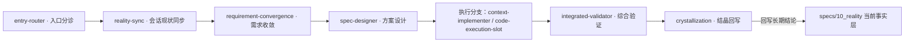
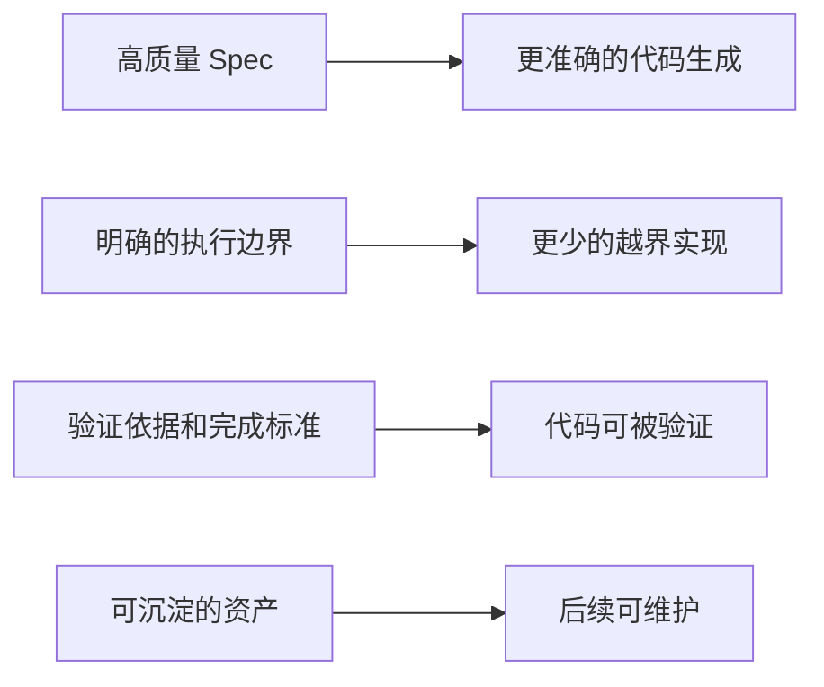

# 系统架构与责任边界

Maglev 的静态架构由多个能力域、主流程入口、运行时和事实层组成。这里的关系图只表达来源中能够定位的静态责任和依赖；它不等于部署拓扑，也不证明每条运行链已经端到端验证。

> 面向正在评估 Maglev 的技术负责人与架构师：读完本页，你会得到三层结构的组织方式、主干链路的构成、Maglev 与编码工具的上下游关系，以及它刻意不做什么。

## 三层结构：方法论、当前规则、技能

Maglev 不是单个工具，而是一套帮助团队在 AI Coding 时代稳定协作、持续交付并沉淀资产的方法论、协议和可执行能力集合。它关注的问题聚焦在一处：意图、设计、代码和验证之间的漂移——AI 放大了执行速度，也放大了这种漂移。在仓库内，这套能力以三层结构组织：

| 层 | 位置 | 回答的问题 |
|----|------|-----------|
| 方法论 | `docs/thinking/` | 为什么这样做 |
| 当前规则 | `.agents/skills/`、`.agents/workflows/`、`specs/10_reality/` | 当前执行边界、兼容入口和事实 |
| 技能 | `.agents/skills/` | 能做什么 |

三层分工让"为什么""现在是什么""能做什么"各自独立演化。`specs/10_reality/` 是当前事实层，登记能力域映射、模块间有静态锚点的关系，以及系统边界与未知项；评估架构时，这里是第一手核对对象。

## 证据可追溯：事实层怎么核对

"第一手核对对象"之所以成立，是因为事实层的每条声明都带可机械核对的凭据（机制见 10_reality README）：

- **reality_id + digest 绑定**：每个能力域页面登记 `reality_id`，页面 claim 由脚本从 frontmatter 机械枚举入登记册，并以 sha256 digest 绑定证据文件——核对走逐字节复核，不走"读起来可信"。
- **knowledge_status 四态**：`established / unknown / not_established / not_applicable` 表达每条事实的证据充分度；状态不来自叙述流畅度，也不表示运行时验证通过。
- **边界诚实声明**：digest 一致不等于内容真实，"结构通过"不能包装成"内容真实"——这条限制写进机制本身，而不是留给评估者自己发现。

对评估的直接含义：架构声明可以逐条核对到证据文件，未证实的能力以 `unknown` 显式登记在已知缺口账本里，而不是从架构图上消失。

## 能力域与主链路

Maglev 的产品范围组织为 14 个能力域：协作生命周期、治理与质量、技能运行时、交付运行时、接入与集成、能力进化、机器索引引擎、项目地图、会话现状同步、知识沉淀、Agent 上下文面、规格知识分层、运营文档体系、发行知识。每个能力域有明确的 owning 模块与边界依据。

评估架构时，最值得关注的是贯穿这些能力域的主干技能链：

主链之外，有几类支撑模块与它咬合：`code-execution-slot` 从项目 `.maglev/extensions.lock` 读取 enabled 候选，决定"用什么执行代码"；`extension-manager` 通过 install / enable / disable / update 命令维护这份 lock；`maglev-cli` 安装器在初始化时向 `AGENTS.md` 与 `llms.txt` 注入双入口骨架和受管区块，已存在的文件一律跳过、不覆盖用户内容；`index-librarian` 生成 `specs/` 与 `docs/` 各级 `INDEX.md` 索引网络；`maglev-map-maker` 从治理事实确定性生成唯一的人读项目入口 `docs/ATLAS.md`。

## 与编码工具的上下游关系

Maglev 不是编码工具的替代品，而是编码工具的**上游输入层**和**下游验证层**。上游供什么、下游查什么，可以分开看：

上游侧，Maglev 把模糊输入整理成高质量 Spec、明确执行边界、给出验证依据，编码工具据此生成更准确、越界更少的代码。下游侧，Maglev 对生成结果做对齐检查：验证依据与完成标准让代码可被验证，沉淀的资产让后续可维护。

代码执行走 `code-execution-slot`：Slot 从 `.maglev/extensions.lock` 读取 enabled 候选，Agent 根据任务上下文和选择说明加载对应 `entry_skill`；没有合适候选时回退到 agent-native 执行。这里有两道硬约束：扩展不会自动进入所有上下文，也不能绕过需求和方案阶段。编码工具侧不限定具体 provider——Maglev 更偏好能直接消费 Spec、遵循边界并返回测试与 review 证据的工具。

## 刻意边界：不做什么

| 不做的事 | 原因 |
|---------|------|
| 替代代码生成层 | 已有成熟的外部编码工具 |
| 追求编码层的"更强" | 那是编码工具的战场，不是 Maglev 的 |
| 运维 / 部署 / 监控 | 不是 Maglev 的定位，交给 CI/CD 等工具 |
| 做平台 / IDE | Maglev 是协议层，不锁定任何平台 |

这些边界对评估的直接含义：编码工具选型仍是独立决策，Maglev 不在这一层参与竞争；它改变的是这些工具收到的输入质量和产出被检查的方式。

## 下一步

- 看五个阶段如何衔接、各阶段产出什么：[核心工作流](lifecycle-and-governance.md)
- 看 Maglev 与相邻概念各自的战场：[与相邻概念的边界](../business/comparisons.md)
- 看扩展机制与集成边界：[扩展机制与集成](runtime-and-extensibility.md)
- 准备接入时，从安装开始：[安装 maglev-cli](../developer/first-success.md)
