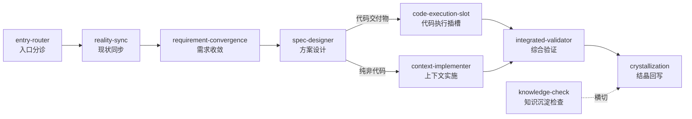
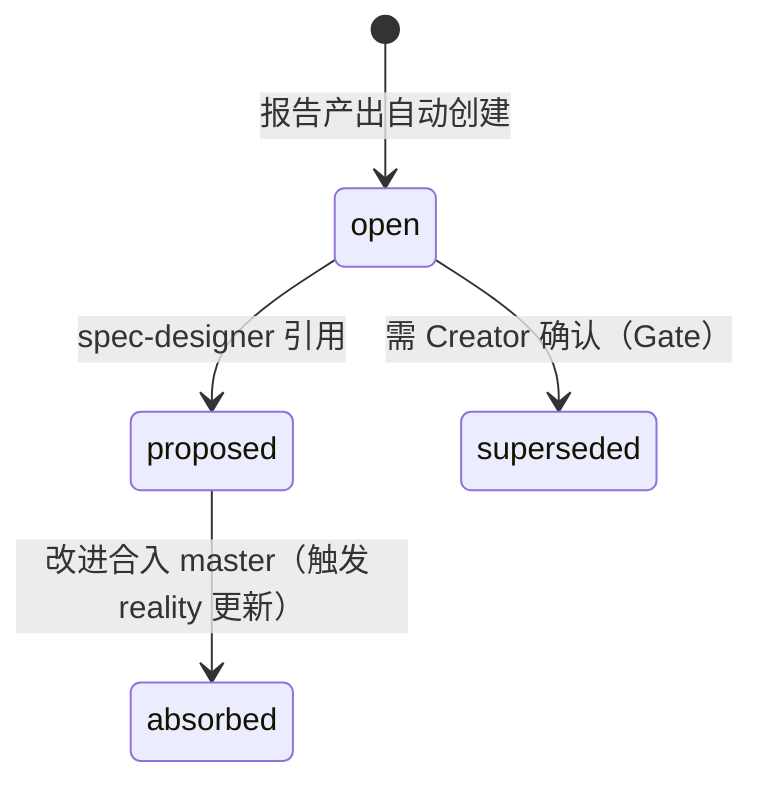

# 能力域与深挖入口

Reality 按问题和责任组织能力域。先从下表选择问题入口，再进入对应域的 capability 概览、实现、操作和 verification 页面。这里是导航，不是把所有域的细节复制成第二套事实源。

> 本页覆盖 Maglev 能力体系的登记与治理事实：主链路与技能目录（`public capability catalog`）、竞品观测与技能侦察（`competitive-registry.yaml`、skill-scout）、文档源治理（`documentation-governance.json`）与运营手册出口（`source operation guides/`）。数据时点为 2026-09-03 仓库现状。

## 评估者先读：接入三问

| 问题 | 回答 |
|------|------|
| 接在哪一层 | 登记与治理层：为技能运行时提供"现役能力清单、关系图与受管表面"，不进入代码执行层本身（见 [internal Reality/skill-runtime/capability/overview.md](../../../internal Reality/skill-runtime/capability/overview.md)） |
| 与现有体系冲突吗 | 不与外部能力竞争，而是给它们设准入闸：外部 skill 必须经插槽从 lock 解析、选择后才生效，禁止自动触发绕过需求/方案/Slot 纪律（见 [internal Reality/skill-runtime/capability/overview.md](../../../internal Reality/skill-runtime/capability/overview.md) §2.2） |
| 要不要一次铺满 | 不需要。登记表按治理价值渐进登记——"纯包装层、临时入口、无独立治理价值的对象，不必强行登记"（见 [public capability catalog](../../../public capability catalog) 头注释） |

## 治理登记表一览

Maglev 用"登记表驱动"替代"口头约定"：哪些能力现役、竞品观察到哪一步、文档谁生成谁校验，各有唯一权威位置。

| 登记表 | 位置 | 登记什么 | 谁消费 |
|--------|------|----------|--------|
| 私域能力清单 | `public capability catalog` | 现役治理对象及其关系；数量以当前清单为准 | 主流程编排、skill-scout / skill-squadron 巡逻 |
| 竞品注册表 | `internal Reality/capability-evolution/evidence/competitive-registry.yaml` | 观察对象清单 + insight 状态 + 维度升级记录 | evolution-observatory 观测循环 |
| 文档治理注册表 | `specs/_meta/documentation-governance.json` | canonical owner、派生投影、消费者、历史边界 | 受管表面生成器与漂移检查器 |
| 运营手册 | `source operation guides/`（五段结构） | 面向使用者的操作知识（非登记表，是治理后的出口） | 使用者按 README 角色分流阅读 |

## 能力清单：主链路、横切能力与治理对象

**问题**：新会话抓错主线、不知道哪些能力现役、能力之间什么关系——这些问题的根源是能力清单散落在目录里靠人记忆。

**抓手**：`public capability catalog` 作为技能注册的单一权威，加上由治理注册表生成的主链路定义。

### 主链路 8 环节

当前主链路由治理注册表生成（AGENTS.md 受管区块）：



| 环节 | 对象 | 职责 |
|------|------|------|
| 1 | `entry-router` | 会话入口路由，始终是最高层入口 |
| 2 | `reality-sync` | 会话启动现状同步 |
| 3 | `requirement-convergence` | 需求收敛与 Ready Gate |
| 4 | `spec-designer` | 方案设计 |
| 5a | `code-execution-slot` | spec 含代码交付物时的执行插槽 |
| 5b | `context-implementer` | 纯非代码交付物的受控实施 |
| 6 | `integrated-validator` | 综合验证 |
| 7 | `crystallization` | 结晶回写 `internal Reality` |
| 横切 | `knowledge-check` | 知识沉淀检查，按需触发不占链路位置 |

（见 [internal Reality/skill-runtime/capability/overview.md](../../../internal Reality/skill-runtime/capability/overview.md) §2.2；执行链为 `entry-router → spec-designer → code-execution-slot → selected entry skill | agent-native → integrated-validator`）

### Skill 优先级协议：外部能力的准入闸

- `entry-router` 始终是最高层入口；任何外部 skill 仅在 `code-execution-slot` 从 lock 解析、选择后才生效。
- 禁止外部 skill 自动触发：外部能力不得绕过需求、方案和 Slot 选择纪律进入执行。
- 代码执行路由：spec 含代码交付物 → `code-execution-slot`；纯非代码 → `context-implementer`。

（见 [internal Reality/skill-runtime/capability/overview.md](../../../internal Reality/skill-runtime/capability/overview.md) §2.2）

### 私域能力清单的登记与生命周期

`public capability catalog` 是"治理对象清单"，不是 `.agents/skills/` 与 `.agents/workflows/` 的机械镜像，也不是历史日志。登记与生命周期规则：

| 规则 | 内容 |
|------|------|
| 登记准入 | 会被统一巡逻、分组、比较或进入结构治理的对象才登记；纯包装 workflow、临时入口、无独立治理价值的对象可不登记 |
| 现役状态 | `status` 以 `active` 为准；`deprecated` 仅作短期迁移态，不应长期保留；被替代的旧名不作为并列现役对象占位 |
| 命名状态 | `runtime_name_status` 区分 `canonical_name_active`（运行面已切正式名）与 `active_legacy_name`（运行面仍用历史名） |
| 分发范围 | `distribution_scope` 三值：`user_visible` / `runtime_internal` / `private_only` |
| 关系图 | `relations` 只记录有治理价值的稳定关系，类型枚举 `calls` / `called_by` / `complements` / `shares_data` / `precedes` / `preceded_by`；`target` 只能指向清单内其他治理对象，不允许把数据文件、目录、普通文档当作关系目标 |

当前清单登记的对象以 `public capability catalog` 和生成的 skills index 为准；页面不复制会随版本变化的数量快照。登记对象覆盖主链路、横切治理、索引与地图、能力进化和分析等类别。

## 竞品观测：6 Phase 循环与 insight 生命周期

**问题**：能力清单怎么跟上外部框架演进？怎么避免"看到好的就抄"？

**抓手**：evolution-observatory 以 registry 驱动的观测循环，把竞品研究变成结构化、可追溯的 insight 资产。

### 观测循环

| 阶段 | 内容 | 约束 |
|------|------|------|
| Phase 0 | 读 `internal Reality/positioning.md` 锚定开局 | 每轮开始前必须执行 |
| Phase 1-6 | Scope → Insight Review → Deep Research → Discovery → Output & Archive → Self-Check | Phase 1/2 需 Creator 确认；Phase 4 即使无新竞品也必须记录"当前未发现"；Phase 6 任一 blocking 项未过不可标记当前完成 |

触发方式是 Creator 主动触发（AI 不自动启动研究）；研究报告归档至 `docs/thinking/10_critique/`，commit 前缀 `research(observatory)`。（见 [internal Reality/capability-evolution/implementation/evolution-cycle.md](../../../internal Reality/capability-evolution/implementation/evolution-cycle.md) §1）

### insight 状态机



- `source_report`、`title`、`created_at` 创建后不可变；被 supersede 的 insight 保留完整内容。
- 长期 open（建议 4 轮）触发再评估而非自动废弃。

（见 [internal Reality/capability-evolution/implementation/evolution-cycle.md](../../../internal Reality/capability-evolution/implementation/evolution-cycle.md) §1）

### 唯一状态源与需求预测四字段

`competitive-registry.yaml` 是观测循环的唯一状态源：登记观察对象清单（每个对象含 `version_tracked`、`activity_level`、`last_researched` 与 `watch_reason`）、insight 状态与维度升级记录（`pending`/`promoted`）。Insight Schema v2 每条附带需求预测四字段——意图是"需求预测，不是看到好的就抄"：

| 字段 | 含义 |
|------|------|
| `demand_driver` | 是什么用户痛点/场景驱动了这个竞品能力 |
| `demand_signal` | high/medium/low——需求的受众规模和紧迫度 |
| `maglev_applicability` | high/medium/low——Maglev 用户是否有同样痛点 |
| `response_strategy` | absorb/differentiate/watch——Maglev 应如何回应 |

（见 [internal Reality/capability-evolution/evidence/competitive-registry.yaml](../../../internal Reality/capability-evolution/evidence/competitive-registry.yaml) 头注释与 [internal Reality/capability-evolution/implementation/evolution-cycle.md](../../../internal Reality/capability-evolution/implementation/evolution-cycle.md) §1）

## 技能侦察：skill-scout 双模式

**问题**：想引入外部能力但不想从头设计；已登记对象怎么持续优化而不腐化？

**抓手**：skill-scout 的 Scout（引入）与 Patrol（巡逻）两种模式，登记落点统一为 `public capability catalog`。

| 模式 | 流程 | 关键约束 |
|------|------|----------|
| Scout（私域化改造） | `parse → search → evaluate → adapt → register` | Hard Gate：未实际联网检索并留下显式证据，不得进入 evaluate/adapt/register 后半段 |
| Patrol（差异巡逻） | `scan → diff → report → optimize` | 优化机会按 `value_score` 降序输出；PatrolReport `status: all_current` 时流程终止，不进入 optimize |

Scout 模式把外部 skill/workflow 经私域化改造后生成并登记为私域能力对象；Patrol 模式对已登记对象做 diff 巡逻并产出结构化 PatrolReport（YAML：`generated_at` / `summary` / `opportunities`（含 `value_score`）/ `status`）。（见 [internal Reality/capability-evolution/capability/overview.md](../../../internal Reality/capability-evolution/capability/overview.md) §2 与 [internal Reality/capability-evolution/implementation/evolution-cycle.md](../../../internal Reality/capability-evolution/implementation/evolution-cycle.md) §1）

## 文档源治理：注册表先行的受管表面

**问题**：AGENTS.md 里的主链路、兼容入口这类"被多方引用的表面"由谁生成？改了源之后怎么知道投影没有漂移？

**抓手**：`specs/_meta/documentation-governance.json` 登记文档关系，配生成器与漂移检查器两把工具。

- 注册表登记当前事实的 canonical owner、派生投影、消费者、历史边界、兼容入口和非 Git 发布目标；**正文仍由各自的 canonical 文档维护**，注册表不拥有内容。
- 当前主链路、兼容入口和 legacy vocabulary 由注册表生成（经 managed block），不再分别维护手工列表。
- 漂移检查：`scripts/check_documentation_drift.py` 校验注册表 schema、路径、canonical owner、派生来源、受管表面、旧术语、当前入口链接、guide 链接、runtime source/dist 快照一致性和发布包 freshness；错误包含可定位的 `code`、`path`、`message`。

常用检查入口：

```text
python3 scripts/check_documentation_drift.py --root . --json
python3 scripts/generate_documentation_surfaces.py --check --json
```

维护纪律：修改主链路、兼容入口、旧术语或发布源时，**先更新治理注册表**，再运行受管表面检查、漂移检查和相关测试。`docs/publishing/` 是派生发布层、不拥有当前事实，第一阶段只生成可复审导入包——不调用 private document API、不保存凭据，也不允许 private document integration 反向成为事实源。（见 [internal Reality/governance-quality/implementation/documentation-governance.md](../../../internal Reality/governance-quality/implementation/documentation-governance.md)）

## 运营手册出口：五段结构与角色分流

**问题**：使用者（非仓库维护者）打开仓库后从哪篇开始读，而不是在目录里迷路？

**抓手**：`source operation guides/` 五段结构 + README 按角色分流。

| 目录 | 作用 |
|------|------|
| `00_start/` | 启动、接入与团队落地 |
| `10_concepts/` | 核心概念与方法论解释 |
| `20_operations/` | 日常操作、安装、更新、排障 |
| `30_comparisons/` | 和相邻方法、产品、范式的对比 |
| `90_advanced/` | 高级配置与进阶治理议题 |

`source operation guides/README.md` 以"如果你只想知道先看什么"开头，按五类角色分流到具体篇目：第一次接触 Maglev 的人、维护 Maglev 本身的维护者、关心"为什么这样设计"的读者、评估老项目接入路径的读者、公司私域环境的使用者。（见 [internal Reality/operations-docs-system/capability/overview.md](../../../internal Reality/operations-docs-system/capability/overview.md) §1 与 [source operation guides/README.md](../../guides/README.md)）

## 刻意边界：不做什么

| 不做的事 | 依据 |
|----------|------|
| 让 catalog 成为技能目录的机械镜像或完备清单 | 无独立治理价值的对象不登记；当前域盘点抽查到 9 个 private document integration 对象未登记且无逐对象免登记裁决记录（见 [internal Reality/capability-evolution/capability/overview.md](../../../internal Reality/capability-evolution/capability/overview.md) §3） |
| 自动启动竞品观测或自动废弃 insight | 研究由 Creator 主动触发；superseded 标记必须等 Creator 确认（见 [internal Reality/capability-evolution/capability/overview.md](../../../internal Reality/capability-evolution/capability/overview.md) §3） |
| 承诺"观测养分已回流" | registry 中 25 条 insight 全部 `status: open`，后半段生命周期（proposed→absorbed）只有机制契约、无执行实例（见 [internal Reality/capability-evolution/implementation/evolution-cycle.md](../../../internal Reality/capability-evolution/implementation/evolution-cycle.md) §4） |
| 让注册表拥有文档正文 | 正文由各自 canonical 文档维护，注册表只登记关系（见 [internal Reality/governance-quality/implementation/documentation-governance.md](../../../internal Reality/governance-quality/implementation/documentation-governance.md)） |
| 允许外部 skill 绕过主链路自动生效 | 必须经插槽从 lock 解析、选择后才生效（见 [internal Reality/skill-runtime/capability/overview.md](../../../internal Reality/skill-runtime/capability/overview.md) §2.2） |

## 来源

- [internal Reality/skill-runtime/capability/overview.md](../../../internal Reality/skill-runtime/capability/overview.md) —— 技能注册、优先级协议与插槽边界
- [public capability catalog](../../../public capability catalog) —— 私域能力清单单一权威（登记字段与生命周期规则）
- [internal Reality/capability-evolution/implementation/evolution-cycle.md](../../../internal Reality/capability-evolution/implementation/evolution-cycle.md) —— 观测 6 Phase、insight 状态机与侦察双模式机制
- [internal Reality/capability-evolution/capability/overview.md](../../../internal Reality/capability-evolution/capability/overview.md) —— 能力进化域对象清单、触发入口与边界
- [internal Reality/capability-evolution/evidence/competitive-registry.yaml](../../../internal Reality/capability-evolution/evidence/competitive-registry.yaml) —— 竞品注册表本体与 Insight Schema v2
- [internal Reality/governance-quality/implementation/documentation-governance.md](../../../internal Reality/governance-quality/implementation/documentation-governance.md) —— 文档源治理与漂移检查
- [internal Reality/operations-docs-system/capability/overview.md](../../../internal Reality/operations-docs-system/capability/overview.md) —— 运营文档知识能力
- [source operation guides/README.md](../../guides/README.md) —— 运营手册五段结构与角色分流

## 下一步

- 看主链路各环节如何衔接、一次交付经过哪些阶段：[核心工作流](lifecycle-and-governance.md)
- 看三层结构与能力域全景：[架构总览](architecture-overview.md)
- 看机器如何在这套登记体系之上定位文件：[机器导航与索引](../developer/navigation-and-context.md)
- 看扩展如何安装、启用并进入插槽：[扩展机制与集成](runtime-and-extensibility.md)
- 从使用者视角查操作手册：[Maglev 指南](../../guides/README.md)
