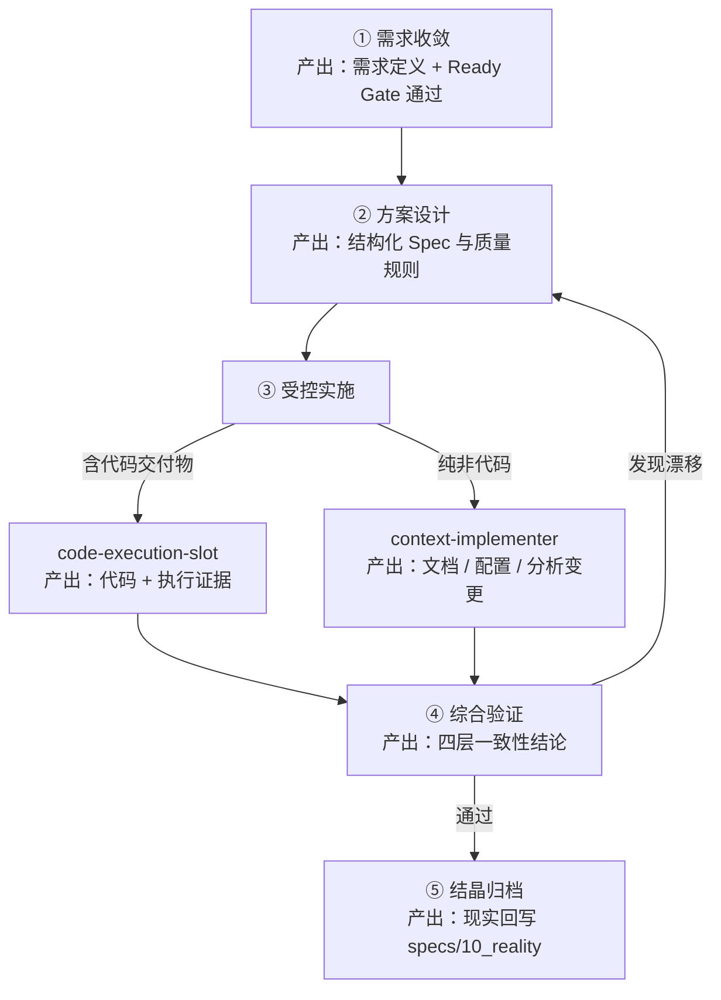
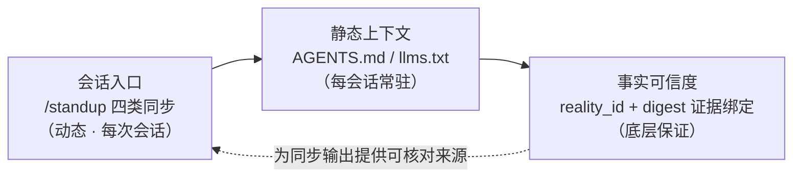
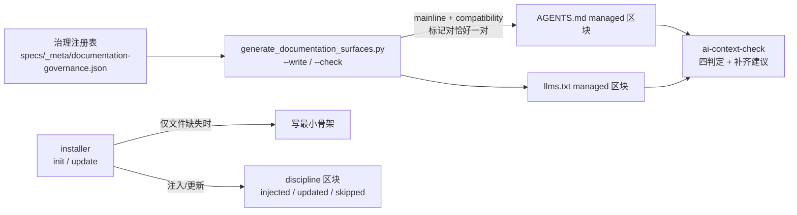

# 协作生命周期与治理质量

Maglev 的主链把请求分诊、现状同步、需求收敛、方案设计、受控实施、综合验证和结晶连接起来。治理质量不是流程外的建议，而是在来源、状态、交接和验证证据上形成阻断或放行依据。

> 面向正在评估 Maglev 的技术负责人与架构师：读完本页，你会得到从模糊需求到结晶归档的五个阶段如何衔接、每个阶段以什么为进入条件、产出什么，以及不同项目阶段该从哪个入口进入这套工作流。

## 五阶段总览

Maglev 把一次完整交付组织为五个阶段：需求收敛 → 方案设计 → 受控实施 → 综合验证 → 结晶归档。前一阶段的产出是后一阶段的进入条件，任何阶段不达标都会被挡回，而不是带着模糊继续往前走（出处：Maglev 范式架构）：

这条链路由治理纪律托底：纪律不是“建议”，而是可检测、可升级的系统——惰性模式可被识别，处理压力按 **五级压力分级（L0-L4）** 升级（出处：[maglev-discipline 治理纪律](../../../.agents/skills/maglev-discipline/SKILL.md)）。

## 阶段一：需求收敛

入口分诊（entry-router）把请求交接给需求收敛后，对抗式质问被用来逼出高质量需求：意图被拆解、边界被逐项确认，模糊任务不会直接滑入方案设计。阶段产出是边界稳定的需求定义，通过 Ready Gate 检查后以最小交接进入下一阶段。

把"把需求问清楚"做成受控阶段，是 Maglev 与声明式工具的一个关键差别：大多数工具假设用户自己写好 spec，Maglev 不做这个假设。

## 阶段二：方案设计

需求边界稳定后，spec-designer 通过受控对话与结构化流程形成可执行的技术方案。Maglev 把 Spec 当作中间表示（Spec as IR）：Spec 是真理，代码只是针对特定技术栈的渲染（出处：Maglev 范式架构）。阶段产出是结构化方案与质量规则齐备的 Spec——它既是下一阶段实施的输入，也是验证阶段的对照基准。方案层由人定骨架、AI 填充，主责在人机之间显式划分。

## 阶段三：受控实施

实施按交付物类型分流，两条路径的入口和产出都不同：

- **代码交付物**：进入 `code-execution-slot`。Slot 从项目 `.maglev/extensions.lock` 读取 enabled 候选，Agent 根据任务上下文和选择说明加载对应 `entry_skill` 执行；没有合适候选时使用 agent-native fallback。
- **纯非代码交付物**：由 `context-implementer` 完成，覆盖文档、配置、分析与 Maglev 自维护。

两条路径都受同一条约束：代码是 Spec 的影子，改代码必须同步改 Spec，提交前的一致性校验会拦截"改了代码没改文档"或"改了文档没写代码"的漂移。扩展不会自动进入所有上下文，也不能绕过需求和方案阶段。

## 阶段四：综合验证

integrated-validator 对 requirements ↔ spec ↔ code ↔ tests 做四层交叉验证，产出一致性与偏差结论。发现漂移时回到方案设计修正 Spec，而不是在代码层打补丁了事。四层交叉验证是外部工具普遍不具备的能力面：生成工具验证"代码能不能跑"，Maglev 验证"实现是否仍然是意图的忠实投影"。

## 阶段五：结晶归档

验证通过后，crystallization 完成结晶条件确认与现实回写判定：有长期价值的结论回写到 `specs/10_reality` 当前事实层，回写受 floor / ceiling 双向质量卡点约束；完成生命周期的主题归档。阶段产出有两份：更新后的仓库事实，以及归档的主题记录。

至此，Spec 的完整生命周期——创建、使用、结晶、归档——形成闭环。大多数工具的文档写完即开始腐烂；这条链路里，仓库的"当前事实"只由验证过的结论维护。

## 入口分层：什么阶段用什么入口

工作流的入口按项目阶段分层，不同阶段用不同入口（出处：Maglev 入口总览）：

| 项目阶段 | 入口 | 说明 |
|---------|------|------|
| 安装前（项目未接入） | npm / npx 包 | 正式首装入口，调用包内安装器，自带离线资产 |
| 安装后 | AI workflow / skill | 上下文同步、导航与解释；兼容入口如 `/standup`、`/create-spec`、`/quick-dev`、`/validate-all` |
| 安装后 | 安装器后续命令 | `update`、`dry-run`、`force`、本地离线更新 |
| 源仓库维护 | 版本与发版脚本 | `maglev_version.py` 统一版本状态，`maglev_release.py` 构建发行产物 |

两个评估时容易误判的点：其一，AI workflow / skill 建立在项目已有 `.agents/` 资产的前提上，在一个还没接入 Maglev 的项目里，AI 助手不是正式安装入口；其二，npm / npx 不是另一套独立逻辑，AI workflow 也不是另一套同步引擎，所有入口围绕同一个执行核心组织。

## 版本对用户意味着什么

入口分层表里的版本与发版脚本回答的是维护者视角的"发没发、发了什么产物"；对使用者而言，每个版本"对用户意味着什么"由独立的发行知识承载，与发版流程分离（出处：发行知识能力）：

- **版本语义四分类**：版本说明按用户语义把变更分为新特性（能做以前不能做的事）、打磨（已有能力更好用）、缺陷修复（行为回归正确）、破坏性变更（升级前需要主动适配）四类。
- **三件产物**：`.maglev_build/CHANGELOG.md` 是构建态镜像，随当次 release 构建分发；`docs/releases/<version>.md` 逐版归档，每版一档；`docs/releases/index.md` 维护版本索引与当前版本指针。
- **生成与发版分离**：版本说明由 `maglev-changelog-generator` 生成，它仅是 Creator——只生成说明，不执行发版动作；npm 发布、git tag、release 分支推送仍属发版流程。

主要消费场景是升级前查阅：升级前看目标版本的归档说明，确认是否包含破坏性变更、要不要主动适配，再决定升级节奏。

## 下一步

- 看这条链路挂在什么架构上：[架构总览](architecture-overview.md)
- 看它与相邻方法论的分界：[与相邻概念的边界](../business/comparisons.md)
- 准备接入时，从安装开始：[安装 maglev-cli](../developer/first-success.md)

---

> 面向正在评估 Maglev 的技术负责人与架构师：读完本页，你会理解人与 AI agent 的每次会话从哪里获得可信起点——动态的会话同步、静态的上下文入口、以及底层事实的可信度由什么保证。

每次会话开始，人和 agent 都面临同一个问题：不读全仓，凭什么知道"现在仓库是什么状态、有什么风险、下一步做什么"？仅靠记忆或过时的文件约定，AI 容易在会话起点误判主线、忽略结构性风险、给出错误的下一步建议——这是 [reality-sync 技能定义](../../../.agents/skills/reality-sync/SKILL.md)里登记的原始动机。

先回答评估时的三个直接问题：**接在哪一层**——会话入口与上下文注入层，位于你自选的编码工具之外，Maglev 不碰代码生成层；**与现有体系冲突吗**——不冲突，同步是只读动作，上下文注入只在文件缺失时发生、已存在内容一律不动；**要不要一次铺满**——不需要，下面三层机制各自独立成立，可以只用其中任何一层。

## 会话入口：四类同步对齐"现在在哪"

第一层是动态同步。用户说 "Standup."（`/standup` 兼容入口）时，[reality-sync](../../../.agents/skills/reality-sync/SKILL.md) 按 **Reality / Risk / Action / Mode 四类同步**对齐仓库真实状态，输出固定为 `[Space]`（当前主线与位置）、`[Mind]`（最近已确认的事实与阶段）、`[Risk]`（当前重要风险）、`[Action]`（1-3 个最优先动作）、`[Mode]`（单个推荐模式：Analyze / Implement / Verify / Release）五节。这一设计让人类开发者在新会话快速建立对仓库状态的可操作认知，也让 AI agent 在不读全仓的前提下获得会话起点的事实底座（能力事实见 会话现状同步能力）。

同步不是凭印象作答。reality-sync 启动时先做运行时 preflight（`./scripts/maglev-python --doctor`），再验证 skills 索引（`track_verify`）；preflight 失败会显式暴露 `env_failed` 并给出修复动作，索引验证不通过则提示重建——而不是带着过期索引继续输出。索引健康检查只确认入口索引"可验证且新鲜"，任务级导航仍留给后续受控阶段消费收据。

## 静态上下文：AGENTS.md 与 llms.txt 双入口

第二层是每会话常驻的静态上下文。跨平台 agent 从 AGENTS.md 获得会话入口——红线纪律、目录速查、定位锚点、managed 主链路区块、Skill 优先级协议；AI 代理从 llms.txt 获得上下文地图——身份定义、快速开始指令表、兼容入口与导航系统。两个文件分工明确：一个约束"进仓库后怎么行为"，一个回答"这个仓库里有什么、从哪开始"（构成与分工见 Agent 上下文入口）。

这套上下文面的维护有一条完整的治理链，而不是靠人工自觉：

三个构件各管一段。**installer 只在缺失时注入骨架**：`ensure_ai_context_files` 对已存在的入口文件保持不动（用户内容优先），只补缺失文件的最小骨架；discipline 区块注入按 `injected` / `updated` / `skipped` 三态报告结果。**managed 区块由治理注册表统一渲染校验**：主链路、兼容入口等受管表面从注册表生成，渲染器要求每个 managed 标记对恰好一对，不符即报结构错误——手工编辑 managed 区块会在下次校验时被打回。**ai-context-check 四判定只判断不重写**：对两个入口文件做存在性（present/missing）、充分性（sufficient/insufficient）、漂移（aligned/drifted）、上游私有污染（clean/contaminated）四项判定，输出存在性、充分性、漂移风险与最小补齐建议四段，契约明确首轮不做自动 merge、重写或下发（检查契约见 [AI Context Check Contract](../../../.agents/skills/_internal/ai-context-check/contract.md)）。

## 事实可信度：证据绑定与四态

前两层给出"起点"，第三层回答"凭什么信"。Maglev 的当前事实层 specs/10_reality/ 为每页登记 `reality_id`，claim 从页面 frontmatter 由脚本机械枚举，再以 digest 绑定证据文件——证据逐字节可复核，而不是一句"参见某文档"。

每条事实的状态用四个词表达证据充分度，词表与语义由 术语表与 00_profile.yaml 持有：

| 状态词 | 含义 | 证据充分度 | 它不表示 |
| --- | --- | --- | --- |
| established | 有直接证据（digest 绑定）支撑的当前事实 | direct：证据文件逐字节可复核 | 不表示生产环境验证过、不表示运行时成立 |
| unknown | 查过、无法成立的点 | missing：写明缺什么 | 不是"没查过"，也不等于失败 |
| not_established | 有线索但证据不足 | partial：不得当 established 用 | 不是已成立事实，也不是被否决的结论 |
| not_applicable | 页面/契约对该模块不适用 | 须记录判断依据 | 不是"没有证据"的委婉说法 |

状态来自来源角色与证据，不来自叙述流畅度，也不表示运行时验证通过——这套口径的原始登记见 10_reality 读取限制。

## 边界澄清：三层各自"不是什么"

这套起点对齐机制的能力边界是刻意的，评估者最值得核对的正是这里：

- **同步不保证输出事实质量**。reality-sync 能力页明文登记：四类内容的贴合度依赖当次索引状态，当前无运行质量记录机制；同步也不代用户做任务导航——它只把起点对齐，把起点变成结论之间的推理仍由后续受控阶段承担。
- **上下文入口不承诺与源始终同步**。Agent 上下文面能力页登记了已知缺口：CLAUDE.md 适配层已观察到陈旧条目（生成器无删除分支），双入口内容并非永远与源一致。
- **digest 一致不等于内容真实**。10_reality README显式声明："结构通过"不能包装成"内容真实"——证据绑定证明"这段话登记时与某个可复核的文件逐字节一致"，不证明文件内容本身正确；同理 `established` 也不等于运行时验证通过。

换句话说，Maglev 在会话起点提供的是**可核对的起点与诚实的证据状态**，而不是"已验证为真"的承诺。这一取舍是本页与"Maglev 保证 AI 输出正确"这类表述之间的分界线。

## 下一步

- 看这三层机制在整体架构中的位置：[架构总览](architecture-overview.md)
- 看对齐后的会话如何进入主链路：[核心工作流](lifecycle-and-governance.md)
- 看与相邻概念（Spec Kit、BMAD 等）在上下文治理上的分工：[与相邻概念的边界](../business/comparisons.md)
- 准备接入时，从安装与初始化开始：[安装 maglev-cli](../developer/first-success.md)
