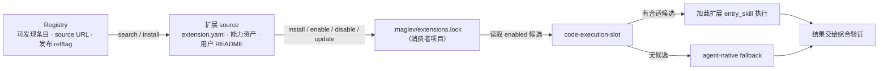
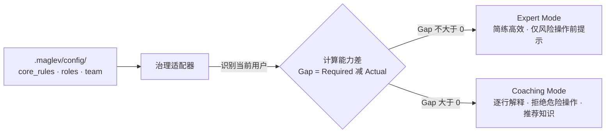
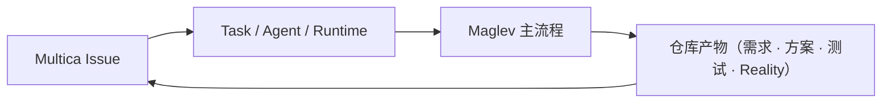

# 执行运行时、交付与能力进化

这三个能力域经常一起被提及，但责任不同：技能运行时负责选择和消费能力，交付运行时负责安装、更新、构建和下发，能力进化负责观察外部信号并治理能力演进。它们的组合不等于无限兼容。

> 面向正在评估 Maglev 的技术负责人与架构师：读完本页，你会得到外部能力如何通过扩展机制进入执行链、治理适配器如何把静态配置转译为动态约束、扩展的持续迭代由什么保证，以及 Maglev 与现有工具链共存的边界。

## 扩展如何进入执行链

Maglev 采用微内核思路：核心治理能力由主线技能链持有，具体领域能力以 Extension Pack 形式外挂。代码交付物进入 `code-execution-slot` 时，Slot 从项目 `.maglev/extensions.lock` 读取 enabled 候选，Agent 根据任务上下文和选择说明加载对应 `entry_skill`；没有合适候选时使用 agent-native fallback（出处：[code-execution-slot 技能定义](../../../.agents/skills/code-execution-slot/SKILL.md)）。

这条路径有两道刻意的约束：扩展不会自动进入所有上下文，也不能绕过需求和方案阶段。换句话说，扩展提供"用什么执行"的候选，执行仍然发生在需求收敛和方案设计之后，结果仍要交给综合验证。

## 治理适配器：从静态配置到动态约束

接入一个新的 Agent 平台时，Maglev 的治理配置不需要重写，而是通过治理适配器转译。适配器读取 `.maglev/config/` 下的静态配置——核心行为准则（`core_rules.md`）、角色定义与权限（`roles.yaml`）、团队成员信息（`team.yaml`）——把它变成该平台 Agent 的动态约束（来源：治理适配器设计）：

设计思路分三步：先加载真理来源（规则、角色、成员三份配置），再做上下文感知——识别当前用户，对比其 `skills` 与角色 `required_skills` 计算能力差，最后按能力差调整行为模式。能力足够时协作简练高效；能力有差距时进入辅导模式：对生成的代码逐行解释、拒绝可能造成数据丢失的 shell 命令（除非用户明确覆盖）、主动推荐相关知识文档。适配器同时做技能桥接：检查 `.maglev/skills/` 下的项目特定技能并提示可用项。

这套机制的直接效果是让权限约束可执行。例如 `roles.yaml` 定义某角色不得直接修改源码，Agent 在响应删除或修改请求时就能依据配置拒绝越权操作并给出替代路径，而不是依赖提示词里可被忽略的"建议"。

## Multica 多智能体扩展

单 agent 的扩展解决"用什么执行"，多 agent 协作则由 Multica 承载：Multica 是第三方多智能体运行环境，Maglev 通过 Squad Kit 把自己的多角色协作适配为可安装、可校验、可升级的小队模板。分工一句话：**Multica 管协作与执行环境（Workspace、Issue、Agent、Runtime、Task），Maglev 仓库管项目质量事实（需求、方案、用例、实施约束、验证、Reality、Extension）**（来源：Multica Squad Kit 能力、Multica × Maglev 整体模型）。

### 五套小队模板

| 模板 | 版本 | 角色 | 定位 |
|------|------|------|------|
| `maglev-complete` | 0.4.0 | 9 | 默认完整小队：Coordinator 串联需求、方案、实施、审查、验证、审计与收口 |
| `maglev-legacy-onboarding` | 0.2.1 | 7 | 存量项目接入：只读接入与 Reality 建模小队 |
| `maglev-complete-lite` | 0.1.1 | 3 | Coordinator / Generalist / Validator 三角色串联完整生命周期 |
| `maglev-legacy-onboarding-lite` | 0.1.2 | 3 | 三角色覆盖存量接入阶段 |
| `maglev-platform-operations` | 0.1.0 | 3（平台域） | 继承完整小队并显式接入平台操作域，非默认模板 |

角色清单与拓扑登记在各模板 `manifest.yaml` 与 catalog.yaml。通用小队设计方法（`multica-squad-design-method`）不固定角色名称；Maglev Adapter（`multica-squad-architect`）把协调/路由责任映射为唯一的 `coordinator`，该映射是样本实现，不回写为通用方法的固定角色名。

### 质量分级：声明上限（L2）

模板通过 self-check 后可声明 `squad_quality`，当前可声明的模板验证级别是 **模板验证级别（L2）**，对应 `template_verified`；Adapter 已落地模板资产、测试和静态验证。更高的运行验证级别 **运行验证级别（L3）**，对应 `runtime_verified`，需要“真实第三方承载端到端验证”的 Runtime Proof，**当前未声明**：本仓库没有用本地验证替代它（出处：Multica Squad Kit 能力）。

### 五层产物模型：什么放哪里

| 层级 | 作用域 | 权威位置 |
|------|--------|---------|
| 集成契约（L1） | Multica × Maglev 的接入需求（Intent / Requirements / Design / Plan） | Maglev active spec |
| 运行资产（L2） | 进入目标 Provider 和 Runtime 的机制（适配资产、Bridge、Agent 配置、Extension lock） | 按运行资产表唯一定位 |
| 迭代交付（L3） | 单个真实需求的需求、方案、用例、代码、测试 | 对应项目仓库 |
| 协作控制（L4） | 具体 Project、Issue、Task 的 Handoff、批准记录、责任人 | Multica |
| 验证证据（L5） | 每个门禁声明和最终结果（探针、命令输出、验证报告） | 仓库为主，Issue 链接摘要 |

五层各有唯一权威位置，混放的代价是具体的：把集成契约复制进 Workspace Skill 会形成两个流程事实源；**把 Task 的 `completed` 当成验证通过会绕过质量门禁——Task 完成不等于项目质量通过**，验证事实以仓库侧证据为准。

### 引入前提与边界

- 目标仓库必须已完成 Maglev 初始化；Multica 小队负责把 Issue、Task、Agent、Runtime 连接到仓库中的 Maglev 流程，不替代初始化，也不会自动生成 `.agents/skills/` 或 Provider 适配资产。
- 主链路技能不感知 multica 等载体：载体回执契约只存在于 Squad Kit 与适配层技能中，发行流水线以载体中立检查拦截窄化复发。
- Lite 模板不声明与母模板相同的专业角色深度或 Agent 身份隔离；`maglev-platform-operations` 不改变 Maglev 主流程、不隐式继承其他小队 skills。

对评估的直接含义：引入 Multica 不改变质量闭环的归属——协作状态看 Multica，质量事实看仓库。

## 扩展的持续迭代靠什么保证

一个 Extension Pack 发布之后，迭代质量由四方职责边界与维护记录共同保证（来源：扩展维护指南）：

| 位置 | 持有内容 |
|------|---------|
| Maglev | extension-evolver 流程、协议、确定性 CLI 和消费者管理入口 |
| 扩展 source | `extension.yaml`、能力资产、用户 README、`maintenance/` 维护记录 |
| Registry | 可发现条目、source URL、发布 ref/tag 与推荐治理 |
| 消费者项目 | `.maglev/extensions.sources.yaml`、`.maglev/extensions.lock` 与已安装资产 |

一次迭代的最小闭环：读取 manifest、Registry entry 和已有消费者的 lock 确定基线 commit；评估变更对安装路径、skill id、Slot、默认启用、运行时要求的影响；修改 pack 与 README 并同步 manifest 版本与兼容性声明；新增维护记录；在隔离项目中执行 `check` 与 `test-install`；对 Git source 验证 search / install / update / remove；确认 Registry ref/tag 已发布。`maintenance/` 是 source 侧资产，不写入 `extension.yaml` 的 `contents`，因此不会被安装进消费者项目。

兼容性按影响分级：修正文档、引用或不改变安装结果的实现是 patch；新增资产或可选能力是 minor；移动/删除受管资产、改 skill id / Slot / 默认启用、增加必需运行时是 breaking，需要提供迁移或停止发布。

维护记录之所以是发布条件，是因为 Registry 的 `ref` 只能说明"从哪里取内容"，不能解释"为什么本次改动可升级"。变更意图、受影响消费者、兼容性结论、验证命令、Registry commit 和 asset commit——这些事实无法从 lock 推导，缺任何一项，就不应宣称该扩展具备可持续迭代能力。

## 与现有工具链共存的边界

Maglev 的集成策略是叠加而非替换：

- **不替代代码生成层**：编码工具由团队自选，Maglev 是它的上游输入层和下游验证层，不限定具体 provider。
- **不覆盖已有内容**：安装器初始化时对已存在的上下文文件一律跳过，不覆盖用户内容。
- **不侵入业务逻辑**：对存量项目，建议以 sidecar 方式挂载（`.maglev/` 目录或独立治理仓库），只读取代码建立 Spec 事实，不改动业务逻辑本身。
- **不放大执行权限**：扩展经显式 install / enable 才进入 lock，Slot 的候选范围以 lock 为准，且不能绕过需求和方案阶段。

对评估的直接含义：引入 Maglev 不需要更换现有编码工具、CI/CD 或 IDE。它改变的是这些工具收到的输入质量（Spec、边界、验证依据）与产出被检查的方式（四层交叉验证），而扩展机制决定哪些额外执行能力被允许进入这条链路。

## 跨平台适配：Claude Code 只读快照

Maglev 能力对其他编码平台不使用双写同步，而是单向生成。以 Claude Code 适配层为例：`packages/maglev-claude-code` 的 generate 动作把仓库技能单向生成到 `.claude/skills/` 只读快照并生成 `CLAUDE.md`（见 `specs/10_reality/adoption-integration/capability/overview.md`）。

这个形态有一个评估者需要知道的边界：源技能变更之后、重新生成之前，适配层快照可能落后于源——跨平台接入物是"生成物"，不是持续同步的镜像。因此在源技能演进后需要重新执行生成，且不应直接手改生成目录里的内容（它们会被下次生成覆盖）。

## 下一步

- 看扩展所在的整体架构：[架构总览](architecture-overview.md)
- 看扩展在五阶段链路中的位置：[核心工作流](lifecycle-and-governance.md)
- 看与相邻概念的边界：[与相邻概念的边界](../business/comparisons.md)
