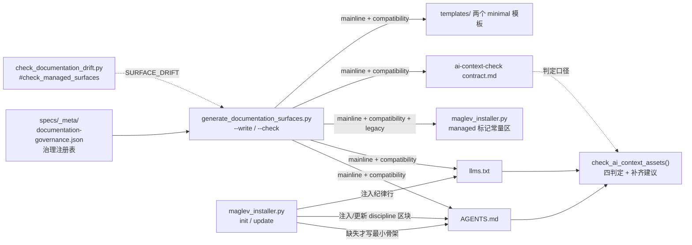

# Agent 上下文入口

## 1. 架构范围与约束

| 范围对象 | 模块内责任 | 已知约束 | 静态依据 |
| --- | --- | --- | --- |
| `AGENTS.md` | 跨平台 agent 的会话入口：红线、目录速查、定位锚点、managed 区块、Skill 优先级协议 | 标记外人类内容不被注入链触碰 | `AGENTS.md` 本体 managed 标记（72-92 行） |
| `llms.txt` | AI 代理的上下文地图：身份定义、快速开始、managed 区块、导航系统 | 同上 | `llms.txt` 本体 managed 标记（22-42 行） |
| ai-context-check 契约 | 统一两文件的最小检查口径（四判定 + 补齐建议） | 只判断不重写；首轮不自动 merge/重写/下发双入口 | `contract.md#统一检查维度`、`contract.md#首轮边界` |
| installer 上下文注入 | init 缺失时写最小骨架；discipline 区块与纪律行注入/更新 | 已存在文件保持不动（用户内容优先） | `maglev_installer.py#ensure_ai_context_files`、`#ensure_discipline_pointer` |
| 治理注册表面 | 由注册表渲染/校验各文件的 mainline/compatibility/legacy 区块 | 标记对必须恰好一对，否则报结构错误 | `scripts/generate_documentation_surfaces.py#TARGETS` |

## 2. 静态关系图

## 3. 构件与边界表

| 构件 | 职责 | 入/出边界 | 关键锚点 | 关联页面 |
| --- | --- | --- | --- | --- |
| `AGENTS.md` | 跨平台 agent 读到的会话约束与主链路事实 | 入：治理脚本 + installer 写入；出：agent 会话起点阅读 | `AGENTS.md`（managed 标记 72-92 行） | `../agent-context-surface/operations/configuration.md` |
| `llms.txt` | AI 代理读到的身份、导航与主链路事实 | 入：同上；出：agent 任务入口选择 | `llms.txt`（managed 标记 22-42 行） | 同上 |
| `contract.md` | 四判定（存在性/充分性/漂移/污染）与输出四段的口径 | 入：两入口文件文本；出：判定与建议，不改写文件 | `.agents/skills/_internal/ai-context-check/contract.md` | `../agent-context-surface/operations/errors.md` |
| `check_ai_context_assets()` | 契约在 installer 内的实现 | 入：project_root 下两文件文本；出：report dict（内存对象，不落盘） | `maglev_installer.py#check_ai_context_assets`（770-897 行） | 同上 |
| `ensure_ai_context_files()` | init 阶段兜底：双入口缺失时写最小骨架 | 入：init 编排；出：新文件或跳过（已存在不动） | `maglev_installer.py#ensure_ai_context_files`（2004-2024 行） | `../agent-context-surface/operations/configuration.md` |
| `ensure_discipline_pointer()` | discipline 管理区块（AGENTS.md）与纪律行（llms.txt）的注入/更新 | 出：三态 `injected`/`updated`/`skipped` | `maglev_installer.py#ensure_discipline_pointer`（900-957 行） | `../agent-context-surface/operations/state-model.md` |
| `generate_documentation_surfaces.py` | 从注册表渲染 managed 区块并支持 `--write`/`--check` | 入：注册表 + 7 个目标文件；出：改写文件或 `SURFACE_*` 错误 | `scripts/generate_documentation_surfaces.py#TARGETS` | 同上 |
| 治理注册表 | mainline stages/cross_cutting/compatibility/legacy_vocabulary 的唯一事实源 | 被 generator、installer 常量区、测试共同引用 | `specs/_meta/documentation-governance.json` | — |
| minimal 模板 ×2 | 补齐建议的参照形态；随分发到达消费项目 | 分发资产（manifest 内含此两文件） | `.agents/skills/_internal/ai-context-check/templates/AGENTS.minimal.md`、`llms.minimal.txt` | `../agent-context-surface/operations/configuration.md` |

## 4. 架构未知项与深挖

| 未知/限制 | 未能证明的原因 | 已查材料 | 深挖入口 |
| --- | --- | --- | --- |
| `llms.txt` 末尾 `Updated: 2026-04-11` 时间戳的维护机制 | 未定位任何生成/更新该行的脚本或技能 | `llms.txt` 本体、scripts/ 目录清单 | `../agent-context-surface/verification/known-gaps.md` |
| `AGENTS.md` 人类区块（目录速查、工作原则等）的维护流程 | 标记外内容无脚本写入锚点，推断为人工维护但无流程记录 | installer 全文 + generator TARGETS（均不含人类区块） | `../agent-context-surface/operations/state-model.md` |
| `README.md` 的 managed 区块维护是否与本页组同链路 | `README.md` 在 generator TARGETS 内，但其内容维护归属未在本轮核对 | `scripts/generate_documentation_surfaces.py#TARGETS`、`README.md` 69-89 行 | 治理类主题 |
| 消费项目侧双入口的实际生成/更新效果 | 本轮 static_read 仅覆盖 maglev 自仓库实例 | installer 源码 + 契约首轮边界声明 | adoption-integration 轮次 |
