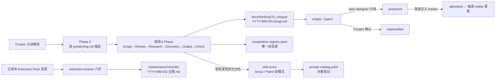

# 演进循环机制（观测 / 侦察 / 扩展迭代）

## 1. 机制范围与约束

| 范围对象 | 模块内责任 | 已知约束 | 静态依据 |
| --- | --- | --- | --- |
| 观测循环 | Phase 0（读 positioning.md 锚定）+ 6 Phase（Scope → Insight Review → Deep Research → Discovery → Output & Archive → Self-Check） | Phase 1/2 需 Creator 确认；Phase 4 即使无新竞品也必须记录"本轮未发现"；Phase 6 任一 blocking 项未过不可标记本轮完成 | workflow.md 各 Phase 段 |
| insight 状态机 | `open`（报告产出自动创建）→ `proposed`（spec-designer 引用）→ `absorbed`（改进合入 master）；`open` → `superseded` 需 Creator 确认；长期 open（建议 4 轮）触发再评估而非自动废弃 | source_report、title、created_at 创建后不可变；被 supersede 的 insight 保留完整内容 | insight-lifecycle.md 状态定义与不可变性原则 |
| registry 状态源 | `specs/10_reality/capability-evolution/evidence/competitive-registry.yaml` 唯一状态源：观察对象清单 + insight 状态 + 维度升级记录 | Insight Schema v2 每条附带需求预测四字段（demand_driver / demand_signal / maglev_applicability / response_strategy），意图是"需求预测，不是看到好的就抄" | SKILL.md 元信息段；registry 头注释与 meta/products 结构 |
| 侦察双模式 | Scout：`parse → search → evaluate → adapt → register`（发现并私域化）；Patrol：`scan → diff → report → optimize`（巡逻优化） | Hard Gate：未实际联网检索并留下显式证据不得进入 evaluate/adapt/register；生成能力已并入 skill-scout，不再依赖独立 Forge 对象 | skill-scout SKILL.md 交互模式与快速参考 |
| 扩展迭代六步 | 确认对象与基线 → 分类影响 → 设计最小变更 → 记录判断 → 运行验证 → 发布交接 | 兼容性不能确认必须标为阻塞；至少运行 `maglev-extension check` 与隔离项目 `test-install`；未推送的本地 ref 不是发布完成 | extension-evolver SKILL.md 工作流与决策规则 |

## 2. 循环关系图

每条边出处：Creator 触发与 Phase 0 锚定为 SKILL.md 交互模式段与 workflow.md Phase 0；
循环产出报告归档与 registry 更新为 workflow.md Phase 5；insight 三条转换为
insight-lifecycle.md 状态转换规则（superseded 边含 Creator 确认 Gate）；absorbed 触发
reality 更新为 SKILL.md 编组关系 `→ triggers crystallization`；观测 → scout 为编组关系
`↔ complements skill-scout`；scout 登记 catalog 为 SKILL.md 概览 register 步；扩展迭代边
为 extension-evolver SKILL.md 工作流与记录约定。

## 3. 构件与状态表

| 构件/状态 | 职责 | 入/出边界 | 关键锚点 | 关联页面 |
| --- | --- | --- | --- | --- |
| competitive-registry.yaml | 登记观察对象（products，含 version_tracked、activity_level、last_researched）与 insights、维度升级（pending/promoted） | 入：每轮 Phase 5 更新；出：研究推荐与 insight review 的读取源 | meta/products 段；dimension_upgrades 段 | `../evidence/`（状态源本体） |
| insight 记录 | 以 `{PRODUCT}-NNN` 全局唯一编号承载改进洞察 | 出：proposed 后作为 spec-designer 输入 | insight-lifecycle.md Insight Record Schema | `../capability/overview.md` |
| 研究报告 | point-in-time 快照，一经 commit 不可回溯修改 | 出：M-6 启示提炼为 actionable insights | workflow.md Phase 5 | `docs/thinking/10_critique/`（归档地） |
| PatrolReport | YAML 结构：generated_at / summary / opportunities（含 value_score）/ status | status 为 `all_current` 时流程终止，不进入 optimize | skill-scout references patrol-03-report.md 输出结构 | `../capability/overview.md` |
| maintenance/ 记录 | 每次可发布变更新增一份 record（意图、影响资产、兼容性结论、验证证据、Registry/source ref、已知风险）；不进入 contents 安装清单 | 出：Registry 发布交接信息 | extension-evolver SKILL.md 记录约定与维护记录模板引用 | `../verification/known-gaps.md`（无实例缺口） |
| patch/minor/breaking 决策 | 仅改说明 → patch；新增资产或改行为 → minor；删除/移动资产、改 skill id、Slot、默认启用或提高运行时要求 → breaking | breaking 必须提供迁移或明确停止发布 | extension-evolver SKILL.md 决策规则 | — |

## 4. 机制未知项与深挖

| 未知/限制 | 未能证明的原因 | 已查材料 | 深挖入口 |
| --- | --- | --- | --- |
| 后半段生命周期无执行实例 | 25 条 insight 全部 open | registry status 统计（本轮） | `../verification/known-gaps.md` |
| scout 中间产物落盘路径未约定 | SKILL.md 只声明"以 Markdown/YAML 文件持久化"，references 无路径定义 | skill-scout SKILL.md Memory 段；references 检索（本轮） | `../verification/known-gaps.md` |
| extension-evolver 验证链无本仓运行记录 | 无 maintenance/ 目录与 extensions.lock | 全仓 find 与 .maglev/ 盘点（本轮） | `../verification/known-gaps.md` |
