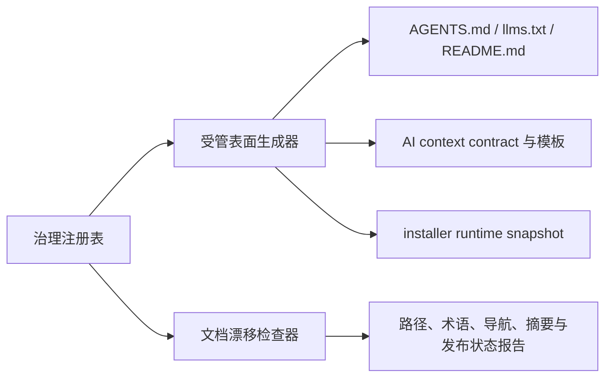

# 文档源治理与漂移验证

Maglev 使用 `specs/_meta/documentation-governance.json` 作为文档关系治理注册表。注册表登记当前事实的 canonical owner、派生投影、消费者、历史边界、兼容入口和非 Git 发布目标；正文仍由各自的 canonical 文档维护。

## 传播边界



受管表面通过 managed block 从注册表生成或校验。当前主链路、兼容入口和 legacy vocabulary 不再分别维护手工列表；installer 以 `runtime-src` 为源，`dist/` 由发行流程生成，若两者同时存在则漂移检查要求快照字节一致。

## 漂移检查

`scripts/check_documentation_drift.py` 校验注册表 schema、路径、canonical owner、派生来源、必填 entry contract、历史 disposition/successor、目录级历史边界、受管表面、旧术语、当前入口链接、current navigation roots 下的 guide 链接、历史导航、runtime source/dist 快照和发布包 freshness。`scope.current_navigation_roots` 与 `ai_context_allowlist` 分开维护；当前为 `docs/guides`，检查器会递归扫描其中的 Markdown/text 文件。发布 manifest 的源摘要变化会报告 stale，`review_by` 到期会报告 review due；错误包含可定位的 code、path 和 message。

常用检查入口：

```text
python3 scripts/check_documentation_drift.py --root . --json
python3 scripts/generate_documentation_surfaces.py --check --json
```

## 非 Git 发布

`docs/publishing/` 是 derived publication layer，不拥有当前事实。每个发布包包含 `document.md`、`manifest.json` 和 `README.md`，manifest 记录源路径、SHA-256、受众、复审日期、freshness 和 private document integration `import-package` 目标。面向 private document integration 的包使用 `inline-reader-links` 时，会把登记的 Wiki 页面和直接关联指南物化到同一文档，并把仓库相对链接重写为包内 anchor；仓库内部来源改为参考来源 anchor，避免导入后的死链。第一阶段只生成可复审导入包，不调用 private document API、不保存凭据，也不允许 private document integration 反向成为事实源。

## 历史边界与源处置

旧运营内容与迁移层不保留在当前工作树；当前非 Git 发布入口是 `docs/publishing/`，`specs/90_archive/` 只作为历史依据，不作为当前 SOP 或 AI allowlist 入口。源瘦身先通过 disposition 表登记分类、保留理由和后继入口，再迁移导航或决定物理删除；原始历史由 Git history 追溯。

维护者修改主链路、兼容入口、旧术语或发布源时，应先更新治理注册表，再运行受管表面检查、漂移检查和相关测试。

深挖：[已知缺口](../verification/known-gaps.md)。
