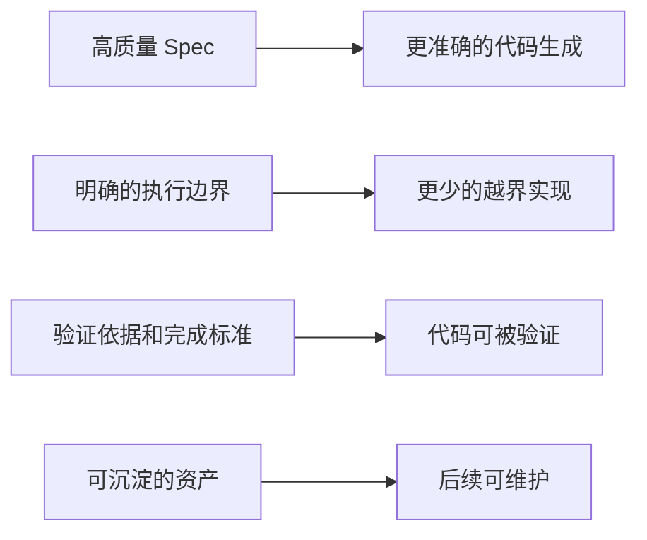

# Maglev 定位与边界

> **Purpose**: 在任何需要理解"Maglev 是什么/不是什么"的场景中，以此文件为锚点。
> **维护规则**: 当核心定位、边界或与外部工具的关系发生变化时更新。

## 1. 核心定位

Maglev 是一套帮助团队在 AI Coding 时代**稳定协作、持续交付并沉淀资产**的方法论、协议和可执行能力集合。

核心关注的问题是：**意图、设计、代码和验证之间的漂移**——AI 放大了执行速度，但也放大了这种漂移。

一句话：**Maglev 不是让 AI 多写一点代码的工具，而是让"写出来的东西"能持续对齐意图、边界和验证。**

## 2. 三层结构

| 层 | 位置 | 回答的问题 |
|----|------|-----------|
| 方法论 | `docs/thinking/` | 为什么这样做 |
| 当前规则 | `.agents/skills/`、`.agents/workflows/`、`internal Reality/` | 当前执行边界、兼容入口和事实 |
| 技能 | `.agents/skills/` | 能做什么 |

## 3. Maglev 不做什么（刻意边界）

| 不做的事 | 原因 | 由谁做 |
|---------|------|--------|
| 替代代码生成层 | 已有成熟的外部编码工具 | 用户自选的编码工具 |
| 追求编码层的"更强" | 那是编码工具的战场，不是 Maglev 的 | 各 AI Coding 框架 |
| 运维/部署/监控 | 不是 Maglev 的定位 | gstack /ship, CI/CD 工具 |
| 做平台/IDE | Maglev 是协议层，不锁定任何平台 | IDE 和 Agent 平台 |
| 构建大规模社区生态 | 当前阶段专注深度而非广度 | 远期方向 |

## 4. 与编码工具的关系

**关系类型**: Maglev 是编码工具的**上游输入层**和**下游验证层**，不是竞品。

**代码执行扩展**：代码交付物进入 `code-execution-slot`。Slot 从 `.maglev/extensions.lock` 读取 enabled 候选，Agent 根据任务上下文和选择说明加载对应 `entry_skill`；没有合适候选时使用 agent-native fallback。扩展不会自动进入所有上下文，也不能绕过 Maglev 的需求和方案阶段。

**编码工具接入**：更推荐接入能直接消费 Spec、遵循边界并返回测试与 review 证据的工具。Maglev 不限定具体 provider。

**context-implementer 定位**: 提供非代码实施能力（文档、配置、分析、Maglev 自维护）。

## 5. 核心能力域

| 域 | 核心价值 | 外部工具不做/做不好的 |
|----|----------|---------------------|
| 需求收敛 | 对抗式质问逼出高质量需求 | 其他工具是声明式的（用户自己写 spec） |
| Spec 质量 | 结构化方案 + 质量规则 | 其他工具无 spec 质量审计 |
| 追踪对齐 | requirements↔spec↔code↔tests | 没有其他框架做四层交叉验证 |
| 治理纪律 | 8 类惰性模式 + L0-L4 升级 | 其他工具纪律是"建议"，Maglev 是"可检测可升级的系统" |
| 知识分层 | 5 层 thinking/ + 3 层 specs/ + 结晶 | 其他工具是扁平存储 |
| Spec 生命周期 | 创建→使用→结晶→归档 | 没有其他框架管理 spec 的完整生命周期 |

## 6. 判断外部信号时的锚定规则

当分析竞品、市场趋势或用户反馈时：

1. **先问"这是不是我们的战场"** — 如果不是（如编码层/运维层），无论竞品做得多好都与 Maglev 无关
2. **如果是同层，问"他们解决了我们没解决的上游/下游需求吗"** — 而不是"他们的功能我们要不要也有"
3. **如果要借鉴，问"这个痛点是否也被 Maglev 用户遇到"** — 需求预测，不是功能模仿
4. **编码层的创新 = Maglev 的环境约束变化** — 它们变强意味着 Maglev 的输出可以被更好地消费，不意味着 Maglev 需要追赶

---

*Last updated: 2026-07-13*
*Source authority: `specs/_meta/documentation-governance.json` + canonical Reality and Skill sources/*
