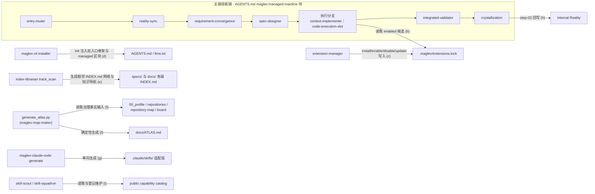

# 产品与模块架构

本页回答三个问题：项目为哪些能力域组织模块、模块之间有哪些静态可证实的关系、哪些关系不能由静态材料判定。模块边界、静态依赖和运行拓扑分开表达：第 3 节账本只登记有 `file:line` 锚点的关系，图中每条边先在账本中入账；无法定位的关系保留为 unknown，不从目录邻近、命名相似或运行假设补画边。

## 1. 产品范围与能力域

Maglev 的产品范围是一套帮助团队在 AI Coding 时代稳定协作、持续交付并沉淀资产的方法论、协议和可执行能力集合，组织为 14 个能力域。能力域的划分依据与 owning 模块锚点登记于 00_profile.yaml 的 `domain_registry`（每项含 `boundary_reason` / `boundary_basis` / `evidence_refs`），下表的任务与结果口径取自各域能力概览的"能力定位与受益者"账本。

| 能力域 | 面向的任务/结果 | owning module | 产品与实现依据 |
| --- | --- | --- | --- |
| 协作生命周期 | 把模糊请求沿主线收敛为需求、方案、实施、验证并结晶回写；看板观测各需求阶段与角色 | 00_profile.yaml `domain_registry` 锚定 `public capability catalog` 登记的主线技能对象 | [能力定位](./collaboration-lifecycle/capability/overview.md)；00_profile.yaml |
| 治理与质量 | 会话纪律约束、需求/方案输入审计、受管表面防漂移、统一回归入口、hooks 行为可观测 | `public capability catalog` 登记的治理技能对象 | [能力定位](./governance-quality/capability/overview.md)；00_profile.yaml |
| 技能运行时 | 决定"用什么执行代码"的插槽协议；扩展搜索/安装/生命周期命令面；现役能力对象与关系登记 | `public capability catalog`；`.agents/skills/code-execution-slot/` | [能力定位](./skill-runtime/capability/overview.md)；00_profile.yaml |
| 交付运行时 | 安装/更新运行时并保持受管文件一致；发版单入口；扩展 CLI；项目本地 Python 协议运行时 | `public capability catalog`；`packages/maglev-cli/` | [能力定位](./delivery-runtime/capability/overview.md)；00_profile.yaml |
| 接入与集成 | 空目录或存量仓库接入 Maglev 且不破坏现有逻辑；存量事实重建；范式教学 | `public capability catalog`；`packages/maglev-claude-code/` | [能力定位](./adoption-integration/capability/overview.md)；00_profile.yaml |
| 能力进化 | 竞品观测与 insight 生命周期；外部能力私域化登记；治理对象巡逻；扩展受控迭代 | `public capability catalog` | [能力定位](./capability-evolution/capability/overview.md)；00_profile.yaml |
| 机器索引引擎 | 多产物仓库中定位权威文件；任务导航收据；索引可信度的机器判定 | `.agents/skills/index-librarian/` | [能力定位](./machine-index-engine/capability/overview.md)；00_profile.yaml |
| 项目地图 | 唯一人读项目入口 `docs/ATLAS.md` 的确定性生成与漂移校验 | `.agents/skills/maglev-map-maker/` | [能力定位](./project-map/capability/overview.md)；00_profile.yaml |
| 会话现状同步 | 新会话快速对齐"现在仓库是什么状态、有什么风险、下一步做什么" | `.agents/skills/reality-sync/` | [能力定位](./session-reality-sync/capability/overview.md)；00_profile.yaml |
| 知识沉淀 | 高价值探索后确认"为什么"已落盘；9 段位段归类与找回 | `.agents/skills/knowledge-check/` | [能力定位](./knowledge-sedimentation/capability/overview.md)；00_profile.yaml |
| Agent 上下文面 | `AGENTS.md` / `llms.txt` 双入口骨架注入与 managed 区块渲染校验 | `packages/maglev-cli/runtime-src/maglev_installer.py` | [能力定位](./agent-context-surface/capability/overview.md)；00_profile.yaml |
| 规格知识分层 | specs 四层知识的分层、流转与回写边界 | `specs/README.md` | [能力定位](./spec-knowledge-layering/capability/overview.md)；00_profile.yaml |
| 运营文档体系 | guides、Wiki、索引与 Publishing 的用户解释和操作知识边界 | `.agents/skills/maglev-wiki/`；`.agents/skills/index-librarian/` | [能力定位](./operations-docs-system/capability/overview.md)；00_profile.yaml |
| 发行知识 | 升级前知道版本带来什么；发版时把机械变更清单转为可归档版本说明 | `.agents/skills/maglev-changelog-generator/` | [能力定位](./release-knowledge/capability/overview.md)；00_profile.yaml |

## 2. 模块关系图

仅展示第 3 节账本中有静态锚点的模块和边；边标签中的编号 (a)–(i) 对应账本行。

主链子图内的相邻边同属账本行 (a)：`entry-router → reality-sync → requirement-convergence → spec-designer → 执行分支 → integrated-validator → crystallization` 的顺序由同一静态锚点（`AGENTS.md` L72–L83 主链路块）承载，另以 L106 执行链行背书执行分支的入口规则。

## 3. 模块关系账本

| 来源模块 | 关系 | 目标模块/边界 | 静态锚点 | 不能推断的内容 |
| --- | --- | --- | --- | --- |
| entry-router（会话入口） | 主链顺序承载：分诊起点，逐级交接直至验证与结晶（覆盖图中主链子图全部相邻边） | 主链技能链直至 crystallization | `AGENTS.md` L72–L83（`maglev:managed:mainline` 块）；L106（执行链行） | 不证明会话级行为质量（收敛耗时、验证通过率无运行记录，[collaboration-lifecycle/capability/overview.md](./collaboration-lifecycle/capability/overview.md) L61 已登记 unknown）；不证明每次会话实际走完全链 |
| code-execution-slot（`resolve_slot.py`） | 读取 | 消费项目 `.maglev/extensions.lock`（enabled 候选来源） | `.agents/skills/code-execution-slot/protocol/scripts/resolve_slot.py` L14（`DEFAULT_LOCK`）；registry-mechanics.md | 不证明本仓存在已启用的扩展（本仓 `.maglev/` 下无 extensions.lock，[skill-runtime/verification/known-gaps.md](./skill-runtime/verification/known-gaps.md) 已登记）；不证明运行时槽位选择的实际结果 |
| extension-manager | 写入（install / enable / disable / update 命令语义） | 消费项目 `.maglev/extensions.lock` | extension-lifecycle.md L33、L45 | 不证明本仓发生过任何扩展安装（该页 L36 自述两状态文件在本仓均不存在）；不修改 provider 资产 |
| maglev-cli installer | 注入（init 首次写入） | `AGENTS.md` / `llms.txt` 双入口骨架与 `maglev:managed` 区块 | configuration.md L32、L37、L48；`packages/maglev-cli/runtime-src/maglev_installer.py` L2004（`ensure_ai_context_files`） | 已存在文件一律跳过、不覆盖用户内容；不证明消费项目当前内容与骨架持续一致（漂移由上下文检查面另行判定） |
| index-librarian（`track_scan.py`） | 生成 | specs/ 与 docs/ 各级 `INDEX.md` 网络及知识导航 | machine-index-engine/implementation/architecture.md L44、L58 | 不证明索引内容新鲜（新鲜度由 `track_verify` 校验）；导航收据是知识入口判断事实，不是任务成功证明 |
| `generate_atlas.py`（maglev-map-maker） | 读取并确定性生成 | 输入 00_profile / repositories / repository-map / board 四项治理事实；产物 `docs/ATLAS.md` | project-map/implementation/dependencies.md L37；`.agents/skills/maglev-map-maker/scripts/generate_atlas.py` L29–L34（`SOURCE_REL_PATHS`） | ATLAS 是派生观察视图，不替代 Reality 事实；其置信度自评 Medium（见第 4 节） |
| maglev-claude-code generate | 单向生成 | `.claude/skills/<skill>/SKILL.md` 只读快照与 `CLAUDE.md` | claude-code-adapter.md 第 2 节静态关系图（L42 起） | 源技能变更后、重新生成前，`.claude/skills/` 可能漂移；不证明 Claude Code 运行时的实际加载行为 |
| crystallization step-02 | 回写 | `internal Reality` | `AGENTS.md` L57；spec-knowledge-layering/capability/workflows.md L45 | 回写受 floor/ceiling 双向质量卡点约束，不证明单次回写内容质量；不证明所有 active 主题最终都回写（存在用户明确废弃 → 归档分支，同页 L46） |
| skill-scout / skill-squadron | 读取与登记维护 | `public capability catalog`（现役能力对象与 relations 的单一权威） | `public capability catalog` 头注释 L1–L24；`AGENTS.md` L69；`.agents/skills/skill-scout/SKILL.md` L83；`.agents/skills/skill-squadron/SKILL.md` L83 | `relations` 声明是登记事实，不证明运行时调用实际发生；登记完备性无机械校验（见第 4 节） |

## 4. 系统边界与未知项

| 边界/未知项 | 已证实范围 | 未能证明的原因 | 深挖入口 |
| --- | --- | --- | --- |
| 运行拓扑未采样 | 模块间静态关系（第 3 节账本）与契约级生命周期均有 `file:line` 锚点 | 各域已知缺口页统一口径：本仓无运行记录机制，触发频率、失败率、耗时等运行统计无数据源 | 各域 `verification/known-gaps.md`（如 [skill-runtime/verification/known-gaps.md](./skill-runtime/verification/known-gaps.md) 第 1 节） |
| catalog 完备性无机械校验 | catalog 头注释自述其登记字段与 relations 结构（L1–L24） | catalog 自述"不是 `.agents/skills/` 的机械镜像"；9 个 private document integration 对象未登记，且无逐对象免登记裁决记录，无法区分"裁决免登记"与"漏登记" | [capability-evolution/verification/known-gaps.md](./capability-evolution/verification/known-gaps.md) L55 |
| VO/TP/XG 未配置具体人员 | 三个角色的任务与职责映射已登记 | 角色当前均未配置具体人员，无法核对人名与职责的实际对应；本页不声明任何真实人员承担 VO/TP/XG | collaboration-lifecycle/operations/team-roles.md L65 |
| ATLAS 置信度 Medium | `docs/ATLAS.md` 由四项治理输入确定性生成（边 f） | 生成器声明"使用当前 Git 仓库并结合部分治理事实"，置信度自评 Medium，未达到 High 的差距无自动提升机制 | docs/ATLAS.md frontmatter（L8 `confidence: Medium`） |
