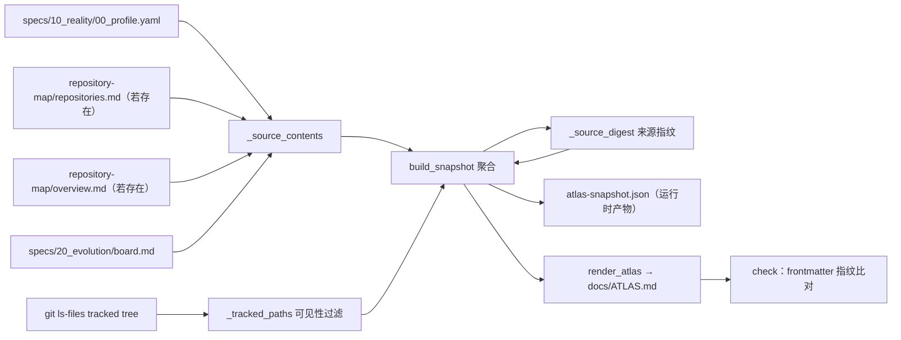

# 人读项目地图（maglev-map-maker）

## 1. 架构范围与约束

| 范围对象 | 模块内责任 | 已知约束 | 静态依据 |
| --- | --- | --- | --- |
| `generate_atlas.py` 单文件脚本 | 把治理事实与 Git 结构确定性合成为唯一人读地图 | 必须在 Git 仓库内运行：`git ls-files` 失败抛 `RuntimeError` | `generate_atlas.py#_tracked_paths`（L98-L101） |
| `docs/ATLAS.md` | 唯一人读地图产物，派生观察视图 | 每次生成整文件覆写；frontmatter 携带 `source_digest` 供校验 | `generate_atlas.py#render_atlas`（L350-L407） |
| `.maglev/temp/atlas-snapshot.json` | 结构化生成证据（gitignored 运行时产物，不作证据绑定） | 先写 snapshot 再写 ATLAS；不入版本库 | `generate_atlas.py#generate`（L428-L436） |
| `--check` 新鲜度机制 | 比对 ATLAS frontmatter 指纹与现算指纹，不写盘 | 指纹 = tracked path 集 + 治理源内容的 sha256 | `generate_atlas.py#check`（L444-L460）；`#_source_digest`（L130-L137） |
| 置信度机制 | 按输入可用性标注 High/Medium/Low | 输入缺失即降级，不猜测补齐 | `generate_atlas.py#_confidence`（L241-L251） |
| 写盘纪律 | 地图写盘始终是显式动作 | 初始化与日常 reality-sync 不自动写地图 | `.agents/skills/maglev-map-maker/SKILL.md`"何时使用"（L35-L37） |
| 治理源缺席容忍 | 缺席的治理源文件跳过读取，不阻断生成 | 4 个候选源任一缺席仅影响指纹与置信度 | `#_source_contents`（L121-L127） |

内容输入口径：三个内容解析输入为 Reality Profile、项目看板与 Git tracked tree；另有仓库清单与 overview.md 两个候选治理文件参与来源指纹，其中仓库清单决定 High 置信度的可达性（`SOURCE_REL_PATHS`，L29-L34）。

## 2. 静态关系图

图约束：每条边对应第 3 节构件表一行；图中不含运行时拓扑——何时触发生成属会话编排，见 `../project-map/operations/configuration.md`。

## 3. 构件与边界表

| 构件 | 职责 | 入/出边界 | 关键锚点 | 关联页面 |
| --- | --- | --- | --- | --- |
| CLI 入口 `main` | 解析 5 个参数并分流 generate/check | argv → 退出码 | `generate_atlas.py#main`（L463-L486） | `../project-map/operations/configuration.md` |
| Git 面 | tracked tree 获取、commit/dirty 判定、可见性过滤 | git 子进程 → 排序路径集 | `#_tracked_paths`（L91-L111） | `../project-map/implementation/components.md` |
| 治理输入读取 `_source_contents` | 读取 4 个候选源文件内容 | 文件系统 → sources dict（缺席文件跳过） | `#_source_contents`（L121-L127） | `../project-map/implementation/data.md` |
| 输入解析组 | Profile 域 / 仓库清单 / 看板表格解析 | 源文本 → 结构化列表 | `#_load_profile_domains`（L140）；`#_parse_board`（L182） | `../project-map/implementation/components.md` |
| 聚合 `build_snapshot` | 组装 snapshot：置信度、结构路径、回退仓库项 | 输入结构 → snapshot dict | `#build_snapshot`（L254-L281） | `../project-map/implementation/data.md` |
| 结构派生 `_structure_paths` | 从 tracked path 集派生 ≤2 层目录与 10 类根锚点文件 | 路径集 → 排序结构路径 | `#_structure_paths`（L229-L238） | `../project-map/implementation/data.md` |
| 置信度分级 `_confidence` | 按仓库清单/Profile/看板可用性输出三级判定 | 布尔输入 → (等级, 理由) | `#_confidence`（L241-L251） | `../project-map/implementation/dependencies.md` |
| 渲染 `render_atlas` | snapshot → ATLAS 全文（frontmatter + 5 节正文） | snapshot dict → markdown 字符串 | `#render_atlas`（L350-L407） | `../project-map/implementation/data.md` |
| 校验 `check` | 读 frontmatter 指纹并与现算指纹比对 | ATLAS 文本 → exit 0/1，不写盘 | `#check`（L444-L460） | `../project-map/verification/test-matrix.md` |

## 4. 架构未知项与深挖

| 未知/限制 | 未能证明的原因 | 已查材料 | 深挖入口 |
| --- | --- | --- | --- |
| `overview.md` 除参与指纹外的职责 | 被读取并入指纹，但无解析函数、渲染无对应节 | `SOURCE_REL_PATHS`（L29-L34）+ 脚本全文检索 | `../project-map/implementation/components.md` 未解析组件 |
| snapshot 是否存在生成器与测试之外的消费方 | 静态检索未定位其他读取方 | 脚本 + `tests/test_maglev_map_maker.py` | `../project-map/implementation/data.md` |
| 多仓库清单输入下的渲染实例 | 本仓当前无 `repositories.md`，仅有单元素回退实例 | 回退分支（L262-L263）；现役 ATLAS"仓库范围"节 | `../project-map/implementation/data.md` |
| 单文件形态下的扩展方式 | 490 行 6 函数组、无内部包结构，扩展时的拆分边界无既有先例 | 脚本全文；与 M1 索引引擎 common/ 多构件形态对照 | `../project-map/implementation/components.md` |
| `--generated-at` 覆盖后时间戳的下游语义 | 覆盖仅改变 frontmatter 与 snapshot 的 `generated_at` 取值（可复现渲染）；是否有消费方依赖其为真实时间，未定位 | `#generate` L425-L429 | `../project-map/implementation/data.md` |
