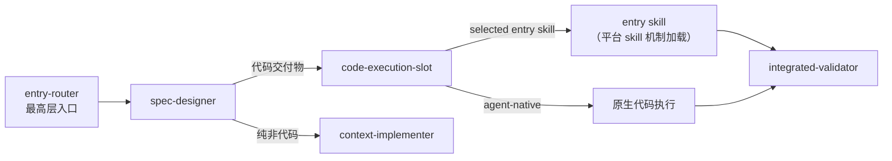

# 技能运行时能力

## 1. 能力定位与受益者

| 受益者/调用方 | 要完成的任务 | 模块提供的结果 | 产品依据 |
| --- | --- | --- | --- |
| AI Agent（代码交付阶段） | 在方案完成后决定"用什么执行代码" | 插槽协议：确定性 resolver 候选 + Agent 语义选择 + `agent-native` 回退 | `.agents/skills/code-execution-slot/SKILL.md` "执行流程" |
| 人类开发者 | 搜索、检查、安装、启用、禁用、更新、移除扩展 | 确定性 CLI 消费命令面与 JSON envelope 结果解释 | `.agents/skills/extension-manager/SKILL.md` "消费命令" |
| 治理者与接入的 AI Agent | 知道哪些能力对象现役、彼此什么关系 | 现役清单与关系图（relations）登记 | `public capability catalog` 头注释 |
| 主流程编排者 | 把代码/非代码交付物路由到正确执行入口 | Skill 优先级协议：执行链与代码执行路由规则 | `AGENTS.md` "Skill 优先级协议" |

## 2. 当前事实

### 2.1 技能注册：private-catalog.yaml 是单一权威

- 登记对象是"治理对象清单"，不是 `.agents/skills/` 与 `.agents/workflows/` 的机械镜像；无独立治理价值的对象（纯包装层、临时入口）可不登记。
- 清单只保留现役对象：`status` 以 `active` 为准，`deprecated` 仅作短期迁移态；被替代的旧名不作为并列现役对象占位。
- 条目字段含 `name`（kebab-case、全清单唯一、与对象真实入口名称一致）、`path`（skill 为以 `/` 结尾的目录路径，workflow 为 `.md` 文件路径）、`formal_action_name`、`runtime_name_status`（`active_legacy_name` / `canonical_name_active`）、`distribution_scope`（`user_visible` / `runtime_internal` / `private_only`）、`top_level_capability`、`object_kind`、`version`、`relations`。
- `relations` 只记录有治理价值的稳定关系；类型枚举 `calls` / `called_by` / `complements` / `shares_data` / `precedes` / `preceded_by`，`target` 只能指向清单内其他治理对象，不允许把数据文件、目录、普通文档当作关系目标。
- 本域两个核心对象在清单中的登记态：
  - `code-execution-slot`（代码执行插槽）：`user_visible`、`canonical_name_active`、顶层能力"上下文实施"；关系：被 `spec-designer` 调用（代码类交付物路由至此）、调用 `integrated-validator`、与 `context-implementer` 双向互补（代码走 Slot、非代码走 context-implementer）。
  - `extension-manager`（扩展管理）：`user_visible`、`canonical_name_active`、顶层能力"能力进化"；关系：与 `index-librarian` / `skill-scout` 互补，向 `skill-squadron` 共享扩展安装与 slot 注册状态。

### 2.2 能力选择：Skill 优先级协议

- Maglev `entry-router` 始终是最高层入口；任何外部 skill 仅在 `code-execution-slot` 从 lock 解析、选择后才生效。
- 禁止外部 skill 自动触发：外部能力不得绕过 Maglev 的需求、方案和 Slot 选择纪律进入执行。
- 执行链：`entry-router → spec-designer → code-execution-slot → selected entry skill | agent-native → integrated-validator`。
- 代码执行路由：spec 含代码交付物 → `code-execution-slot`；纯非代码 → `context-implementer`。

- 进入插槽后的选择纪律（`code-execution-slot/SKILL.md` "选择纪律"）：只使用 resolver 返回的 enabled 候选，不从 registry 搜索结果推断已启用状态；external integration 必须保持 `detected: true` 否则不能选择；不因候选存在就自动选择，必须给出与任务匹配的判断依据；多个候选同样适用且会改变执行方法时，向用户说明差异后再选择；`priority` 仅作为同等匹配时的排序提示，不替代语义判断。

### 2.3 代码执行插槽：协议与回退

- `code-execution-slot` 只定义插槽协议，不安装扩展，也不绑定具体 provider。
- 触发前置：需求与方案已稳定，`delivery_type` 为 `code` 或 `mixed`，或实施清单明确包含代码文件；在选择 provider 或进入 `agent-native` fallback 前，必须校验 `index-librarian` 导航收据，`insufficient` / `exhausted` 状态不得进入代码执行。
- 执行流程：运行确定性 resolver（`resolve_slot.py --workspace-root . --json`）→ 校验导航收据 → 按"用户显式指定 > `selection_hint` 与任务匹配度 > spec 约束与候选能力边界 > `priority` 平局提示"选择候选 → 通过当前 Agent 平台的 skill 机制加载其 `entry_skill`（不得直接导入、复制或改写 provider 资产）→ 没有候选或没有候选适合当前任务时使用 `agent-native` fallback → 收集变更 diff、测试结果、review 发现和剩余风险，交给 `integrated-validator`。
- 输出契约：至少包含 Slot 解析结果与选择依据、实际使用的 `entry_skill` 或 `agent-native` fallback 原因、代码变更范围、测试与 review 证据、可交综合验证的验证包。
- 本仓当前实测（本轮运行 1 次）：`.maglev/extensions.lock` 不存在，resolver 返回 `status=pass`、`candidates=[]`、`fallback={mode: agent-native, reason: no_enabled_candidate}`，exit 0。

### 2.4 扩展管理：CLI 薄入口

- `extension-manager` 只调用 PATH 上已安装的 `maglev-extension`，不手写复制、lock 更新或 registry 解析逻辑。
- 负责：配置与查看消费者项目的 Registry source（`.maglev/extensions.sources.yaml`）；search、inspect、安装、更新、启用、禁用和移除 extension；解释 CLI 的 JSON envelope、issues 和 slot 候选；CLI 缺失时提供安装引导。
- 不负责：执行插件内部能力（外部 provider 被选中后应读取对应 entry skill）；让所有已安装扩展自动进入默认上下文；管理 BDD / `test-generation` 槽位（v1 只允许 `code-execution`）；绕过 Maglev 主流程或替代 `entry-router` / `spec-designer` / `integrated-validator`；CLI 缺失时回退 Python scripts。

## 3. 触发条件与可见结果

| 触发/入口 | 前置条件 | 可见结果 | 实现/验证深挖 | 知识状态 | 证据充分度 |
| --- | --- | --- | --- | --- | --- |
| spec 含代码交付物 | 需求与方案已稳定；导航收据非 `insufficient`/`exhausted` | 候选选择结果或 `agent-native` 回退 + 交综合验证的验证包 | 插槽解析机制 | established | 契约级 |
| 运行 resolver（本仓现状） | 无 `.maglev/extensions.lock` | `pass` + 空 `candidates` + `no_enabled_candidate`，exit 0 | [已知缺口](../verification/known-gaps.md) | established | 运行级（本轮 1 次） |
| 用户要求管理扩展 | `maglev-extension` 在 PATH | sources/search/install/enable 等命令结果（JSON envelope） | 扩展生命周期 | established | 契约级 |
| 外部 skill 想进入执行 | — | 必须经 slot 从 lock 解析、选择后才生效 | `AGENTS.md` Skill 优先级协议 | established | 协议级 |

## 4. 作用边界与不承诺事项

| 边界类型 | 不覆盖或未证实的内容 | 依据/已查范围 | 下一步静态入口 |
| --- | --- | --- | --- |
| 不安装不绑定 | 插槽不安装扩展、不绑定具体 provider | code-execution-slot SKILL.md 开篇 | `../implementation/registry-mechanics.md` |
| 不执行插件内容 | 被选中扩展的内部能力执行 | extension-manager SKILL.md "核心边界" | `../operations/extension-lifecycle.md` |
| 不自动生效 | 外部 skill 自动触发被禁止 | AGENTS.md "Skill 优先级协议"；slot "选择纪律" | — |
| 安装≠启用 | 安装后的扩展不自动成为 slot 候选 | extension-manager SKILL.md | `../operations/extension-lifecycle.md` |
| 登记不镜像 | private-catalog 不是技能目录的机械镜像 | private-catalog.yaml 头注释 | `../implementation/registry-mechanics.md` |

## 5. 事实与深挖

- lock 契约、候选过滤与 resolver 行为事实：`../implementation/registry-mechanics.md`
- 扩展消费/作者命令面、生命周期状态与 envelope 处理：`../operations/extension-lifecycle.md`
- 本仓状态文件缺失、约束冲突等缺口与关闭条件：`../verification/known-gaps.md`
