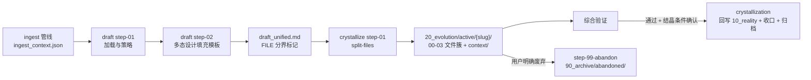

# 规格知识分层工作流

## 1. 流程范围与触发

| 流程 | 触发 | 起点/终点 | 参与方 | 依据 |
| --- | --- | --- | --- | --- |
| spec-draft（生成统一草稿） | spec pipeline draft 被调用 | 起点 `.maglev/temp/ingest_context.json`；终点 `draft_unified.md` | draft 工作流、AI 架构师角色 | `.agents/skills/_internal/spec-pipeline/draft/draft.workflow.md` |
| spec-crystallize（草稿固化） | 综合验证后执行结晶 | 起点 `draft_unified.md`；终点 `specs/20_evolution/active/{slug}/` 文件簇 | crystallize 工作流 | `.agents/skills/_internal/spec-pipeline/crystallize/crystallize.workflow.md` |
| abandon（废弃出口） | 用户明确要求"废弃/Abandon" | 起点 `active/{slug}/`；终点 `90_archive/abandoned/{date}-{slug}/` | crystallize 工作流 step-99 | `.agents/skills/_internal/spec-pipeline/crystallize/step-99-abandon.md` |
| 现实回写与收口 | 主题通过综合验证、结晶条件确认 | 起点 active 主题；终点 10_reality 回写 + active 收口 + 归档日志 | crystallization skill（执行面属 governance-quality，Gate A 裁决） | `.agents/skills/crystallization/SKILL.md` |

## 2. 静态流程图

图中每条边均对应第 3 节步骤表的一行；旧稿中"10_reality → 00_vision 稳定沉淀"的边
无任何工作流文本支持，已删除并登记于第 4 节。

## 3. 步骤、分支与交接表

| 步骤 | 责任方 | 输入 | 输出/交接 | 静态依据 | 状态 |
| --- | --- | --- | --- | --- | --- |
| ingest 产出上下文（上游） | spec-designer ingest 管线 | 用户源（idea/doc/legacy） | `.maglev/temp/ingest_context.json` | `.agents/skills/spec-designer/references/pipeline/ingest/step-03-zoom-extract.md`（output_json 声明） | established（上游锚点） |
| draft step-01 加载与策略 | draft 工作流 | ingest_context.json | 提取 intent 与 legacy_references；设 design_strategy = frontend\|backend\|agent | `.agents/skills/_internal/spec-pipeline/draft/step-01-load-context.md` | established |
| draft step-02 多态设计 | draft 工作流 | 上下文 + input_facts + zone 模板 | 按 unified-draft-template 填 00-03 章，以 `<!-- FILE: -->` 分界写入 draft_unified.md | `.agents/skills/_internal/spec-pipeline/draft/step-02-polymorphic-design.md` | established |
| crystallize step-01 拆分存档 | crystallize 工作流 | draft_unified.md | 按 `<!-- FILE: -->` 正则拆分到 `active/{slug}/`；复制 input_facts.md 到 `context/` | `.agents/skills/_internal/spec-pipeline/crystallize/step-01-split-files.md` | established |
| crystallize step-02 finalize | crystallize 工作流 | 文件簇 | 清理 `.maglev/temp/`；输出固化报告；不移动或关闭来源 Issue | `.agents/skills/_internal/spec-pipeline/crystallize/step-02-finalize.md` | established |
| 综合验证（门禁分支） | integrated-validator 等验证面 | Spec 簇 + 实现 + 测试 | 主题 status.md 流程进度推进（⏳→✅） | active 主题 status.md 流程进度惯例 | established |
| 现实回写与收口 | crystallization skill | 通过验证的主题 | 10_reality 回写（floor/ceiling 卡点）+ active 唯一结论 + step-05 归档日志 | `.agents/skills/crystallization/SKILL.md`；`.agents/skills/crystallization/references/step-02-judge-writeback.md`、`.agents/skills/crystallization/references/step-05-archive-with-log.md` | established（契约） |
| 结晶跨会话交接 | crystallization 工作流 | 部分完成的结晶 | 四项交接产物：进度清单/约束清单/质量标杆引用/验证清单 | `.agents/skills/crystallization/references/crystallization.workflow.md` 跨会话交接纪律 | established（契约） |
| step-99 abandon | crystallize 工作流 | 用户废弃指令 | 整目录移入 `90_archive/abandoned/{date}-{slug}/`；追加 ABANDONED 原因 | `.agents/skills/_internal/spec-pipeline/crystallize/step-99-abandon.md` | established |

## 4. 未证实路径与深挖

| 路径/分支 | 缺少什么依据 | 已查范围 | 深挖入口 |
| --- | --- | --- | --- |
| 10_reality → 00_vision 的"稳定沉淀" | 无任何工作流文本把现状层内容沉淀为愿景 | `.agents/skills/_internal/spec-pipeline/draft/`、`.agents/skills/_internal/spec-pipeline/crystallize/` 全部 step 文件、`.agents/skills/crystallization/SKILL.md` | 旧图该边已删除；补充前须先有契约文本 |
| abandon 与 crystallization 归档的优先级 | 两机制并存且约束不同（见 business-rules 冲突表） | `.agents/skills/_internal/spec-pipeline/crystallize/crystallize.workflow.md` + crystallization SKILL | `../spec-knowledge-layering/capability/business-rules.md` 决策表 B |
| draft 三态策略与 zone 模板的执行质量 | 模板为参考文本，无运行验证记录 | `.agents/skills/_internal/spec-pipeline/draft/unified-draft-template.md` | `../spec-knowledge-layering/verification/known-gaps.md` |
| 回写门禁的逐项判定 | step-02-judge-writeback 等步骤文件细节未在本页逐一展开 | `.agents/skills/crystallization/references/` 目录清单 | governance-quality 域（Gate A 裁决：写回执行面归其所有） |
| ingest 管线内部分支（idea/doc/legacy 三型） | 属 spec-designer 域细节，本域只锚定其输出产物 | `.agents/skills/spec-designer/references/pipeline/ingest/ingest.workflow.md` + step-03 output_json 声明 | spec-designer 页组（跨域导航，不复制正文） |
