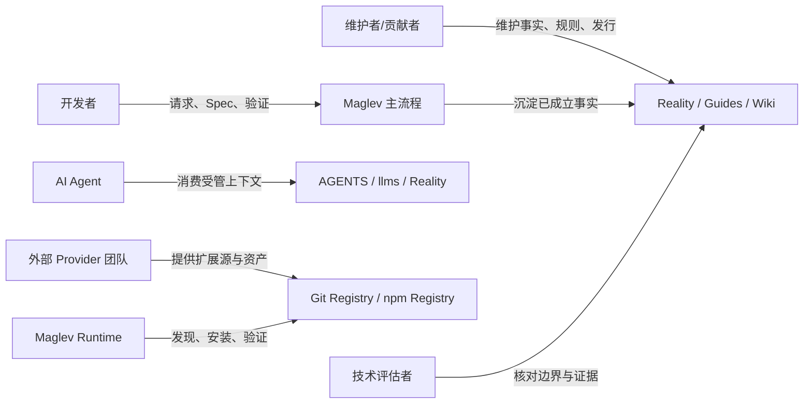

# 项目相关方与角色关系

## 读者问题

哪些人、团队或外部系统与 Maglev 能力发生关系，他们要完成什么任务，通过什么入口交互，哪些关系不能直接推导为权限？

## 1. 相关方范围

| 类别 | 纳入原则 | 排除原则 | 来源类型 |
|---|---|---|---|
| 维护者与贡献者 | 需要维护事实、规则、索引或发行资产 | 只在历史提交中出现的个人 | `AGENTS.md`、Reality Profile |
| 开发者与 Agent | 需要接入、协作、验证或消费上下文 | 未由入口或能力契约支持的行为 | Skill、Guide、Reality capability |
| 业务/技术评估者 | 需要判断定位、架构、证据和边界 | 未经来源支持的购买或收益承诺 | positioning、product-architecture、Wiki |
| 外部系统 | 与安装、扩展分发、发行或 Provider 交互 | 只在名称中出现、没有静态交互锚点的系统 | dependencies、extension-distribution |

## 2. 相关方关系账本

| 相关方/角色 | 要完成的任务或交互 | 接触能力/接口 | 来源锚点 | 状态 |
|---|---|---|---|---|
| 新贡献者 | 读取当前事实、规则和主流程入口 | `AGENTS.md`、`specs/10_reality/`、`docs/guides/` | `AGENTS.md` 服务读者段；`specs/10_reality/README.md` | established static |
| 人类开发者 | 从请求进入需求、方案、实施、验证和结晶流程 | `entry-router`、主链 Skills、项目看板 | `collaboration-lifecycle/capability/overview.md` | established static |
| AI Agent | 消费受管上下文、导航、Spec 和验证边界 | `AGENTS.md`、`llms.txt`、Reality、Wiki | `agent-context-surface/capability/overview.md`；`AGENTS.md` | established static |
| 维护者/用户 | 执行安装、更新、发行和排障 | `maglev-cli`、`scripts/maglev-python`、Publishing | `delivery-runtime/implementation/dependencies.md`；`release-knowledge/` | established static |
| 技术评估者 | 判断架构、能力边界和证据充分度 | Reality、Wiki、比较指南 | `product-architecture.md`；`positioning.md` | established static |
| 外部 Git Registry | 提供扩展源和资产分发 | `maglev-extension` source/registry 机制 | `delivery-runtime/implementation/extension-distribution.md` | established static |
| npm Registry | 承担 Maglev CLI 的发布状态查询与验证 | release publish/verify | `delivery-runtime/implementation/dependencies.md` | established static |
| 外部 Provider 团队 | 独立维护 Provider；由消费方负责授权与远端副作用 | Extension source / lock / Provider interface | `delivery-runtime/implementation/extension-distribution.md` | established static |

## 3. 角色、消费者与权限边界

| 相关方 | 可确认的关系 | 不应推断为权限 | 权限 owner page | 深挖 |
|---|---|---|---|---|
| VO/TP/XG | 看板按阶段映射角色状态 | 不代表当前配置了具体人员，也不代表排期或绩效管理 | `collaboration-lifecycle/operations/team-roles.md` | `.maglev/team.yaml` |
| AI Agent | 可消费受管上下文和协议入口 | 不代表能绕过需求、方案、Slot、Approval 或 Admission | 各主流程 Skill 与 `AGENTS.md` | `governance-quality/` |
| 外部 Provider | 可被 Extension 机制发现或记录 | 不代表已启用、已授权、可达或已产生业务副作用 | `delivery-runtime/implementation/extension-distribution.md` | `skill-runtime/` |
| npm/Git Registry | 被发布或扩展流程读取/写入 | 不代表 Maglev 拥有外部系统治理权 | `delivery-runtime/implementation/dependencies.md` | `release-knowledge/` |

## 4. 冲突与未知关系

| 关系 | 冲突/缺口 | 已查依据 | 影响 | 下一入口 |
|---|---|---|---|---|
| 项目角色与真实人员 | `.maglev/team.yaml` 的 VO/TP/XG name 当前为空 | `collaboration-lifecycle/operations/team-roles.md` | 只能证明角色映射规则，不能证明具体人员承担角色 | 填写 team 配置后重新渲染看板 |
| Agent 与最终模型行为 | 静态上下文可见性不等于 Provider 实际响应 | `agent-context-surface/verification/known-gaps.md` | 不声明模型行为、接收完整上下文或最终产出质量 | `agent-context-surface/` |
| 外部系统可达性与授权 | 本仓没有持续运行记录和外部授权状态 | `delivery-runtime/implementation/extension-distribution.md` | 不声明远端写入成功或 Provider 业务能力成立 | 对应消费项目运行验证 |
| 维护者与发布权限 | 发布命令和责任边界可定位，但具体组织审批未登记 | `release-knowledge/`、`.maglev/team.yaml` | 不从角色名称推导发布授权 | `release-knowledge/verification/known-gaps.md` |

## 关系图

## 深挖入口

- 协作角色和阶段映射：`collaboration-lifecycle/operations/team-roles.md`
- 主流程与能力对象：`collaboration-lifecycle/capability/overview.md`
- 外部依赖：`system-dependencies.md`
- 扩展和 Provider 边界：`delivery-runtime/implementation/extension-distribution.md`
- 上下文消费者边界：`agent-context-surface/`

## 落地约束

- 本页固定物化到目标 Reality 根目录的 `stakeholders.md`，不物化到模板目录。
- 相关方关系必须有任务或交互和来源锚点；历史提交中的个人不自动纳入。
- 相关方关系不等于授权，权限规则必须回到模块的 owner page。
- 未能确认角色、消费者或权限映射时保留 unknown/blocked，不以名称补推结论。
