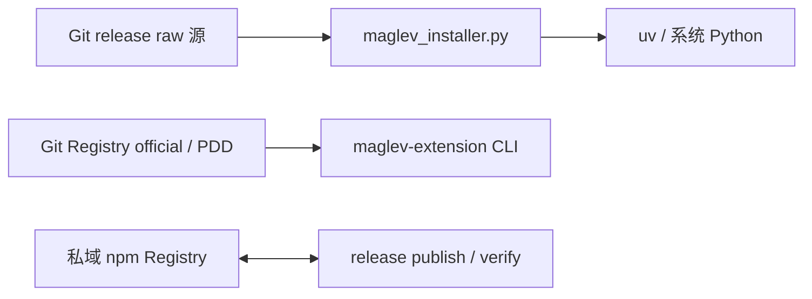

# 项目系统依赖与集成边界

## 读者问题

Maglev 依赖或服务哪些外部系统，交互方向和配置入口是什么，哪些依赖只支持静态判断，哪些运行结果仍未知？

## 1. 依赖范围

| 系统边界 | Maglev 角色 | 纳入依据 | 不纳入的同进程模块 |
|---|---|---|---|
| Git release raw 源 | 安装器读取发行清单和文件 | 安装器默认上游地址、manifest URL 拼接和 Shell 入口 | 安装器内部函数关系 |
| uv / 系统 Python | 协议脚本执行环境 | `scripts/maglev-python` 的选择和回退逻辑 | 具体协议脚本业务语义 |
| Git Registry | 扩展源和资产分发来源 | Registry source 解析、ref 默认值和扩展 CLI | `code-execution-slot` 的候选选择细节 |
| 私域 npm Registry | Maglev CLI 发布状态检查 | release 脚本的 publish/verify 步骤 | 发布说明正文生成 |

## 2. 系统依赖账本

| 外部系统 | 方向 | 目的/数据 | 协议/配置 | 实现锚点 | 状态 |
|---|---|---|---|---|---|
| Git release raw 源 | 读取 | `manifest.json` 和发行文件 | `MAGLEV_UPSTREAM_URL` 可覆盖默认地址 | `packages/maglev-cli/runtime-src/maglev_installer.py`；`packages/maglev-cli/runtime-src/install.sh` | established static |
| uv | 被调用 | 创建/管理项目本地 Python 协议运行时 | `MAGLEV_UV` 或 PATH 候选 | `scripts/maglev-python` | established static |
| 系统 Python | 回退调用 | uv 不可用时执行协议脚本 | `MAGLEV_PYTHON_VERSION` 默认 3.11 | `scripts/maglev-python` | established static |
| Node.js | 被扩展 CLI 使用 | 运行 `maglev-extension` 命令面 | `engines.node >=20.0.0` | `packages/maglev-extension-cli/package.json` | established static |
| Git Registry official/PDD | 读取/克隆 | 搜索、安装和探测扩展源 | SSH/HTTP(S) source、`ref` 默认 `master` | `packages/maglev-extension-cli/src/registry.js`；`extension-distribution.md` | established static |
| 私域 npm Registry | 发布链读写 | 发布并验证 `@idea-maglev/maglev-cli` 版本 | `private npm registry endpoint` | `scripts/maglev_release.py` | established static |

## 3. 集成关系图

图中只表达有代码、配置或脚本锚点的静态关系，不证明网络可达、授权有效、远端写入成功或运行时行为等动态结果。

## 4. 限制、替代和未知

| 系统/依赖 | 已知限制或降级 | 未证实内容 | 深挖入口 |
|---|---|---|---|
| Git release raw 源 | manifest 拉取失败会阻断安装器；环境变量可改变上游 | 缓存清单、自动重试和上游内容质量 | `delivery-runtime/operations/errors.md` |
| uv / 系统 Python | uv 不可用时回退系统 Python；两者均不可用会阻断协议脚本 | 所有系统 Python 发行版的兼容性 | `delivery-runtime/operations/python-runtime.md` |
| Git Registry | 单源失败可 warning 并继续尝试后续 source；全部失败才阻断 | 网络超时、鉴权和 Provider 运行结果 | `delivery-runtime/implementation/extension-distribution.md` |
| npm Registry | 未发布版本会使 release verify 失败 | Registry 外部可用性和实际发布完成度 | `release-knowledge/verification/known-gaps.md` |

## 深挖入口

- 交付依赖和失败影响：`delivery-runtime/implementation/dependencies.md`
- 扩展源、安装与生命周期：`delivery-runtime/implementation/extension-distribution.md`
- 系统架构和同进程模块关系：`product-architecture.md`
- 发布说明知识：`release-knowledge/`
