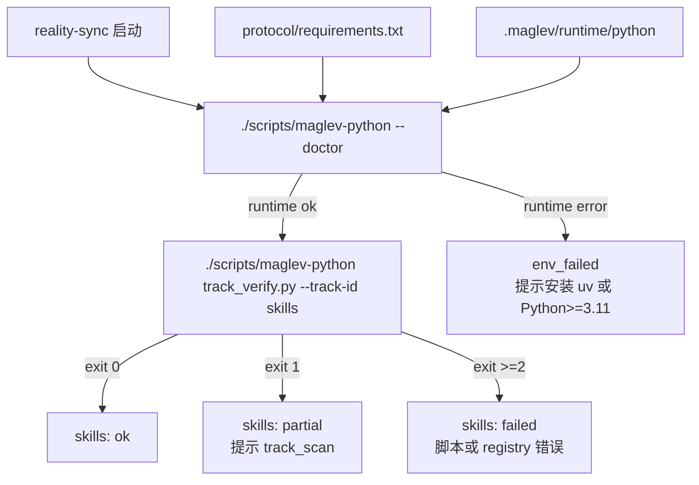

# Design — Runtime Environment Check

## 来源依据

| 来源 | 类型 | 用途 |
|---|---|---|
| [01_requirements.md](./01_requirements.md) | requirements | 本设计的直接需求输入 |
| [context/input_facts.md](./context/input_facts.md) | 输入事实 | 运行时故障与现有实现观察 |
| `scripts/maglev_release.py` | 代码观察 | 确认 runtime_internal 分发路径 |
| `packages/maglev-cli/runtime-src/maglev_installer.py` | 代码观察 | 确认下载、`.gitignore` 管理和 chmod 落点 |

## Executive Brief

本设计将 Maglev 的 Python 协议脚本执行收敛到 `scripts/maglev-python`。该入口负责发现 `uv`、创建项目本地受控环境、安装协议依赖，并提供 `--doctor` 作为主流程 preflight。`reality-sync` 在冷启动时先执行 doctor，再通过 wrapper 运行 `track_verify`，从而把 `env_failed` 与索引内容失败分开。

## 总体结构

## 关键设计决策

| Decision | 选择 | 来源摘要 | 上下文判定 | 证据 |
|---|---|---|---|---|
| D-1 | wrapper 默认创建 `.maglev/runtime/python`，不使用仓库根 `.venv`。 | 反馈建议项目本地虚拟环境，现有 installer 已管理 `.maglev/temp/` 这类本地状态。 | `.maglev/runtime/` 更符合 Maglev 自身运行时状态，不抢占业务项目可能已有的 `.venv`。 | [01_requirements.md](./01_requirements.md) F-4 |
| D-2 | wrapper 优先 `uv`，并额外探测 `~/.local/bin/uv`、`~/.cargo/bin/uv`、Homebrew 和 `/usr/local/bin`。 | 真实故障中 `uv` 已安装但非交互 PATH 不包含对应目录。 | 只用 `command -v uv` 会复现故障；常见路径探测能覆盖 Codex/CLI 运行环境。 | [context/input_facts.md](./context/input_facts.md) |
| D-3 | 无 `uv` 时允许系统 Python>=3.11 兜底。 | 目标是稳定运行，不是强制用户安装单一工具。 | 兜底路径降低首次运行失败率；若系统 Python 也不满足，再输出 `env_failed`。 | [01_requirements.md](./01_requirements.md) AC-F1-3 |
| D-4 | `env_failed` 在 skill 报告契约层表达，不改 `track_verify.py` 的业务 exit code。 | 本轮不改变 track 校验语义。 | 环境失败发生在 wrapper/preflight 层，保持 `track_verify` 只负责索引健康。 | [01_requirements.md](./01_requirements.md) AC-F3-3 |
| D-5 | 通过 catalog 注册 `scripts/maglev-python` 为 `runtime_internal` 资产。 | release 脚本按 catalog 收集 runtime_internal path。 | 这能让 wrapper 随发行包进入目标项目，不需要改 release copy 规则。 | `scripts/maglev_release.py` |

## 文件改造面

| 文件 | 改造内容 | 覆盖需求 |
|---|---|---|
| `scripts/maglev-python` | 新增受控 Python runtime wrapper，支持 `--doctor`、`--check`、`uv` 探测、venv 创建和依赖安装。 | F-1, F-2, F-3 |
| `.agents/skills/index-librarian/protocol/requirements.txt` | 声明协议最小依赖 `PyYAML>=6.0`。 | F-2 |
| `.agents/skills/reality-sync/SKILL.md` | 启动期漂移哨兵改为先 doctor，再用 wrapper 执行 track verify；增加 `env_failed` 表达。 | F-3 |
| `.agents/skills/index-librarian/SKILL.md` | 脚本路径从裸 `python3` 迁移到 `./scripts/maglev-python`，报告契约增加 `env_failed`。 | F-1, F-3 |
| `.agents/private-catalog.yaml` | 注册 `maglev-python-runtime` runtime_internal script。 | F-4 |
| `.gitignore` | 忽略 `.maglev/runtime/`。 | F-4 |
| `packages/maglev-cli/runtime-src/maglev_installer.py` | installer managed `.gitignore` 增加 `.maglev/runtime/`，下载 wrapper 后 chmod。 | F-4 |
| `docs/guides/20_operations/` | 快速开始、初始化、更新和排障文档补充 doctor、自动触发点、`env_failed` 与验证命令。 | F-3, F-4 |

## 状态契约

| 状态 | 触发条件 | 用户可见修复动作 |
|---|---|---|
| `ok` | wrapper doctor 通过，track verify exit 0 | 无需处理 |
| `env_failed` | wrapper 无法准备 Python>=3.11 或依赖安装失败 | 安装 `uv` 或 Python>=3.11 后重试 `./scripts/maglev-python --doctor` |
| `partial` | runtime ok，track verify exit 1 | 运行 `./scripts/maglev-python .../track_scan.py --track-id skills` 后重新 verify |
| `failed` | runtime ok，track verify exit >=2 | 检查脚本错误、registry 非法或协议实现问题 |

## 验证设计

| 验证项 | 命令 | 期望 |
|---|---|---|
| wrapper doctor | `./scripts/maglev-python --doctor` | exit 0，输出 uv、venv、python、requirements |
| 冷启动 track verify | `./scripts/maglev-python .agents/skills/index-librarian/protocol/scripts/track_verify.py --track-id skills` | exit 0 或暴露真实 track 状态；不因 Python 版本/依赖缺失失败 |
| catalog 分发校验 | `python3 scripts/check_runtime_distribution.py` | runtime_internal path 均存在 |
| installer 语法 | `python3 -m py_compile packages/maglev-cli/runtime-src/maglev_installer.py` | 编译通过 |
| 文档引用检查 | `rg "python3 .*track_verify|python3 \\${PROTOCOL}" .agents/skills/reality-sync .agents/skills/index-librarian` | 冷启动与 index-librarian 主路径不再出现裸 `python3` |
