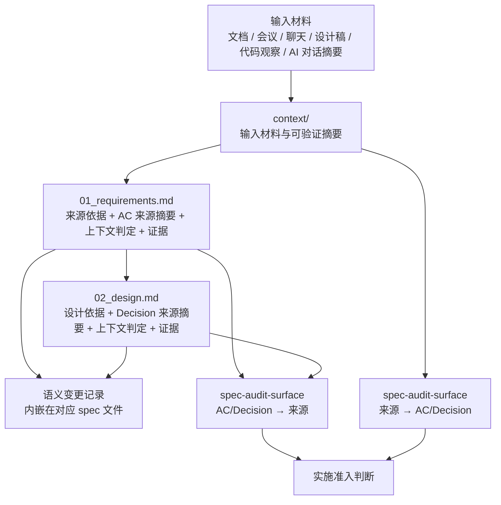
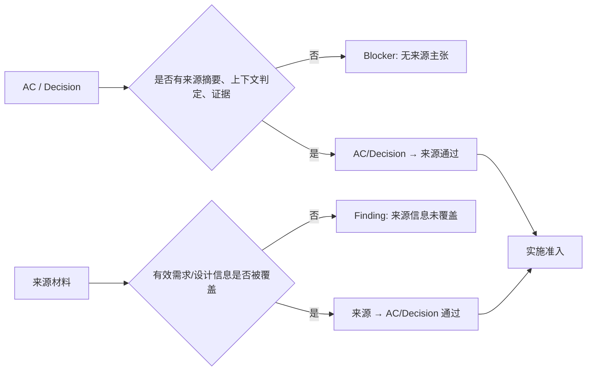

# Design — Spec Provenance Governance

## 来源依据

| 来源 | 类型 | 用途 |
|---|---|---|
| [01_requirements.md](./01_requirements.md) | requirements | 本设计的直接需求输入 |
| [context/input_facts.md](./context/input_facts.md) | 输入事实 | 用户反馈、实践观察与已收敛决策 |
| [foresight requirements self-check](../../../../../../maglev-project/maglev-foresight/docs/guides/requirements-self-check.md) | 实践文档 | 双向覆盖检查方法参考 |
| [foresight requirements sample](../../../../../../maglev-project/maglev-foresight/specs/20_evolution/active/foresight-perception-market-pv/01_requirements.md) | 实践样本 | AC 摘要、证据来源与变更记录样本 |
| [spec-designer draft workflow](../../../../.agents/skills/_internal/spec-pipeline/draft/step-02-polymorphic-design.md) | 现有流程 | 设计模板生成入口 |
| [spec-audit-surface synthesize findings](../../../../.agents/skills/spec-audit-surface/references/step-04-synthesize-findings.md) | 现有流程 | 审计评分与 findings 汇总入口 |

## Executive Brief

本设计把 spec provenance 固化为 Maglev 生成 spec 时的默认结构：`context/` 保留输入材料，requirements 和 design 正文都带“来源依据”，关键 AC / Decision 必须有“来源摘要 + 上下文判定 + 证据”，AI 语义变更记录直接维护在对应 spec 文件内。审计侧新增双向覆盖检查，既检查 AC / Decision 是否有来源，也检查来源中的有效信息是否被 spec 覆盖。

核心取舍：不新增独立日志文件、不新增用户可见治理概念，优先修改模板与流程指令，让 AI 在生成时自然产出可追溯结构。

## 设计目标

1. 让 `requirement-convergence` 产出的结构化 requirements 默认包含来源依据、来源摘要、上下文判定与证据。
2. 让 `spec-designer` 生成 design 时继承 requirements 的 provenance 信息，并为关键设计决策补充来源与判定。
3. 让 `spec-audit-surface` 在进入实施前执行双向覆盖与语义变更记录检查。
4. 让 AI 语义变更记录内嵌在对应 spec 文件中，避免引入独立日志面。
5. 保持产物只输出读者可消费的信息，不把会话过程和内部取舍写进正文。

## 总体结构



## 关键设计决策

| Decision | 选择 | 来源摘要 | 上下文判定 | 证据 |
|---|---|---|---|---|
| D-1 | 语义变更记录内嵌在对应 spec 文件，不新增独立 log 文件。 | 用户确认变更不应太多，变更太多说明项目健康度无法保证。 | 内嵌记录让读者在同一文件理解语义演进；独立日志会增加查找面并掩盖频繁变更的健康风险。 | [01_requirements.md](./01_requirements.md) D-1 / AC-F5-1 |
| D-2 | 审计执行双向覆盖：AC / Decision → 来源，以及来源 → AC / Decision。 | 用户指出既要检查 AC 是否有来源，也要检查来源中的信息是否被覆盖。Foresight 自检协议已有双向覆盖实践。 | 单向证据列无法发现遗漏需求；双向覆盖是防止“有引用但漏上下文”的核心机制。 | [01_requirements.md](./01_requirements.md) D-2 / AC-F6-3；[foresight requirements self-check](../../../../../../maglev-project/maglev-foresight/docs/guides/requirements-self-check.md) |
| D-3 | AI 对话只以来源摘要进入 spec，高价值思考沉淀到 `docs/thinking/`。 | 用户确认 AI 对话原始记录通常不需要保存，只需说明来自 AI 并写摘要。 | 需求正文保持可执行；长篇思考属于 thinking 层，避免把需求文档变成会话记录。 | [01_requirements.md](./01_requirements.md) D-3 / AC-F3-4 |
| D-4 | 优先改模板与流程指令，不先实现脚本。 | 本轮 Out of Scope 明确不实现自动检查脚本。 | 先让人和 AI 的生成协议稳定，再决定是否工具化；否则脚本会固化未验证的格式。 | [01_requirements.md](./01_requirements.md) Out of Scope |
| D-5 | 来源信息使用普通 Markdown 表格或小节表达。 | NFR 要求纯 Markdown、读者可消费。 | 这能保持可读、可 diff、可被 AI 消费，避免引入用户不需要理解的结构概念。 | [01_requirements.md](./01_requirements.md) NFR-1 / NFR-2 |

## 文件与流程改造面

| 改造对象 | 改造内容 | 覆盖需求 |
|---|---|---|
| `.agents/skills/requirement-convergence/references/step-02-define-requirements.md` | 结构化 requirements 生成规则增加“来源依据”章节，以及 AC 字段：验收标准、来源摘要、上下文判定、证据。 | AC-F2-1, AC-F3-1, AC-F7-1 |
| `.agents/skills/requirement-convergence/references/prd-output-contract.md` | `functional_requirements.acceptance_criteria` 增加 `source_summary`、`context_judgement`、`evidence` 字段说明。 | AC-F3-1, AC-F3-2, AC-F3-3 |
| `.agents/skills/_internal/spec-pipeline/draft/unified-draft-template.md` | 需求契约与技术蓝图模板增加来源依据、关键 Decision 表、内嵌语义变更记录章节。 | AC-F2-1, AC-F2-2, AC-F4-1, AC-F5-1 |
| `.agents/skills/_internal/spec-pipeline/draft/step-02-polymorphic-design.md` | 生成 design 时要求消费 requirements 的来源摘要和上下文判定，不得只消费最终 AC 文本。 | AC-F7-2 |
| `.agents/skills/spec-audit-surface/references/step-02-audit-requirements.md` | 增加 requirements provenance 审计：来源依据、AC 字段完整性、AC→来源覆盖。 | AC-F6-1, AC-F6-2 |
| `.agents/skills/spec-audit-surface/references/step-03-audit-spec-cluster.md` | 增加 design provenance 审计：Decision 字段完整性、design 是否消费 requirements provenance。 | AC-F4-1, AC-F6-4, AC-F7-2 |
| `.agents/skills/spec-audit-surface/references/step-04-synthesize-findings.md` | 评分维度或 findings 合成增加“来源覆盖”结果，并输出来源→AC/Decision 反向覆盖 findings。 | AC-F6-3, AC-F6-5 |

## 模板设计

### Requirements 来源依据

```markdown
## 来源依据

| 来源 | 类型 | 用途 |
|---|---|---|
| {source_name} | {doc/meeting/chat/design/code/ai_dialog} | {用于固定什么结论} |
```

生成规则：

- 来源必须是本轮实际消费过的输入或可验证摘要。
- AI 对话来源写作 `AI 对话摘要`，不保存完整原始记录。
- 若 AI 对话产生高价值思考，另行沉淀到 `docs/thinking/`，requirements 中只保留摘要。

### Requirements AC 表

```markdown
| AC | 验收标准 | 来源摘要 | 上下文判定 | 证据 |
|---|---|---|---|---|
| AC-F1-1 | 当...时，系统应... | {来源表达了什么完整含义} | {如何从上下文推导为该 AC；冲突如何取舍} | {路径/会议/聊天/用户确认/AI 对话摘要} |
```

生成规则：

- `来源摘要` 复述完整含义，不摘孤立关键词。
- `上下文判定` 说明取舍，特别是文档、会议、聊天、设计稿之间不一致时。
- `证据` 尽量可回查；无法回查时说明摘要来源。

### Design Decision 表

```markdown
| Decision | 选择 | 来源摘要 | 上下文判定 | 证据 |
|---|---|---|---|---|
| D-1 | {选择} | {哪些输入支持该选择} | {为什么采用该选择；替代方案为何不采用} | {requirements AC / 代码观察 / 会议 / 用户确认} |
```

生成规则：

- 影响接口、数据结构、流程、状态机、边界或实现约束的设计都应进入 Decision 表。
- 来自代码观察的证据必须指向文件、函数、接口、命令输出或可观察事实。
- 设计不得只消费 AC 最终文本，必须消费 AC 的来源摘要和上下文判定。

### 内嵌语义变更记录

在发生语义变更的 spec 文件末尾追加：

```markdown
## 变更记录

| 日期 | 变更对象 | 变更内容 | 变更原因 | 来源依据 |
|---|---|---|---|---|
| 2026-06-03 | AC-F1-1 | {旧含义 → 新含义} | {为什么改} | {来源} |
```

记录规则：

- 只记录影响范围、需求、AC、设计决策、约束、验收标准或关键未知的语义变更。
- 格式调整、错别字、表格修复、索引补齐不记录。
- 如果变更记录快速膨胀，审计应提示项目健康风险。

## 双向覆盖审计设计



### 正向检查：AC / Decision → 来源

检查项：

1. 是否存在“来源依据”章节。
2. 每条关键 AC 是否有来源摘要、上下文判定、证据。
3. 每条关键 Decision 是否有来源摘要、上下文判定、证据。
4. 证据是否可回查，或是否给出无法回查时的摘要说明。
5. AI 对话来源是否仅作为摘要出现，未把长篇思考塞进需求正文。

### 反向检查：来源 → AC / Decision

检查项：

1. 来源依据中列出的每个输入是否被读取并摘要。
2. 来源中产生的有效需求信息是否映射到 AC。
3. 来源中产生的有效设计约束是否映射到 Decision。
4. 后续来源是否推翻或修正早期来源。
5. 未覆盖的信息是否被标记为不采纳、待确认或 out of scope。

### Finding 分级

| 级别 | 条件 | 处理 |
|---|---|---|
| blocker | 正式 AC / Decision 无来源，或 AI 语义变更无变更记录 | 不进入实施 |
| major | 来源中有效信息未覆盖，且可能影响需求、验收或设计 | 先补 spec 或标明不采纳原因 |
| minor | 证据可回查性不足，但不影响当前设计方向 | 补充摘要或后续改善 |

## 流程集成

### requirement-convergence

1. 在结构化需求生成前收集来源清单。
2. 生成 `来源依据`。
3. 生成 AC 时同步填写 `来源摘要`、`上下文判定`、`证据`。
4. 若 AC 来自 AI 对话，写明 `来自 AI 对话` 与摘要。
5. 若发现来源中有高价值思考，建议触发 `knowledge-check`，沉淀到 `docs/thinking/`。

### spec-designer

1. 读取 requirements 的来源依据与 AC provenance 字段。
2. 设计关键 Decision 时引用 AC provenance，而不是只引用 AC 文本。
3. 对新增设计判断补充 Decision provenance。
4. 若修改 requirements/design 语义，在对应文件内追加变更记录。

### spec-audit-surface

1. 执行正向 provenance 检查。
2. 执行反向来源覆盖检查。
3. 汇总 blocker / major / minor findings。
4. 若变更记录过多，增加项目健康风险 finding。
5. 将结果写入 `context/audit_score.md`。

## 实施顺序建议

| 顺序 | 动作 | 原因 |
|---|---|---|
| 1 | 修改 requirement-convergence 的结构化需求输出规则 | 需求源头先稳定，后续流程才能消费 |
| 2 | 修改 unified draft template 和 spec-designer draft 指令 | 让 design 继承并扩展 provenance |
| 3 | 修改 spec-audit-surface 三个审计步骤 | 把生成要求变成实施前门禁 |
| 4 | 用本 spec 自身做一次人工审计 | 验证模板是否可读、可执行 |
| 5 | 再决定是否工具化扫描 | 避免过早固化格式 |

## 风险与缓解

| 风险 | 表现 | 缓解 |
|---|---|---|
| 表格过宽 | AC 表难读 | 复杂 AC 可改为小节块，保留同样字段 |
| AI 填空式生成摘要 | 来源摘要空泛 | 审计检查“最终 AC 是否能从来源摘要 + 上下文判定推导出来” |
| 反向覆盖耗时 | 来源材料多时审计变慢 | 先要求覆盖“来源依据”中列出的主要来源，长材料可用摘要分段 |
| 变更记录膨胀 | spec 多次语义改写 | 不拆独立 log，直接暴露为项目健康风险 |
| thinking 与 requirements 混淆 | AI 把长篇思考塞进需求 | AI 对话仅写摘要；高价值思考走 `docs/thinking/` |

## 验收映射

| Requirement | Design Coverage |
|---|---|
| AC-F1-1, AC-F1-2, AC-F1-3 | `context/` 保留策略、AI 对话摘要规则 |
| AC-F2-1, AC-F2-2, AC-F2-3 | requirements/design 来源依据模板 |
| AC-F3-1, AC-F3-2, AC-F3-3, AC-F3-4 | AC provenance 表字段与生成规则 |
| AC-F4-1, AC-F4-2, AC-F4-3 | Design Decision 表字段与代码观察证据规则 |
| AC-F5-1, AC-F5-2, AC-F5-3, AC-F5-4 | 内嵌语义变更记录模板与健康风险规则 |
| AC-F6-1, AC-F6-2, AC-F6-3, AC-F6-4, AC-F6-5 | 双向覆盖审计与 finding 分级 |
| AC-F7-1, AC-F7-2, AC-F7-3 | requirement-convergence / spec-designer / spec-audit-surface 集成方案 |

## 变更记录

| 日期 | 变更对象 | 变更内容 | 变更原因 | 来源依据 |
|---|---|---|---|---|
| 2026-06-03 | 02_design.md | 新建设计文档，明确内嵌变更记录、双向覆盖审计、AI 对话摘要与流程集成方案。 | 用户确认 requirements 可继续进入方案设计。 | [01_requirements.md](./01_requirements.md) Ready Gate |
