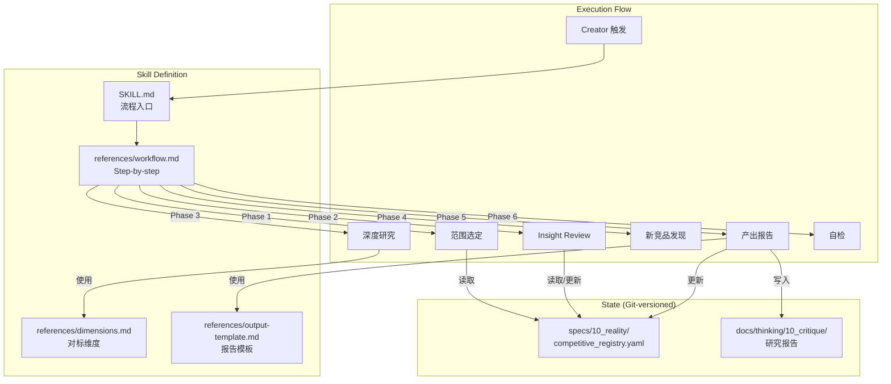
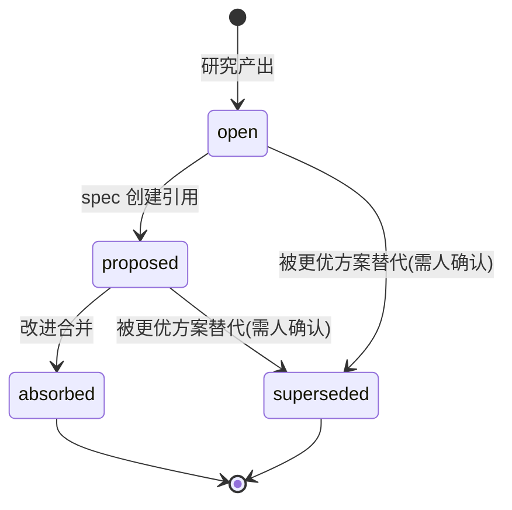

# Design: Evolution Observatory

## 文档关系

- **上游**: 01_requirements.md
- **下游**: 03_plan.md, context-implementer
- **平行**: 无

## 2.0 Overview

Evolution Observatory 是一个 Maglev skill，实现"观察→分析→学习→反省→建议"的闭环。它由 **SKILL.md**（流程定义）、**Registry YAML**（状态数据）、**研究模板**（产出标准）和 **维度定义**（对比轴）四个核心组件构成。每轮研究由人触发，AI 按 workflow 执行，产出归档到 `docs/thinking/10_critique/`。

## 2.1 需求覆盖表

| 需求 | AC | 设计覆盖位置 |
|------|-----|-------------|
| F-1 | AC-F1-1 ~ F1-3 | §2.4.1 Registry Schema |
| F-2 | AC-F2-1 ~ F2-3 | §2.4.2 Workflow Phase 1 |
| F-3 | AC-F3-1 ~ F3-3 | §2.4.3 Dimensions Definition |
| F-4 | AC-F4-1 ~ F4-3 | §2.4.4 Output Template |
| F-5 | AC-F5-1 ~ F5-5 | §2.4.5 Insight Lifecycle |
| F-6 | AC-F6-1 ~ F6-3 | §2.4.2 Workflow Phase 4 |
| F-7 | AC-F7-1 ~ F7-3 | §2.4.6 Self-Check |

## 2.2 架构视图



## 2.3 组件职责表

| 组件 | 职责 | 覆盖 AC |
|------|------|---------|
| `SKILL.md` | Skill 入口定义、触发规则、命令矩阵 | 全局 |
| `references/workflow.md` | 6 个 Phase 的 step-by-step 执行指南 | AC-F2-1~3, AC-F7-1~3 |
| `references/dimensions.md` | Mandatory + Exploratory 维度定义与规则 | AC-F3-1~3 |
| `references/output-template.md` | 研究报告标准格式 | AC-F4-1~3 |
| `competitive_registry.yaml` | 竞品清单 + Insight 状态 + 版本追踪 | AC-F1-1~3, AC-F5-1~5, AC-F6-3 |

## 2.4 变更方案

### 2.4.1 Registry Schema（→ AC-F1-1~3, AC-F5-1~5）

```yaml
# specs/10_reality/competitive_registry.yaml
meta:
  version: "1.0"
  last_updated: "2026-05-25"
  description: "Maglev Evolution Observatory - 竞品注册表"

products:
  superpowers:
    name: "Superpowers"
    category: [horizontal]        # horizontal | vertical | [horizontal, vertical]
    subcategory: "AI coding discipline framework"
    version_tracked: "v5.1.0"
    first_added: "2026-05-25"
    watch_reason: "同层 AI 编码纪律框架，TDD/Subagent 模式对 Maglev 有直接参考"
    activity_level: high          # high | medium | low | dormant
    last_researched: "2026-05-25"
    source:
      repo: "obra/superpowers"
      url: "https://github.com/obra/superpowers"
    insights:
      - id: "SP-001"
        title: "Subagent 模式可引入 context-implementer"
        source_report: "docs/thinking/10_critique/2026-05-25-maglev_vs_superpowers.md"
        status: open              # open | proposed | absorbed | superseded
        priority: medium          # high | medium | low
        target: "context-implementer"
        proposed_spec: null
        absorbed_at: null
        superseded_by: null
        superseded_reason: null
        created_at: "2026-05-25"

  bmad:
    name: "BMAD Method"
    category: [horizontal]
    subcategory: "AI Agile team simulation"
    version_tracked: "latest"
    first_added: "2026-02-02"
    watch_reason: "角色驱动的 AI 敏捷模拟，Zero Trust 哲学对比"
    activity_level: medium
    last_researched: "2026-02-23"
    source:
      repo: "bmad-code-org/bmad-method"
      url: "https://github.com/bmad-code-org/bmad-method"
    insights: []

# ... more products

dimension_upgrades:
  # 当 exploratory 维度连续 3 次被使用时记录在此
  pending: []
  promoted: []
```

### 2.4.2 Workflow Phases（→ AC-F2-1~3, AC-F6-1~3, AC-F7-1~3）

研究 workflow 分 6 个 Phase：

| Phase | 名称 | 核心动作 |
|-------|------|----------|
| 1 | Scope & Plan | 读取 Registry → 确定本轮对象 → 展示研究计划 |
| 2 | Insight Review | 遍历 open insights → 逐条评估有效性 → 标记 superseded 候选 |
| 3 | Deep Research | 按 mandatory + exploratory 维度深入研究 → 产出分析 |
| 4 | Discovery | 行业扫描（web + GitHub）→ 推荐新竞品候选 |
| 5 | Output & Archive | 按 output-template 生成报告 → 提炼 insights → 更新 Registry → commit |
| 6 | Self-Check | 执行 checklist → 确认完整性 → 输出本轮摘要 |

### 2.4.3 Mandatory Dimensions（→ AC-F3-1~3）

基于已有 7+ 篇对比文档分析，提炼以下 mandatory 维度：

| # | 维度 | 说明 | 来源 |
|---|------|------|------|
| M-1 | 定位与目标 | 一句话定位、核心目标、受众、哲学 | vs_superpowers, vs_openspec |
| M-2 | 架构模式 | 整体架构、技术栈、分发方式 | vs_superpowers, vs_bmm |
| M-3 | 需求→实施流水线 | 从需求到代码的完整路径 | vs_openspec, industry_validation |
| M-4 | 治理与纪律 | 约束机制、红线、drift 检测 | vs_superpowers, vs_harness |
| M-5 | 知识管理 | 知识沉淀、记忆、跨会话连续性 | vs_superpowers |
| M-6 | 对 Maglev 的启示 | 具体可操作的参考价值 + Actionable Insights | 所有文档 |

**垂域工具的维度豁免规则**：若目标是垂域工具（如纯 TDD 框架），M-5（知识管理）可标记 N/A，但 M-6 不可省略。

### 2.4.4 Output Template（→ AC-F4-1~3）

研究报告模板结构：

```markdown
# {Product} 深度研究报告

> **日期**: YYYY-MM-DD
> **目标版本**: {version}
> **Maglev 版本**: {maglev_version}
> **研究范围**: {scope_description}

## 一、概览
{一段话概述该产品/框架}

## 二、对标分析

### M-1: 定位与目标
| 维度 | {Product} | Maglev |
|------|-----------|--------|
| ... | ... | ... |

### M-2: 架构模式
...

### M-3 ~ M-5: ...

### E-{N}: {Exploratory Dimension}（如有）
...

## 三、对 Maglev 的启示（M-6）

{深度分析，不少于 500 字}

## 四、Actionable Insights

| ID | 标题 | 建议目标 | 优先级 | 简述 |
|----|------|----------|--------|------|
| {PROD}-001 | ... | {target skill/process} | high/medium/low | ... |

## 五、新竞品发现（本轮）

| 名称 | 分类建议 | 理由 | 纳入建议 |
|------|----------|------|----------|
| ... | ... | ... | 推荐/观望 |

## 六、研究元数据

- 信息来源：{sources list}
- 研究耗时：{duration}
- Registry 变化：{summary}
```

### 2.4.5 Insight Lifecycle（→ AC-F5-1~5）

状态机：



**Insight Review 触发规则**：
- 每轮研究 Phase 2 自动执行
- 评估标准：框架是否有重大更新 / Maglev 是否已从其他路径解决 / 是否有更优替代
- 输出建议，由 Creator 确认后执行状态变更

### 2.4.6 Self-Check Checklist（→ AC-F7-1~3）

```yaml
self_check:
  - id: CHK-1
    item: "Registry 已更新（新产品/版本变化/insights 新增）"
    blocking: true
  - id: CHK-2
    item: "所有 open insights 已 review（标记仍有效或建议 superseded）"
    blocking: true
  - id: CHK-3
    item: "研究报告符合 output-template.md 结构"
    blocking: true
  - id: CHK-4
    item: "新竞品探索步骤已执行（即使结果为'无新发现'）"
    blocking: true
  - id: CHK-5
    item: "报告已 commit 且 message 以 research(observatory): 为前缀"
    blocking: true
  - id: CHK-6
    item: "本轮摘要已输出（覆盖对象+新增 insights+Registry 变化）"
    blocking: false
```

## 2.5 设计决策表

| # | 决策 | 理由 | 备选方案 | 关联 AC |
|---|------|------|----------|---------|
| D-1 | Registry 放 `specs/10_reality/` | 是当前现实的一部分，与 glossary 同层 | `docs/` 下独立文件 | AC-F1-1 |
| D-2 | 6 Phase workflow | 保持每步单一职责，可单独升级 | 3 Phase（合并 Review+Discovery+Check） | AC-F2-1, AC-F7-1 |
| D-3 | Mandatory 维度固定 6 个 | 覆盖已有对比轴且不过于繁重 | 8-10 个（过重），3 个（过简） | AC-F3-1 |
| D-4 | Exploratory 升级需连续 3 次使用 | 避免偶发维度膨胀 mandatory | 2 次（过激进），5 次（过保守） | AC-F3-3 |
| D-5 | Superseded 需人确认 | 避免 AI 误废有效 insight | AI 自动标记（风险高） | AC-F5-4 |
| D-6 | 报告模板含"新竞品发现"章节 | 每轮强制执行发现步骤 | 独立流程（容易遗忘） | AC-F6-1 |

## 2.6 分层架构（通用层 + 领域配置层）

基于 Skill Scout + Skill Squadron 分析结论：此技能的底层模式是一个**通用的持续情报净化循环**，Maglev 观测 AI 框架只是第一个 instance。

### 分层原则

| 层 | 内容 | 变更频率 | 复用性 |
|----|------|----------|--------|
| **Base Pattern（通用层）** | workflow.md（6 Phase 定义）、insight lifecycle 规则、self-check checklist | 低 | 可被未来任意领域复用 |
| **Domain Config（领域配置层）** | dimensions.md（Maglev 特有维度）、Registry 种子数据、output-template（报告格式） | 中 | 可替换为其他领域配置 |

### Skill 文件结构

```
.agents/skills/evolution-observatory/
├── SKILL.md                              # 入口定义（描述当前 instance：观测 AI 框架）
├── references/
│   ├── workflow.md                       # [通用层] 6-Phase 执行指南（领域无关）
│   ├── insight-lifecycle.md              # [通用层] Insight 状态机 + Review 规则
│   ├── self-check.md                     # [通用层] 每轮自检 checklist
│   ├── dimensions.md                     # [配置层] Mandatory + Exploratory 维度定义
│   └── output-template.md               # [配置层] 研究报告模板
└── (无 scripts/ — 纯 Markdown 驱动)
```

### Registry YAML Schema

```
specs/10_reality/competitive_registry.yaml
├── meta (version, last_updated, description, domain)
├── products (map)
│   └── {slug}
│       ├── name, category[], subcategory
│       ├── version_tracked, first_added, watch_reason
│       ├── activity_level, last_researched
│       ├── source (repo, url)
│       └── insights[]
│           └── {id, title, source_report, status, priority, target,
│                proposed_spec, absorbed_at, superseded_by, superseded_reason, created_at}
└── dimension_upgrades
    ├── pending[] (exploratory dimensions used 1-2 times)
    └── promoted[] (upgraded to mandatory)
```

## 2.7 编组关系（Squadron Analysis）

| 关系 | 目标 | 类型 | 说明 |
|------|------|------|------|
| → | `spec-designer` | feeds | insight(proposed) 状态可作为 spec 设计输入 |
| → | `knowledge-check` | complements | 研究报告沉淀到 docs/thinking/ 需知识检查 |
| → | `crystallization` | triggers | insight(absorbed) 触发 reality 更新 |
| ← | `skill-squadron` | called_by | 编队巡逻可将此 skill 纳入巡逻范围 |
| ↔ | `skill-scout` | complements | 研究发现优化方向 → 可触发 scout 寻找外部实现 |

**所属顶层能力**: `能力进化`（与 skill-scout、skill-squadron 同簇）
