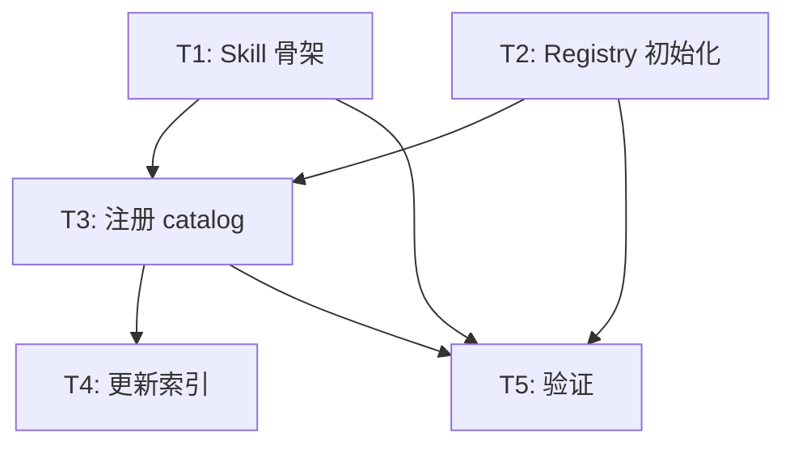

# Plan: Evolution Observatory

## 文档关系

- **上游**: 02_design.md
- **下游**: context-implementer

## 3.1 实施任务

- [ ] T1: 创建 Skill 骨架 → _需求: AC-F2-1, AC-F3-1, AC-F4-1, AC-F7-1_
  - 创建 `.agents/skills/evolution-observatory/SKILL.md`
  - 创建 `references/workflow.md`（6 Phase 定义）
  - 创建 `references/dimensions.md`（mandatory + exploratory 规则）
  - 创建 `references/output-template.md`（报告模板）

- [ ] T2: 创建 Registry 初始数据 → _需求: AC-F1-1, AC-F1-2, AC-F5-1_
  - 创建 `specs/10_reality/competitive_registry.yaml`
  - 填充已有对标对象（Superpowers, BMAD, OpenSpec, 快手, GitHub Spec Kit, Hermes Agent, OpenAI Frontier）
  - 迁移已有 insights（从 Superpowers 对比文档提取）

- [ ] T3: 注册到 private-catalog.yaml → _需求: 全局_
  - 在 `.agents/private-catalog.yaml` 添加 evolution-observatory 条目
  - 设置 lifecycle status、triggers、dependencies

- [ ] T4: 更新 specs/20_evolution/ 索引 → _需求: 全局_
  - 更新 `specs/20_evolution/active/INDEX.md`
  - 更新 `specs/20_evolution/INDEX.md` child_count

- [ ] T5: 验证与自检 → _需求: AC-F7-1~3_
  - 验证 skill 定义可被 entry-router 识别
  - 验证 Registry YAML 格式有效
  - 验证报告模板结构完整
  - 模拟一轮执行流（dry-run）检查 workflow 可行性

## 3.2 任务依赖

## 3.3 验证计划

| 验证项 | 方法 | 通过标准 |
|--------|------|----------|
| Skill 可发现 | 检查 private-catalog.yaml 中条目存在 | entry-router 能识别 |
| Registry 格式 | YAML lint | 无语法错误 |
| 维度完整 | 对照已有 7+ 篇文档维度 | 6 个 mandatory 维度覆盖所有历史对比轴 |
| 模板可用 | 对照最新研究报告（Superpowers） | 格式兼容 |
| Workflow 可执行 | Dry-run Phase 1 | 能从 Registry 读取并推荐候选 |
| Insight lifecycle | 手动检查状态转换 | open → proposed / superseded 路径清晰 |
